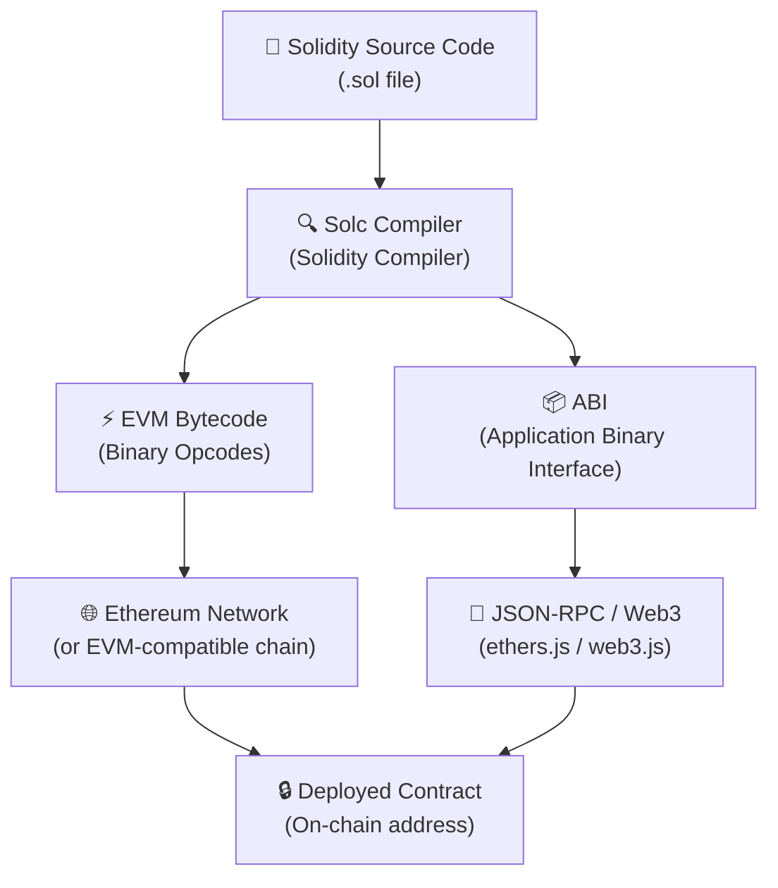

# 🧱 Introduction to Solidity

> "Smart contracts are the backbone of the decentralized web. Solidity is how you write them."

---

## 🗺️ Table of Contents

1. [What is Solidity?](#what-is-solidity)
2. [Why Solidity?](#why-solidity)
3. [How Solidity Compiles to EVM Bytecode](#how-solidity-compiles-to-evm-bytecode)
4. [Setting Up Your Environment](#setting-up-your-environment)
5. [Your First Solidity Contract: Hello World](#your-first-solidity-contract-hello-world)
6. [SPDX License Identifier and Pragma](#spdx-license-identifier-and-pragma)
7. [Contract Structure Overview](#contract-structure-overview)
8. [Compiling and Deploying on Remix](#compiling-and-deploying-on-remix)
9. [Solidity Versions and Why Version Locking Matters](#solidity-versions-and-why-version-locking-matters)
10. [Key Takeaways](#key-takeaways)
11. [Quiz](#quiz)

---

## 🔷 What is Solidity?

Solidity is a **high-level, statically typed, curly-brace programming language** designed specifically for writing **smart contracts** — self-executing programs that live on the blockchain.

If you have ever written JavaScript, C++, or Java, Solidity will feel familiar in syntax. It uses curly braces `{}` to define blocks, semicolons `;` to end statements, and follows a structure similar to object-oriented programming.

Here are the defining characteristics of Solidity:

| Property | Description |
|---|---|
| **High-level** | You write human-readable code; the compiler handles the low-level details |
| **Statically typed** | Every variable has a declared type (`uint`, `string`, `address`, etc.) known at compile time |
| **Curly-brace syntax** | Code blocks are delimited with `{}`, familiar to C/Java/JS developers |
| **Contract-oriented** | The primary unit of code is a `contract`, analogous to a class in OOP |
| **EVM-targeted** | Compiles exclusively to Ethereum Virtual Machine (EVM) bytecode |

Solidity was created by **Gavin Wood** (co-founder of Ethereum) and the Ethereum team, with development beginning around 2014. It was designed from the ground up to run on the **Ethereum Virtual Machine (EVM)** — the decentralized computation engine that powers Ethereum and dozens of compatible blockchains.

---

## 🚀 Why Solidity?

With several smart contract languages available (Vyper, Fe, Yul), why should you start with Solidity?

### 1. It is the Most Popular Smart Contract Language

Solidity dominates the smart contract ecosystem. The vast majority of deployed contracts on Ethereum, Polygon, BNB Chain, Avalanche, and other EVM-compatible networks are written in Solidity. This is not an accident — it got there first, matured rapidly, and built a massive network effect.

### 2. Massive Ecosystem and Tooling

Because of its popularity, Solidity has the richest ecosystem:

- **Frameworks**: Hardhat, Foundry, Truffle
- **Testing libraries**: Chai, Mocha, Forge
- **Security tools**: Slither, MythX, Echidna
- **Auditing resources**: OpenZeppelin, ConsenSys Diligence
- **Package libraries**: OpenZeppelin Contracts (battle-tested, reusable contracts)

### 3. EVM Compatibility = Write Once, Deploy Anywhere

Solidity targets the EVM, which means a single contract can be deployed on:

- Ethereum Mainnet
- Polygon
- Arbitrum and Optimism (Layer 2s)
- BNB Smart Chain
- Avalanche C-Chain
- Base, and many more

### 4. Huge Community and Learning Resources

Stack Overflow, GitHub, Discord servers, and YouTube are full of Solidity tutorials, answers, and open-source code. Finding help when you are stuck is significantly easier compared to newer, less-adopted languages.

### 5. Industry Demand

Solidity developers are among the highest-paid in the software industry. Understanding Solidity opens doors to DeFi protocol development, NFT projects, DAOs, and blockchain security auditing.

---

## ⚙️ How Solidity Compiles to EVM Bytecode

Before your Solidity code can run on the blockchain, it must be **compiled** — transformed from human-readable source code into machine-executable instructions the EVM understands.

Here is the full compilation pipeline:



### Step-by-Step Breakdown

**Step 1 — Write Solidity (.sol)**
You write your contract logic in a `.sol` file using the Solidity language.

**Step 2 — Solc Compiles**
The Solidity compiler (`solc`) processes your source code. It performs:
- Syntax and type checking
- Resolving imports and dependencies
- Generating two critical outputs

**Step 3 — Two Outputs Produced**

- **ABI (Application Binary Interface)**: A JSON description of your contract's public interface — what functions exist, what parameters they accept, and what they return. This is how frontend applications (using ethers.js or web3.js) know how to talk to your contract.

- **EVM Bytecode**: A sequence of low-level opcodes (like `PUSH1`, `ADD`, `SSTORE`) that the EVM can execute. This is the actual program that gets deployed to the blockchain.

**Step 4 — Deployment**
The bytecode is sent to the network as a transaction. The network stores it permanently at a unique address. From this point on, anyone can call the contract's functions.

> **Key insight**: The blockchain stores and executes bytecode, not Solidity. Solidity is purely a developer convenience — the EVM has never heard of it.

---

## 🛠️ Setting Up Your Environment

For beginners, there are two tools you need to get started immediately — no installation required.

### Remix IDE (Browser-Based)

**Remix** is an in-browser IDE specifically built for Solidity development. It is the fastest way to go from zero to a deployed contract.

**Access it at**: [https://remix.ethereum.org](https://remix.ethereum.org)

What Remix gives you out of the box:

- A full code editor with Solidity syntax highlighting
- A built-in Solidity compiler (multiple versions)
- A local JavaScript VM to deploy and test contracts without spending real ETH
- A file explorer for managing your `.sol` files
- A deploy and interact panel to call contract functions directly in the browser

No npm, no terminal, no configuration files. Just open the URL and start writing code.

### MetaMask (Browser Wallet)

**MetaMask** is a browser extension that acts as your Ethereum wallet. You will need it when you want to deploy to real testnets or mainnet.

**Install it at**: [https://metamask.io](https://metamask.io)

What MetaMask provides:

- A wallet to hold ETH and tokens
- The ability to sign and broadcast transactions from your browser
- Connection to testnets like Sepolia (where you can get free test ETH from faucets)
- Integration with Remix — one click connects Remix to MetaMask for real network deployments

> **For this chapter**: You only need Remix. MetaMask becomes important when you graduate from the built-in JavaScript VM to deploying on a real test network.

---

## 📄 Your First Solidity Contract: Hello World

Let us walk through a complete, working Solidity contract line by line:

```solidity
// SPDX-License-Identifier: MIT
pragma solidity ^0.8.0;

contract HelloWorld {
    string public greeting = "Hello, Blockchain!";
    
    function getGreeting() public view returns (string memory) {
        return greeting;
    }
    
    function setGreeting(string memory _newGreeting) public {
        greeting = _newGreeting;
    }
}
```

This contract does three things:
1. Stores a greeting string on the blockchain
2. Lets anyone read the current greeting
3. Lets anyone update the greeting

---

## 📋 SPDX License Identifier and Pragma

### Line 1 — SPDX License Identifier

```solidity
// SPDX-License-Identifier: MIT
```

This is a **comment** that declares the software license for your source code. SPDX stands for Software Package Data Exchange — a standardized format for expressing license information.

**Why it matters:**

- Smart contract source code published on-chain is publicly visible
- The Solidity compiler will warn you (not error) if this line is missing
- Common choices: `MIT` (permissive, open-source friendly), `GPL-3.0`, `UNLICENSED` (proprietary), `BUSL-1.1` (business source)
- For learning projects and open-source work, `MIT` is the standard choice

### Line 2 — Pragma Statement

```solidity
pragma solidity ^0.8.0;
```

`pragma` is a **compiler directive** — an instruction to the compiler about how to handle the file. The `solidity` pragma specifies the version(s) of the Solidity compiler that should be used.

Breaking down `^0.8.0`:

| Symbol | Meaning |
|---|---|
| `^` | Compatible with this version and higher minor/patch versions |
| `0.8.0` | Minimum version required |
| `^0.8.0` | Accepts 0.8.0 through 0.8.x, but NOT 0.9.0 |

Other pragma version patterns:

```solidity
pragma solidity 0.8.20;           // Exact version only
pragma solidity >=0.8.0 <0.9.0;  // Range: any 0.8.x version
pragma solidity ^0.8.19;          // 0.8.19 up to (not including) 0.9.0
```

---

## 🏛️ Contract Structure Overview

A Solidity contract follows a predictable structure. Think of it like a class in object-oriented programming:

```solidity
// SPDX-License-Identifier: MIT
pragma solidity ^0.8.0;

contract ContractName {
    // 1. State variables (stored permanently on-chain)
    string public greeting = "Hello, Blockchain!";
    
    // 2. Events (for logging)
    // event GreetingChanged(string newGreeting);
    
    // 3. Modifiers (reusable access control logic)
    // modifier onlyOwner() { ... }
    
    // 4. Constructor (runs once at deployment)
    // constructor() { ... }
    
    // 5. Functions (the contract's behavior)
    function getGreeting() public view returns (string memory) {
        return greeting;
    }
    
    function setGreeting(string memory _newGreeting) public {
        greeting = _newGreeting;
    }
}
```

### Key Components Explained

**State Variables**
Variables declared at the contract level are stored permanently in the blockchain's storage. In our example, `string public greeting` is a state variable. The `public` keyword automatically generates a getter function, so you can read its value without writing `getGreeting()` explicitly.

**Functions**
Functions define what the contract can do. Our contract has two:

- `getGreeting()` — marked `view` because it only reads data and does not modify state. View functions do not cost gas when called externally.
- `setGreeting()` — modifies state (writes to the blockchain), which costs gas (ETH) to execute.

**Visibility Modifiers**

| Modifier | Accessible From |
|---|---|
| `public` | Anywhere (inside contract, derived contracts, externally) |
| `private` | Only inside this contract |
| `internal` | Inside this contract and derived contracts |
| `external` | Only from outside the contract |

**The `memory` Keyword**
In `string memory _newGreeting`, the `memory` keyword tells Solidity this string should be stored temporarily in memory (not on-chain) for the duration of the function call. Solidity requires you to be explicit about data location for reference types like strings and arrays.

---

## 🚢 Compiling and Deploying on Remix

Follow these steps to compile and deploy your Hello World contract in Remix.

### Step 1 — Open Remix

Navigate to [https://remix.ethereum.org](https://remix.ethereum.org) in your browser.

### Step 2 — Create a New File

In the left panel under "File Explorer":
1. Click the "contracts" folder
2. Click the new file icon (document with a plus sign)
3. Name it `HelloWorld.sol`

### Step 3 — Paste the Contract Code

Copy and paste the full `HelloWorld` contract code into the editor.

### Step 4 — Compile the Contract

1. Click the **Solidity Compiler** tab in the left sidebar (looks like a `<>` icon with an S)
2. Under "Compiler", select version `0.8.0` or any `0.8.x` version
3. Click the blue **"Compile HelloWorld.sol"** button
4. A green checkmark appears if compilation succeeds
5. If there are errors, they appear in red below — the error message will tell you the line number

### Step 5 — Deploy the Contract

1. Click the **Deploy & Run Transactions** tab (rocket ship icon)
2. Under "Environment", select **"Remix VM (Cancun)"** — this is a local simulated blockchain, free and instant
3. You will see pre-funded test accounts with 100 ETH each
4. Under "Contract", ensure `HelloWorld` is selected in the dropdown
5. Click the orange **"Deploy"** button

### Step 6 — Interact with the Contract

After deployment, a new section appears at the bottom of the Deploy panel under "Deployed Contracts":

- Click the dropdown arrow next to your contract address
- You will see buttons for each public function and variable:
  - **`greeting`** — click to read the current greeting value
  - **`getGreeting`** — click to call and see the returned string
  - **`setGreeting`** — type a new string in the input box, then click to update

Congratulations — you have just deployed and interacted with your first smart contract!

---

## 🔒 Solidity Versions and Why Version Locking Matters

Solidity is a young, rapidly evolving language. Between major versions, breaking changes and security improvements are introduced. This makes version management critical in smart contract development.

### A Brief History of Significant Versions

| Version | Notable Change |
|---|---|
| 0.4.x | Initial stable releases, basic features |
| 0.5.x | Explicit function visibility required, `address payable` introduced |
| 0.6.x | `virtual`/`override` keywords for inheritance |
| 0.7.x | `receive()` and `fallback()` split into separate functions |
| 0.8.x | **Arithmetic overflow/underflow checks built-in** (huge security improvement) |
| 0.8.20+ | Shanghai EVM support, various optimizations |

### Why Version Locking is Critical

**1. Breaking Changes Between Versions**
Code that compiles in `0.7.x` may fail or behave differently in `0.8.x`. Locking your version ensures your code always compiles with the compiler it was written and tested against.

**2. Security Implications**
Before `0.8.0`, integer overflow and underflow were silent bugs. A `uint8` variable holding `255` would silently wrap around to `0` when you added `1`. This caused real exploits costing millions of dollars. In `0.8.0+`, this throws an automatic error. Using an old pragma on new code — or vice versa — can introduce subtle vulnerabilities.

**3. Reproducible Builds**
When other developers (or auditors) review your code, they need to compile it the same way you did. A pinned version guarantees identical compilation results.

**4. Production Best Practice**
In production contracts, pin to an exact version:

```solidity
pragma solidity 0.8.20;  // Production: exact version
```

In libraries and shared code, a caret range is acceptable:

```solidity
pragma solidity ^0.8.0;  // Library: compatible minor versions
```

> **Rule of thumb**: For anything you plan to deploy with real value, lock to a specific version that has been thoroughly tested and audited.

---

## ✅ Key Takeaways

- **Solidity** is a statically typed, high-level, curly-brace language for writing smart contracts that run on the EVM.

- It is the **most popular smart contract language** with the largest ecosystem, community, and tooling support.

- Solidity source code is **compiled by `solc`** into EVM bytecode (what runs on-chain) and an ABI (what frontends use to interact with the contract).

- **Remix IDE** is the fastest way to start — browser-based, no setup, built-in compiler and local test blockchain.

- Every Solidity file should begin with an **SPDX license identifier** and a **pragma** statement declaring the compatible compiler version.

- A `contract` is the fundamental unit of Solidity — it contains state variables, functions, events, and modifiers.

- **Version locking is not optional** in production — Solidity introduces breaking changes between versions, and pre-0.8.0 contracts lack built-in overflow protection.

- The `public` keyword on a state variable auto-generates a getter; the `view` keyword on a function signals it reads but does not write state (no gas cost for external calls).

---

## 📝 Quiz

Test your understanding before moving to the next chapter.

**Question 1**

What are the two outputs produced when you compile a Solidity contract?

- A) Source map and deployment script
- B) ABI and EVM bytecode
- C) Bytecode and a Solidity AST
- D) JSON config and binary executable

<details>
<summary>Show Answer</summary>

**B) ABI and EVM bytecode**

The ABI (Application Binary Interface) is a JSON description of the contract's public interface used by frontends. The EVM bytecode is the compiled program that gets deployed and executed on the blockchain.

</details>

---

**Question 2**

What does `pragma solidity ^0.8.0;` mean?

- A) The contract will only compile with exactly version 0.8.0
- B) The contract requires version 0.8.0 or any later version, including 0.9.0
- C) The contract is compatible with version 0.8.0 and higher 0.8.x versions, but not 0.9.0
- D) The compiler version is automatically selected at runtime

<details>
<summary>Show Answer</summary>

**C) The contract is compatible with version 0.8.0 and higher 0.8.x versions, but not 0.9.0**

The caret (`^`) operator means "compatible with this version" — it allows patch and minor updates within the same major minor version but blocks the next minor increment (0.9.0). This is identical to how `^` works in npm's `package.json`.

</details>

---

**Question 3**

Which of the following statements about the `view` keyword on a function is correct?

- A) `view` functions can write to state variables
- B) `view` functions cost more gas because they read from storage
- C) `view` functions read state but do not modify it, and cost no gas when called externally
- D) `view` is only valid for `private` functions

<details>
<summary>Show Answer</summary>

**C) `view` functions read state but do not modify it, and cost no gas when called externally**

When a `view` function is called from outside the blockchain (by a frontend or script using a `call`, not a `send`/transaction), it executes locally on the node and does not consume gas. If called from within another state-modifying transaction, it does use gas as part of that transaction.

</details>

---

*Next Chapter: [02 — Data Types and Variables in Solidity](./02-data-types.md)*
