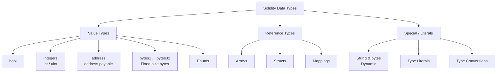

# 🧱 Chapter 02: Data Types in Solidity

> **Ye kiske liye hai:** Woh developers jo smart contracts mein naye hain, kam se kam ek language (JavaScript, Python, etc.) jaanate hain, aur samajhna chahte hain ki Solidity data ko kaise handle karta hai.

---

## Data Types Itne Important Kyun Hain Smart Contracts Mein?

Zyadatar languages mein, galat data type choose karna sirf ek chhoti si inconvenience hoti hai — bas thoda memory waste ho jaata hai. Lekin Solidity mein? Ye tumhara real money (gas) khaa sakta hai, security vulnerabilities create kar sakta hai, ya tumhara contract permanently broken bhi ho sakta hai. Blockchain pe har byte store karna ETH kharch karta hai, aur har computation ka price hai.

Socho ye aisa hai jaise tum Zomato pe order kar rahe ho — agar tum galat quantity ya galat item type select karte ho, to sirf order galat nahi hota, paisa bhi zyada kat sakta hai. Solidity mein bhi wahi — galat type choose kiya to gas zyada lagega ya contract hi crash ho jaayega.

Is chapter mein hum Solidity ke poore type system ka ek complete map banayenge, taaki tum shuru se hi soch-samajh kar decisions le sako.

---

## Type Categories — Ek Nazar Mein



**Value types** assign karte waqt copy ho jaate hain — jaise JavaScript mein ek number ko "by value" pass karna.
**Reference types** same data ka reference share karte hain — jaise ek object pass karna.

---

## 1. 🔘 bool — True ya False

Sabse simple type. Ek `true` ya `false` store karta hai, bas.

**Analogy:** Ek light switch — ya to ON hai ya OFF, beech mein kuch nahi hota.

```solidity
// SPDX-License-Identifier: MIT
pragma solidity ^0.8.0;

contract BoolExamples {
    bool public isActive = true;
    bool public isPaused = false;

    // Default value hamesha false hota hai — koi bhi unset bool false se start hota hai
    bool public defaultBool; // = false

    function toggle() public {
        isActive = !isActive; // switch flip karo
    }

    function canWithdraw(bool isOwner, bool isWhitelisted) public pure returns (bool) {
        return isOwner || isWhitelisted; // logical OR
    }
}
```

**Operators:**
| Operator | Matlab |
|----------|---------|
| `!` | NOT (negation) |
| `&&` | AND (dono true hone chahiye) |
| `\|\|` | OR (kam se kam ek true) |
| `==` | Equal |
| `!=` | Not equal |

> **Gas ka note:** Ek `bool` store karna utna hi costly hai jitna `uint256` store karna — chain pe dono ek full 32-byte slot lete hain. Agar tum multiple bools ko ek struct mein pack karo, to Solidity 32 bools tak ek hi storage slot mein fit kar sakta hai — ye ek meaningful gas saving hai.

---

## 2. 🔢 Integers — int aur uint

Integers do flavours mein aate hain: **signed** (`int`, negative bhi ho sakta hai) aur **unsigned** (`uint`, hamesha non-negative). Dono 8 bits ke steps mein 8 se 256 tak aate hain.

**Analogy:** `uint` ko socho ek measuring tape ki tarah jo 0 se start hoti hai. `int` ko socho ek thermometer ki tarah jo zero ke neeche bhi ja sakta hai.

```solidity
pragma solidity ^0.8.0;

contract IntegerExamples {
    // uint — unsigned integers (0 aur usse zyada)
    uint8   public smallCounter   = 255;      // max 255
    uint16  public mediumCounter  = 65535;    // max 65,535
    uint256 public tokenSupply    = 1_000_000; // underscores readability ke liye

    // int — signed integers (negative se positive tak)
    int8    public temperature    = -10;      // range: -128 se 127
    int256  public profit         = -500_000; // bada signed number

    // uint aur int bina size suffix ke = uint256 / int256
    uint public score = 42;  // uint256 ke barabar hi hai
    int  public delta = -7;  // int256 ke barabar hi hai

    // Default values
    uint public defaultUint; // = 0
    int  public defaultInt;  // = 0

    function addNumbers(uint256 a, uint256 b) public pure returns (uint256) {
        return a + b;
    }

    function absoluteValue(int256 n) public pure returns (uint256) {
        if (n < 0) {
            return uint256(-n);
        }
        return uint256(n);
    }
}
```

### Integer Size Quick Reference

| Type | Bits | Min Value | Max Value |
|------|------|-----------|-----------|
| `uint8` | 8 | 0 | 255 |
| `uint16` | 16 | 0 | 65,535 |
| `uint32` | 32 | 0 | ~4.3 billion |
| `uint64` | 64 | 0 | ~1.8 × 10¹⁹ |
| `uint128` | 128 | 0 | ~3.4 × 10³⁸ |
| `uint256` | 256 | 0 | ~1.15 × 10⁷⁷ |
| `int8` | 8 | -128 | 127 |
| `int256` | 256 | -(2¹⁵⁵) | 2¹⁵⁵ - 1 |

> **Rule of thumb:** Default mein hamesha `uint256` use karo. Chhote types (`uint8`, `uint16`) tabhi use karo jab tum struct mein variables ko pack karke gas bachana chahte ho.

### Overflow: Pre-0.8 vs Post-0.8

Solidity ki history mein ye sabse important safety change hai. Dhyan se padho.

```solidity
pragma solidity ^0.8.0;

contract OverflowDemo {
    // Solidity < 0.8.0 mein — ye SILENTLY wrap around ho jaata tha:
    // uint8 x = 255;
    // x += 1;  // x ban jaata 0, koi error nahi! Classic bug.

    // Solidity >= 0.8.0 mein — ye ab REVERT karta hai panic ke saath:
    function unsafeAdd(uint8 a, uint8 b) public pure returns (uint8) {
        return a + b; // agar result > 255 hai to revert
    }

    // Jaan-boojh kar wrap-around allow karna hai (rare, advanced use case):
    function wrappingAdd(uint8 a, uint8 b) public pure returns (uint8) {
        unchecked {
            return a + b; // wrap ho jaata hai, revert nahi hota — extreme care se use karo
        }
    }
}
```

> **Key lesson:** Agar tum purane Solidity tutorials padhte ho ya purane contracts audit karte ho, to yaad rakhna ki overflow 0.8.0 se pehle ek real attack vector tha. SafeMath jaisi libraries isi ko prevent karne ke liye banayi gayi thi. Ab 0.8.0+ mein tumhe SafeMath ki zaroorat nahi hai.

---

## 3. 📬 address — Ethereum Addresses

Ethereum pe har account (wallet ho ya contract) ka ek 20-byte address hota hai. `address` type exactly wahi store karta hai.

**Analogy:** `address` ek P.O. box number jaisa hai — bas identify karta hai ki cheezein kahan bhejni hain, koi special privilege nahi deta. `address payable` ek aisa P.O. box hai jo paisa bhi receive kar sakta hai — jaise UPI ID jo payment accept kar sake.

```solidity
pragma solidity ^0.8.0;

contract AddressExamples {
    address public owner;
    address payable public treasury;

    constructor() {
        owner    = msg.sender;                      // is contract ko kisne deploy kiya
        treasury = payable(msg.sender);             // same address, lekin ab payable
    }

    // --- Balance check karna ---
    function getOwnerBalance() public view returns (uint256) {
        return owner.balance; // balance wei mein
    }

    // --- ETH bhejne ke teen tareeke ---

    // 1. transfer — fail hone pe revert karta hai, 2300 gas forward karta hai (simple sends ke liye safest)
    function sendViaTransfer(address payable recipient) public payable {
        recipient.transfer(msg.value);
    }

    // 2. send — fail hone pe false return karta hai (return value check karna zaruri hai)
    function sendViaSend(address payable recipient) public payable returns (bool) {
        bool success = recipient.send(msg.value);
        require(success, "Send failed");
        return success;
    }

    // 3. call — sabse flexible, ETH bhejne ke liye recommended (koi gas limit nahi)
    function sendViaCall(address payable recipient) public payable {
        (bool success, ) = recipient.call{value: msg.value}("");
        require(success, "Call failed");
    }

    // --- address aur address payable ke beech convert karna ---
    function makePayable(address addr) public pure returns (address payable) {
        return payable(addr); // explicit cast zaruri hai
    }
}
```

### address vs address payable

| Feature | `address` | `address payable` |
|---------|-----------|-------------------|
| 20-byte address store karta hai | Haan | Haan |
| `.balance` call kar sakta hai | Haan | Haan |
| `.transfer()` call kar sakta hai | Nahi | Haan |
| `.send()` call kar sakta hai | Nahi | Haan |
| `.call` se ETH receive kar sakta hai | Haan (explicit cast ke saath) | Haan |
| `msg.sender` ke liye default | Haan | Nahi (cast karna padega) |

> **Best practice:** `.transfer()` aur `.send()` ke bajaye `.call{value: ...}("")` use karo. `transfer`/`send` ka 2300 gas stipend un contracts ke saath fail ho sakta hai jinka fallback function expensive hai.

---

## 4. 🗂 bytes — Fixed aur Dynamic

Solidity mein byte sequences do categories mein aate hain: fixed-size (`bytes1` se `bytes32`) aur dynamic (`bytes`).

**Analogy:** Fixed bytes ek form ki tarah hai jisme exactly N blank fields hain — na field add kar sakte ho, na remove. Dynamic `bytes` ek sticky note jaisa hai — jitna chahe utna bada.

### Fixed-Size Bytes (bytes1 se bytes32)

```solidity
pragma solidity ^0.8.0;

contract FixedBytesExamples {
    bytes1 public singleByte  = 0xFF;          // 1 byte, hex literal
    bytes4 public magicNumber = 0xDEADBEEF;    // 4 bytes
    bytes32 public fileHash;                   // 32 bytes — hashes ke liye best

    // bytes32 commonly keccak256 hashes ke liye use hota hai
    function hashData(string memory data) public pure returns (bytes32) {
        return keccak256(abi.encodePacked(data));
    }

    // Individual bytes access karna
    function getFirstByte(bytes4 value) public pure returns (bytes1) {
        return value[0]; // array jaisa index access
    }

    // Short fixed data ke liye bytes32, string se sasta padta hai
    bytes32 public constant ROLE_ADMIN = keccak256("ADMIN");
}
```

### Dynamic bytes

```solidity
pragma solidity ^0.8.0;

contract DynamicBytesExamples {
    bytes public dynamicData;

    function appendByte(bytes1 b) public {
        dynamicData.push(b); // dynamically grow kar sakta hai
    }

    function getLength() public view returns (uint256) {
        return dynamicData.length;
    }

    // Arbitrary binary payloads ke liye useful
    function encodeData(address addr, uint256 amount) public pure returns (bytes memory) {
        return abi.encode(addr, amount);
    }
}
```

### string vs bytes — Kaunsa Kab Use Karein

```solidity
pragma solidity ^0.8.0;

contract StringVsBytes {
    // string — human-readable UTF-8 text ke liye
    string public greeting = "Hello, Solidity!";

    // bytes — arbitrary binary data ya jab indexing chahiye
    bytes public rawData  = "Hello, Solidity!"; // same content, different type

    // Tum string mein directly index NAHI kar sakte:
    // char c = greeting[0]; // ERROR

    // Lekin bytes mein index kar SAKTE ho:
    function getCharCode(uint256 index) public view returns (bytes1) {
        bytes memory strBytes = bytes(greeting); // string ko bytes mein convert karo
        return strBytes[index];
    }

    // Strings compare karne ke liye hashing chahiye (strings ke liye == nahi chalta)
    function stringsEqual(string memory a, string memory b) public pure returns (bool) {
        return keccak256(abi.encodePacked(a)) == keccak256(abi.encodePacked(b));
    }
}
```

| Feature | `string` | `bytes` |
|---------|----------|---------|
| Store karta hai | UTF-8 text | Arbitrary binary |
| Index access | Nahi | Haan |
| `.length` | Nahi (convert karna padega) | Haan |
| `.push()` | Nahi | Haan |
| Gas cost | Similar | Similar |
| Equality check | Hash comparison | Hash comparison |
| Best for | User-facing text | Binary data, hashing |

---

## 5. 🏷 Enums — Named Constants

Enums tumhe ek custom type define karne dete hain jisme fixed set of named values hote hain. Under the hood, ye `uint8` ki tarah store hote hain.

**Analogy:** Jaise Swiggy ke order status dropdown mein hota hai — Placed, Preparing, Out for Delivery, Delivered. Fixed options, koi random value nahi daal sakte.

```solidity
pragma solidity ^0.8.0;

contract EnumExample {
    enum Status { Pending, Active, Paused, Cancelled }

    Status public currentStatus = Status.Pending;

    function activate() public {
        currentStatus = Status.Active;
    }

    function cancel() public {
        currentStatus = Status.Cancelled;
    }

    function getStatusAsInt() public view returns (uint8) {
        return uint8(currentStatus); // Pending=0, Active=1, Paused=2, Cancelled=3
    }
}
```

> Enums Chapter 05 mein detail mein cover honge. Yahan sirf completeness ke liye mention kiya hai.

---

## 6. 📦 Reference Types (Preview)

Reference types assign karte waqt data copy nahi karte — woh same underlying data ko point karte hain. Inhe hamesha ek **data location** keyword chahiye hota hai: `storage`, `memory`, ya `calldata`.

### Arrays

```solidity
pragma solidity ^0.8.0;

contract ArrayPreview {
    uint256[] public dynamicArray;         // runtime mein grow hota hai
    uint256[5] public fixedArray;          // hamesha 5 elements

    function addItem(uint256 item) public {
        dynamicArray.push(item);
    }

    function getItem(uint256 index) public view returns (uint256) {
        return dynamicArray[index];
    }
}
```

### Structs

```solidity
pragma solidity ^0.8.0;

contract StructPreview {
    struct Person {
        string name;
        uint256 age;
        address wallet;
    }

    Person public alice = Person("Alice", 30, address(0x123));
}
```

### Mappings

```solidity
pragma solidity ^0.8.0;

contract MappingPreview {
    mapping(address => uint256) public balances;

    function deposit() public payable {
        balances[msg.sender] += msg.value;
    }
}
```

> Arrays, Structs, aur Mappings — teeno ke apne dedicated chapters honge.

---

## 7. 🔄 Type Conversions

### Implicit vs Explicit Conversion

Solidity sirf tabhi implicit conversion allow karta hai jab woh 100% safe ho (koi information loss na ho). Baaki sab jagah explicit casting zaruri hai.

```solidity
pragma solidity ^0.8.0;

contract TypeConversion {
    // IMPLICIT — safe, koi data loss nahi
    uint8  smallNum  = 10;
    uint256 bigNum   = smallNum; // uint8 -> uint256: hamesha safe, cast ki zaroorat nahi

    // EXPLICIT — zaruri hai jab information lose ho sakti hai
    uint256 large    = 1000;
    uint8   truncated = uint8(large); // 1000 > 255, isliye truncated = 232 (1000 % 256)

    // address conversions
    address addr        = msg.sender;
    address payable pay = payable(addr); // explicit cast zaruri hai

    // bytes conversions
    bytes32 hash   = 0xabc123;
    bytes4  prefix = bytes4(hash);      // pehle 4 bytes leta hai (left-aligned)

    function demonstrateConversion() public pure returns (uint8, bytes4) {
        uint256 n    = 300;
        uint8   safe = uint8(n);          // 300 % 256 = 44 — data silently lost ho gaya!

        bytes32 b32  = bytes32(uint256(1)); // int -> bytes32
        bytes4  b4   = bytes4(b32);         // right mein zero-pad hota hai, leftmost bytes lete hain

        return (safe, b4);
    }
}
```

### Type Casting ke Pitfalls

```solidity
pragma solidity ^0.8.0;

contract CastingPitfalls {
    // PITFALL 1: Truncation — silent data loss
    function unsafeTruncate() public pure returns (uint8) {
        uint256 big = 256;
        return uint8(big); // 0 return karega! (256 % 256 = 0)
    }

    // PITFALL 2: Sign misinterpretation
    function signPitfall() public pure returns (uint256) {
        int8 negative = -1;
        // uint256(negative) tumhe 1 NAHI deta
        // ye tumhe 2^256 - 1 (max uint256) deta hai, two's complement ki wajah se
        return uint256(int256(negative)); // = 115792089237316195423570985008687907853269984665640564039457584007913129639935
    }

    // SAFE PATTERN: cast karne se pehle check karo
    function safeCast(uint256 value) public pure returns (uint8) {
        require(value <= type(uint8).max, "Value too large for uint8");
        return uint8(value);
    }
}
```

> [!warning]
> Type casting mein silent truncation sabse common bug hai naye Solidity developers ke liye. Jaise Zomato pe agar tum quantity field mein galti se bada number daal do aur system usse silently truncate kar de — order hi galat chala jaayega. Isliye hamesha bounds check karo casting se pehle.

### Implicit Conversion Rules

| From | To | Allowed? |
|------|----|----------|
| `uint8` | `uint256` | Haan (implicit) |
| `uint256` | `uint8` | Nahi (explicit only, truncate ho sakta hai) |
| `int8` | `int256` | Haan (implicit) |
| `int8` | `uint8` | Nahi (explicit only, sign issue) |
| `address` | `address payable` | Nahi (explicit `payable()` zaruri) |
| `bytes4` | `bytes32` | Nahi (explicit, right mein zero-padded) |
| `bytes32` | `bytes4` | Nahi (explicit, truncate hota hai) |

---

## 8. 📝 Poora DataTypes Contract

Sab kuch ek reference contract mein combine karte hain:

```solidity
// SPDX-License-Identifier: MIT
pragma solidity ^0.8.0;

contract DataTypes {
    // ─── Value Types ──────────────────────────────────────

    // Booleans
    bool public isActive     = true;
    bool public isPaused     = false;

    // Unsigned integers
    uint8   public smallId   = 200;
    uint256 public maxSupply = 1_000_000 * 1e18; // 18 decimals ke saath, ETH ki tarah

    // Signed integers
    int256 public temperature = -10;
    int256 public profitLoss  = -500;

    // Addresses
    address public owner;
    address payable public treasury;

    // Fixed bytes — hashes, identifiers ke liye best
    bytes32 public constant CONTRACT_ID = keccak256("MY_CONTRACT_V1");
    bytes4  public constant SELECTOR    = 0x70a08231; // balanceOf selector

    // Enum
    enum Phase { Seed, Private, Public, Closed }
    Phase public currentPhase = Phase.Seed;

    // ─── Reference Types (storage declarations) ───────────

    uint256[]                   public scores;
    mapping(address => uint256) public balances;

    struct User {
        string  name;
        uint256 joinedAt;
        bool    isVerified;
    }

    mapping(address => User) public users;

    // ─── Constructor ──────────────────────────────────────

    constructor() {
        owner    = msg.sender;
        treasury = payable(msg.sender);
    }

    // ─── Functions ────────────────────────────────────────

    function registerUser(string calldata name) public {
        users[msg.sender] = User({
            name:       name,
            joinedAt:   block.timestamp,
            isVerified: false
        });
    }

    function deposit() public payable {
        balances[msg.sender] += msg.value;
    }

    function advancePhase() public {
        require(msg.sender == owner, "Not owner");
        require(currentPhase != Phase.Closed, "Already closed");
        currentPhase = Phase(uint8(currentPhase) + 1);
    }

    function getContractBalance() public view returns (uint256) {
        return address(this).balance;
    }
}
```

---

## 9. 🗺 Kab Kya Use Karein — Decision Guide

| Tumhe store karna hai... | Use karo |
|----------------------|-----|
| True/false flag | `bool` |
| Token amounts, counts, IDs | `uint256` |
| Temperature, profit/loss (negative ho sakta hai) | `int256` |
| Ethereum wallet ya contract address | `address` |
| Address jo ETH receive karega | `address payable` |
| Keccak256 hash | `bytes32` |
| Short fixed identifier (function selector) | `bytes4` |
| Arbitrary binary data | `bytes` |
| Human-readable text | `string` |
| States ka named set | `enum` |
| Items ki list | `array` |
| Key-value lookup | `mapping` |
| Named fields ke saath grouped data | `struct` |

---

## Key Takeaways

1. **Value types copy hote hain; reference types pointer share karte hain.** Ye samajhna accidental overwrites se bachaata hai.

2. **Solidity 0.8.0+ tumhe overflow/underflow se protect karta hai** — integer arithmetic automatically revert ho jaata hai. `unchecked { }` sirf tab use karo jab tumhare paas koi deliberate reason ho.

3. **ETH bhejne ke liye `address payable` zaruri hai.** Ek plain `address` `.transfer()` ya `.send()` call nahi kar sakta. Convert karne ke liye `payable(addr)` use karo.

4. **`uint256` integers ke liye default choice hai.** Chhote types (`uint8`, `uint16`) sirf tabhi gas bachate hain jab structs mein pack kiye jaayein; akele use karne pe type conversion ki wajah se zyada gas bhi lag sakta hai.

5. **String ko kabhi `==` se compare mat karo.** `keccak256(abi.encodePacked(a)) == keccak256(abi.encodePacked(b))` use karo.

6. **Explicit casting silently data truncate kar sakta hai.** Type ko downscale karne se pehle (jaise `uint256` se `uint8`) hamesha bounds validate karo.

7. **State variables mein short, fixed-length identifiers ke liye `bytes32`, `string` se zyada gas-efficient hai.**

---

## Quiz

Aage badhne se pehle apna understanding test karo.

**Q1.** Tum ek contract likh rahe ho jo Celsius mein temperature track karta hai (jo negative bhi ho sakta hai). Best type kaunsa hai?

- A) `uint256`
- B) `int256`
- C) `bool`
- D) `bytes32`

<details>
<summary>Answer</summary>

**B) `int256`** — Temperature negative ho sakta hai, isliye signed integer chahiye. `uint256` zero se neeche ki values represent nahi kar sakta.
</details>

---

**Q2.** Ek user ye code likhta hai Solidity 0.8.0 contract mein. `a = 255` aur `b = 1` hone pe kya hoga?

```solidity
function add(uint8 a, uint8 b) public pure returns (uint8) {
    return a + b;
}
```

- A) 0 return karega (silently wrap around)
- B) 256 return karega
- C) Panic error ke saath revert karega
- D) Compiler error

<details>
<summary>Answer</summary>

**C) Panic error ke saath revert karega** — Solidity 0.8.0+ mein, integer overflow automatically revert trigger karta hai. Purana wrap-around behaviour sirf `unchecked { }` block ke andar hi hota hai.
</details>

---

**Q3.** In do declarations mein kya difference hai?

```solidity
address public recipient;
address payable public payableRecipient;
```

- A) Koi difference nahi hai — dono ETH receive kar sakte hain
- B) `address payable` `.transfer()` aur `.send()` call kar sakta hai; plain `address` nahi
- C) `address payable` lambi value store karta hai
- D) `address` sirf wallet addresses ke liye hai; `address payable` contracts ke liye hai

<details>
<summary>Answer</summary>

**B) `address payable` `.transfer()` aur `.send()` call kar sakta hai; plain `address` nahi** — Dono types 20-byte Ethereum address store karte hain. Difference sirf ye hai ki kaunse operations allowed hain. ETH bhejne ke liye plain address ko convert karne ke liye `payable(addr)` use karo.
</details>

---

## Aage Kya

Agle chapter mein hum cover karenge **Variables and State** — state variables, local variables, aur global variables ke beech ka difference, saath hi visibility modifiers (`public`, `private`, `internal`, `external`) aur special `constant` aur `immutable` keywords.
