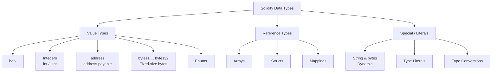

# 🧱 Chapter 02: Data Types in Solidity

> **Who this is for:** Developers new to smart contracts who know at least one programming language (JavaScript, Python, etc.) and want to understand how Solidity handles data.

---

## Why Data Types Matter in Smart Contracts

In most languages, choosing the wrong data type is a minor inconvenience. In Solidity, it can cost real money (gas), cause security vulnerabilities, or make your contract permanently broken. Every byte stored on-chain costs ETH, and every computation has a price.

This chapter gives you a complete map of Solidity's type system so you can make deliberate choices from the start.

---

## Type Categories at a Glance



**Value types** are copied when assigned — like passing a number by value in JavaScript.
**Reference types** share a reference to the same data — like passing an object.

---

## 1. 🔘 bool — True or False

The simplest type. Stores a single `true` or `false`.

**Analogy:** A light switch — it is either on or off, nothing in between.

```solidity
// SPDX-License-Identifier: MIT
pragma solidity ^0.8.0;

contract BoolExamples {
    bool public isActive = true;
    bool public isPaused = false;

    // Default value is false — every unset bool starts as false
    bool public defaultBool; // = false

    function toggle() public {
        isActive = !isActive; // flip the switch
    }

    function canWithdraw(bool isOwner, bool isWhitelisted) public pure returns (bool) {
        return isOwner || isWhitelisted; // logical OR
    }
}
```

**Operators:**
| Operator | Meaning |
|----------|---------|
| `!` | NOT (negation) |
| `&&` | AND (both must be true) |
| `\|\|` | OR (at least one true) |
| `==` | Equal |
| `!=` | Not equal |

> **Gas note:** Storing a `bool` costs the same as storing a `uint256` on-chain (a full 32-byte slot). If you pack multiple bools into a struct, Solidity can fit up to 32 bools into one storage slot — a meaningful gas saving.

---

## 2. 🔢 Integers — int and uint

Integers come in two flavours: **signed** (`int`, can be negative) and **unsigned** (`uint`, always non-negative). Both come in steps of 8 bits from 8 to 256.

**Analogy:** Think of `uint` as a measuring tape that starts at 0. Think of `int` as a thermometer that can go below zero.

```solidity
pragma solidity ^0.8.0;

contract IntegerExamples {
    // uint — unsigned integers (0 and above)
    uint8   public smallCounter   = 255;      // max 255
    uint16  public mediumCounter  = 65535;    // max 65,535
    uint256 public tokenSupply    = 1_000_000; // underscores for readability

    // int — signed integers (negative to positive)
    int8    public temperature    = -10;      // range: -128 to 127
    int256  public profit         = -500_000; // large signed number

    // uint and int without a size suffix = uint256 / int256
    uint public score = 42;  // same as uint256
    int  public delta = -7;  // same as int256

    // Default values
    uint public defaultUint; // = 0
    int  public defaultInt;  // = 0

    function addNumbers(uint256 a, uint256 b) public pure returns (uint256) {
        return a + b;
    }

    function absoluteValue(int256 n) public pure returns (uint256) {
        if (n < 0) {
            return uint256(-n);
        }
        return uint256(n);
    }
}
```

### Integer Size Quick Reference

| Type | Bits | Min Value | Max Value |
|------|------|-----------|-----------|
| `uint8` | 8 | 0 | 255 |
| `uint16` | 16 | 0 | 65,535 |
| `uint32` | 32 | 0 | ~4.3 billion |
| `uint64` | 64 | 0 | ~1.8 × 10¹⁹ |
| `uint128` | 128 | 0 | ~3.4 × 10³⁸ |
| `uint256` | 256 | 0 | ~1.15 × 10⁷⁷ |
| `int8` | 8 | -128 | 127 |
| `int256` | 256 | -(2¹⁵⁵) | 2¹⁵⁵ - 1 |

> **Rule of thumb:** Use `uint256` by default. Only shrink to smaller types when you are packing variables in a struct to save gas.

### Overflow: Pre-0.8 vs Post-0.8

This is one of the most important safety changes in Solidity history.

```solidity
pragma solidity ^0.8.0;

contract OverflowDemo {
    // In Solidity < 0.8.0 — this would SILENTLY wrap around:
    // uint8 x = 255;
    // x += 1;  // x becomes 0, no error! Classic bug.

    // In Solidity >= 0.8.0 — this REVERTS with a panic:
    function unsafeAdd(uint8 a, uint8 b) public pure returns (uint8) {
        return a + b; // reverts if result > 255
    }

    // To intentionally allow wrap-around (rare, advanced use):
    function wrappingAdd(uint8 a, uint8 b) public pure returns (uint8) {
        unchecked {
            return a + b; // wraps around, no revert — use with extreme care
        }
    }
}
```

> **Key lesson:** If you read old Solidity tutorials or audit old contracts, remember that overflow was a real attack vector before 0.8.0. Libraries like SafeMath existed to prevent it. You no longer need SafeMath in 0.8.0+.

---

## 3. 📬 address — Ethereum Addresses

Every account on Ethereum (wallet or contract) has a 20-byte address. The `address` type stores exactly that.

**Analogy:** An `address` is like a P.O. box number. It identifies where to send things but has no special privileges. An `address payable` is a P.O. box that can also receive money.

```solidity
pragma solidity ^0.8.0;

contract AddressExamples {
    address public owner;
    address payable public treasury;

    constructor() {
        owner    = msg.sender;                      // who deployed this contract
        treasury = payable(msg.sender);             // same address, but payable
    }

    // --- Querying balances ---
    function getOwnerBalance() public view returns (uint256) {
        return owner.balance; // balance in wei
    }

    // --- Sending ETH: three ways ---

    // 1. transfer — reverts on failure, forwards 2300 gas (safest for simple sends)
    function sendViaTransfer(address payable recipient) public payable {
        recipient.transfer(msg.value);
    }

    // 2. send — returns false on failure (you must check the return value)
    function sendViaSend(address payable recipient) public payable returns (bool) {
        bool success = recipient.send(msg.value);
        require(success, "Send failed");
        return success;
    }

    // 3. call — most flexible, recommended for sending ETH (no gas limit)
    function sendViaCall(address payable recipient) public payable {
        (bool success, ) = recipient.call{value: msg.value}("");
        require(success, "Call failed");
    }

    // --- Converting between address and address payable ---
    function makePayable(address addr) public pure returns (address payable) {
        return payable(addr); // explicit cast required
    }
}
```

### address vs address payable

| Feature | `address` | `address payable` |
|---------|-----------|-------------------|
| Stores 20-byte address | Yes | Yes |
| Can call `.balance` | Yes | Yes |
| Can call `.transfer()` | No | Yes |
| Can call `.send()` | No | Yes |
| Can receive ETH via `.call` | Yes (with explicit cast) | Yes |
| Default for `msg.sender` | Yes | No (must cast) |

> **Best practice:** Prefer `.call{value: ...}("")` over `.transfer()` and `.send()`. The 2300 gas stipend in `transfer`/`send` can cause failures with contracts that have expensive fallback functions.

---

## 4. 🗂 bytes — Fixed and Dynamic

Solidity has two categories of byte sequences: fixed-size (`bytes1` to `bytes32`) and dynamic (`bytes`).

**Analogy:** Fixed bytes are like a form with exactly N blank fields — you cannot add or remove fields. Dynamic `bytes` is like a sticky note of any length.

### Fixed-Size Bytes (bytes1 to bytes32)

```solidity
pragma solidity ^0.8.0;

contract FixedBytesExamples {
    bytes1 public singleByte  = 0xFF;          // 1 byte, hex literal
    bytes4 public magicNumber = 0xDEADBEEF;    // 4 bytes
    bytes32 public fileHash;                   // 32 bytes — great for hashes

    // bytes32 is commonly used for keccak256 hashes
    function hashData(string memory data) public pure returns (bytes32) {
        return keccak256(abi.encodePacked(data));
    }

    // Accessing individual bytes
    function getFirstByte(bytes4 value) public pure returns (bytes1) {
        return value[0]; // index access like an array
    }

    // bytes32 is cheaper than string for short fixed data
    bytes32 public constant ROLE_ADMIN = keccak256("ADMIN");
}
```

### Dynamic bytes

```solidity
pragma solidity ^0.8.0;

contract DynamicBytesExamples {
    bytes public dynamicData;

    function appendByte(bytes1 b) public {
        dynamicData.push(b); // can grow dynamically
    }

    function getLength() public view returns (uint256) {
        return dynamicData.length;
    }

    // Useful for arbitrary binary payloads
    function encodeData(address addr, uint256 amount) public pure returns (bytes memory) {
        return abi.encode(addr, amount);
    }
}
```

### string vs bytes — When to Use Which

```solidity
pragma solidity ^0.8.0;

contract StringVsBytes {
    // string — for human-readable UTF-8 text
    string public greeting = "Hello, Solidity!";

    // bytes — for arbitrary binary data or when you need indexing
    bytes public rawData  = "Hello, Solidity!"; // same content, different type

    // You CANNOT index into a string directly in Solidity:
    // char c = greeting[0]; // ERROR

    // But you CAN index into bytes:
    function getCharCode(uint256 index) public view returns (bytes1) {
        bytes memory strBytes = bytes(greeting); // convert string to bytes
        return strBytes[index];
    }

    // Comparing strings requires hashing (no == for strings)
    function stringsEqual(string memory a, string memory b) public pure returns (bool) {
        return keccak256(abi.encodePacked(a)) == keccak256(abi.encodePacked(b));
    }
}
```

| Feature | `string` | `bytes` |
|---------|----------|---------|
| Stores | UTF-8 text | Arbitrary binary |
| Index access | No | Yes |
| `.length` | No (must convert) | Yes |
| `.push()` | No | Yes |
| Gas cost | Similar | Similar |
| Equality check | Hash comparison | Hash comparison |
| Best for | User-facing text | Binary data, hashing |

---

## 5. 🏷 Enums — Named Constants

Enums let you define a custom type with a fixed set of named values. Under the hood, they are stored as `uint8`.

**Analogy:** Like the status dropdown on a shipping form: Pending, Shipped, Delivered, Cancelled.

```solidity
pragma solidity ^0.8.0;

contract EnumExample {
    enum Status { Pending, Active, Paused, Cancelled }

    Status public currentStatus = Status.Pending;

    function activate() public {
        currentStatus = Status.Active;
    }

    function cancel() public {
        currentStatus = Status.Cancelled;
    }

    function getStatusAsInt() public view returns (uint8) {
        return uint8(currentStatus); // Pending=0, Active=1, Paused=2, Cancelled=3
    }
}
```

> Enums are covered in full depth in Chapter 05. They are listed here for completeness.

---

## 6. 📦 Reference Types (Preview)

Reference types do not copy data when assigned — they point to the same underlying data. They always need a **data location** keyword: `storage`, `memory`, or `calldata`.

### Arrays

```solidity
pragma solidity ^0.8.0;

contract ArrayPreview {
    uint256[] public dynamicArray;         // grows at runtime
    uint256[5] public fixedArray;          // always 5 elements

    function addItem(uint256 item) public {
        dynamicArray.push(item);
    }

    function getItem(uint256 index) public view returns (uint256) {
        return dynamicArray[index];
    }
}
```

### Structs

```solidity
pragma solidity ^0.8.0;

contract StructPreview {
    struct Person {
        string name;
        uint256 age;
        address wallet;
    }

    Person public alice = Person("Alice", 30, address(0x123));
}
```

### Mappings

```solidity
pragma solidity ^0.8.0;

contract MappingPreview {
    mapping(address => uint256) public balances;

    function deposit() public payable {
        balances[msg.sender] += msg.value;
    }
}
```

> Arrays, Structs, and Mappings each get their own dedicated chapters.

---

## 7. 🔄 Type Conversions

### Implicit vs Explicit Conversion

Solidity only allows implicit conversion when it is 100% safe (no information loss). Everything else requires explicit casting.

```solidity
pragma solidity ^0.8.0;

contract TypeConversion {
    // IMPLICIT — safe, no data loss
    uint8  smallNum  = 10;
    uint256 bigNum   = smallNum; // uint8 -> uint256: always safe, no cast needed

    // EXPLICIT — required when information might be lost
    uint256 large    = 1000;
    uint8   truncated = uint8(large); // 1000 > 255, so truncated = 232 (1000 % 256)

    // address conversions
    address addr        = msg.sender;
    address payable pay = payable(addr); // explicit cast required

    // bytes conversions
    bytes32 hash   = 0xabc123;
    bytes4  prefix = bytes4(hash);      // takes the first 4 bytes (left-aligned)

    function demonstrateConversion() public pure returns (uint8, bytes4) {
        uint256 n    = 300;
        uint8   safe = uint8(n);          // 300 % 256 = 44 — data lost silently!

        bytes32 b32  = bytes32(uint256(1)); // int -> bytes32
        bytes4  b4   = bytes4(b32);         // right-pads with zeros becomes leftmost bytes

        return (safe, b4);
    }
}
```

### Type Casting Pitfalls

```solidity
pragma solidity ^0.8.0;

contract CastingPitfalls {
    // PITFALL 1: Truncation — silent data loss
    function unsafeTruncate() public pure returns (uint8) {
        uint256 big = 256;
        return uint8(big); // returns 0! (256 % 256 = 0)
    }

    // PITFALL 2: Sign misinterpretation
    function signPitfall() public pure returns (uint256) {
        int8 negative = -1;
        // uint256(negative) does NOT give you 1
        // It gives you 2^256 - 1 (max uint256) because of two's complement
        return uint256(int256(negative)); // = 115792089237316195423570985008687907853269984665640564039457584007913129639935
    }

    // SAFE PATTERN: check before casting
    function safeCast(uint256 value) public pure returns (uint8) {
        require(value <= type(uint8).max, "Value too large for uint8");
        return uint8(value);
    }
}
```

### Implicit Conversion Rules

| From | To | Allowed? |
|------|----|----------|
| `uint8` | `uint256` | Yes (implicit) |
| `uint256` | `uint8` | No (explicit only, may truncate) |
| `int8` | `int256` | Yes (implicit) |
| `int8` | `uint8` | No (explicit only, sign issue) |
| `address` | `address payable` | No (explicit `payable()` required) |
| `bytes4` | `bytes32` | No (explicit, zero-padded on right) |
| `bytes32` | `bytes4` | No (explicit, truncates) |

---

## 8. 📝 The Full DataTypes Contract

Putting everything together in one reference contract:

```solidity
// SPDX-License-Identifier: MIT
pragma solidity ^0.8.0;

contract DataTypes {
    // ─── Value Types ──────────────────────────────────────

    // Booleans
    bool public isActive     = true;
    bool public isPaused     = false;

    // Unsigned integers
    uint8   public smallId   = 200;
    uint256 public maxSupply = 1_000_000 * 1e18; // with 18 decimals like ETH

    // Signed integers
    int256 public temperature = -10;
    int256 public profitLoss  = -500;

    // Addresses
    address public owner;
    address payable public treasury;

    // Fixed bytes — great for hashes, identifiers
    bytes32 public constant CONTRACT_ID = keccak256("MY_CONTRACT_V1");
    bytes4  public constant SELECTOR    = 0x70a08231; // balanceOf selector

    // Enum
    enum Phase { Seed, Private, Public, Closed }
    Phase public currentPhase = Phase.Seed;

    // ─── Reference Types (storage declarations) ───────────

    uint256[]                   public scores;
    mapping(address => uint256) public balances;

    struct User {
        string  name;
        uint256 joinedAt;
        bool    isVerified;
    }

    mapping(address => User) public users;

    // ─── Constructor ──────────────────────────────────────

    constructor() {
        owner    = msg.sender;
        treasury = payable(msg.sender);
    }

    // ─── Functions ────────────────────────────────────────

    function registerUser(string calldata name) public {
        users[msg.sender] = User({
            name:       name,
            joinedAt:   block.timestamp,
            isVerified: false
        });
    }

    function deposit() public payable {
        balances[msg.sender] += msg.value;
    }

    function advancePhase() public {
        require(msg.sender == owner, "Not owner");
        require(currentPhase != Phase.Closed, "Already closed");
        currentPhase = Phase(uint8(currentPhase) + 1);
    }

    function getContractBalance() public view returns (uint256) {
        return address(this).balance;
    }
}
```

---

## 9. 🗺 When to Use What — Decision Guide

| You need to store... | Use |
|----------------------|-----|
| True/false flag | `bool` |
| Token amounts, counts, IDs | `uint256` |
| Temperature, profit/loss (can be negative) | `int256` |
| Ethereum wallet or contract address | `address` |
| Address that will receive ETH | `address payable` |
| Keccak256 hash | `bytes32` |
| Short fixed identifier (function selector) | `bytes4` |
| Arbitrary binary data | `bytes` |
| Human-readable text | `string` |
| A named set of states | `enum` |
| A list of items | `array` |
| Key-value lookup | `mapping` |
| Grouped data with named fields | `struct` |

---

## Key Takeaways

1. **Value types are copied; reference types share a pointer.** Knowing this prevents accidental overwrites.

2. **Solidity 0.8.0+ protects you from overflow/underflow** — integer arithmetic reverts automatically. Use `unchecked { }` only when you have a deliberate reason.

3. **`address payable` is required to send ETH.** A plain `address` cannot call `.transfer()` or `.send()`. Use `payable(addr)` to convert.

4. **`uint256` is the default choice for integers.** Smaller types (`uint8`, `uint16`) save gas only when packed together in structs; in isolation they can cost more gas due to type conversion.

5. **Never compare `string` with `==`.** Use `keccak256(abi.encodePacked(a)) == keccak256(abi.encodePacked(b))`.

6. **Explicit casting can silently truncate data.** Always validate bounds before downscaling a type (e.g., `uint256` to `uint8`).

7. **`bytes32` is more gas-efficient than `string` for short, fixed-length identifiers** stored in state variables.

---

## Quiz

Test your understanding before moving on.

**Q1.** You are writing a contract that tracks temperatures in Celsius (which can be negative). What is the best type to use?

- A) `uint256`
- B) `int256`
- C) `bool`
- D) `bytes32`

<details>
<summary>Answer</summary>

**B) `int256`** — Temperatures can be negative, so you need a signed integer. `uint256` cannot represent values below zero.
</details>

---

**Q2.** A user writes this code in a Solidity 0.8.0 contract. What happens when `a = 255` and `b = 1`?

```solidity
function add(uint8 a, uint8 b) public pure returns (uint8) {
    return a + b;
}
```

- A) Returns 0 (wraps around silently)
- B) Returns 256
- C) Reverts with a panic error
- D) Compiler error

<details>
<summary>Answer</summary>

**C) Reverts with a panic error** — In Solidity 0.8.0+, integer overflow automatically triggers a revert. The old wrap-around behaviour only occurs inside an `unchecked { }` block.
</details>

---

**Q3.** What is the difference between these two declarations?

```solidity
address public recipient;
address payable public payableRecipient;
```

- A) There is no difference — both can receive ETH
- B) `address payable` can call `.transfer()` and `.send()`; plain `address` cannot
- C) `address payable` stores a longer value
- D) `address` is only for wallet addresses; `address payable` is for contracts

<details>
<summary>Answer</summary>

**B) `address payable` can call `.transfer()` and `.send()`; plain `address` cannot** — Both types store a 20-byte Ethereum address. The difference is purely in what operations are allowed. Use `payable(addr)` to convert a plain address when you need to send ETH.
</details>

---

## What is Next

In the next chapter, we cover **Variables and State** — the difference between state variables, local variables, and global variables, along with visibility modifiers (`public`, `private`, `internal`, `external`) and the special `constant` and `immutable` keywords.
