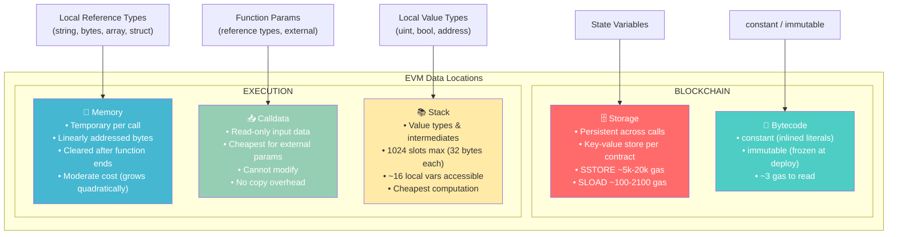

# 📦 Variables in Solidity

> **Chapter 3** | Solidity for Smart Contract Developers
> **Difficulty:** Beginner | **Reading Time:** ~20 minutes

---

## 🗺️ What You'll Learn

- The three categories of variables in Solidity and where each lives
- How the EVM stores data and why it matters for gas costs
- Security pitfalls around `tx.origin` vs `msg.sender`
- When to reach for `constant` vs `immutable` to save gas
- A mental model for Storage, Memory, Calldata, and Stack

---

## 🧠 The Big Picture

In most programming languages, variables just "live in RAM" while your program runs. Solidity is different because your code runs on a blockchain — a globally shared, permanent ledger. That means where a variable lives has enormous consequences for:

- **Cost** — writing to the blockchain costs real money (gas)
- **Persistence** — some variables survive forever; others vanish after a function call
- **Access control** — who can read or write the variable

Solidity has four distinct data locations and three conceptual categories of variables. Let's map them all.

---

## 1. 🏛️ State Variables — The Blockchain Database

State variables are declared **at the contract level**, outside any function. They are stored permanently on the Ethereum blockchain in the contract's **storage slot** — think of it like a key-value database that belongs exclusively to your contract.

```solidity
// SPDX-License-Identifier: MIT
pragma solidity ^0.8.20;

contract BankAccount {
    // --- State Variables ---
    address public owner;          // who owns this account
    uint256 public balance;        // current balance in wei
    bool private isLocked;         // internal flag
    string internal accountName;   // visible to child contracts

    uint256 private constant MAX_DEPOSIT = 10 ether; // compile-time constant
}
```

### 1a. Default Values

Every state variable in Solidity is **zero-initialised** — you never have uninitialized garbage like in C/C++.

| Type | Default Value |
|------|--------------|
| `uint` / `int` | `0` |
| `bool` | `false` |
| `address` | `address(0)` — the zero address |
| `bytes` / `string` | `""` — empty |
| `enum` | First member (index `0`) |
| Mapping | All keys map to their zero value |
| Array (dynamic) | Empty array |

### 1b. Visibility Modifiers

```solidity
contract VisibilityDemo {
    uint256 public    pubVar;      // readable by anyone; Solidity auto-generates a getter
    uint256 private   privVar;     // only THIS contract's code can access it
    uint256 internal  intVar;      // this contract AND contracts that inherit from it
    // Note: 'external' is NOT valid for state variables — only for functions
}
```

> **Pro tip:** `public` on a state variable tells the compiler to auto-generate a free getter function with the same name. You do NOT need to write `getBalance()` yourself — just declare `uint256 public balance`.

### 1c. Gas Cost Implications

Writing to storage is one of the most expensive EVM operations:

| Operation | Approximate Gas |
|-----------|----------------|
| `SSTORE` — writing a **new** non-zero value | ~20,000 gas |
| `SSTORE` — updating an **existing** non-zero value | ~5,000 gas |
| `SSTORE` — resetting a value to **zero** | ~5,000 gas (but you get a refund) |
| `SLOAD` — reading from storage | ~100–2,100 gas (cold vs warm) |

**Rule of thumb:** minimise the number of storage writes in a single transaction.

---

## 2. ⚡ Local Variables — Gone When the Function Returns

Local variables are declared **inside a function**. They exist only for the duration of that function call and are stored in the EVM's **stack** or **memory** — never on the blockchain.

```solidity
contract Calculator {
    function add(uint256 a, uint256 b) public pure returns (uint256) {
        uint256 result = a + b;   // local variable — lives on the stack
        return result;            // destroyed after this line
    }

    function buildGreeting(string memory name) public pure returns (string memory) {
        // 'greeting' is a local variable in memory
        string memory greeting = string.concat("Hello, ", name, "!");
        return greeting;
    }
}
```

**Key facts:**
- Local variables of value types (`uint`, `bool`, `address`, etc.) live on the **stack**.
- Local variables of reference types (`string`, `bytes`, arrays, structs) must be annotated with a data location: `memory` or `storage`.
- They cost **no permanent storage gas** — you only pay for the computation (CPU opcodes).

---

## 3. 🌐 Global Variables — The Blockchain's Context

Solidity provides a set of **globally available variables and functions** that give you access to information about the current transaction, block, and chain. You do not declare these — they are always in scope.

### 3a. Message Context (`msg.*`)

```solidity
contract MsgDemo {
    event Log(address sender, uint256 value);

    function deposit() external payable {
        address caller  = msg.sender;   // who called this function
        uint256 amount  = msg.value;    // how many wei were sent with the call
        bytes memory d  = msg.data;     // the full calldata (function selector + arguments)
        bytes4 selector = msg.sig;      // first 4 bytes of msg.data (function selector)

        emit Log(caller, amount);
    }
}
```

| Variable | Type | Description |
|----------|------|-------------|
| `msg.sender` | `address` | The immediate caller of the current function |
| `msg.value` | `uint256` | Wei sent along with the call |
| `msg.data` | `bytes calldata` | Complete calldata payload |
| `msg.sig` | `bytes4` | Function selector (first 4 bytes of calldata) |

### 3b. Block Context (`block.*`)

```solidity
contract BlockDemo {
    function getBlockInfo() external view returns (
        uint256 timestamp,
        uint256 blockNum,
        uint256 chainId,
        address coinbase
    ) {
        timestamp = block.timestamp;   // Unix timestamp of the current block (seconds)
        blockNum  = block.number;      // current block height
        chainId   = block.chainid;     // EIP-155 chain ID (1 = Ethereum mainnet)
        coinbase  = block.coinbase;    // address of the miner / validator
    }
}
```

> **Warning on `block.timestamp`:** Validators can manipulate the timestamp by a small margin (~15 seconds). Never use it as a source of randomness or for precise timing in high-value logic.

### 3c. Transaction Context (`tx.*`)

```solidity
contract TxDemo {
    function whoStartedThis() external view returns (address origin, uint256 gasPrice) {
        origin   = tx.origin;    // EOA that ORIGINALLY signed the transaction
        gasPrice = tx.gasprice;  // gas price for this transaction (wei per gas unit)
    }
}
```

### 3d. 🚨 CRITICAL SECURITY: `tx.origin` vs `msg.sender`

This is one of the most dangerous mistakes a new Solidity developer can make.

```
User (EOA) → calls → MaliciousContract → calls → VulnerableWallet
```

In the above call chain:
- Inside `VulnerableWallet`, `msg.sender` = `MaliciousContract`
- Inside `VulnerableWallet`, `tx.origin` = `User (EOA)`

**Vulnerable code:**
```solidity
contract VulnerableWallet {
    address owner;

    // DANGEROUS: attacker can trick owner into calling their contract
    // which then calls this function — tx.origin is still the owner!
    function withdraw(uint256 amount) external {
        require(tx.origin == owner, "not owner"); // WRONG — phishing attack possible
        payable(msg.sender).transfer(amount);
    }
}
```

**Secure code:**
```solidity
contract SecureWallet {
    address owner;

    function withdraw(uint256 amount) external {
        require(msg.sender == owner, "not owner"); // CORRECT — checks immediate caller
        payable(msg.sender).transfer(amount);
    }
}
```

> **Rule:** Almost always use `msg.sender` for access control. Only use `tx.origin` in very rare cases where you explicitly need the original EOA signer — and even then, think twice.

### 3e. Address Utilities

```solidity
contract AddressDemo {
    function getContractInfo() external view returns (address self, uint256 ethBalance) {
        self       = address(this);          // this contract's own address
        ethBalance = address(this).balance;  // ETH held by this contract (in wei)
    }
}
```

---

## 4. 🔒 Constants and Immutables — Gas-Saving Hardcoded Values

### 4a. `constant`

A `constant` is evaluated at **compile time**. Its value is baked directly into the bytecode wherever it is used — there is no storage slot allocated.

```solidity
contract TokenConfig {
    // Must be assigned at declaration; primitive types only
    uint256 public constant MAX_SUPPLY      = 1_000_000 * 1e18;
    string  public constant TOKEN_NAME      = "MyToken";
    bytes32 public constant ADMIN_ROLE      = keccak256("ADMIN_ROLE");

    function getMax() external pure returns (uint256) {
        return MAX_SUPPLY; // compiler inlines the literal value — no SLOAD
    }
}
```

**Rules for `constant`:**
- Must be assigned at the point of declaration.
- Only works for value types and `string`/`bytes` literals.
- Cannot reference state variables or call functions (except pure ones like `keccak256`).

### 4b. `immutable`

An `immutable` is assigned **once** — in the constructor — and can never change after deployment. Unlike `constant`, it can be computed at runtime (e.g., from a constructor argument).

```solidity
contract Ownable {
    address public immutable owner;      // set once in constructor
    uint256 public immutable deployedAt; // block number at deployment

    constructor() {
        owner      = msg.sender;         // known only at deploy time
        deployedAt = block.number;
    }

    function isOwner() external view returns (bool) {
        return msg.sender == owner;      // reads from code, not storage
    }
}
```

**Rules for `immutable`:**
- Assigned in the constructor (or inline for simple cases in Solidity ≥0.8.8).
- Can use constructor arguments and runtime values.
- After the constructor runs, the value is frozen into the deployment bytecode.

### 4c. Gas Comparison

| Variable Type | Storage Slot | Read Cost | Write Cost |
|---------------|-------------|-----------|------------|
| Regular state var | Yes | ~100–2,100 gas (SLOAD) | ~5,000–20,000 gas (SSTORE) |
| `immutable` | No (bytecode) | ~3 gas (CODECOPY) | One-time in constructor |
| `constant` | No (inlined) | ~3 gas (literal) | None — compile time |

**Savings are significant.** If you have a value that never changes (e.g., a fee rate, a token address), always prefer `constant` or `immutable`.

---

## 5. 🗄️ Storage vs Memory vs Calldata vs Stack

This is the most conceptually important section. Solidity forces you to be explicit about *where* data lives.

### Data Location Rules

1. **State variables** always live in **Storage**.
2. **Function parameters and return values** default to **Memory** for reference types inside the contract, and can be **Calldata** for `external` function inputs.
3. **Local value types** live on the **Stack**.
4. You must annotate reference types (`string`, `bytes`, arrays, structs) in function signatures.

### 5a. Storage — Permanent and Expensive

```solidity
contract StorageExample {
    uint256[] public numbers; // storage array

    function addNumber(uint256 n) external {
        numbers.push(n); // SSTORE — costs gas, permanent
    }

    function manipulateStorage() external {
        // This creates a REFERENCE to the storage array — no copy made
        uint256[] storage ref = numbers;
        ref[0] = 99; // THIS MODIFIES the actual on-chain state!
    }
}
```

### 5b. Memory — Temporary Workspace

```solidity
contract MemoryExample {
    function processArray(uint256[] memory input) external pure returns (uint256 sum) {
        // 'input' is a copy in memory — modifying it does NOT affect anything outside
        for (uint256 i = 0; i < input.length; i++) {
            sum += input[i];
        }
        // 'input' is destroyed when this function returns
    }

    function buildDynamicArray(uint256 size) external pure returns (uint256[] memory) {
        uint256[] memory result = new uint256[](size); // allocate in memory
        for (uint256 i = 0; i < size; i++) {
            result[i] = i * 2;
        }
        return result;
    }
}
```

### 5c. Calldata — Read-Only Input (Cheapest for External Functions)

```solidity
contract CalldataExample {
    // calldata: cheaper than memory — no copy is made, data read directly from input
    function sumArray(uint256[] calldata data) external pure returns (uint256 total) {
        for (uint256 i = 0; i < data.length; i++) {
            total += data[i]; // reads directly from calldata — cannot modify
        }
    }

    // If you need to modify the input, you must use memory (more expensive)
    function doubleArray(uint256[] memory data) external pure returns (uint256[] memory) {
        for (uint256 i = 0; i < data.length; i++) {
            data[i] *= 2; // allowed because it's a memory copy
        }
        return data;
    }
}
```

> **When to use `calldata`:** Use it for `external` function parameters that are reference types and that you do not need to modify. It skips the copy that `memory` would make, saving gas especially for large arrays or strings.

### 5d. Stack — Tiny and Implicit

The EVM stack holds up to **1024 slots** of 32 bytes each. Local value-type variables and intermediate expression results live here automatically. You rarely think about it explicitly, but you will encounter the **"Stack too deep"** compiler error if a single function has too many local variables (~16 local variables is typically the limit before the compiler cannot access them all).

```solidity
contract StackDemo {
    // This will cause a "Stack too deep" compiler error if too many vars are added
    function lotsOfVars() external pure returns (uint256) {
        uint256 a = 1; uint256 b = 2; uint256 c = 3;
        uint256 d = 4; uint256 e = 5; uint256 f = 6;
        // ... adding ~10+ more local uint256 variables hits the limit
        return a + b + c + d + e + f;
    }
}
```

**Fix for "Stack too deep":** Extract logic into smaller helper functions, or pack related variables into a `struct` stored in `memory`.

---

## 📊 Mermaid Diagram — Data Locations in the EVM



---

## 📋 Master Comparison Table

| Category | Where Stored | Persists? | Gas Cost | Modifiable? | Declared Where |
|----------|-------------|-----------|----------|-------------|----------------|
| State variable | Storage (blockchain) | Yes — forever | High (SSTORE/SLOAD) | Yes | Contract level |
| `constant` | Bytecode (inlined) | Yes — in code | Minimal (~3 gas read) | No | Contract level |
| `immutable` | Bytecode (frozen) | Yes — in code | Minimal (~3 gas read) | Constructor only | Contract level |
| Local (value type) | Stack | No — per call | Minimal | Yes | Inside function |
| Local (reference type `memory`) | Memory | No — per call | Moderate | Yes (copy) | Inside function |
| Local (reference type `storage`) | Storage (reference) | Yes (same slot) | High (same as state) | Yes (in-place) | Inside function |
| Function param (`calldata`) | Calldata | No — per call | Minimal (no copy) | No | Function signature |
| Function param (`memory`) | Memory | No — per call | Moderate (copied in) | Yes | Function signature |
| `msg.sender` / `block.*` | EVM context | No — per call | Minimal (opcode) | No | Built-in global |

---

## 🔑 Key Takeaways

1. **Storage is precious.** Every write to a state variable costs real money. Batch updates, cache values in memory locals, and avoid redundant writes.

2. **`constant` > `immutable` > state variable** — in that order for gas efficiency, when each is applicable. Ask "does this value need to change?" If no, make it `constant` or `immutable`.

3. **Never use `tx.origin` for access control.** It is vulnerable to phishing/relay attacks. Always use `msg.sender`.

4. **`calldata` over `memory`** for external function parameters you don't need to modify. It's free to read and avoids a copy.

5. **`storage` references are dangerous.** When you write `MyStruct storage ref = myStructVar;` inside a function and modify `ref`, you are modifying the on-chain state — no different from modifying `myStructVar` directly.

6. **Default values are zero.** You never read garbage from an uninitialized variable in Solidity — but double check your logic doesn't depend on this to mask a bug.

7. **Stack depth = 1024, accessible slots ~= 16.** If your function grows complex, break it up. "Stack too deep" is a compiler error, not a runtime one.

---

## 🧩 Quick-Reference Cheat Sheet

```solidity
// SPDX-License-Identifier: MIT
pragma solidity ^0.8.20;

contract CheatSheet {
    // ---- STATE VARIABLES ----
    address public  owner;                        // auto-getter, anyone can read
    uint256 private secretCode;                   // only this contract
    uint256 internal sharedBase;                  // this + inheriting contracts

    // ---- CONSTANTS & IMMUTABLES ----
    uint256 public constant  FEE_BPS   = 300;     // 3% — compile-time literal
    address public immutable TOKEN;               // set once in constructor

    constructor(address _token) {
        owner = msg.sender;
        TOKEN = _token;
    }

    // ---- LOCAL + CALLDATA + MEMORY ----
    function process(
        uint256[] calldata ids,   // read-only, no copy — cheapest
        string memory label       // writable copy in memory
    ) external view returns (uint256 total) {
        uint256 cachedLen = ids.length; // local value type (stack)

        for (uint256 i = 0; i < cachedLen; i++) {
            total += ids[i];
        }
        // 'label' and 'cachedLen' are gone after this function returns
    }

    // ---- GLOBAL VARIABLES ----
    function globalInfo() external payable returns (
        address caller,
        uint256 sent,
        uint256 blockTs,
        address self
    ) {
        caller  = msg.sender;
        sent    = msg.value;
        blockTs = block.timestamp;
        self    = address(this);
    }
}
```

---

## 📝 Quiz

Test your understanding before moving on.

**Q1.** You have a contract with:
```solidity
uint256 public constant RATE = 500;
uint256 public rateVar = 500;
```
Which is cheaper to read in a function, and why?

<details>
<summary>Answer</summary>

`RATE` (the constant) is cheaper. A `constant` is inlined into the bytecode at compile time, so reading it is essentially free (~3 gas, like reading a literal). `rateVar` is a state variable in storage — reading it costs an SLOAD, which can be 100–2,100 gas depending on whether the slot is "warm" (already accessed this transaction) or "cold".

</details>

---

**Q2.** A user calls `ContractA.doStuff()`, which internally calls `ContractB.withdraw()`. Inside `ContractB.withdraw()`, what are the values of `msg.sender` and `tx.origin`?

<details>
<summary>Answer</summary>

- `msg.sender` = **the address of `ContractA`** — it is the immediate caller of `ContractB.withdraw()`.
- `tx.origin` = **the original EOA (human wallet)** that initiated the top-level transaction by calling `ContractA.doStuff()`.

This is why using `tx.origin` for access control is dangerous: a malicious contract (ContractA) could trick a legitimate owner into calling it, and the malicious contract could then call your contract where `tx.origin == owner` would still pass — allowing unauthorized actions.

</details>

---

**Q3.** What will the compiler output if you write this function?

```solidity
function getData(uint256[] calldata items) external pure returns (uint256[] calldata) {
    items[0] = 99; // trying to modify calldata
    return items;
}
```

<details>
<summary>Answer</summary>

**Compiler error:** `TypeError: Expression has to be an lvalue.`

`calldata` variables are **read-only**. You cannot assign to them. If you need to modify the array, change the parameter location to `memory`:

```solidity
function getData(uint256[] memory items) external pure returns (uint256[] memory) {
    items[0] = 99; // works — items is a writable memory copy
    return items;
}
```

Note that this is slightly more expensive because the calldata is copied into memory on entry.

</details>

---

## 🔗 What's Next

In **Chapter 4 — Functions in Solidity**, we'll explore:
- Function visibility (`public`, `private`, `internal`, `external`)
- State mutability (`pure`, `view`, `payable`)
- Function modifiers and how to build reusable access-control guards
- Fallback and receive functions for handling plain ETH transfers

---

*Chapter 3 of the Solidity Developer Series*
