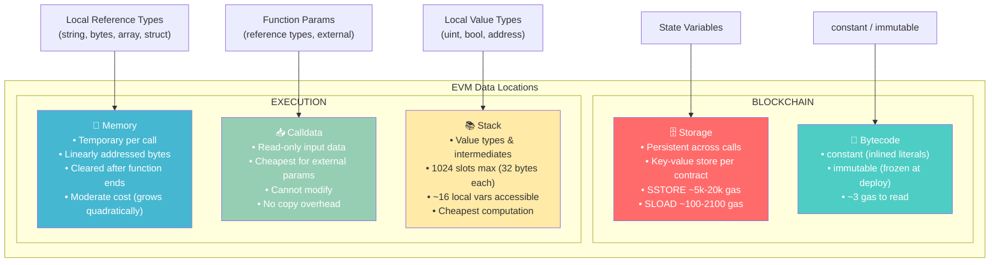

# 📦 Variables in Solidity

> **Chapter 3** | Solidity for Smart Contract Developers
> **Difficulty:** Beginner | **Reading Time:** ~20 minutes

---

## 🗺️ Kya Seekhoge Is Chapter Mein

- Solidity mein variables ke teen categories aur har ek kahan "rehta" hai
- EVM data ko kaise store karta hai aur ye gas cost ko kaise affect karta hai
- `tx.origin` vs `msg.sender` ka security wala pitfall
- Gas bachane ke liye `constant` vs `immutable` kab use karna hai
- Storage, Memory, Calldata, aur Stack ka ek mental model

---

## 🧠 Bada Picture

Zyada tar programming languages mein variables bas "RAM mein rehte hain" jab tak program chal raha hai. Solidity alag hai kyunki tumhara code blockchain pe chalta hai — ek globally shared, permanent ledger. Iska matlab, variable kahan store ho raha hai, uska seedha asar padta hai:

- **Cost** — blockchain pe likhna real paisa (gas) kharch karta hai
- **Persistence** — kuch variables hamesha ke liye rehte hain; kuch function call khatam hote hi gayab ho jaate hain
- **Access control** — variable ko kaun padh sakta hai ya likh sakta hai

Solidity mein data ke chaar alag locations hain aur variables ke teen conceptual categories. Chalo sabko map karte hain.

---

## 1. 🏛️ State Variables — Blockchain Ka Database

State variables **contract level pe** declare hote hain, kisi function ke bahar. Ye Ethereum blockchain pe permanently store hote hain contract ke **storage slot** mein — isko socho ek key-value database jaisa jo sirf tumhare contract ka apna hai.

```solidity
// SPDX-License-Identifier: MIT
pragma solidity ^0.8.20;

contract BankAccount {
    // --- State Variables ---
    address public owner;          // who owns this account
    uint256 public balance;        // current balance in wei
    bool private isLocked;         // internal flag
    string internal accountName;   // visible to child contracts

    uint256 private constant MAX_DEPOSIT = 10 ether; // compile-time constant
}
```

### 1a. Default Values

Solidity mein har state variable **zero-initialised** hota hai — C/C++ jaisa uninitialized garbage yahan kabhi nahi milega.

| Type | Default Value |
|------|--------------|
| `uint` / `int` | `0` |
| `bool` | `false` |
| `address` | `address(0)` — zero address |
| `bytes` / `string` | `""` — empty |
| `enum` | Pehla member (index `0`) |
| Mapping | Saari keys apne zero value pe map hoti hain |
| Array (dynamic) | Empty array |

### 1b. Visibility Modifiers

```solidity
contract VisibilityDemo {
    uint256 public    pubVar;      // readable by anyone; Solidity auto-generates a getter
    uint256 private   privVar;     // only THIS contract's code can access it
    uint256 internal  intVar;      // this contract AND contracts that inherit from it
    // Note: 'external' is NOT valid for state variables — only for functions
}
```

> [!tip]
> `public` state variable pe lagane se compiler khud-b-khud ek free getter function bana deta hai same naam se. Tumhe khud `getBalance()` likhne ki zarurat nahi — bas `uint256 public balance` declare karo, kaam ho gaya. Zomato ke app jaisa socho — restaurant ka naam public hai, tumhe alag se "restaurant ka naam batao" wala API call nahi karna padta, seedha dikh jaata hai.

### 1c. Gas Cost Ka Panga

Storage mein likhna EVM ke sabse expensive operations mein se ek hai:

| Operation | Approximate Gas |
|-----------|----------------|
| `SSTORE` — **naya** non-zero value likhna | ~20,000 gas |
| `SSTORE` — **existing** non-zero value update karna | ~5,000 gas |
| `SSTORE` — value ko zero pe reset karna | ~5,000 gas (lekin refund milta hai) |
| `SLOAD` — storage se padhna | ~100–2,100 gas (cold vs warm) |

**Rule of thumb:** ek hi transaction mein storage writes jitna kam ho sake utna kam rakho.

---

## 2. ⚡ Local Variables — Function Khatam, Variable Gayab

Local variables **function ke andar** declare hote hain. Ye sirf us function call ke duration tak zinda rehte hain aur EVM ke **stack** ya **memory** mein store hote hain — blockchain pe kabhi nahi.

```solidity
contract Calculator {
    function add(uint256 a, uint256 b) public pure returns (uint256) {
        uint256 result = a + b;   // local variable — lives on the stack
        return result;            // destroyed after this line
    }

    function buildGreeting(string memory name) public pure returns (string memory) {
        // 'greeting' is a local variable in memory
        string memory greeting = string.concat("Hello, ", name, "!");
        return greeting;
    }
}
```

**Key facts:**
- Value type (`uint`, `bool`, `address` etc.) wale local variables **stack** pe rehte hain.
- Reference type (`string`, `bytes`, arrays, structs) wale local variables ke saath data location bataana zaroori hai: `memory` ya `storage`.
- Ye **koi permanent storage gas** nahi lete — sirf computation (CPU opcodes) ka paisa lagta hai.

---

## 3. 🌐 Global Variables — Blockchain Ka Context

Solidity tumhe kuch **globally available variables aur functions** deta hai jo current transaction, block, aur chain ke baare mein info dete hain. Inhe declare karne ki zarurat nahi — ye hamesha scope mein already available hote hain.

### 3a. Message Context (`msg.*`)

```solidity
contract MsgDemo {
    event Log(address sender, uint256 value);

    function deposit() external payable {
        address caller  = msg.sender;   // who called this function
        uint256 amount  = msg.value;    // how many wei were sent with the call
        bytes memory d  = msg.data;     // the full calldata (function selector + arguments)
        bytes4 selector = msg.sig;      // first 4 bytes of msg.data (function selector)

        emit Log(caller, amount);
    }
}
```

| Variable | Type | Description |
|----------|------|-------------|
| `msg.sender` | `address` | Current function ka immediate caller |
| `msg.value` | `uint256` | Call ke saath bheja gaya wei |
| `msg.data` | `bytes calldata` | Poora calldata payload |
| `msg.sig` | `bytes4` | Function selector (calldata ke pehle 4 bytes) |

### 3b. Block Context (`block.*`)

```solidity
contract BlockDemo {
    function getBlockInfo() external view returns (
        uint256 timestamp,
        uint256 blockNum,
        uint256 chainId,
        address coinbase
    ) {
        timestamp = block.timestamp;   // Unix timestamp of the current block (seconds)
        blockNum  = block.number;      // current block height
        chainId   = block.chainid;     // EIP-155 chain ID (1 = Ethereum mainnet)
        coinbase  = block.coinbase;    // address of the miner / validator
    }
}
```

> [!warning]
> **`block.timestamp` ka warning:** Validators timestamp ko thoda-bahut (~15 seconds) manipulate kar sakte hain. Isko kabhi bhi randomness ke source ya high-value logic mein precise timing ke liye use mat karo.

### 3c. Transaction Context (`tx.*`)

```solidity
contract TxDemo {
    function whoStartedThis() external view returns (address origin, uint256 gasPrice) {
        origin   = tx.origin;    // EOA that ORIGINALLY signed the transaction
        gasPrice = tx.gasprice;  // gas price for this transaction (wei per gas unit)
    }
}
```

### 3d. 🚨 CRITICAL SECURITY: `tx.origin` vs `msg.sender`

Ye ek sabse dangerous mistake hai jo naya Solidity developer kar sakta hai.

```
User (EOA) → calls → MaliciousContract → calls → VulnerableWallet
```

Upar wali call chain mein:
- `VulnerableWallet` ke andar, `msg.sender` = `MaliciousContract`
- `VulnerableWallet` ke andar, `tx.origin` = `User (EOA)`

Socho tum Zomato pe login ho (`tx.origin` = tum), lekin tumne galti se ek fake link click kar diya jo background mein ek malicious contract ko call karta hai, jo aage tumhare wallet contract ko call karta hai. Agar wallet sirf `tx.origin` check karega, toh usko lagega "haan ye owner hi hai" — kyunki original signer toh tum hi ho! Yehi phishing ka poora khel hai.

**Vulnerable code:**
```solidity
contract VulnerableWallet {
    address owner;

    // DANGEROUS: attacker can trick owner into calling their contract
    // which then calls this function — tx.origin is still the owner!
    function withdraw(uint256 amount) external {
        require(tx.origin == owner, "not owner"); // WRONG — phishing attack possible
        payable(msg.sender).transfer(amount);
    }
}
```

**Secure code:**
```solidity
contract SecureWallet {
    address owner;

    function withdraw(uint256 amount) external {
        require(msg.sender == owner, "not owner"); // CORRECT — checks immediate caller
        payable(msg.sender).transfer(amount);
    }
}
```

> [!tip]
> **Rule:** Access control ke liye lagbhag hamesha `msg.sender` use karo. `tx.origin` ko sirf un rare cases mein use karo jaha tumhe explicitly original EOA signer chahiye ho — aur tab bhi do baar soch lo.

### 3e. Address Utilities

```solidity
contract AddressDemo {
    function getContractInfo() external view returns (address self, uint256 ethBalance) {
        self       = address(this);          // this contract's own address
        ethBalance = address(this).balance;  // ETH held by this contract (in wei)
    }
}
```

---

## 4. 🔒 Constants Aur Immutables — Gas Bachane Wale Hardcoded Values

### 4a. `constant`

`constant` **compile time** pe evaluate hota hai. Iski value directly bytecode mein bake ho jaati hai jahan bhi use hoti hai — koi storage slot allocate nahi hota.

```solidity
contract TokenConfig {
    // Must be assigned at declaration; primitive types only
    uint256 public constant MAX_SUPPLY      = 1_000_000 * 1e18;
    string  public constant TOKEN_NAME      = "MyToken";
    bytes32 public constant ADMIN_ROLE      = keccak256("ADMIN_ROLE");

    function getMax() external pure returns (uint256) {
        return MAX_SUPPLY; // compiler inlines the literal value — no SLOAD
    }
}
```

**`constant` ke rules:**
- Declaration ke waqt hi assign karna padega.
- Sirf value types aur `string`/`bytes` literals ke liye kaam karta hai.
- State variables ko reference nahi kar sakta ya functions call nahi kar sakta (except pure wale jaise `keccak256`).

### 4b. `immutable`

`immutable` **sirf ek baar** assign hota hai — constructor mein — aur deployment ke baad kabhi badal nahi sakta. `constant` ke ulat, ye runtime pe compute ho sakta hai (jaise constructor argument se).

```solidity
contract Ownable {
    address public immutable owner;      // set once in constructor
    uint256 public immutable deployedAt; // block number at deployment

    constructor() {
        owner      = msg.sender;         // known only at deploy time
        deployedAt = block.number;
    }

    function isOwner() external view returns (bool) {
        return msg.sender == owner;      // reads from code, not storage
    }
}
```

**`immutable` ke rules:**
- Constructor mein assign hota hai (ya inline, simple cases mein Solidity ≥0.8.8 se).
- Constructor arguments aur runtime values use kar sakta hai.
- Constructor chalne ke baad, value deployment bytecode mein freeze ho jaati hai.

### 4c. Gas Comparison

| Variable Type | Storage Slot | Read Cost | Write Cost |
|---------------|-------------|-----------|------------|
| Regular state var | Haan | ~100–2,100 gas (SLOAD) | ~5,000–20,000 gas (SSTORE) |
| `immutable` | Nahi (bytecode) | ~3 gas (CODECOPY) | Ek baar constructor mein |
| `constant` | Nahi (inlined) | ~3 gas (literal) | Kuch nahi — compile time |

**Savings kaafi significant hain.** Agar koi value kabhi badalti nahi (jaise fee rate, ek token address), toh hamesha `constant` ya `immutable` prefer karo.

---

## 5. 🗄️ Storage vs Memory vs Calldata vs Stack

Ye section conceptually sabse important hai. Solidity tumhe explicitly batana padta hai ki data *kahan* rehta hai.

### Data Location Ke Rules

1. **State variables** hamesha **Storage** mein rehte hain.
2. **Function parameters aur return values** contract ke andar reference types ke liye default **Memory** hote hain, aur `external` function inputs ke liye **Calldata** ho sakte hain.
3. **Local value types** **Stack** pe rehte hain.
4. Function signatures mein reference types (`string`, `bytes`, arrays, structs) ko annotate karna padega.

### 5a. Storage — Permanent Aur Mehnga

```solidity
contract StorageExample {
    uint256[] public numbers; // storage array

    function addNumber(uint256 n) external {
        numbers.push(n); // SSTORE — costs gas, permanent
    }

    function manipulateStorage() external {
        // This creates a REFERENCE to the storage array — no copy made
        uint256[] storage ref = numbers;
        ref[0] = 99; // THIS MODIFIES the actual on-chain state!
    }
}
```

### 5b. Memory — Temporary Workspace

```solidity
contract MemoryExample {
    function processArray(uint256[] memory input) external pure returns (uint256 sum) {
        // 'input' is a copy in memory — modifying it does NOT affect anything outside
        for (uint256 i = 0; i < input.length; i++) {
            sum += input[i];
        }
        // 'input' is destroyed when this function returns
    }

    function buildDynamicArray(uint256 size) external pure returns (uint256[] memory) {
        uint256[] memory result = new uint256[](size); // allocate in memory
        for (uint256 i = 0; i < size; i++) {
            result[i] = i * 2;
        }
        return result;
    }
}
```

### 5c. Calldata — Read-Only Input (External Functions Ke Liye Sabse Sasta)

```solidity
contract CalldataExample {
    // calldata: cheaper than memory — no copy is made, data read directly from input
    function sumArray(uint256[] calldata data) external pure returns (uint256 total) {
        for (uint256 i = 0; i < data.length; i++) {
            total += data[i]; // reads directly from calldata — cannot modify
        }
    }

    // If you need to modify the input, you must use memory (more expensive)
    function doubleArray(uint256[] memory data) external pure returns (uint256[] memory) {
        for (uint256 i = 0; i < data.length; i++) {
            data[i] *= 2; // allowed because it's a memory copy
        }
        return data;
    }
}
```

> [!info]
> **`calldata` kab use karein:** `external` function parameters ke liye jo reference types hain aur jinhe tumhe modify nahi karna — waha `calldata` use karo. Ye woh copy skip kar deta hai jo `memory` banata, isse bade arrays ya strings pe kaafi gas bachta hai. Bilkul IRCTC ke tatkal booking jaisa — jo data sirf padhna hai use directly source se hi padho, alag se copy banane ki zarurat nahi.

### 5d. Stack — Chhota Aur Implicit

EVM stack mein maximum **1024 slots** hote hain, har ek 32 bytes ka. Local value-type variables aur intermediate expression results automatically yahi rehte hain. Tum shayad hi kabhi isके baare mein directly sochte ho, lekin **"Stack too deep"** compiler error tab milega jab ek single function mein bohot zyada local variables ho jayein (~16 local variables typically limit hai jiske baad compiler unko access nahi kar pata).

```solidity
contract StackDemo {
    // This will cause a "Stack too deep" compiler error if too many vars are added
    function lotsOfVars() external pure returns (uint256) {
        uint256 a = 1; uint256 b = 2; uint256 c = 3;
        uint256 d = 4; uint256 e = 5; uint256 f = 6;
        // ... adding ~10+ more local uint256 variables hits the limit
        return a + b + c + d + e + f;
    }
}
```

**"Stack too deep" ka fix:** Logic ko chhote helper functions mein tod do, ya related variables ko ek `struct` mein pack karke `memory` mein store karo.

---

## 📊 Mermaid Diagram — EVM Mein Data Locations



---

## 📋 Master Comparison Table

| Category | Kahan Store Hota Hai | Persist Karta Hai? | Gas Cost | Modify Ho Sakta Hai? | Kahan Declare Hota Hai |
|----------|-------------|-----------|----------|-------------|----------------|
| State variable | Storage (blockchain) | Haan — hamesha ke liye | High (SSTORE/SLOAD) | Haan | Contract level |
| `constant` | Bytecode (inlined) | Haan — code mein | Minimal (~3 gas read) | Nahi | Contract level |
| `immutable` | Bytecode (frozen) | Haan — code mein | Minimal (~3 gas read) | Sirf constructor mein | Contract level |
| Local (value type) | Stack | Nahi — per call | Minimal | Haan | Function ke andar |
| Local (reference type `memory`) | Memory | Nahi — per call | Moderate | Haan (copy) | Function ke andar |
| Local (reference type `storage`) | Storage (reference) | Haan (same slot) | High (state jaisa hi) | Haan (in-place) | Function ke andar |
| Function param (`calldata`) | Calldata | Nahi — per call | Minimal (no copy) | Nahi | Function signature |
| Function param (`memory`) | Memory | Nahi — per call | Moderate (copied in) | Haan | Function signature |
| `msg.sender` / `block.*` | EVM context | Nahi — per call | Minimal (opcode) | Nahi | Built-in global |

---

## 🔑 Key Takeaways

1. **Storage precious hai.** Har state variable write real paisa kharch karta hai. Updates ko batch karo, values ko memory locals mein cache karo, aur redundant writes se bacho.

2. **`constant` > `immutable` > state variable** — gas efficiency ke hisaab se yahi order hai, jab bhi applicable ho. Khud se pucho "kya ye value badlegi?" Agar nahi, toh `constant` ya `immutable` bana do.

3. **Access control ke liye `tx.origin` kabhi use mat karo.** Ye phishing/relay attacks ke liye vulnerable hai. Hamesha `msg.sender` use karo.

4. **`memory` ke bajaye `calldata`** un external function parameters ke liye jinhe tumhe modify nahi karna. Padhna free hai aur copy bhi nahi banti.

5. **`storage` references dangerous hain.** Jab tum `MyStruct storage ref = myStructVar;` likhte ho function ke andar aur `ref` ko modify karte ho, tab tum actual on-chain state modify kar rahe ho — bilkul waisa hi jaisa `myStructVar` ko directly modify karna.

6. **Default values zero hote hain.** Solidity mein tum kabhi bhi uninitialized variable se garbage nahi padhoge — lekin double check kar lo ki tumhara logic kisi bug ko chhupane ke liye isi zero-default pe depend na kare.

7. **Stack depth = 1024, accessible slots ~= 16.** Agar tumhara function complex ho raha hai, use tod do. "Stack too deep" ek compiler error hai, runtime wala nahi.

---

## 🧩 Quick-Reference Cheat Sheet

```solidity
// SPDX-License-Identifier: MIT
pragma solidity ^0.8.20;

contract CheatSheet {
    // ---- STATE VARIABLES ----
    address public  owner;                        // auto-getter, anyone can read
    uint256 private secretCode;                   // only this contract
    uint256 internal sharedBase;                  // this + inheriting contracts

    // ---- CONSTANTS & IMMUTABLES ----
    uint256 public constant  FEE_BPS   = 300;     // 3% — compile-time literal
    address public immutable TOKEN;               // set once in constructor

    constructor(address _token) {
        owner = msg.sender;
        TOKEN = _token;
    }

    // ---- LOCAL + CALLDATA + MEMORY ----
    function process(
        uint256[] calldata ids,   // read-only, no copy — cheapest
        string memory label       // writable copy in memory
    ) external view returns (uint256 total) {
        uint256 cachedLen = ids.length; // local value type (stack)

        for (uint256 i = 0; i < cachedLen; i++) {
            total += ids[i];
        }
        // 'label' and 'cachedLen' are gone after this function returns
    }

    // ---- GLOBAL VARIABLES ----
    function globalInfo() external payable returns (
        address caller,
        uint256 sent,
        uint256 blockTs,
        address self
    ) {
        caller  = msg.sender;
        sent    = msg.value;
        blockTs = block.timestamp;
        self    = address(this);
    }
}
```

---

## 📝 Quiz

Aage badhne se pehle apna samajh test kar lo.

**Q1.** Tumhare paas ek contract hai:
```solidity
uint256 public constant RATE = 500;
uint256 public rateVar = 500;
```
Kaunsa function ke andar padhna sasta hai, aur kyun?

<details>
<summary>Answer</summary>

`RATE` (constant wala) sasta hai. `constant` compile time pe bytecode mein inline ho jaata hai, isliye ise padhna basically free hai (~3 gas, ek literal padhne jaisa). `rateVar` ek state variable hai storage mein — ise padhne mein SLOAD lagta hai, jo 100–2,100 gas ho sakta hai depend karta hai slot "warm" hai (isi transaction mein pehle access ho chuka) ya "cold".

</details>

---

**Q2.** Ek user `ContractA.doStuff()` call karta hai, jo internally `ContractB.withdraw()` ko call karta hai. `ContractB.withdraw()` ke andar, `msg.sender` aur `tx.origin` ki values kya hongi?

<details>
<summary>Answer</summary>

- `msg.sender` = **`ContractA` ka address** — ye `ContractB.withdraw()` ka immediate caller hai.
- `tx.origin` = **original EOA (human wallet)** jisne top-level transaction shuru kiya tha `ContractA.doStuff()` ko call karke.

Isi wajah se access control ke liye `tx.origin` use karna dangerous hai: ek malicious contract (ContractA) kisi legitimate owner ko trick karke apna function call karwa sakta hai, aur phir woh malicious contract tumhare contract ko call kar sakta hai jahan `tx.origin == owner` phir bhi pass ho jayega — isse unauthorized actions ho sakte hain.

</details>

---

**Q3.** Agar tum ye function likhoge toh compiler kya output dega?

```solidity
function getData(uint256[] calldata items) external pure returns (uint256[] calldata) {
    items[0] = 99; // trying to modify calldata
    return items;
}
```

<details>
<summary>Answer</summary>

**Compiler error:** `TypeError: Expression has to be an lvalue.`

`calldata` variables **read-only** hote hain. Inko assign nahi kar sakte. Agar array modify karna hai, toh parameter location ko `memory` mein badal do:

```solidity
function getData(uint256[] memory items) external pure returns (uint256[] memory) {
    items[0] = 99; // works — items is a writable memory copy
    return items;
}
```

Dhyan rahe ye thoda zyada expensive hoga kyunki calldata entry pe memory mein copy hoti hai.

</details>

---

## 🔗 Aage Kya

**Chapter 4 — Functions in Solidity** mein hum explore karenge:
- Function visibility (`public`, `private`, `internal`, `external`)
- State mutability (`pure`, `view`, `payable`)
- Function modifiers aur reusable access-control guards kaise banayein
- Fallback aur receive functions plain ETH transfers handle karne ke liye

---

*Chapter 3 of the Solidity Developer Series*
