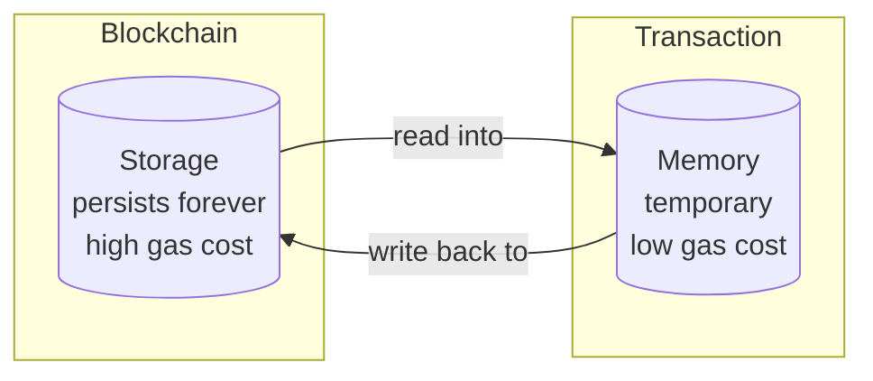
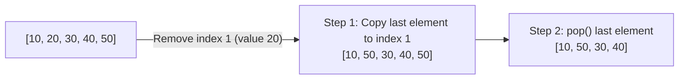
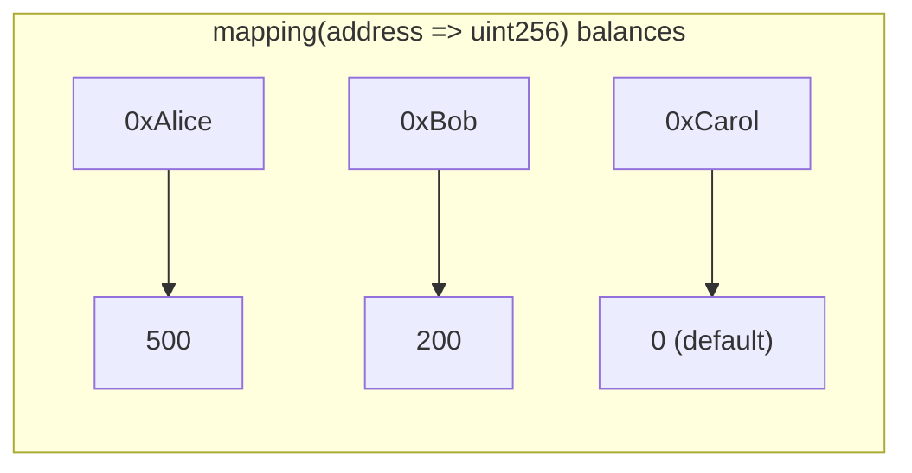
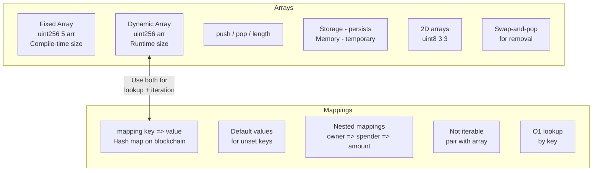

# 📦 Arrays and Mappings in Solidity

> **Difficulty:** Beginner | **Chapter:** 06 | **Prerequisites:** Structs, Value Types, Functions

Data structures are the backbone of any smart contract. If you've ever built a backend API, you've used arrays and hash maps constantly — Solidity has both, but with some blockchain-specific twists that can trip up newcomers. This chapter covers everything you need to know to store, retrieve, and manage collections of data on-chain efficiently.

---

## 🗂️ Part 1: Arrays

### What Is an Array?

An array is an ordered list of items of the same type. Solidity supports two flavors: **fixed-size** and **dynamic**.

---

### 1. Fixed-Size Arrays

```solidity
uint256[5] public scores;
```

- The size is baked in at compile time — it **cannot change**.
- Stored contiguously in a single storage slot (for small types).
- Best used when the count is known and constant: days of the week, RGB channels, etc.
- Slightly cheaper to use than dynamic arrays because there is no length bookkeeping overhead.

```solidity
// SPDX-License-Identifier: MIT
pragma solidity ^0.8.0;

contract FixedArrayDemo {
    uint256[5] public weeklyGoals;  // exactly 5 slots, indices 0..4

    function setGoal(uint256 index, uint256 value) public {
        // Will revert automatically if index >= 5
        weeklyGoals[index] = value;
    }

    function sumGoals() public view returns (uint256 total) {
        for (uint256 i = 0; i < weeklyGoals.length; i++) {
            total += weeklyGoals[i];
        }
    }
}
```

**When to use fixed arrays:**
- Storing a fixed set of parameters (e.g., fee tiers, price bands).
- Working with cryptographic proofs where element count is fixed (e.g., Merkle proofs).
- Avoiding the gas overhead of a dynamic length slot.

---

### 2. Dynamic Arrays

```solidity
uint256[] public scores;
```

- Size is **unknown at compile time** — the array grows and shrinks at runtime.
- Solidity tracks `length` automatically in storage.
- The go-to choice for lists that change over time (members, orders, bids).

```solidity
contract DynamicArrayDemo {
    uint256[] public numbers;

    function addNumber(uint256 n) public {
        numbers.push(n);          // appends to the end
    }

    function removeLastNumber() public {
        numbers.pop();            // removes last element
    }

    function getLength() public view returns (uint256) {
        return numbers.length;
    }
}
```

---

### 3. Array Methods: push, pop, length, delete

| Operation | Syntax | Effect |
|---|---|---|
| Append | `arr.push(value)` | Adds value at the end, increments length |
| Remove last | `arr.pop()` | Removes last element, decrements length |
| Read length | `arr.length` | Returns current number of elements |
| Delete element | `delete arr[i]` | **Resets** element to default value; length unchanged |

> ⚠️ **`delete` does NOT shrink the array.** It sets the element to its zero value (`0` for uint, `address(0)` for address, etc.) but leaves a "hole". This is a common beginner mistake.

```solidity
uint256[] public data = [10, 20, 30, 40];

delete data[1];
// data is now [10, 0, 30, 40]  — length is still 4
```

---

### 4. Storage vs Memory Arrays

This is one of the most important distinctions in Solidity.



| Property | Storage Array | Memory Array |
|---|---|---|
| Lifetime | Permanent (state variable) | Temporary (function execution) |
| Cost | Expensive (SSTORE ~20,000 gas) | Cheap (in-memory ops ~3 gas) |
| `push` / `pop` | Supported | **Not supported** |
| Size | Can grow dynamically | Must be fixed at creation time |
| Declared | At contract level | Inside a function with `memory` keyword |

```solidity
contract StorageVsMemory {
    uint256[] public storedNums;  // storage: lives on-chain forever

    function processLocally(uint256 size) public pure returns (uint256[] memory) {
        // Memory array: size must be known at creation, no push/pop
        uint256[] memory temp = new uint256[](size);
        for (uint256 i = 0; i < size; i++) {
            temp[i] = i * 2;
        }
        return temp;  // returned to caller, not persisted
    }

    function addToStorage(uint256 val) public {
        storedNums.push(val);  // push only works on storage arrays
    }
}
```

**Rule of thumb:** Use `memory` arrays for intermediate calculations inside functions. Use `storage` arrays (state variables) only when data must persist between transactions.

---

### 5. Array of Structs Pattern

Pairing arrays with structs is one of the most common patterns in Solidity:

```solidity
contract Auction {
    struct Bid {
        address bidder;
        uint256 amount;
        uint256 timestamp;
    }

    Bid[] public bids;

    function placeBid() public payable {
        bids.push(Bid({
            bidder: msg.sender,
            amount: msg.value,
            timestamp: block.timestamp
        }));
    }

    function getTopBid() public view returns (Bid memory) {
        require(bids.length > 0, "No bids yet");
        Bid memory top = bids[0];
        for (uint256 i = 1; i < bids.length; i++) {
            if (bids[i].amount > top.amount) {
                top = bids[i];
            }
        }
        return top;
    }
}
```

---

### 6. 2D Arrays

Solidity supports arrays of arrays — useful for grids, matrices, and multi-dimensional data.

```solidity
contract TicTacToe {
    // 3x3 board: 0 = empty, 1 = X, 2 = O
    uint8[3][3] public board;

    function mark(uint8 row, uint8 col, uint8 player) public {
        require(board[row][col] == 0, "Cell taken");
        board[row][col] = player;
    }
}

// Dynamic 2D array
contract Matrix {
    uint256[][] public grid;

    function addRow(uint256[] memory row) public {
        grid.push(row);
    }
}
```

> **Note on syntax:** `uint8[3][3]` — the **rightmost** dimension is the outer dimension. `uint8[3][3]` means an array of 3 items, each being an array of 3 `uint8`s. This is opposite to many other languages — read it right to left.

---

### 7. Removing an Element: The Swap-and-Pop Pattern

Since `delete` leaves holes and doesn't shrink the array, a clean removal technique is **swap-and-pop**:



```solidity
function removeAtIndex(uint256[] storage arr, uint256 index) internal {
    require(index < arr.length, "Index out of bounds");
    arr[index] = arr[arr.length - 1];  // overwrite with last element
    arr.pop();                          // shrink array by 1
}
```

**Trade-off:** This does NOT preserve order. If order matters, you need a shift-left approach (much more gas-expensive) or a different data structure entirely.

---

## 🗺️ Part 2: Mappings

### What Is a Mapping?

Think of a mapping as a **hash map** or **dictionary** — it maps keys to values. But unlike in traditional programming, a Solidity mapping is backed by the blockchain's key-value store (the EVM's trie), not an in-memory hash table.



---

### 1. Syntax

```solidity
mapping(KeyType => ValueType) visibility variableName;
```

Examples:

```solidity
mapping(address => uint256) public balances;
mapping(uint256 => string)  public tokenURIs;
mapping(bytes32 => bool)    public usedNonces;
```

---

### 2. Allowed Key Types

Keys must be **value types** (no dynamic-sized types like arrays or structs):

| Allowed Key Types | Examples |
|---|---|
| Integer types | `uint256`, `int128`, `uint8` |
| `address` | `address`, `address payable` |
| `bool` | `bool` |
| `bytes` (fixed) | `bytes32`, `bytes4` |
| `string` | `string` (special case — treated like `bytes`) |
| Enums | Any user-defined enum |

> ❌ You **cannot** use structs, arrays, or other mappings as key types.

---

### 3. Default Values for Unset Keys

Every possible key in a mapping exists conceptually and returns the **zero/default value** of the value type if never set:

```solidity
mapping(address => uint256) public balances;

// balances[0xSomeRandomAddress] returns 0 — no revert, no error
// This is why you never need to "initialize" a mapping key
```

| Value Type | Default |
|---|---|
| `uint256` | `0` |
| `bool` | `false` |
| `address` | `address(0)` |
| `string` | `""` |
| struct | All fields at their zero values |

---

### 4. Nested Mappings

Mappings can be nested to create two-dimensional lookup tables:

```solidity
// ERC-20 allowances: owner => spender => amount
mapping(address => mapping(address => uint256)) public allowances;

function approve(address spender, uint256 amount) public {
    allowances[msg.sender][spender] = amount;
}

function allowance(address owner, address spender) public view returns (uint256) {
    return allowances[owner][spender];
}
```

This is a canonical pattern from the ERC-20 token standard — Alice approves Bob to spend 100 tokens on her behalf:

```
allowances[Alice][Bob] = 100
```

---

### 5. Mappings Are Not Iterable

This is the single biggest gotcha with mappings. You **cannot** loop over a mapping or find out what keys exist in it. Solidity does not maintain a list of keys — values are scattered across storage by their hash.

**Workaround: pair the mapping with an array of keys**

```solidity
mapping(address => uint256) public balances;
address[] public accountList;  // keep track of who has ever deposited

function deposit() public payable {
    if (balances[msg.sender] == 0) {
        accountList.push(msg.sender);  // only add if new
    }
    balances[msg.sender] += msg.value;
}

function getTotalDeposited() public view returns (uint256 total) {
    for (uint256 i = 0; i < accountList.length; i++) {
        total += balances[accountList[i]];
    }
}
```

> ⚠️ Be careful: iterating over unbounded arrays costs unbounded gas. For large user bases, this can hit the block gas limit and make functions un-callable.

---

### 6. Real-World Mapping Patterns

#### Token Balances

```solidity
mapping(address => uint256) public balances;

function transfer(address to, uint256 amount) public {
    require(balances[msg.sender] >= amount, "Insufficient balance");
    balances[msg.sender] -= amount;
    balances[to] += amount;
}
```

#### ERC-20 Allowances (Nested Mapping)

```solidity
mapping(address => mapping(address => uint256)) public allowances;
// allowances[owner][spender] = max spendable amount
```

#### Whitelist / Access Control

```solidity
mapping(address => bool) public whitelist;

modifier onlyWhitelisted() {
    require(whitelist[msg.sender], "Not whitelisted");
    _;
}

function addToWhitelist(address user) public onlyOwner {
    whitelist[user] = true;
}
```

---

### 7. Mapping vs Array: When to Use Which

| Factor | Mapping | Array |
|---|---|---|
| Lookup by key | O(1) — instant | O(n) — must loop |
| Iteration | Not possible natively | Straightforward |
| Ordered data | No | Yes |
| Checking membership | `map[key] != 0` | Must loop or pair with mapping |
| Gas for lookup | Cheap (single SLOAD) | Cheap if you know index |
| Removing elements | `delete map[key]` — O(1), no holes | Swap-and-pop or shift — O(1)/O(n) |
| Key enumeration | Not possible | Built-in via index |
| Best for | Balances, permissions, lookups | Ordered lists, iterating over all items |

**Quick decision guide:**
- Need to look up by address/ID → **mapping**
- Need to iterate over all items → **array** (or mapping + array combo)
- Need both → **use both** (as shown in the TokenVault pattern below)

---

### 8. OpenZeppelin EnumerableMap

For cases where you need both O(1) lookup AND iteration, OpenZeppelin provides `EnumerableMap` and `EnumerableSet`:

```solidity
import "@openzeppelin/contracts/utils/structs/EnumerableMap.sol";

contract Registry {
    using EnumerableMap for EnumerableMap.UintToAddressMap;

    EnumerableMap.UintToAddressMap private _tokenOwners;

    function mint(uint256 tokenId, address owner) internal {
        _tokenOwners.set(tokenId, owner);
    }

    function ownerOf(uint256 tokenId) public view returns (address) {
        return _tokenOwners.get(tokenId);  // O(1) lookup
    }

    function totalSupply() public view returns (uint256) {
        return _tokenOwners.length();  // iteration-friendly
    }
}
```

This is how ERC-721 (NFTs) internally manage token ownership. Under the hood, it maintains both a mapping and an array, keeping them in sync automatically.

---

## 🏦 Full Working Example: TokenVault

```solidity
// SPDX-License-Identifier: MIT
pragma solidity ^0.8.0;

/// @title TokenVault
/// @notice Demonstrates arrays and mappings working together
contract TokenVault {
    // ---------------------------------------------------------
    // STATE VARIABLES
    // ---------------------------------------------------------

    /// @notice ETH balance of each depositor
    mapping(address => uint256) public balances;

    /// @notice Whether an address is an approved member
    mapping(address => bool) public whitelist;

    /// @notice Ordered list of all members (enables iteration)
    address[] public members;

    // ---------------------------------------------------------
    // EVENTS
    // ---------------------------------------------------------

    event MemberAdded(address indexed member);
    event MemberRemoved(address indexed member);
    event Deposited(address indexed depositor, uint256 amount);

    // ---------------------------------------------------------
    // MEMBER MANAGEMENT
    // ---------------------------------------------------------

    /// @notice Register a new member
    /// @dev Uses whitelist mapping for O(1) duplicate check,
    ///      then appends to members array for iterability
    function addMember(address member) public {
        require(!whitelist[member], "Already a member");
        whitelist[member] = true;
        members.push(member);
        emit MemberAdded(member);
    }

    /// @notice Remove a member using swap-and-pop (O(1), unordered)
    /// @param index The index in the members array to remove
    function removeMember(uint256 index) public {
        require(index < members.length, "Index out of bounds");

        address member = members[index];

        // Clear mapping entry
        whitelist[member] = false;

        // Swap with last element, then pop
        members[index] = members[members.length - 1];
        members.pop();

        emit MemberRemoved(member);
    }

    // ---------------------------------------------------------
    // DEPOSITS
    // ---------------------------------------------------------

    /// @notice Deposit ETH into the vault
    function deposit() public payable {
        require(whitelist[msg.sender], "Must be a member to deposit");
        balances[msg.sender] += msg.value;
        emit Deposited(msg.sender, msg.value);
    }

    // ---------------------------------------------------------
    // VIEW FUNCTIONS
    // ---------------------------------------------------------

    /// @notice Get total ETH held in the vault
    function totalDeposited() public view returns (uint256 total) {
        for (uint256 i = 0; i < members.length; i++) {
            total += balances[members[i]];
        }
    }

    /// @notice Get all current members (use carefully with large lists)
    function getMembers() public view returns (address[] memory) {
        return members;
    }

    /// @notice Check if an address is a member in O(1) — no loop needed
    function isMember(address addr) public view returns (bool) {
        return whitelist[addr];
    }
}
```

**What this contract demonstrates:**

1. `mapping(address => uint256) balances` — classic token balance pattern
2. `mapping(address => bool) whitelist` — O(1) membership check
3. `address[] members` — enables iteration over all members
4. `addMember` — uses mapping to prevent duplicates before pushing to array
5. `removeMember` — swap-and-pop pattern keeps array compact
6. `totalDeposited` — iterates the array, reads from mapping per element

---

## 📊 Visual Summary



---

## 🎯 Key Takeaways

1. **Fixed arrays** are great for known, constant-size collections; **dynamic arrays** are flexible but cost more gas to manage.

2. **`delete arr[i]`** resets an element to zero — it does NOT remove the slot. Use **swap-and-pop** to actually shrink an array.

3. **Storage arrays** persist on-chain and support `push`/`pop`. **Memory arrays** are temporary, cheaper, and require a fixed size at creation.

4. **Mappings** give you O(1) lookup by key but are completely un-iterable — you can never loop over their keys natively.

5. **Pair a mapping with an array** when you need both fast lookup and the ability to iterate over all entries.

6. Every unset mapping key returns the **zero value** for its type — there is no "key not found" error.

7. **Nested mappings** (`mapping(address => mapping(address => uint256))`) are the standard pattern for ERC-20 allowances and similar two-party relationships.

8. For production code that requires both lookup and iteration, consider OpenZeppelin's **EnumerableMap** / **EnumerableSet**.

---

## 🧩 Quiz

**Question 1**

You have `uint256[] public ids;` with values `[1, 2, 3, 4, 5]`. You call `delete ids[2]`. What is the resulting array state?

- A) `[1, 2, 4, 5]` — length 4
- B) `[1, 2, 0, 4, 5]` — length 5
- C) Reverts with an out-of-bounds error
- D) `[1, 2, 3, 4, 5]` — unchanged

<details>
<summary>Answer</summary>

**B.** `delete` resets the element at index 2 to its zero value (`0`), but does NOT change the array length. The array becomes `[1, 2, 0, 4, 5]` with length 5.

</details>

---

**Question 2**

Which of the following is a valid key type for a Solidity mapping?

- A) `uint256[]` (dynamic array)
- B) `struct Person { string name; uint age; }`
- C) `bytes32`
- D) `mapping(address => bool)`

<details>
<summary>Answer</summary>

**C.** `bytes32` is a fixed-size value type and is a valid mapping key. Dynamic arrays, structs, and nested mappings cannot be used as key types.

</details>

---

**Question 3**

You need a data structure to store user reputation scores where you want to: (1) look up any user's score instantly by address, and (2) iterate over all users to compute the average score. What is the best approach?

- A) Use only a `mapping(address => uint256)` and iterate using a for loop
- B) Use only an `address[]` array and search it linearly for each lookup
- C) Use a `mapping(address => uint256)` for lookup and an `address[]` to track all keys, keeping them in sync
- D) Use a 2D array `address[][2]` where index 0 stores addresses and index 1 stores scores

<details>
<summary>Answer</summary>

**C.** The canonical pattern for "both fast lookup and iterability" is a mapping paired with an array of keys. The mapping gives O(1) lookup; the array enables full iteration. Options A and B each sacrifice one of the two requirements, and option D is not how Solidity 2D arrays work.

</details>

---

*Next Chapter: Events and Logging — How to emit and listen to on-chain events*
