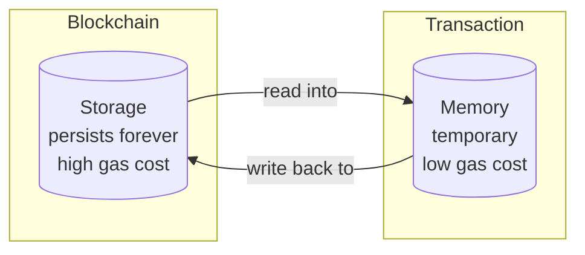
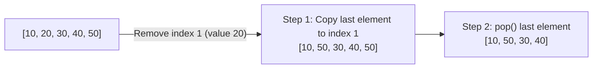
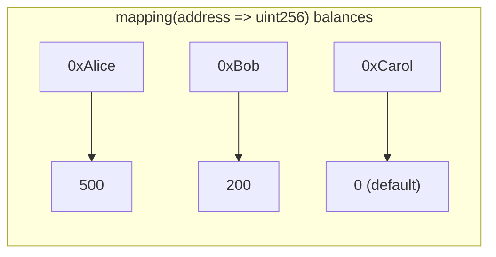
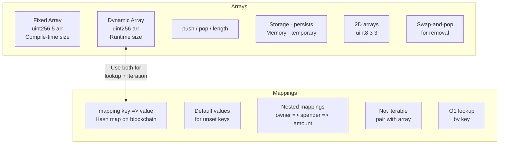

# 📦 Arrays and Mappings in Solidity

> **Difficulty:** Beginner | **Chapter:** 06 | **Prerequisites:** Structs, Value Types, Functions

Data structures kisi bhi smart contract ki backbone hoti hain. Agar tumne kabhi backend API banaya hai, toh tum arrays aur hash maps ka use already daily basis pe kar chuke ho. Solidity mein bhi dono hain, but blockchain ke apne kuch twists ke saath jo naye developers ko confuse kar dete hain. Yeh chapter tumhe woh sab sikhayega jo on-chain data ko efficiently store, retrieve, aur manage karne ke liye chahiye — bilkul aise jaise Swiggy apne restaurants aur orders ko organize karta hai.

---

## 🗂️ Part 1: Arrays

### Array Hota Kya Hai?

Array ek ordered list hoti hai same type ke items ki. Solidity mein do flavors milte hain: **fixed-size** aur **dynamic**.

---

### 1. Fixed-Size Arrays

```solidity
uint256[5] public scores;
```

- Size compile time pe hi fix ho jaata hai — **change nahi ho sakta** baad mein.
- Contiguously ek hi storage slot mein store hota hai (chhote types ke liye).
- Best tab use karo jab count pehle se pata ho aur constant ho: jaise hafte ke 7 din, RGB ke 3 channels, etc.
- Dynamic arrays se thoda sasta padta hai kyunki length track karne ka overhead nahi hota.

```solidity
// SPDX-License-Identifier: MIT
pragma solidity ^0.8.0;

contract FixedArrayDemo {
    uint256[5] public weeklyGoals;  // exactly 5 slots, indices 0..4

    function setGoal(uint256 index, uint256 value) public {
        // Will revert automatically if index >= 5
        weeklyGoals[index] = value;
    }

    function sumGoals() public view returns (uint256 total) {
        for (uint256 i = 0; i < weeklyGoals.length; i++) {
            total += weeklyGoals[i];
        }
    }
}
```

**Fixed arrays kab use karein:**
- Jab fixed set of parameters store karne hon (jaise fee tiers, price bands).
- Cryptographic proofs ke saath kaam karte waqt jahan element count fixed hota hai (jaise Merkle proofs).
- Dynamic length slot ke gas overhead se bachne ke liye.

---

### 2. Dynamic Arrays

```solidity
uint256[] public scores;
```

- Size **compile time pe pata nahi hoti** — array runtime pe grow aur shrink hoti rehti hai.
- Solidity `length` ko automatically storage mein track karta hai.
- Yeh woh go-to choice hai jab list time ke saath badalti rahe — members, orders, bids, jaise Zomato pe naye restaurants add hote rehte hain.

```solidity
contract DynamicArrayDemo {
    uint256[] public numbers;

    function addNumber(uint256 n) public {
        numbers.push(n);          // appends to the end
    }

    function removeLastNumber() public {
        numbers.pop();            // removes last element
    }

    function getLength() public view returns (uint256) {
        return numbers.length;
    }
}
```

---

### 3. Array Methods: push, pop, length, delete

| Operation | Syntax | Effect |
|---|---|---|
| Append | `arr.push(value)` | Value ko end mein add karta hai, length badha deta hai |
| Remove last | `arr.pop()` | Last element remove karta hai, length ghata deta hai |
| Read length | `arr.length` | Current elements ki count return karta hai |
| Delete element | `delete arr[i]` | Element ko **reset** karta hai default value pe; length wahi rehti hai |

> ⚠️ **`delete` array ko chhota NAHI karta.** Yeh sirf element ko uski zero value pe set kar deta hai (`uint` ke liye `0`, `address` ke liye `address(0)`, etc.) lekin ek "hole" chhod deta hai. Yeh ek common beginner mistake hai.

```solidity
uint256[] public data = [10, 20, 30, 40];

delete data[1];
// data is now [10, 0, 30, 40]  — length is still 4
```

---

### 4. Storage vs Memory Arrays

Yeh Solidity ke sabse important distinctions mein se ek hai.



| Property | Storage Array | Memory Array |
|---|---|---|
| Lifetime | Permanent (state variable) | Temporary (function execution ke time tak) |
| Cost | Mehenga (SSTORE ~20,000 gas) | Sasta (in-memory ops ~3 gas) |
| `push` / `pop` | Supported | **Supported nahi** |
| Size | Dynamically grow ho sakta hai | Creation time pe hi fixed hona chahiye |
| Declared | Contract level pe | Function ke andar `memory` keyword ke saath |

```solidity
contract StorageVsMemory {
    uint256[] public storedNums;  // storage: lives on-chain forever

    function processLocally(uint256 size) public pure returns (uint256[] memory) {
        // Memory array: size must be known at creation, no push/pop
        uint256[] memory temp = new uint256[](size);
        for (uint256 i = 0; i < size; i++) {
            temp[i] = i * 2;
        }
        return temp;  // returned to caller, not persisted
    }

    function addToStorage(uint256 val) public {
        storedNums.push(val);  // push only works on storage arrays
    }
}
```

**Rule of thumb:** Function ke andar intermediate calculations ke liye `memory` arrays use karo. `storage` arrays (state variables) sirf tab use karo jab data ko transactions ke beech persist karna zaruri ho.

---

### 5. Array of Structs Pattern

Arrays ko structs ke saath pair karna Solidity ka sabse common pattern hai:

```solidity
contract Auction {
    struct Bid {
        address bidder;
        uint256 amount;
        uint256 timestamp;
    }

    Bid[] public bids;

    function placeBid() public payable {
        bids.push(Bid({
            bidder: msg.sender,
            amount: msg.value,
            timestamp: block.timestamp
        }));
    }

    function getTopBid() public view returns (Bid memory) {
        require(bids.length > 0, "No bids yet");
        Bid memory top = bids[0];
        for (uint256 i = 1; i < bids.length; i++) {
            if (bids[i].amount > top.amount) {
                top = bids[i];
            }
        }
        return top;
    }
}
```

Socho ek IRCTC tatkal jaisi auction — sab log bid daal rahe hain, aur tumhe sabse highest bid nikalni hai. Bas array loop karo aur top wala track kar lo.

---

### 6. 2D Arrays

Solidity arrays-of-arrays support karta hai — grids, matrices, aur multi-dimensional data ke liye useful.

```solidity
contract TicTacToe {
    // 3x3 board: 0 = empty, 1 = X, 2 = O
    uint8[3][3] public board;

    function mark(uint8 row, uint8 col, uint8 player) public {
        require(board[row][col] == 0, "Cell taken");
        board[row][col] = player;
    }
}

// Dynamic 2D array
contract Matrix {
    uint256[][] public grid;

    function addRow(uint256[] memory row) public {
        grid.push(row);
    }
}
```

> **Syntax ka note:** `uint8[3][3]` — **rightmost** dimension outer dimension hoti hai. `uint8[3][3]` ka matlab hai 3 items ka ek array, jisme har item khud `uint8` ka ek 3-size array hai. Yeh bahut languages ke opposite hai — ise right se left padho.

---

### 7. Element Remove Karna: Swap-and-Pop Pattern

Chunki `delete` holes chhod deta hai aur array shrink nahi karta, ek clean removal technique hai **swap-and-pop**:



```solidity
function removeAtIndex(uint256[] storage arr, uint256 index) internal {
    require(index < arr.length, "Index out of bounds");
    arr[index] = arr[arr.length - 1];  // overwrite with last element
    arr.pop();                          // shrink array by 1
}
```

**Trade-off:** Yeh order preserve NAHI karta. Agar order matter karta hai, toh tumhe shift-left approach chahiye (jo bahut zyada gas-expensive hai) ya phir koi alag data structure.

---

## 🗺️ Part 2: Mappings

### Mapping Hoti Kya Hai?

Mapping ko ek **hash map** ya dictionary jaisa socho — yeh keys ko values se map karti hai. Lekin traditional programming se alag, Solidity mapping blockchain ke key-value store (EVM ke trie) se backed hoti hai, na ki koi in-memory hash table.



---

### 1. Syntax

```solidity
mapping(KeyType => ValueType) visibility variableName;
```

Examples:

```solidity
mapping(address => uint256) public balances;
mapping(uint256 => string)  public tokenURIs;
mapping(bytes32 => bool)    public usedNonces;
```

---

### 2. Allowed Key Types

Keys sirf **value types** ho sakti hain (dynamic-sized types jaise arrays ya structs allowed nahi hain):

| Allowed Key Types | Examples |
|---|---|
| Integer types | `uint256`, `int128`, `uint8` |
| `address` | `address`, `address payable` |
| `bool` | `bool` |
| `bytes` (fixed) | `bytes32`, `bytes4` |
| `string` | `string` (special case — `bytes` jaisa treat hota hai) |
| Enums | Koi bhi user-defined enum |

> ❌ Tum structs, arrays, ya doosri mappings ko key types ke roop mein use **nahi** kar sakte.

---

### 3. Unset Keys Ke Liye Default Values

Mapping mein har possible key conceptually exist karti hai aur agar kabhi set nahi hui toh value type ki **zero/default value** return karti hai:

```solidity
mapping(address => uint256) public balances;

// balances[0xSomeRandomAddress] returns 0 — no revert, no error
// This is why you never need to "initialize" a mapping key
```

| Value Type | Default |
|---|---|
| `uint256` | `0` |
| `bool` | `false` |
| `address` | `address(0)` |
| `string` | `""` |
| struct | Saare fields apni zero values pe |

---

### 4. Nested Mappings

Mappings ko nest karke two-dimensional lookup tables banaye ja sakte hain:

```solidity
// ERC-20 allowances: owner => spender => amount
mapping(address => mapping(address => uint256)) public allowances;

function approve(address spender, uint256 amount) public {
    allowances[msg.sender][spender] = amount;
}

function allowance(address owner, address spender) public view returns (uint256) {
    return allowances[owner][spender];
}
```

Yeh ERC-20 token standard ka canonical pattern hai — Alice, Bob ko apni taraf se 100 tokens spend karne ki permission de rahi hai, bilkul UPI mandate jaisa jahan tum kisi app ko apne account se auto-debit ki limited permission dete ho:

```
allowances[Alice][Bob] = 100
```

---

### 5. Mappings Iterable Nahi Hoti

Yeh mappings ka sabse bada gotcha hai. Tum ek mapping pe loop **nahi** kar sakte ya yeh nahi pata kar sakte ki usme kaunsi keys exist karti hain. Solidity keys ki koi list maintain nahi karta — values apne hash ke hisab se storage mein bikhri (scattered) hoti hain.

**Workaround: mapping ko keys ke array ke saath pair karo**

```solidity
mapping(address => uint256) public balances;
address[] public accountList;  // keep track of who has ever deposited

function deposit() public payable {
    if (balances[msg.sender] == 0) {
        accountList.push(msg.sender);  // only add if new
    }
    balances[msg.sender] += msg.value;
}

function getTotalDeposited() public view returns (uint256 total) {
    for (uint256 i = 0; i < accountList.length; i++) {
        total += balances[accountList[i]];
    }
}
```

> ⚠️ Dhyan rakhna: unbounded arrays pe iterate karna unbounded gas cost karta hai. Bade user base ke liye, yeh block gas limit hit kar sakta hai aur function ko un-callable bana sakta hai — jaise Diwali sale pe Flipkart ka server load na sambhal paana.

---

### 6. Real-World Mapping Patterns

#### Token Balances

```solidity
mapping(address => uint256) public balances;

function transfer(address to, uint256 amount) public {
    require(balances[msg.sender] >= amount, "Insufficient balance");
    balances[msg.sender] -= amount;
    balances[to] += amount;
}
```

#### ERC-20 Allowances (Nested Mapping)

```solidity
mapping(address => mapping(address => uint256)) public allowances;
// allowances[owner][spender] = max spendable amount
```

#### Whitelist / Access Control

```solidity
mapping(address => bool) public whitelist;

modifier onlyWhitelisted() {
    require(whitelist[msg.sender], "Not whitelisted");
    _;
}

function addToWhitelist(address user) public onlyOwner {
    whitelist[user] = true;
}
```

Yeh bilkul CRED ke waise hai jahan sirf approved credit-score wale users hi platform use kar sakte hain — `whitelist[user]` check ek bouncer jaisa kaam karta hai.

---

### 7. Mapping vs Array: Kab Kaunsa Use Karein

| Factor | Mapping | Array |
|---|---|---|
| Key se lookup | O(1) — instant | O(n) — loop karna padega |
| Iteration | Natively possible nahi | Straightforward |
| Ordered data | Nahi | Haan |
| Membership check | `map[key] != 0` | Loop karna padega ya mapping ke saath pair |
| Lookup ka gas | Sasta (single SLOAD) | Sasta agar index pata ho |
| Elements remove karna | `delete map[key]` — O(1), no holes | Swap-and-pop ya shift — O(1)/O(n) |
| Key enumeration | Possible nahi | Built-in via index |
| Best for | Balances, permissions, lookups | Ordered lists, saare items pe iterate karna |

**Quick decision guide:**
- Address/ID se lookup chahiye → **mapping**
- Saare items pe iterate karna hai → **array** (ya mapping + array combo)
- Dono chahiye → **dono use karo** (jaise neeche TokenVault pattern mein dikhaya hai)

---

### 8. OpenZeppelin EnumerableMap

Jab tumhe O(1) lookup AND iteration dono chahiye, OpenZeppelin `EnumerableMap` aur `EnumerableSet` provide karta hai:

```solidity
import "@openzeppelin/contracts/utils/structs/EnumerableMap.sol";

contract Registry {
    using EnumerableMap for EnumerableMap.UintToAddressMap;

    EnumerableMap.UintToAddressMap private _tokenOwners;

    function mint(uint256 tokenId, address owner) internal {
        _tokenOwners.set(tokenId, owner);
    }

    function ownerOf(uint256 tokenId) public view returns (address) {
        return _tokenOwners.get(tokenId);  // O(1) lookup
    }

    function totalSupply() public view returns (uint256) {
        return _tokenOwners.length();  // iteration-friendly
    }
}
```

ERC-721 (NFTs) internally bilkul isi tarah token ownership manage karte hain. Under the hood, yeh ek mapping aur ek array dono maintain karta hai, aur automatically dono ko sync mein rakhta hai.

---

## 🏦 Full Working Example: TokenVault

```solidity
// SPDX-License-Identifier: MIT
pragma solidity ^0.8.0;

/// @title TokenVault
/// @notice Demonstrates arrays and mappings working together
contract TokenVault {
    // ---------------------------------------------------------
    // STATE VARIABLES
    // ---------------------------------------------------------

    /// @notice ETH balance of each depositor
    mapping(address => uint256) public balances;

    /// @notice Whether an address is an approved member
    mapping(address => bool) public whitelist;

    /// @notice Ordered list of all members (enables iteration)
    address[] public members;

    // ---------------------------------------------------------
    // EVENTS
    // ---------------------------------------------------------

    event MemberAdded(address indexed member);
    event MemberRemoved(address indexed member);
    event Deposited(address indexed depositor, uint256 amount);

    // ---------------------------------------------------------
    // MEMBER MANAGEMENT
    // ---------------------------------------------------------

    /// @notice Register a new member
    /// @dev Uses whitelist mapping for O(1) duplicate check,
    ///      then appends to members array for iterability
    function addMember(address member) public {
        require(!whitelist[member], "Already a member");
        whitelist[member] = true;
        members.push(member);
        emit MemberAdded(member);
    }

    /// @notice Remove a member using swap-and-pop (O(1), unordered)
    /// @param index The index in the members array to remove
    function removeMember(uint256 index) public {
        require(index < members.length, "Index out of bounds");

        address member = members[index];

        // Clear mapping entry
        whitelist[member] = false;

        // Swap with last element, then pop
        members[index] = members[members.length - 1];
        members.pop();

        emit MemberRemoved(member);
    }

    // ---------------------------------------------------------
    // DEPOSITS
    // ---------------------------------------------------------

    /// @notice Deposit ETH into the vault
    function deposit() public payable {
        require(whitelist[msg.sender], "Must be a member to deposit");
        balances[msg.sender] += msg.value;
        emit Deposited(msg.sender, msg.value);
    }

    // ---------------------------------------------------------
    // VIEW FUNCTIONS
    // ---------------------------------------------------------

    /// @notice Get total ETH held in the vault
    function totalDeposited() public view returns (uint256 total) {
        for (uint256 i = 0; i < members.length; i++) {
            total += balances[members[i]];
        }
    }

    /// @notice Get all current members (use carefully with large lists)
    function getMembers() public view returns (address[] memory) {
        return members;
    }

    /// @notice Check if an address is a member in O(1) — no loop needed
    function isMember(address addr) public view returns (bool) {
        return whitelist[addr];
    }
}
```

**Yeh contract kya demonstrate karta hai:**

1. `mapping(address => uint256) balances` — classic token balance pattern, bilkul Paytm wallet balance jaisa.
2. `mapping(address => bool) whitelist` — O(1) membership check.
3. `address[] members` — saare members pe iterate karne ka rasta deta hai.
4. `addMember` — pehle mapping se duplicates check karta hai, phir array mein push karta hai.
5. `removeMember` — swap-and-pop pattern array ko compact rakhta hai.
6. `totalDeposited` — array pe iterate karta hai, har element ke liye mapping se read karta hai.

---

## 📊 Visual Summary



---

## 🎯 Key Takeaways

1. **Fixed arrays** known, constant-size collections ke liye great hain; **dynamic arrays** flexible hain lekin manage karne mein zyada gas lagti hai.

2. **`delete arr[i]`** element ko zero pe reset karta hai — slot ko remove NAHI karta. Array ko actually shrink karne ke liye **swap-and-pop** use karo.

3. **Storage arrays** on-chain persist karti hain aur `push`/`pop` support karti hain. **Memory arrays** temporary hoti hain, sasti hoti hain, aur creation time pe fixed size maangti hain.

4. **Mappings** key se O(1) lookup dete hain lekin poori tarah un-iterable hoti hain — tum kabhi bhi natively unki keys pe loop nahi kar sakte.

5. Jab tumhe fast lookup aur saare entries pe iterate karne ki ability dono chahiye, **mapping ko array ke saath pair karo**.

6. Har unset mapping key apne type ki **zero value** return karti hai — koi "key not found" error nahi aata.

7. **Nested mappings** (`mapping(address => mapping(address => uint256))`) ERC-20 allowances aur aise hi two-party relationships ke liye standard pattern hain.

8. Production code jisme lookup aur iteration dono chahiye, wahan OpenZeppelin ke **EnumerableMap** / **EnumerableSet** consider karo.

---

## 🧩 Quiz

**Question 1**

Tumhare paas `uint256[] public ids;` hai jisme values `[1, 2, 3, 4, 5]` hain. Tum `delete ids[2]` call karte ho. Resulting array state kya hoga?

- A) `[1, 2, 4, 5]` — length 4
- B) `[1, 2, 0, 4, 5]` — length 5
- C) Out-of-bounds error ke saath revert
- D) `[1, 2, 3, 4, 5]` — unchanged

<details>
<summary>Answer</summary>

**B.** `delete` index 2 ke element ko uski zero value (`0`) pe reset karta hai, lekin array length CHANGE nahi karta. Array ban jaata hai `[1, 2, 0, 4, 5]`, length 5 ke saath.

</details>

---

**Question 2**

Inme se kaunsa Solidity mapping ke liye valid key type hai?

- A) `uint256[]` (dynamic array)
- B) `struct Person { string name; uint age; }`
- C) `bytes32`
- D) `mapping(address => bool)`

<details>
<summary>Answer</summary>

**C.** `bytes32` ek fixed-size value type hai aur valid mapping key hai. Dynamic arrays, structs, aur nested mappings key types ke roop mein use nahi ho sakte.

</details>

---

**Question 3**

Tumhe ek data structure chahiye jo user reputation scores store kare jahan tum: (1) kisi bhi user ka score address se instantly lookup kar sako, aur (2) saare users pe iterate karke average score compute kar sako. Best approach kya hai?

- A) Sirf `mapping(address => uint256)` use karo aur for loop se iterate karo
- B) Sirf `address[]` array use karo aur har lookup ke liye linearly search karo
- C) Lookup ke liye `mapping(address => uint256)` aur saari keys track karne ke liye `address[]` use karo, dono ko sync mein rakhte hue
- D) 2D array `address[][2]` use karo jahan index 0 addresses store kare aur index 1 scores store kare

<details>
<summary>Answer</summary>

**C.** "Fast lookup aur iterability dono" ke liye canonical pattern ek mapping hai jo keys ke array ke saath paired ho. Mapping O(1) lookup deta hai; array full iteration enable karta hai. Options A aur B dono mein se ek requirement sacrifice karte hain, aur option D Solidity 2D arrays ka actual working nahi hai.

</details>

---

*Next Chapter: Events and Logging — How to emit and listen to on-chain events*
