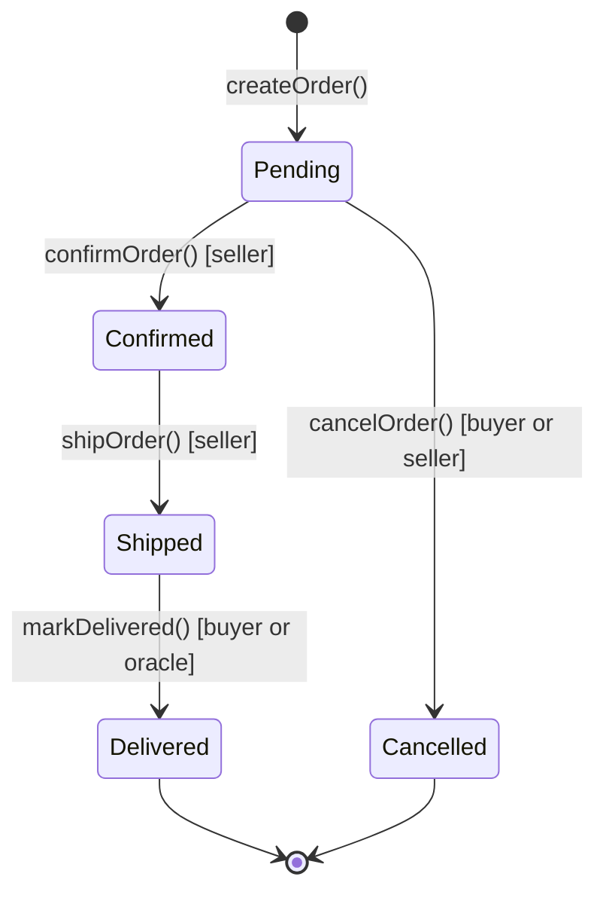

# 🏗️ Structs and Enums in Solidity

> **Level:** Beginner | **Prerequisite:** Variables, Mappings, Arrays | **Estimated reading time:** 20 minutes

---

## 📋 Table of Contents

1. [Structs](#structs)
   - [What is a Struct?](#what-is-a-struct)
   - [Defining a Struct](#defining-a-struct)
   - [Creating Struct Instances: storage vs memory](#creating-struct-instances-storage-vs-memory)
   - [Accessing Struct Members](#accessing-struct-members)
   - [Structs in Arrays and Mappings](#structs-in-arrays-and-mappings)
   - [Nested Structs](#nested-structs)
   - [Structs as Function Parameters and Return Values](#structs-as-function-parameters-and-return-values)
   - [Structs and Storage Layout](#structs-and-storage-layout)
2. [Enums](#enums)
   - [What is an Enum?](#what-is-an-enum)
   - [Defining and Using Enums](#defining-and-using-enums)
   - [Enums as State Machines](#enums-as-state-machines)
   - [Enum uint Conversion](#enum-uint-conversion)
   - [Enums in Events](#enums-in-events)
   - [Default Enum Value](#default-enum-value)
3. [Real-World Patterns](#real-world-patterns)
4. [Complete Marketplace Example](#complete-marketplace-example)
5. [Key Takeaways](#key-takeaways)
6. [Quiz](#quiz)

---

## 🏗️ Structs

### What is a Struct?

Socho tumhe ek order ka pura record rakhna hai — order ID, buyer ka naam, seller kaun hai, total amount, delivery status. Agar tum yeh sab alag-alag variables mein rakhoge toh mess ho jayega. Isi problem ko solve karta hai **struct** — ek custom data type jo related data ko ek naam ke under bundle kar deta hai. Socho ek form ya record card — ek hi "cheez" jismein multiple attributes bhare hote hain.

Agar tum OOP languages se aaye ho (jaise TypeScript ki classes), toh struct thoda similar lagega — bas fark itna hai ki **struct mein methods nahi hote**. Yeh sirf ek data container hai. Saara logic contract ke functions mein likha jata hai jo struct pe operate karte hain.

**Real-world analogy:** Zomato pe jab tum order karte ho, uska ek receipt banta hai — order ID, buyer ka naam, seller (restaurant), total amount, aur delivery status — sab ek saath. Paanch alag-alag variables track karne ke bajaye, tum inhe ek `Order` struct mein bundle kar dete ho.

```solidity
// Without a struct — messy and hard to manage
mapping(uint256 => address) public orderBuyer;
mapping(uint256 => address) public orderSeller;
mapping(uint256 => uint256) public orderAmount;

// With a struct — clean and self-documenting
struct Order {
    address buyer;
    address seller;
    uint256 amount;
}
mapping(uint256 => Order) public orders;
```

---

### Defining a Struct

Struct define karne ke liye contract level pe `struct` keyword use karo, uske baad naam, aur curly braces ke andar typed fields.

```solidity
// SPDX-License-Identifier: MIT
pragma solidity ^0.8.0;

contract Registry {
    struct Person {
        string name;
        uint256 age;
        address wallet;
        bool isVerified;
    }
}
```

**Naming conventions:**
- Struct ke naam **PascalCase** mein hote hain (`MyStruct`, `myStruct` nahi)
- Field ke naam **camelCase** mein hote hain (`firstName`, `FirstName` nahi)

Struct ke andar koi bhi valid Solidity type ho sakta hai: `uint`, `address`, `bool`, `string`, `bytes`, dusre structs, arrays, aur mappings bhi (thodi restrictions ke saath — agar struct `memory` mein use hoga toh usmein mapping nahi rakh sakte).

---

### Creating Struct Instances: storage vs memory

Yeh sabse important cheez hai jo samajhni chahiye. Struct variable kahan "reh raha hai" — yeh decide karta hai ki woh kaise behave karega aur gas kitna lagega.

#### Storage — persistent, on-chain

`storage` struct variable ek **reference** hota hai jo directly contract storage ko point karta hai. Isme change karoge toh woh automatically blockchain pe likha jayega — bilkul Google Sheets ki tarah jahan koi bhi edit turant save ho jata hai.

```solidity
struct Counter {
    uint256 value;
    address owner;
}

mapping(address => Counter) public counters;

function increment() public {
    // 'storage' gives us a reference — changes persist
    Counter storage myCounter = counters[msg.sender];
    myCounter.value += 1;       // This writes to chain storage
    myCounter.owner = msg.sender;
}
```

> **Warning:** Agar tum `storage` keyword bhool jaate ho aur sirf `Counter counter = counters[msg.sender]` likhte ho, toh Solidity warning ya error dega — hamesha explicit raho.

#### Memory — temporary, off-chain

`memory` struct ek temporary copy hota hai jo sirf function call ke duration tak zinda rehta hai. Yeh use karna sasta padta hai (kam gas), lekin isme kiya gaya change automatically persist nahi hota — bilkul Excel ki ek local unsaved copy ki tarah jo browser band karte hi gayab ho jaati hai.

```solidity
function buildTempPerson(string memory name, uint256 age)
    public
    pure
    returns (string memory, uint256)
{
    // 'memory' — this disappears after the function returns
    Person memory temp = Person({
        name: name,
        age: age,
        wallet: address(0),
        isVerified: false
    });
    return (temp.name, temp.age);
}
```

**Kab kya use karein:**
| `storage` use karo | `memory` use karo |
|---|---|
| Existing on-chain data update karna ho | Function se return karne ke liye naya struct banana ho |
| Bade structs ke liye extra copy cost bachana ho | Function ke andar short-lived calculation |
| State variables modify karna ho | Sirf padhna ho, wapas likhna na ho |

#### Struct initialise karne ke do tarike

```solidity
// Named field syntax (recommended — order-independent, readable)
Order memory o1 = Order({
    id: 1,
    buyer: msg.sender,
    seller: sellerAddress,
    amount: msg.value
});

// Positional syntax (must match field declaration order exactly)
Order memory o2 = Order(1, msg.sender, sellerAddress, msg.value);
```

Named-field style zyada preferred hai kyunki agar future mein struct mein naya field add karo, toh yeh silently tumhara positional initialisation nahi todega.

---

### Accessing Struct Members

**Dot notation** use karo — bilkul waise hi jaise JavaScript ya Python mein object ki properties access karte ho.

```solidity
Order storage order = orders[orderId];

// Reading
address buyer = order.buyer;
uint256 amount = order.amount;

// Writing
order.amount = 500;
order.status = OrderStatus.Confirmed;
```

---

### Structs in Arrays and Mappings

Yeh sabse common pattern hai jo real contracts mein milega. Structs ko arrays ya mappings ke saath combine karke tum complex objects ke collections manage kar sakte ho.

#### Struct ek dynamic array mein

```solidity
contract TaskManager {
    struct Task {
        string title;
        bool completed;
        address assignee;
    }

    Task[] public tasks;

    function addTask(string memory title, address assignee) public {
        tasks.push(Task({
            title: title,
            completed: false,
            assignee: assignee
        }));
    }

    function completeTask(uint256 index) public {
        // Use 'storage' to modify the actual array element
        Task storage task = tasks[index];
        require(task.assignee == msg.sender, "Not your task");
        task.completed = true;
    }

    function getTask(uint256 index) public view returns (Task memory) {
        return tasks[index];
    }
}
```

#### Struct ek mapping mein (sabse efficient lookup pattern)

```solidity
contract UserRegistry {
    struct User {
        string username;
        uint256 registeredAt;
        bool active;
    }

    mapping(address => User) public users;

    function register(string memory username) public {
        require(!users[msg.sender].active, "Already registered");
        users[msg.sender] = User({
            username: username,
            registeredAt: block.timestamp,
            active: true
        });
    }
}
```

Mapping tumhe O(1) lookup deta hai key ke through — matlab jaise UPI mein tumhara mobile number seedha tumhare account tak le jaata hai, waise hi yahan address ya ID se seedha user/order ka data mil jaata hai.

---

### Nested Structs

Ek struct dusre struct ko field ke roop mein rakh sakta hai. Isse tum hierarchical data ko naturally model kar sakte ho.

```solidity
contract ShippingTracker {
    struct Address {
        string street;
        string city;
        string country;
    }

    struct Shipment {
        uint256 id;
        Address origin;
        Address destination;
        uint256 dispatchedAt;
    }

    mapping(uint256 => Shipment) public shipments;

    function createShipment(
        uint256 id,
        string memory fromCity,
        string memory toCity
    ) public {
        shipments[id] = Shipment({
            id: id,
            origin: Address({ street: "", city: fromCity, country: "" }),
            destination: Address({ street: "", city: toCity, country: "" }),
            dispatchedAt: block.timestamp
        });
    }

    function getDestinationCity(uint256 id) public view returns (string memory) {
        return shipments[id].destination.city;   // chained dot notation
    }
}
```

Bilkul jaise Flipkart ka shipment tracking hota hai — ek Shipment ke andar origin address aur destination address dono nested structs ki tarah rehte hain.

---

### Structs as Function Parameters and Return Values

Structs ko functions mein pass kiya ja sakta hai aur unse return bhi kiya ja sakta hai. Reference types ke liye function signature mein `memory` keyword zaruri hota hai.

```solidity
contract ProductStore {
    struct Product {
        uint256 id;
        string name;
        uint256 price;
    }

    // Accepting a struct as parameter
    function calculateDiscount(Product memory product, uint256 discountPct)
        public
        pure
        returns (uint256 discountedPrice)
    {
        discountedPrice = product.price * (100 - discountPct) / 100;
    }

    // Returning a struct from a function
    function buildProduct(uint256 id, string memory name, uint256 price)
        public
        pure
        returns (Product memory)
    {
        return Product({ id: id, name: name, price: price });
    }
}
```

> **ABI note:** Solidity 0.8.x se `public` functions se structs return karna fully supported hai aur proper ABI encoding generate karta hai — matlab tumhara frontend (ya doosra contract) result ko easily decode kar sakta hai.

---

### Structs and Storage Layout

Yeh samajhna zaruri hai ki struct storage slots mein kaise fit hota hai — isse tum sasta (kam gas wala) contract likh sakte ho.

- Har storage slot **32 bytes** (256 bits) ka hota hai.
- Solidity chhote variables ko ek hi slot mein **pack** karne ki koshish karta hai.
- Compiler fields ko **declaration order** mein pack karta hai, isliye chhote types (`uint8`, `bool`, `address` jo 20 bytes ka hota hai) ko saath rakhoge toh slot share ho sakta hai.

```solidity
// Inefficient — each bool takes its own full slot
struct Bad {
    uint256 a;   // slot 0
    bool x;      // slot 1 (wastes 31 bytes)
    uint256 b;   // slot 2
    bool y;      // slot 3 (wastes 31 bytes)
}

// Efficient — bools packed into same slot as address
struct Good {
    uint256 a;      // slot 0
    address owner;  // slot 1 (20 bytes)
    bool active;    // slot 1 (packed alongside owner, 1 byte)
    bool verified;  // slot 1 (packed, 1 byte)
    uint256 b;      // slot 2
}
```

> [!tip]
> Yeh cheez high-frequency contracts ke liye bahut relevant hai — kam SSTORE operations matlab real paisa bachega gas mein.

---

## 🔢 Enums

### What is an Enum?

**Enum** (enumeration) ek **finite, named set of values** define karta hai. Raw integers use karne ke bajaye (0 = pending, 1 = active, 2 = cancelled — inme galti hona bahut aasan hai), tum har value ko ek meaningful naam de dete ho jise compiler enforce karta hai.

```solidity
// Bad — magic numbers everywhere
uint8 public status;  // 0=pending, 1=active, hope you remember!

// Good — self-documenting, compiler-checked
enum Status { Pending, Active, Cancelled }
Status public status;
```

Under the hood, Solidity enums ko `uint8` ki tarah store karta hai, matlab ek enum mein maximum 256 values ho sakti hain (jo kisi bhi real use case ke liye kaafi zyada hai).

---

### Defining and Using Enums

```solidity
// SPDX-License-Identifier: MIT
pragma solidity ^0.8.0;

contract AuctionRoom {
    enum AuctionState {
        Created,    // 0 — auction is set up but not started
        Bidding,    // 1 — bidding is open
        Ended,      // 2 — bidding closed
        Settled     // 3 — funds distributed
    }

    AuctionState public state;

    function startBidding() public {
        require(state == AuctionState.Created, "Not in Created state");
        state = AuctionState.Bidding;
    }

    function endBidding() public {
        require(state == AuctionState.Bidding, "Bidding is not open");
        state = AuctionState.Ended;
    }
}
```

Enum values ko `EnumName.ValueName` syntax se access karo. Comparison ke liye `==` aur `!=` use hota hai.

---

### Enums as State Machines

Yeh Solidity mein enums ka **sabse powerful** use hai. State machine ek aisa model hai jahan system kisi bhi time pe exactly ek state mein hota hai, aur states ke beech transitions controlled hote hain.

Ek achhe se design kiya gaya state machine (enum ke saath) tumhe deta hai:
- **Clarity** — code padhte hi pata chal jata hai ki kaunse states possible hain.
- **Safety** — `require` guards illegal transitions ko rokte hain.
- **Auditability** — saare possible states enum definition mein hi likhe hote hain.

**Order lifecycle state machine** (Zomato/Flipkart order ki tarah socho):



Har arrow ek function call ko represent karta hai jisme `require` guard current state check karta hai. Tum sirf aage badh sakte ho lifecycle mein — `Pending` se seedha `Delivered` pe jump nahi kar sakte, aur `Shipped` se peeche `Confirmed` pe bhi nahi ja sakte.

**Enums se role management:**

```solidity
contract AccessControl {
    enum Role { Guest, Member, Moderator, Admin }

    mapping(address => Role) public roles;

    modifier onlyAdmin() {
        require(roles[msg.sender] == Role.Admin, "Admins only");
        _;
    }

    modifier atLeastModerator() {
        require(
            roles[msg.sender] == Role.Moderator ||
            roles[msg.sender] == Role.Admin,
            "Moderators and Admins only"
        );
        _;
    }

    function promoteToMember(address user) public onlyAdmin {
        roles[user] = Role.Member;
    }

    function promoteModerator(address user) public onlyAdmin {
        roles[user] = Role.Moderator;
    }
}
```

---

### Enum uint Conversion

Kyunki enums `uint8` ki tarah store hote hain, tum inhe explicitly convert kar sakte ho.

```solidity
enum Phase { Alpha, Beta, Launch }  // Alpha=0, Beta=1, Launch=2

Phase current = Phase.Beta;

// Enum -> uint
uint8 asNumber = uint8(current);   // asNumber = 1

// uint -> Enum (be careful — reverts if value is out of range)
Phase fromNumber = Phase(2);       // fromNumber = Phase.Launch
Phase invalid = Phase(99);         // REVERTS — 99 is not a valid Phase
```

> [!warning]
> Out-of-range revert (Solidity 0.8.x mein add hua) ek safety net hai. Purani versions mein (pre-0.8) invalid cast silently garbage value produce kar deta tha — isliye hamesha `^0.8.0` use karo.

**Practical use — enum value ko off-chain ya events mein store karna:**

```solidity
function getCurrentPhaseNumber() public view returns (uint8) {
    return uint8(currentPhase);
}
```

---

### Enums in Events

Events on-chain jo hua usko record karte hain taaki frontends aur indexers usse react kar saken. Enums events mein naturally kaam karte hain — ABI unhe `uint8` ki tarah encode karta hai.

```solidity
event PhaseChanged(Phase indexed oldPhase, Phase indexed newPhase);
event OrderStatusUpdated(uint256 indexed orderId, OrderStatus status);

function advancePhase() internal {
    Phase old = currentPhase;
    currentPhase = Phase(uint8(currentPhase) + 1);
    emit PhaseChanged(old, currentPhase);
}
```

Frontend pe (ethers.js ya viem ke through) tumhe numeric value milegi. Tumhara ABI enum definition include karta hai, isliye libraries usse wapas naam wale string mein decode karke display kar sakti hain — bilkul jaise Swiggy app tumhe "Order Placed", "Preparing", "On the way" dikhata hai, backend mein woh sirf numbers hote hain.

---

### Default Enum Value

Jab enum type ka variable declare kiya jata hai lekin kabhi assign nahi kiya jata, toh woh default **first member** (index 0) ban jata hai. Yeh design karte waqt dhyan mein rakhna zaruri hai.

```solidity
enum OrderStatus { Pending, Confirmed, Shipped, Delivered, Cancelled }

// In a mapping, every un-initialised entry has status = Pending (0)
mapping(uint256 => OrderStatus) public statuses;

// statuses[999] == OrderStatus.Pending  <- even though order 999 was never created!
```

> [!warning]
> Yeh ek common bug ka source hai. Order 999 kabhi bana hi nahi, phir bhi uska status "Pending" dikhega — jaise kisi ne kabhi order kiya hi nahi, lekin app bole "Order Placed"!

Iska ek defensive pattern hai — pehli value ko sentinel bana do:

```solidity
enum OrderStatus {
    None,       // 0 — "does not exist" sentinel
    Pending,    // 1
    Confirmed,  // 2
    Shipped,    // 3
    Delivered,  // 4
    Cancelled   // 5
}

// Now you can check: require(order.status != OrderStatus.None, "Order not found");
```

---

## 🌍 Real-World Patterns

### Pattern 1 — Order Status Lifecycle

Sabse classic example: ek e-commerce marketplace (Flipkart/Amazon type) jahan orders alag-alag stages se guzarte hain.

```
Pending -> Confirmed -> Shipped -> Delivered
    \                                     
     -> Cancelled (from Pending or Confirmed)
```

Har transition pe guards yeh confirm karte hain ki business rules on-chain hi follow ho rahe hain, bina kisi off-chain service pe trust kiye.

### Pattern 2 — Role-Based Access Control

```solidity
enum Role { Guest, Member, Moderator, Admin }
mapping(address => Role) public roles;
```

`onlyAdmin` aur `atLeastModerator` jaise modifiers sensitive functions ko wrap karte hain. Structs (jo user profiles store karte hain) ke saath combine karke tumhe ek complete permission system mil jata hai — bilkul jaise CRED app mein alag-alag tier ke members ko alag access milta hai.

### Pattern 3 — Auction States

```solidity
enum AuctionState { NotStarted, Accepting, Closed, Finalized, Refunding }
```

`Refunding` state us edge case ko handle karta hai jahan auction cancel ho jaaye bids place hone ke baad — bidders apna ETH sirf isi state mein withdraw kar sakte hain.

---

## 📦 Complete Marketplace Example

```solidity
// SPDX-License-Identifier: MIT
pragma solidity ^0.8.0;

contract Marketplace {
    // ------------------------------------------------------------------
    // Enum: all possible states an order can be in
    // ------------------------------------------------------------------
    enum OrderStatus { Pending, Confirmed, Shipped, Delivered, Cancelled }

    // ------------------------------------------------------------------
    // Struct: one complete order record
    // ------------------------------------------------------------------
    struct Order {
        uint256 id;
        address buyer;
        address seller;
        uint256 amount;
        OrderStatus status;
        uint256 createdAt;
    }

    // ------------------------------------------------------------------
    // State: mapping from order ID to order data
    // ------------------------------------------------------------------
    mapping(uint256 => Order) public orders;
    uint256 public orderCount;

    // ------------------------------------------------------------------
    // Events
    // ------------------------------------------------------------------
    event OrderCreated(uint256 indexed orderId, address buyer, address seller);
    event OrderStatusChanged(uint256 indexed orderId, OrderStatus newStatus);

    // ------------------------------------------------------------------
    // Functions
    // ------------------------------------------------------------------

    /// @notice Buyer creates an order by sending ETH
    function createOrder(address seller) public payable returns (uint256) {
        require(msg.value > 0, "Must send ETH");
        orderCount++;

        // Named-field initialisation — clear and safe
        orders[orderCount] = Order({
            id: orderCount,
            buyer: msg.sender,
            seller: seller,
            amount: msg.value,
            status: OrderStatus.Pending,    // default state
            createdAt: block.timestamp
        });

        emit OrderCreated(orderCount, msg.sender, seller);
        return orderCount;
    }

    /// @notice Seller confirms the order
    function confirmOrder(uint256 orderId) public {
        Order storage order = orders[orderId];            // storage reference — writes persist
        require(order.seller == msg.sender, "Only seller can confirm");
        require(order.status == OrderStatus.Pending, "Order not pending");

        order.status = OrderStatus.Confirmed;
        emit OrderStatusChanged(orderId, OrderStatus.Confirmed);
    }

    /// @notice Seller marks order as shipped
    function shipOrder(uint256 orderId) public {
        Order storage order = orders[orderId];
        require(order.seller == msg.sender, "Only seller can ship");
        require(order.status == OrderStatus.Confirmed, "Order not confirmed");

        order.status = OrderStatus.Shipped;
        emit OrderStatusChanged(orderId, OrderStatus.Shipped);
    }

    /// @notice Buyer confirms delivery — releases funds to seller
    function confirmDelivery(uint256 orderId) public {
        Order storage order = orders[orderId];
        require(order.buyer == msg.sender, "Only buyer can confirm delivery");
        require(order.status == OrderStatus.Shipped, "Order not shipped");

        order.status = OrderStatus.Delivered;
        emit OrderStatusChanged(orderId, OrderStatus.Delivered);

        // Release payment to seller
        payable(order.seller).transfer(order.amount);
    }

    /// @notice Cancel order (only when Pending)
    function cancelOrder(uint256 orderId) public {
        Order storage order = orders[orderId];
        require(
            order.buyer == msg.sender || order.seller == msg.sender,
            "Not a party to this order"
        );
        require(order.status == OrderStatus.Pending, "Cannot cancel at this stage");

        order.status = OrderStatus.Cancelled;
        emit OrderStatusChanged(orderId, OrderStatus.Cancelled);

        // Refund buyer
        payable(order.buyer).transfer(order.amount);
    }

    /// @notice Helper: get status as a uint (for off-chain use)
    function getStatusCode(uint256 orderId) public view returns (uint8) {
        return uint8(orders[orderId].status);
    }

    /// @notice Read a full order struct
    function getOrder(uint256 orderId) public view returns (Order memory) {
        return orders[orderId];
    }
}
```

**Yeh example kya-kya demonstrate karta hai:**

| Feature | Where used |
|---|---|
| Enum definition | `enum OrderStatus` |
| Struct definition | `struct Order` |
| Struct in mapping | `mapping(uint256 => Order) public orders` |
| `storage` reference | `Order storage order = orders[orderId]` |
| Enum comparison guard | `require(order.status == OrderStatus.Pending, ...)` |
| Enum assignment | `order.status = OrderStatus.Confirmed` |
| Enum in event | `emit OrderStatusChanged(orderId, OrderStatus.Confirmed)` |
| Struct return value | `returns (Order memory)` |
| uint8 conversion | `return uint8(orders[orderId].status)` |

---

## ✅ Key Takeaways

1. **Structs related data ko group karte hain** ek single named type mein — jab bhi teen-chaar se zyada related variables ho, struct use karo.

2. **`storage` vs `memory` matter karta hai:** On-chain state modify karna ho toh `storage` use karo. Temporary data aur function return values ke liye `memory` use karo.

3. **Named field initialisation** (`Order({ id: 1, buyer: ... })`) positional initialisation se zyada safe hai kyunki naye fields add karne pe yeh nahi tootta.

4. **Struct fields ko pack karo** — chhote types ko saath rakho taaki storage slots share ho saken aur gas cost kam ho.

5. **Enums self-documenting integers hote hain** — yeh magic number bugs ko rokte hain aur code readable banate hain.

6. **Enums ko state machines ki tarah design karo** — har state-changing function pe `require` guards lagao taaki business rules on-chain enforce ho saken.

7. **Default enum value index 0 hoti hai** — isko dhyan mein rakhkar design karo: ya toh index 0 ko meaningful default banao (jaise `Pending`), ya `None` sentinel use karo taaki "not found" aur "freshly created" mein fark pata chal sake.

8. **Enums events mein `uint8` ki tarah emit hote hain** — frontend inhe ABI ke against match karke decode karta hai.

---

## 🧠 Quiz

**Question 1**

Tumhare paas `mapping(uint256 => Product)` hai aur tum `products[42]` ka `price` field update karna chahte ho. Inme se kaunsa sahi hai?

```solidity
// Option A
Product memory p = products[42];
p.price = 999;

// Option B
Product storage p = products[42];
p.price = 999;
```

<details>
<summary>Answer</summary>

**Option B** sahi hai. `storage` tumhe contract storage ka direct reference deta hai, isliye `p.price = 999` value ko blockchain pe likh deta hai. `memory` (Option A) ke saath, tum ek local copy pe kaam kar rahe ho — function return hote hi change gayab ho jayega aur `products[42].price` unchanged rahega.

</details>

---

**Question 2**

Yeh enum diya gaya hai:

```solidity
enum Phase { Alpha, Beta, Launch }
Phase public phase;
```

Contract deploy hone ke turant baad, kisi bhi function call se pehle, `phase` ki value kya hogi?

<details>
<summary>Answer</summary>

`Phase.Alpha` — pehla enum member (index 0). Unassigned enum state variables default index 0 wale member pe hote hain.

</details>

---

**Question 3**

Ek developer order cancel karne ke liye yeh code likhta hai:

```solidity
function cancel(uint256 orderId) public {
    orders[orderId].status = OrderStatus.Cancelled;
}
```

Kya missing hai, aur do risks kya hain?

<details>
<summary>Answer</summary>

Do cheezein missing hain:

1. **Access control** — koi check nahi hai ki `msg.sender` buyer ya seller hai. Koi bhi kisi ka bhi order cancel kar sakta hai.

2. **State guard** — koi `require` nahi hai jo ensure kare ki order ek valid state mein hai cancellation ke liye (jaise `Pending`). Ek already-`Delivered` order ko wapas `Cancelled` set kiya ja sakta hai, jisse potentially double refund ho sakta hai agar contract cancellation pe ETH bhi bhejta hai.

Corrected version mein yeh hona chahiye:
```solidity
require(
    msg.sender == orders[orderId].buyer ||
    msg.sender == orders[orderId].seller,
    "Not authorised"
);
require(
    orders[orderId].status == OrderStatus.Pending,
    "Cannot cancel at this stage"
);
```

</details>

---

*Next chapter: Inheritance and Interfaces in Solidity*
