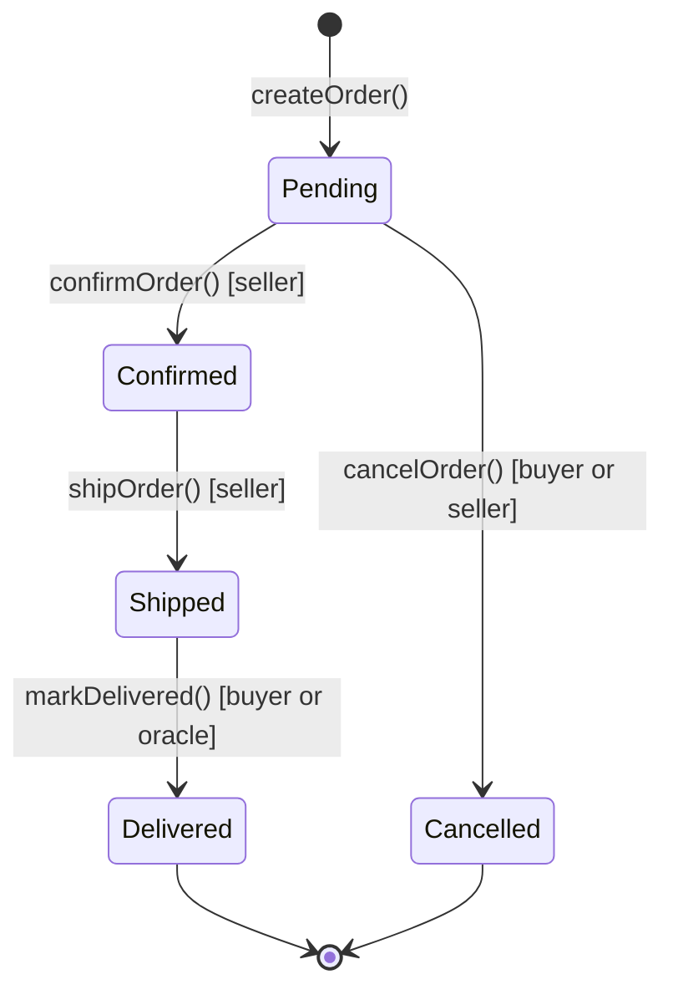

# 🏗️ Structs and Enums in Solidity

> **Level:** Beginner | **Prerequisite:** Variables, Mappings, Arrays | **Estimated reading time:** 20 minutes

---

## 📋 Table of Contents

1. [Structs](#structs)
   - [What is a Struct?](#what-is-a-struct)
   - [Defining a Struct](#defining-a-struct)
   - [Creating Struct Instances: storage vs memory](#creating-struct-instances-storage-vs-memory)
   - [Accessing Struct Members](#accessing-struct-members)
   - [Structs in Arrays and Mappings](#structs-in-arrays-and-mappings)
   - [Nested Structs](#nested-structs)
   - [Structs as Function Parameters and Return Values](#structs-as-function-parameters-and-return-values)
   - [Structs and Storage Layout](#structs-and-storage-layout)
2. [Enums](#enums)
   - [What is an Enum?](#what-is-an-enum)
   - [Defining and Using Enums](#defining-and-using-enums)
   - [Enums as State Machines](#enums-as-state-machines)
   - [Enum uint Conversion](#enum-uint-conversion)
   - [Enums in Events](#enums-in-events)
   - [Default Enum Value](#default-enum-value)
3. [Real-World Patterns](#real-world-patterns)
4. [Complete Marketplace Example](#complete-marketplace-example)
5. [Key Takeaways](#key-takeaways)
6. [Quiz](#quiz)

---

## 🏗️ Structs

### What is a Struct?

A **struct** is a custom data type that lets you group related pieces of data together under one name. Think of it like a form or a record card — a single "thing" that carries multiple attributes.

In traditional object-oriented languages you might use a class. A Solidity struct is similar, **but without methods** — it is purely a data container. All the logic lives in the contract functions that operate on the struct.

**Real-world analogy:** An order receipt at an online store holds an order ID, the buyer's name, the seller, the total amount, and the delivery status. Instead of tracking five separate variables per order, you bundle them into one `Order` struct.

```solidity
// Without a struct — messy and hard to manage
mapping(uint256 => address) public orderBuyer;
mapping(uint256 => address) public orderSeller;
mapping(uint256 => uint256) public orderAmount;

// With a struct — clean and self-documenting
struct Order {
    address buyer;
    address seller;
    uint256 amount;
}
mapping(uint256 => Order) public orders;
```

---

### Defining a Struct

You define a struct at the contract level using the `struct` keyword followed by a name and a set of typed fields inside curly braces.

```solidity
// SPDX-License-Identifier: MIT
pragma solidity ^0.8.0;

contract Registry {
    struct Person {
        string name;
        uint256 age;
        address wallet;
        bool isVerified;
    }
}
```

**Naming conventions:**
- Struct names use **PascalCase** (`MyStruct`, not `myStruct`)
- Field names use **camelCase** (`firstName`, not `FirstName`)

Structs can contain any valid Solidity type: `uint`, `address`, `bool`, `string`, `bytes`, other structs, arrays, and mappings (with some restrictions — a struct cannot contain a mapping if it will be used in `memory`).

---

### Creating Struct Instances: storage vs memory

This is one of the most important things to understand. Where a struct variable lives determines how it behaves and what it costs in gas.

#### Storage — persistent, on-chain

A `storage` struct variable is a **reference** directly into contract storage. Changes to it are automatically written back to the blockchain.

```solidity
struct Counter {
    uint256 value;
    address owner;
}

mapping(address => Counter) public counters;

function increment() public {
    // 'storage' gives us a reference — changes persist
    Counter storage myCounter = counters[msg.sender];
    myCounter.value += 1;       // This writes to chain storage
    myCounter.owner = msg.sender;
}
```

> **Warning:** If you omit the `storage` keyword and just write `Counter counter = counters[msg.sender]`, Solidity will warn you or error — always be explicit.

#### Memory — temporary, off-chain

A `memory` struct is a temporary copy that exists only during the function call. It is cheaper to work with but changes do **not** persist automatically.

```solidity
function buildTempPerson(string memory name, uint256 age)
    public
    pure
    returns (string memory, uint256)
{
    // 'memory' — this disappears after the function returns
    Person memory temp = Person({
        name: name,
        age: age,
        wallet: address(0),
        isVerified: false
    });
    return (temp.name, temp.age);
}
```

**When to use which:**
| Use `storage` | Use `memory` |
|---|---|
| Updating existing on-chain data | Building a new struct to return from a function |
| Avoiding extra copy costs for large structs | Short-lived computation inside a function |
| Modifying state variables | Reading data without needing to write back |

#### Two ways to initialise a struct

```solidity
// Named field syntax (recommended — order-independent, readable)
Order memory o1 = Order({
    id: 1,
    buyer: msg.sender,
    seller: sellerAddress,
    amount: msg.value
});

// Positional syntax (must match field declaration order exactly)
Order memory o2 = Order(1, msg.sender, sellerAddress, msg.value);
```

The named-field style is strongly preferred because adding a new field to the struct in the future will not silently break your positional initialisation.

---

### Accessing Struct Members

Use **dot notation** — exactly like accessing properties on an object in JavaScript or Python.

```solidity
Order storage order = orders[orderId];

// Reading
address buyer = order.buyer;
uint256 amount = order.amount;

// Writing
order.amount = 500;
order.status = OrderStatus.Confirmed;
```

---

### Structs in Arrays and Mappings

This is the most common pattern you will encounter in real contracts. Combining structs with arrays or mappings lets you manage collections of complex objects.

#### Struct in a dynamic array

```solidity
contract TaskManager {
    struct Task {
        string title;
        bool completed;
        address assignee;
    }

    Task[] public tasks;

    function addTask(string memory title, address assignee) public {
        tasks.push(Task({
            title: title,
            completed: false,
            assignee: assignee
        }));
    }

    function completeTask(uint256 index) public {
        // Use 'storage' to modify the actual array element
        Task storage task = tasks[index];
        require(task.assignee == msg.sender, "Not your task");
        task.completed = true;
    }

    function getTask(uint256 index) public view returns (Task memory) {
        return tasks[index];
    }
}
```

#### Struct in a mapping (most efficient lookup pattern)

```solidity
contract UserRegistry {
    struct User {
        string username;
        uint256 registeredAt;
        bool active;
    }

    mapping(address => User) public users;

    function register(string memory username) public {
        require(!users[msg.sender].active, "Already registered");
        users[msg.sender] = User({
            username: username,
            registeredAt: block.timestamp,
            active: true
        });
    }
}
```

Mappings give O(1) lookup by key — perfect when you need to look up a user's or order's data by ID or address.

---

### Nested Structs

A struct can contain another struct as a field. This lets you model hierarchical data naturally.

```solidity
contract ShippingTracker {
    struct Address {
        string street;
        string city;
        string country;
    }

    struct Shipment {
        uint256 id;
        Address origin;
        Address destination;
        uint256 dispatchedAt;
    }

    mapping(uint256 => Shipment) public shipments;

    function createShipment(
        uint256 id,
        string memory fromCity,
        string memory toCity
    ) public {
        shipments[id] = Shipment({
            id: id,
            origin: Address({ street: "", city: fromCity, country: "" }),
            destination: Address({ street: "", city: toCity, country: "" }),
            dispatchedAt: block.timestamp
        });
    }

    function getDestinationCity(uint256 id) public view returns (string memory) {
        return shipments[id].destination.city;   // chained dot notation
    }
}
```

---

### Structs as Function Parameters and Return Values

Structs can be passed into functions and returned from them. The `memory` keyword is required for reference types used in function signatures.

```solidity
contract ProductStore {
    struct Product {
        uint256 id;
        string name;
        uint256 price;
    }

    // Accepting a struct as parameter
    function calculateDiscount(Product memory product, uint256 discountPct)
        public
        pure
        returns (uint256 discountedPrice)
    {
        discountedPrice = product.price * (100 - discountPct) / 100;
    }

    // Returning a struct from a function
    function buildProduct(uint256 id, string memory name, uint256 price)
        public
        pure
        returns (Product memory)
    {
        return Product({ id: id, name: name, price: price });
    }
}
```

> **ABI note:** Returning structs from `public` functions is fully supported from Solidity 0.8.x and generates proper ABI encoding so external callers (your frontend, other contracts) can decode the result.

---

### Structs and Storage Layout

Understanding how structs occupy storage slots helps you write cheaper contracts.

- Each storage slot is **32 bytes** (256 bits).
- Solidity tries to **pack** smaller variables into the same slot.
- The compiler packs fields **in declaration order**, so putting small types (`uint8`, `bool`, `address` which is 20 bytes) together allows slot sharing.

```solidity
// Inefficient — each bool takes its own full slot
struct Bad {
    uint256 a;   // slot 0
    bool x;      // slot 1 (wastes 31 bytes)
    uint256 b;   // slot 2
    bool y;      // slot 3 (wastes 31 bytes)
}

// Efficient — bools packed into same slot as address
struct Good {
    uint256 a;      // slot 0
    address owner;  // slot 1 (20 bytes)
    bool active;    // slot 1 (packed alongside owner, 1 byte)
    bool verified;  // slot 1 (packed, 1 byte)
    uint256 b;      // slot 2
}
```

This is relevant for high-frequency contracts where minimising SSTORE operations saves real money in gas.

---

## 🔢 Enums

### What is an Enum?

An **enum** (enumeration) defines a **finite, named set of values**. Instead of using raw integers to represent states (0 = pending, 1 = active, 2 = cancelled — easy to get wrong), you give each value a meaningful name that the compiler enforces.

```solidity
// Bad — magic numbers everywhere
uint8 public status;  // 0=pending, 1=active, hope you remember!

// Good — self-documenting, compiler-checked
enum Status { Pending, Active, Cancelled }
Status public status;
```

Under the hood Solidity stores enums as `uint8`, meaning you can have at most 256 values in a single enum (more than enough for any real use case).

---

### Defining and Using Enums

```solidity
// SPDX-License-Identifier: MIT
pragma solidity ^0.8.0;

contract AuctionRoom {
    enum AuctionState {
        Created,    // 0 — auction is set up but not started
        Bidding,    // 1 — bidding is open
        Ended,      // 2 — bidding closed
        Settled     // 3 — funds distributed
    }

    AuctionState public state;

    function startBidding() public {
        require(state == AuctionState.Created, "Not in Created state");
        state = AuctionState.Bidding;
    }

    function endBidding() public {
        require(state == AuctionState.Bidding, "Bidding is not open");
        state = AuctionState.Ended;
    }
}
```

Access enum values with `EnumName.ValueName` syntax. Comparisons use `==` and `!=`.

---

### Enums as State Machines

This is the **most powerful** use of enums in Solidity. A state machine is a model where a system can be in exactly one state at a time, and transitions between states are controlled.

A well-designed state machine using an enum gives you:
- **Clarity** — anyone reading the code immediately understands what states exist.
- **Safety** — `require` guards prevent illegal transitions.
- **Auditability** — the set of possible states is right there in the enum definition.

**Order lifecycle state machine:**



Each arrow represents a function call with a `require` guard that checks the current state. You can only move forward through the lifecycle — no jumping from `Pending` to `Delivered`, and no going backward from `Shipped` to `Confirmed`.

**Role management with enums:**

```solidity
contract AccessControl {
    enum Role { Guest, Member, Moderator, Admin }

    mapping(address => Role) public roles;

    modifier onlyAdmin() {
        require(roles[msg.sender] == Role.Admin, "Admins only");
        _;
    }

    modifier atLeastModerator() {
        require(
            roles[msg.sender] == Role.Moderator ||
            roles[msg.sender] == Role.Admin,
            "Moderators and Admins only"
        );
        _;
    }

    function promoteToMember(address user) public onlyAdmin {
        roles[user] = Role.Member;
    }

    function promoteModerator(address user) public onlyAdmin {
        roles[user] = Role.Moderator;
    }
}
```

---

### Enum uint Conversion

Because enums are stored as `uint8`, you can convert between them explicitly.

```solidity
enum Phase { Alpha, Beta, Launch }  // Alpha=0, Beta=1, Launch=2

Phase current = Phase.Beta;

// Enum -> uint
uint8 asNumber = uint8(current);   // asNumber = 1

// uint -> Enum (be careful — reverts if value is out of range)
Phase fromNumber = Phase(2);       // fromNumber = Phase.Launch
Phase invalid = Phase(99);         // REVERTS — 99 is not a valid Phase
```

The out-of-range revert (added in Solidity 0.8.x) is a safety net. In older versions (pre-0.8) an invalid cast would silently produce garbage — another reason to always use `^0.8.0`.

**Practical use — storing enum values off-chain or in events:**

```solidity
function getCurrentPhaseNumber() public view returns (uint8) {
    return uint8(currentPhase);
}
```

---

### Enums in Events

Events record things that happened on-chain so that frontends and indexers can react to them. Enums work naturally in events — the ABI encodes them as `uint8`.

```solidity
event PhaseChanged(Phase indexed oldPhase, Phase indexed newPhase);
event OrderStatusUpdated(uint256 indexed orderId, OrderStatus status);

function advancePhase() internal {
    Phase old = currentPhase;
    currentPhase = Phase(uint8(currentPhase) + 1);
    emit PhaseChanged(old, currentPhase);
}
```

On the frontend (via ethers.js or viem) you receive the numeric value. Your ABI includes the enum definition, so libraries can decode it back to the named string for display.

---

### Default Enum Value

When a variable of an enum type is declared but never assigned, it defaults to the **first member** (index 0). This is important to design around.

```solidity
enum OrderStatus { Pending, Confirmed, Shipped, Delivered, Cancelled }

// In a mapping, every un-initialised entry has status = Pending (0)
mapping(uint256 => OrderStatus) public statuses;

// statuses[999] == OrderStatus.Pending  <- even though order 999 was never created!
```

This is a common source of bugs. A common defensive pattern is to add a sentinel first value:

```solidity
enum OrderStatus {
    None,       // 0 — "does not exist" sentinel
    Pending,    // 1
    Confirmed,  // 2
    Shipped,    // 3
    Delivered,  // 4
    Cancelled   // 5
}

// Now you can check: require(order.status != OrderStatus.None, "Order not found");
```

---

## 🌍 Real-World Patterns

### Pattern 1 — Order Status Lifecycle

The canonical example: an e-commerce marketplace where orders move through stages.

```
Pending -> Confirmed -> Shipped -> Delivered
    \                                     
     -> Cancelled (from Pending or Confirmed)
```

Guards on each transition ensure business rules are respected on-chain without trusting any off-chain service.

### Pattern 2 — Role-Based Access Control

```solidity
enum Role { Guest, Member, Moderator, Admin }
mapping(address => Role) public roles;
```

Modifiers like `onlyAdmin` and `atLeastModerator` wrap sensitive functions. Combined with structs that store user profiles, this gives you a complete permission system.

### Pattern 3 — Auction States

```solidity
enum AuctionState { NotStarted, Accepting, Closed, Finalized, Refunding }
```

The `Refunding` state handles the edge case where the auction is cancelled after bids were placed — bidders can withdraw their ETH only in this state.

---

## 📦 Complete Marketplace Example

```solidity
// SPDX-License-Identifier: MIT
pragma solidity ^0.8.0;

contract Marketplace {
    // ------------------------------------------------------------------
    // Enum: all possible states an order can be in
    // ------------------------------------------------------------------
    enum OrderStatus { Pending, Confirmed, Shipped, Delivered, Cancelled }

    // ------------------------------------------------------------------
    // Struct: one complete order record
    // ------------------------------------------------------------------
    struct Order {
        uint256 id;
        address buyer;
        address seller;
        uint256 amount;
        OrderStatus status;
        uint256 createdAt;
    }

    // ------------------------------------------------------------------
    // State: mapping from order ID to order data
    // ------------------------------------------------------------------
    mapping(uint256 => Order) public orders;
    uint256 public orderCount;

    // ------------------------------------------------------------------
    // Events
    // ------------------------------------------------------------------
    event OrderCreated(uint256 indexed orderId, address buyer, address seller);
    event OrderStatusChanged(uint256 indexed orderId, OrderStatus newStatus);

    // ------------------------------------------------------------------
    // Functions
    // ------------------------------------------------------------------

    /// @notice Buyer creates an order by sending ETH
    function createOrder(address seller) public payable returns (uint256) {
        require(msg.value > 0, "Must send ETH");
        orderCount++;

        // Named-field initialisation — clear and safe
        orders[orderCount] = Order({
            id: orderCount,
            buyer: msg.sender,
            seller: seller,
            amount: msg.value,
            status: OrderStatus.Pending,    // default state
            createdAt: block.timestamp
        });

        emit OrderCreated(orderCount, msg.sender, seller);
        return orderCount;
    }

    /// @notice Seller confirms the order
    function confirmOrder(uint256 orderId) public {
        Order storage order = orders[orderId];            // storage reference — writes persist
        require(order.seller == msg.sender, "Only seller can confirm");
        require(order.status == OrderStatus.Pending, "Order not pending");

        order.status = OrderStatus.Confirmed;
        emit OrderStatusChanged(orderId, OrderStatus.Confirmed);
    }

    /// @notice Seller marks order as shipped
    function shipOrder(uint256 orderId) public {
        Order storage order = orders[orderId];
        require(order.seller == msg.sender, "Only seller can ship");
        require(order.status == OrderStatus.Confirmed, "Order not confirmed");

        order.status = OrderStatus.Shipped;
        emit OrderStatusChanged(orderId, OrderStatus.Shipped);
    }

    /// @notice Buyer confirms delivery — releases funds to seller
    function confirmDelivery(uint256 orderId) public {
        Order storage order = orders[orderId];
        require(order.buyer == msg.sender, "Only buyer can confirm delivery");
        require(order.status == OrderStatus.Shipped, "Order not shipped");

        order.status = OrderStatus.Delivered;
        emit OrderStatusChanged(orderId, OrderStatus.Delivered);

        // Release payment to seller
        payable(order.seller).transfer(order.amount);
    }

    /// @notice Cancel order (only when Pending)
    function cancelOrder(uint256 orderId) public {
        Order storage order = orders[orderId];
        require(
            order.buyer == msg.sender || order.seller == msg.sender,
            "Not a party to this order"
        );
        require(order.status == OrderStatus.Pending, "Cannot cancel at this stage");

        order.status = OrderStatus.Cancelled;
        emit OrderStatusChanged(orderId, OrderStatus.Cancelled);

        // Refund buyer
        payable(order.buyer).transfer(order.amount);
    }

    /// @notice Helper: get status as a uint (for off-chain use)
    function getStatusCode(uint256 orderId) public view returns (uint8) {
        return uint8(orders[orderId].status);
    }

    /// @notice Read a full order struct
    function getOrder(uint256 orderId) public view returns (Order memory) {
        return orders[orderId];
    }
}
```

**What this example demonstrates:**

| Feature | Where used |
|---|---|
| Enum definition | `enum OrderStatus` |
| Struct definition | `struct Order` |
| Struct in mapping | `mapping(uint256 => Order) public orders` |
| `storage` reference | `Order storage order = orders[orderId]` |
| Enum comparison guard | `require(order.status == OrderStatus.Pending, ...)` |
| Enum assignment | `order.status = OrderStatus.Confirmed` |
| Enum in event | `emit OrderStatusChanged(orderId, OrderStatus.Confirmed)` |
| Struct return value | `returns (Order memory)` |
| uint8 conversion | `return uint8(orders[orderId].status)` |

---

## ✅ Key Takeaways

1. **Structs group related data** into a single named type — use them whenever you have more than two or three related variables.

2. **`storage` vs `memory` matters:** Use `storage` when you need to modify on-chain state. Use `memory` for temporary data and function return values.

3. **Named field initialisation** (`Order({ id: 1, buyer: ... })`) is safer than positional initialisation because it does not break when you add fields.

4. **Pack your struct fields** — place smaller types together to share storage slots and reduce gas costs.

5. **Enums are self-documenting integers** — they prevent magic number bugs and make your code readable.

6. **Design enums as state machines** — pair them with `require` guards on every state-changing function to enforce your business rules on-chain.

7. **The default enum value is index 0** — plan for this: either make index 0 a meaningful default (e.g., `Pending`) or use a `None` sentinel to distinguish "not found" from "freshly created".

8. **Enums are emitted as `uint8`** in events — your frontend decodes them by matching against the ABI.

---

## 🧠 Quiz

**Question 1**

You have a `mapping(uint256 => Product)` and you want to update the `price` field of `products[42]`. Which of the following is correct?

```solidity
// Option A
Product memory p = products[42];
p.price = 999;

// Option B
Product storage p = products[42];
p.price = 999;
```

<details>
<summary>Answer</summary>

**Option B** is correct. `storage` gives you a direct reference into contract storage, so `p.price = 999` writes the value to the blockchain. With `memory` (Option A), you are working on a local copy — the change is lost when the function returns and `products[42].price` is unchanged.

</details>

---

**Question 2**

Given this enum:

```solidity
enum Phase { Alpha, Beta, Launch }
Phase public phase;
```

What is the value of `phase` immediately after the contract is deployed, before any function is called?

<details>
<summary>Answer</summary>

`Phase.Alpha` — the first enum member (index 0). Unassigned enum state variables default to the member at index 0.

</details>

---

**Question 3**

A developer writes this code to cancel an order:

```solidity
function cancel(uint256 orderId) public {
    orders[orderId].status = OrderStatus.Cancelled;
}
```

What is missing, and what are the two risks?

<details>
<summary>Answer</summary>

Two things are missing:

1. **Access control** — there is no check that `msg.sender` is the buyer or seller. Anyone can cancel any order.

2. **State guard** — there is no `require` ensuring the order is in a state where cancellation is valid (e.g., `Pending`). An already-`Delivered` order could be set back to `Cancelled`, potentially allowing a second refund if the contract also sends ETH on cancellation.

The corrected version should include:
```solidity
require(
    msg.sender == orders[orderId].buyer ||
    msg.sender == orders[orderId].seller,
    "Not authorised"
);
require(
    orders[orderId].status == OrderStatus.Pending,
    "Cannot cancel at this stage"
);
```

</details>

---

*Next chapter: Inheritance and Interfaces in Solidity*
