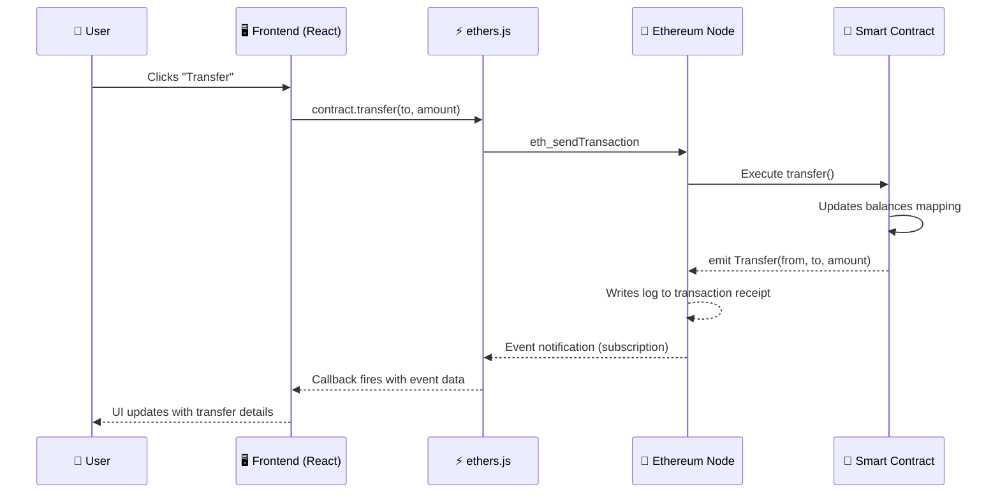

# 📡 Events and Logs in Solidity

> **Chapter 8 — Smart Contract Development Series**
> Difficulty: Beginner | Estimated Reading Time: ~20 minutes

---

## 🧭 What You Will Learn

- What Solidity events are and why they exist
- How to define and emit events with `indexed` parameters
- How events are stored (transaction logs vs. state)
- How frontends listen to and query events using ethers.js
- Standard events in ERC-20 and ERC-721 contracts
- How The Graph protocol solves complex event querying at scale

---

## 1. 🔔 What Are Events?

Think of Solidity events as **`console.log` for the blockchain** — but with a superpower: the logs are stored permanently in the transaction receipt and can never be altered or deleted.

When you call `console.log` in JavaScript, the output disappears the moment the tab closes. When you `emit` an event in Solidity, the data is written into the **transaction log** of the Ethereum blockchain and is accessible forever to anyone who knows the transaction hash — or who queries the logs programmatically.

Here is the key mental model:

| Feature | `console.log` (JS) | Solidity Event |
|---|---|---|
| Lives in | Browser console | Blockchain transaction receipt |
| Persistent? | No | Yes — forever |
| Readable by contract? | Yes | **No** — contracts cannot read their own past logs |
| Readable by off-chain code? | Yes | Yes — via RPC / ethers.js |
| Cost | Free | Much cheaper than `storage` |

> **Important:** Events are **write-only** from the contract's perspective. Once emitted, the contract itself cannot query them back. Events are purely a communication channel to the outside world.

---

## 2. 💡 Why Events Matter

Events are not just a nice-to-have — they are essential to how production dApps function.

### Frontend Real-Time Updates
Your React/Vue frontend cannot "see" what is happening inside the contract in real time unless it listens for events. Polling the blockchain every few seconds is expensive and slow. Subscribing to events gives you instant push notifications when something changes.

### Indexing and Search
State variables are great for looking up "current" values (`balances[alice]`), but they cannot answer questions like "show me every transfer Alice has ever made." Events give you a queryable history of everything that happened.

### Audit Trail and Compliance
Financial protocols, DAOs, and NFT marketplaces use events to create an immutable audit trail. Every deposit, withdrawal, ownership change, or vote can be logged permanently.

### The Graph Protocol
For complex queries — "show me all wallets that received more than 10 ETH this week" — you need an indexing layer. The Graph listens to your contract's events, indexes them into a GraphQL API, and lets frontends query data in milliseconds. Events are the raw input that makes The Graph possible.

---

## 3. 📝 Defining an Event

Events are declared at the contract level using the `event` keyword.

```solidity
// SPDX-License-Identifier: MIT
pragma solidity ^0.8.0;

contract EventsDemo {
    // Event declarations — think of these as type definitions for your logs
    event Transfer(address indexed from, address indexed to, uint256 amount);
    event Deposit(address indexed user, uint256 amount, uint256 timestamp);
    event OwnerChanged(address indexed oldOwner, address indexed newOwner);

    mapping(address => uint256) public balances;
    address public owner;

    constructor() {
        owner = msg.sender;
    }

    function deposit() public payable {
        balances[msg.sender] += msg.value;
        emit Deposit(msg.sender, msg.value, block.timestamp);
    }

    function transfer(address to, uint256 amount) public {
        require(balances[msg.sender] >= amount, "Insufficient balance");
        balances[msg.sender] -= amount;
        balances[to] += amount;
        emit Transfer(msg.sender, to, amount);
    }

    function changeOwner(address newOwner) public {
        require(msg.sender == owner, "Only owner");
        emit OwnerChanged(owner, newOwner);
        owner = newOwner;
    }
}
```

The syntax is straightforward:

```
event EventName(type param1, type param2, ...);
```

You can have as many parameters as you need. Parameters marked `indexed` get special treatment (more on that next).

---

## 4. 📢 Emitting an Event

Once declared, you fire an event using `emit`:

```solidity
emit Transfer(msg.sender, to, amount);
```

`emit` is not a function call — it writes data to the **transaction log**. No gas is spent on changing contract state, which makes it significantly cheaper than a `SSTORE` (storage write) operation.

> **Gas intuition:** Writing 32 bytes to contract storage costs ~20,000 gas. Emitting a log with 32 bytes of data costs roughly 375 gas + 8 gas per byte. Events are **~50x cheaper** than storage for the same data.

---

## 5. 🔍 The `indexed` Keyword

The `indexed` keyword is how you make event parameters **searchable**.

```solidity
event Transfer(address indexed from, address indexed to, uint256 amount);
//                      ^^^^^^^^              ^^^^^^^^
//               These become "topics"   This stays as "data"
```

### Rules
- Maximum **3 indexed parameters** per event.
- Indexed parameters are ABI-encoded and stored as **topics** in the log.
- Non-indexed parameters are ABI-encoded and stored in the **data** field.

### Why does this matter?
When you query logs, you can **filter by topics**. For example:

- "Give me all `Transfer` events **where `from` is Alice**"
- "Give me all `Transfer` events **where `to` is Bob**"
- "Give me all `Transfer` events **where `from` is Alice AND `to` is Bob**"

You cannot filter by the non-indexed `amount` field without downloading all logs and filtering client-side. Choose what to index based on what you expect to search.

---

## 6. 🏗️ Event Topics vs. Data

Every emitted event log has two parts:

### Topics (indexed parameters)
- Up to 4 topics (Topic 0 is always the **event signature hash**, e.g., `keccak256("Transfer(address,address,uint256)`)
- Topics 1–3 hold your `indexed` parameters
- Topics are 32 bytes each, ABI-padded
- **Filterable** at the node/RPC level — fast lookups

### Data (non-indexed parameters)
- All non-indexed parameters are ABI-encoded together into the `data` field
- Not directly filterable at the node level
- Can hold variable-length data like `string` and `bytes` (indexed parameters of dynamic types are stored as their Keccak-256 hash, losing the original value)

```
Log Structure
├── address: contract address
├── topics[0]: keccak256("Transfer(address,address,uint256)")
├── topics[1]: indexed `from` address (padded to 32 bytes)
├── topics[2]: indexed `to` address (padded to 32 bytes)
└── data: ABI-encoded `amount` (non-indexed)
```

> **Tip:** Avoid indexing `string` or `bytes` parameters — you only get their hash, making the original value unrecoverable from the log alone.

---

## 7. 💾 How Events Are Stored (Logs vs. State)

This is one of the most misunderstood aspects of Solidity events.

Events are **NOT** stored in contract storage (`mapping`, `uint256`, etc.). They live in the **transaction receipt**, which is part of the block data maintained by Ethereum nodes.

```
Ethereum Block
├── Block Header (state root, tx root, receipts root)
├── Transactions []
│   └── Tx 0xabc...
│       ├── Input data (function call)
│       └── Receipt
│           ├── Status (success/fail)
│           ├── Gas used
│           └── Logs []          ← Events live here
│               └── Log entry
│                   ├── address
│                   ├── topics[]
│                   └── data
└── ...
```

Because logs are not in the EVM state trie, they:
- Cannot be read by other smart contracts
- Are much cheaper to write
- Are prunable in some node configurations (archive nodes keep all; full nodes may not)
- Are indexed by Ethereum nodes for efficient querying via `eth_getLogs`

---

## 8. 🌐 Event Flow: Contract to Frontend



---

## 9. 👂 Listening to Events in ethers.js

### Real-Time Subscription

```javascript
import { ethers } from "ethers";

const provider = new ethers.BrowserProvider(window.ethereum);
const signer = await provider.getSigner();

const contract = new ethers.Contract(CONTRACT_ADDRESS, ABI, signer);

// Listen for future Transfer events in real time
contract.on("Transfer", (from, to, amount, event) => {
    console.log(`Transfer detected!`);
    console.log(`From: ${from}`);
    console.log(`To: ${to}`);
    console.log(`Amount: ${ethers.formatEther(amount)} ETH`);
    console.log(`Tx hash: ${event.log.transactionHash}`);

    // Update your React state, refresh a balance, show a toast, etc.
    updateUI(from, to, amount);
});

// Stop listening when the component unmounts (important for React!)
return () => {
    contract.off("Transfer");
};
```

### Querying Historical Events

```javascript
// Build a filter for Transfer events TO a specific address
const filter = contract.filters.Transfer(null, userAddress);

// Query all matching events from block 0 to latest
const events = await contract.queryFilter(filter, 0, "latest");

events.forEach((event) => {
    const { from, to, amount } = event.args;
    console.log(`Block ${event.blockNumber}: ${from} → ${to} | ${ethers.formatEther(amount)} ETH`);
});
```

### getLogs (low-level RPC)

```javascript
// Low-level approach using eth_getLogs
const logs = await provider.getLogs({
    address: CONTRACT_ADDRESS,
    topics: [
        ethers.id("Transfer(address,address,uint256)"), // Topic 0: event sig
        null,                                            // Topic 1: any `from`
        ethers.zeroPadValue(userAddress, 32),            // Topic 2: specific `to`
    ],
    fromBlock: 0,
    toBlock: "latest",
});
```

---

## 10. 🕵️ Anonymous Events

You can declare an event with the `anonymous` keyword to omit Topic 0 (the event signature hash):

```solidity
event SecretLog(address indexed who, uint256 value) anonymous;
```

With `anonymous`:
- Topic 0 is freed up, giving you **4 indexed parameters** instead of 3
- The event **cannot be filtered by name** — you lose the ability to look it up by its signature
- Marginally cheaper gas (saves storing Topic 0)

Anonymous events are rarely used in practice. They make sense only when you need 4 indexed topics and have no need to identify the event type by signature.

---

## 11. 🪙 ERC-20 Standard Events

The ERC-20 standard mandates two events that every fungible token must emit:

```solidity
// Emitted when tokens are transferred (including mint and burn)
event Transfer(address indexed from, address indexed to, uint256 value);

// Emitted when an allowance is set via approve()
event Approval(address indexed owner, address indexed spender, uint256 value);
```

### Transfer
- `from` = zero address (`0x000...000`) on **mint**
- `to` = zero address on **burn**
- Both non-zero on a regular transfer

### Approval
- `owner` approved `spender` to move up to `value` tokens on their behalf
- Used by DEXes like Uniswap to pull funds from your wallet

These events are what allows block explorers like Etherscan to show you a complete token transfer history, and what lets wallets auto-detect token balances.

---

## 12. 🖼️ ERC-721 Standard Events (NFTs)

ERC-721 (NFT standard) defines these key events:

```solidity
// Single NFT transfer
event Transfer(address indexed from, address indexed to, uint256 indexed tokenId);

// Approval for a single token
event Approval(address indexed owner, address indexed approved, uint256 indexed tokenId);

// Approval for ALL tokens owned by `owner`
event ApprovalForAll(address indexed owner, address indexed operator, bool approved);
```

Notice that ERC-721's `Transfer` indexes all three parameters (`from`, `to`, `tokenId`) — this is possible because there is no non-indexed `value` field. This makes it extremely efficient to filter: "find every transfer of token #42" or "find every NFT Alice has received."

---

## 13. 🖥️ Events for Frontend UX Patterns

Here are the most common real-world patterns for using events in your dApp UI:

### Pattern 1 — Optimistic UI with Event Confirmation
```javascript
// 1. Show "pending" state immediately
setStatus("pending");

// 2. Send the transaction
const tx = await contract.deposit({ value: ethers.parseEther("1") });

// 3. Wait for the Deposit event to confirm (more reliable than tx.wait())
contract.once("Deposit", (user, amount, timestamp) => {
    if (user === signerAddress) {
        setStatus("confirmed");
        setBalance(prev => prev + amount);
    }
});
```

### Pattern 2 — Activity Feed / History
```javascript
// Fetch the last 100 blocks of Transfer events for the connected wallet
const filter = contract.filters.Transfer(signerAddress);
const recentEvents = await contract.queryFilter(filter, -100);
setActivityFeed(recentEvents.map(e => ({
    type: "sent",
    to: e.args.to,
    amount: ethers.formatEther(e.args.amount),
    block: e.blockNumber,
})));
```

### Pattern 3 — Live Dashboard
```javascript
// Subscribe to all incoming transfers for a live dashboard
contract.on("Transfer", (from, to, amount) => {
    if (to === dashboardAddress) {
        addToLiveFeed({ from, amount: ethers.formatEther(amount) });
        updateTotalVolume(amount);
    }
});
```

---

## 14. 🕸️ The Graph: Indexing Events at Scale

`queryFilter` and `getLogs` work fine for simple queries over small time ranges. But they break down when you need:

- Aggregations: "total volume in the last 30 days"
- Joins: "all wallets that sent AND received tokens"
- Large history: scanning millions of blocks
- Complex filters: multiple conditions across multiple events

This is why **The Graph** exists. It is a decentralized indexing protocol that:

1. Listens to your contract's events in real time
2. Processes and stores them in a structured database (indexers)
3. Exposes a **GraphQL API** that frontends can query

You define a **Subgraph** — a mapping of events to database entities — and The Graph does the rest.

```graphql
# Example query on a deployed subgraph
{
  transfers(
    where: { from: "0xAlice", amount_gt: "1000000000000000000" }
    orderBy: blockTimestamp
    orderDirection: desc
    first: 20
  ) {
    from
    to
    amount
    blockTimestamp
  }
}
```

> Without The Graph, answering this query would require downloading and scanning millions of log entries on the client side. With The Graph, it returns in milliseconds.

Events are not optional for protocols that want to use The Graph — they are the **only** input the indexer can consume.

---

## 🔑 Key Takeaways

| Concept | Summary |
|---|---|
| Events are cheap | ~50x cheaper than storage writes for the same data |
| Events are permanent | Stored in transaction receipts on the blockchain forever |
| Events are write-only | Contracts cannot read their own past events |
| `indexed` = searchable | Up to 3 indexed params become filterable topics |
| Topics vs. data | Indexed params go in topics (filterable); others go in data |
| `anonymous` events | Rare; frees Topic 0, gains a 4th indexed slot |
| ERC-20 events | `Transfer` and `Approval` are mandatory |
| ERC-721 events | `Transfer`, `Approval`, `ApprovalForAll` |
| The Graph | Decentralized indexer that turns events into a GraphQL API |

---

## 🧠 Quiz

Test your understanding before moving on.

**Question 1.**
You emit an event with 4 parameters. Two are marked `indexed`, two are not. Where is each type stored in the transaction log, and what is the maximum number of `indexed` parameters you can have (excluding anonymous events)?

**Question 2.**
A frontend developer complains that after calling `contract.queryFilter(filter)`, they cannot filter results by a `string` parameter they marked as `indexed`. Why does this not work as expected, and how should they redesign the event to fix it?

**Question 3.**
Your DeFi protocol has been live for 2 years. A user asks: "Can you show me every wallet that deposited more than 5 ETH in January 2024?" You have a `Deposit(address indexed user, uint256 amount, uint256 timestamp)` event. What tool or approach would you use to answer this query efficiently, and why would `queryFilter` alone be insufficient?

<details>
<summary>Answers (click to reveal)</summary>

**Answer 1.**
Indexed parameters are stored as **topics** (topics 1–3; topic 0 is always the event signature hash). Non-indexed parameters are ABI-encoded together in the **data** field. The maximum number of indexed parameters per non-anonymous event is **3**.

**Answer 2.**
When a `string` (or any dynamic type like `bytes`) is marked `indexed`, Solidity stores its **Keccak-256 hash** as the topic, not the original value. The original string is lost and cannot be recovered from the log. To fix this, either leave the string as non-indexed (it goes into the `data` field intact) or use a `bytes32` identifier instead.

**Answer 3.**
`queryFilter` would require scanning potentially millions of blocks, downloading all `Deposit` events, and filtering client-side — this is too slow and unreliable at scale. The correct approach is to build a **subgraph on The Graph** that indexes `Deposit` events into a database, then query it via GraphQL with filters like `amount_gt: "5000000000000000000"` and a timestamp range. This returns results in milliseconds.

</details>

---

## 📚 Further Reading

- [Solidity Docs — Events](https://docs.soliditylang.org/en/latest/contracts.html#events)
- [ethers.js — Listening to Events](https://docs.ethers.org/v6/getting-started/#starting-events)
- [The Graph — Building a Subgraph](https://thegraph.com/docs/en/developing/creating-a-subgraph/)
- [EIP-20 — ERC-20 Token Standard](https://eips.ethereum.org/EIPS/eip-20)
- [EIP-721 — ERC-721 NFT Standard](https://eips.ethereum.org/EIPS/eip-721)

---

*Next Chapter: Chapter 09 — Inheritance and Interfaces in Solidity*
