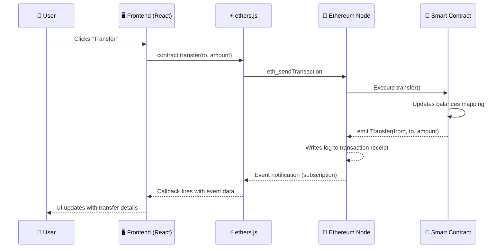

# 📡 Events and Logs in Solidity

> **Chapter 8 — Smart Contract Development Series**
> Difficulty: Beginner | Estimated Reading Time: ~20 minutes

---

## 🧭 Kya Seekhoge Is Chapter Mein

- Solidity events kya hote hain aur exist kyun karte hain
- `indexed` parameters ke saath events kaise define aur emit karte hain
- Events kahan store hote hain (transaction logs vs. state)
- Frontend ethers.js use karke events kaise sunta aur query karta hai
- ERC-20 aur ERC-721 contracts ke standard events
- The Graph protocol scale pe complex event querying kaise solve karta hai

---

## 1. 🔔 Events Hote Kya Hain?

Socho Solidity events ko **blockchain ka `console.log`** samajh lo — bas iska ek superpower hai: iske logs transaction receipt mein permanently store ho jaate hain aur kabhi alter ya delete nahi ho sakte.

Jab tum JavaScript mein `console.log` chalate ho, tab tab jaise hi browser tab band hota hai, output gayab ho jaata hai. Lekin jab tum Solidity mein koi event `emit` karte ho, toh woh data Ethereum blockchain ke **transaction log** mein likha jaata hai — aur jisko bhi transaction hash pata hai, ya jo logs ko programmatically query karta hai, uske liye woh data hamesha ke liye available rehta hai.

Yeh raha mental model, ek table mein:

| Feature | `console.log` (JS) | Solidity Event |
|---|---|---|
| Kahan rehta hai | Browser console | Blockchain transaction receipt |
| Permanent? | Nahi | Haan — hamesha ke liye |
| Contract khud padh sakta hai? | Haan | **Nahi** — contract apne hi purane logs nahi padh sakta |
| Off-chain code padh sakta hai? | Haan | Haan — RPC / ethers.js ke zariye |
| Cost | Free | `storage` se kaafi sasta |

> **Important:** Events contract ke perspective se **write-only** hote hain. Ek baar emit hone ke baad, contract khud unhe query back nahi kar sakta. Events sirf bahar ki duniya ko batane ka ek communication channel hain — jaise ek megaphone jo sirf bolta hai, sunta nahi.

---

## 2. 💡 Events Kyun Zaruri Hain

Events koi "nice to have" cheez nahi hain — production dApps ke liye yeh backbone jaisa kaam karte hain.

### Frontend Real-Time Updates
Tumhara React/Vue frontend contract ke andar kya ho raha hai, woh real time mein "dekh" nahi sakta jab tak woh events sunna shuru na kare. Har chand second mein blockchain ko poll karna expensive aur slow hai — jaise Swiggy ka delivery status baar baar manually refresh karna. Events subscribe karne se tumhe instant push notification milti hai jaise hi kuch change hota hai.

### Indexing and Search
State variables current values dekhne ke liye zabardast hain (`balances[alice]`), lekin woh yeh sawaal nahi answer kar sakte: "Alice ne ab tak jitne bhi transfers kiye hain, sab dikhao." Events tumhe har cheez ki queryable history dete hain — jaise Paytm ka transaction history tab.

### Audit Trail and Compliance
Financial protocols, DAOs, aur NFT marketplaces events use karke ek immutable audit trail banate hain. Har deposit, withdrawal, ownership change, ya vote permanently log ho sakta hai.

### The Graph Protocol
Complex queries ke liye — jaise "is hafte 10 ETH se zyada kisne receive kiya" — tumhe ek indexing layer chahiye. The Graph tumhare contract ke events sunta hai, unhe ek GraphQL API mein index kar deta hai, aur frontends ko milliseconds mein data query karne deta hai. Events hi woh raw input hain jo The Graph ko possible banate hain.

---

## 3. 📝 Event Define Karna

Events contract level pe `event` keyword use karke declare hote hain.

```solidity
// SPDX-License-Identifier: MIT
pragma solidity ^0.8.0;

contract EventsDemo {
    // Event declarations — inhe apne logs ke type definitions samjho
    event Transfer(address indexed from, address indexed to, uint256 amount);
    event Deposit(address indexed user, uint256 amount, uint256 timestamp);
    event OwnerChanged(address indexed oldOwner, address indexed newOwner);

    mapping(address => uint256) public balances;
    address public owner;

    constructor() {
        owner = msg.sender;
    }

    function deposit() public payable {
        balances[msg.sender] += msg.value;
        emit Deposit(msg.sender, msg.value, block.timestamp);
    }

    function transfer(address to, uint256 amount) public {
        require(balances[msg.sender] >= amount, "Insufficient balance");
        balances[msg.sender] -= amount;
        balances[to] += amount;
        emit Transfer(msg.sender, to, amount);
    }

    function changeOwner(address newOwner) public {
        require(msg.sender == owner, "Only owner");
        emit OwnerChanged(owner, newOwner);
        owner = newOwner;
    }
}
```

Syntax bilkul simple hai:

```
event EventName(type param1, type param2, ...);
```

Jitne chahiye utne parameters rakh sakte ho. Jo parameters `indexed` marked hain, unhe special treatment milti hai (aage detail mein dekhenge).

---

## 4. 📢 Event Emit Karna

Ek baar declare karne ke baad, `emit` use karke event fire karte ho:

```solidity
emit Transfer(msg.sender, to, amount);
```

`emit` koi function call nahi hai — yeh **transaction log** mein data likhta hai. Contract state change karne mein koi gas nahi lagta, isliye yeh `SSTORE` (storage write) operation se kaafi sasta hai.

> **Gas intuition:** Contract storage mein 32 bytes likhna ~20,000 gas leta hai. Waheen 32 bytes ka log emit karna roughly 375 gas + 8 gas per byte leta hai. Matlab events storage se **~50x sasta** hain same data ke liye — jaise Ola vs auto-rickshaw ka fare comparison, bahut bada difference.

---

## 5. 🔍 `indexed` Keyword Ka Kamaal

`indexed` keyword se tum event parameters ko **searchable** bana sakte ho.

```solidity
event Transfer(address indexed from, address indexed to, uint256 amount);
//                      ^^^^^^^^              ^^^^^^^^
//               Yeh "topics" ban jaate hain   Yeh "data" mein rehta hai
```

### Rules
- Ek event mein maximum **3 indexed parameters** ho sakte hain.
- Indexed parameters ABI-encoded hokar log ke **topics** mein store hote hain.
- Non-indexed parameters ABI-encoded hokar **data** field mein store hote hain.

### Yeh matter kyun karta hai?
Jab tum logs query karte ho, tab tum **topics ke basis pe filter** kar sakte ho. Jaise:

- "Mujhe woh saare `Transfer` events do **jahan `from` Alice ho**"
- "Mujhe woh saare `Transfer` events do **jahan `to` Bob ho**"
- "Mujhe woh saare `Transfer` events do **jahan `from` Alice AND `to` Bob ho**"

Lekin non-indexed `amount` field ko tum filter nahi kar sakte bina saare logs download karke client-side filter kiye. Toh yeh soch samajh ke decide karo ki kya index karna hai — jo search karna hai woh index karo.

---

## 6. 🏗️ Event Topics vs. Data

Har emit hue event log ke do parts hote hain:

### Topics (indexed parameters)
- Maximum 4 topics hote hain (Topic 0 hamesha **event signature ka hash** hota hai, jaise `keccak256("Transfer(address,address,uint256)")`)
- Topics 1–3 tumhare `indexed` parameters hold karte hain
- Har topic 32 bytes ka hota hai, ABI-padded
- **Filterable** node/RPC level pe — fast lookups milti hain

### Data (non-indexed parameters)
- Saare non-indexed parameters ek saath ABI-encoded hokar `data` field mein jaate hain
- Node level pe directly filter nahi ho sakte
- `string` aur `bytes` jaisi variable-length data hold kar sakta hai (agar dynamic type indexed ho, toh unka Keccak-256 hash store hota hai, original value kho jaata hai)

```
Log Structure
├── address: contract address
├── topics[0]: keccak256("Transfer(address,address,uint256)")
├── topics[1]: indexed `from` address (32 bytes tak padded)
├── topics[2]: indexed `to` address (32 bytes tak padded)
└── data: ABI-encoded `amount` (non-indexed)
```

> **Tip:** `string` ya `bytes` parameters ko index karne se bacho — tumhe sirf unka hash milega, original value log se recover nahi ho payegi.

---

## 7. 💾 Events Kaise Store Hote Hain (Logs vs. State)

Yeh Solidity events ka sabse zyada misunderstand kiya jaane wala part hai.

Events contract storage (`mapping`, `uint256`, etc.) mein **store NAHI** hote. Woh **transaction receipt** mein rehte hain, jo Ethereum nodes ke maintain kiye hue block data ka part hai.

```
Ethereum Block
├── Block Header (state root, tx root, receipts root)
├── Transactions []
│   └── Tx 0xabc...
│       ├── Input data (function call)
│       └── Receipt
│           ├── Status (success/fail)
│           ├── Gas used
│           └── Logs []          ← Events yahan rehte hain
│               └── Log entry
│                   ├── address
│                   ├── topics[]
│                   └── data
└── ...
```

Kyunki logs EVM state trie mein nahi hote, isliye woh:
- Doosre smart contracts se padhe nahi ja sakte
- Likhne mein kaafi sasta padta hai
- Kuch node configurations mein prunable ho sakte hain (archive nodes sab kuch rakhte hain; full nodes shayad na rakhein)
- Ethereum nodes efficient querying ke liye inhe index karte hain `eth_getLogs` ke through

---

## 8. 🌐 Event Flow: Contract Se Frontend Tak



---

## 9. 👂 ethers.js Mein Events Sunna

### Real-Time Subscription

```javascript
import { ethers } from "ethers";

const provider = new ethers.BrowserProvider(window.ethereum);
const signer = await provider.getSigner();

const contract = new ethers.Contract(CONTRACT_ADDRESS, ABI, signer);

// Future mein aane wale Transfer events real time mein suno
contract.on("Transfer", (from, to, amount, event) => {
    console.log(`Transfer detected!`);
    console.log(`From: ${from}`);
    console.log(`To: ${to}`);
    console.log(`Amount: ${ethers.formatEther(amount)} ETH`);
    console.log(`Tx hash: ${event.log.transactionHash}`);

    // Apna React state update karo, balance refresh karo, toast dikhao, waghera
    updateUI(from, to, amount);
});

// Component unmount hote hi sunna band kar do (React mein bahut zaruri hai!)
return () => {
    contract.off("Transfer");
};
```

### Historical Events Query Karna

```javascript
// Ek specific address ko TO wale Transfer events ka filter banao
const filter = contract.filters.Transfer(null, userAddress);

// Block 0 se latest tak saare matching events query karo
const events = await contract.queryFilter(filter, 0, "latest");

events.forEach((event) => {
    const { from, to, amount } = event.args;
    console.log(`Block ${event.blockNumber}: ${from} → ${to} | ${ethers.formatEther(amount)} ETH`);
});
```

### getLogs (low-level RPC)

```javascript
// eth_getLogs use karke low-level approach
const logs = await provider.getLogs({
    address: CONTRACT_ADDRESS,
    topics: [
        ethers.id("Transfer(address,address,uint256)"), // Topic 0: event sig
        null,                                            // Topic 1: koi bhi `from`
        ethers.zeroPadValue(userAddress, 32),            // Topic 2: specific `to`
    ],
    fromBlock: 0,
    toBlock: "latest",
});
```

---

## 10. 🕵️ Anonymous Events

Tum ek event ko `anonymous` keyword ke saath declare kar sakte ho taaki Topic 0 (event signature hash) skip ho jaaye:

```solidity
event SecretLog(address indexed who, uint256 value) anonymous;
```

`anonymous` ke saath:
- Topic 0 free ho jaata hai, matlab tumhe 3 ki jagah **4 indexed parameters** mil jaate hain
- Event ko **naam se filter nahi kar sakte** — signature se lookup karne ki ability chali jaati hai
- Gas thoda sa kam lagta hai (Topic 0 store nahi karna padta)

Anonymous events practice mein bahut kam use hote hain. Yeh tabhi sense banate hain jab tumhe 4 indexed topics chahiye ho aur event type ko signature se identify karne ki zaroorat na ho.

---

## 11. 🪙 ERC-20 Standard Events

ERC-20 standard mandate karta hai ki har fungible token ko yeh do events emit karne chahiye:

```solidity
// Jab tokens transfer hote hain (mint aur burn including) tab emit hota hai
event Transfer(address indexed from, address indexed to, uint256 value);

// Jab approve() ke through allowance set hoti hai tab emit hota hai
event Approval(address indexed owner, address indexed spender, uint256 value);
```

### Transfer
- `from` = zero address (`0x000...000`) **mint** ke case mein
- `to` = zero address **burn** ke case mein
- Regular transfer mein dono non-zero

### Approval
- `owner` ne `spender` ko approve kiya hai ki woh unki taraf se `value` tokens tak move kar sakta hai
- Uniswap jaise DEXes yeh use karte hain tumhare wallet se funds pull karne ke liye

Yeh events hi hain jinki wajah se Etherscan jaise block explorers tumhe complete token transfer history dikha paate hain, aur wallets automatically token balances detect kar paate hain.

---

## 12. 🖼️ ERC-721 Standard Events (NFTs)

ERC-721 (NFT standard) yeh key events define karta hai:

```solidity
// Single NFT ka transfer
event Transfer(address indexed from, address indexed to, uint256 indexed tokenId);

// Ek single token ke liye approval
event Approval(address indexed owner, address indexed approved, uint256 indexed tokenId);

// `owner` ke saare tokens ke liye approval
event ApprovalForAll(address indexed owner, address indexed operator, bool approved);
```

Notice karo — ERC-721 ka `Transfer` teeno parameters (`from`, `to`, `tokenId`) ko index karta hai — yeh possible hai kyunki yahan koi non-indexed `value` field nahi hai. Isse filtering extremely efficient ho jaati hai: "token #42 ke saare transfers dhoondo" ya "Alice ko mile saare NFTs dhoondo."

---

## 13. 🖥️ Frontend UX Patterns Ke Liye Events

Yeh rahe dApp UI mein events use karne ke sabse common real-world patterns:

### Pattern 1 — Optimistic UI With Event Confirmation
```javascript
// 1. "pending" state turant dikhao
setStatus("pending");

// 2. Transaction bhejo
const tx = await contract.deposit({ value: ethers.parseEther("1") });

// 3. Deposit event ka wait karo confirm karne ke liye (tx.wait() se zyada reliable)
contract.once("Deposit", (user, amount, timestamp) => {
    if (user === signerAddress) {
        setStatus("confirmed");
        setBalance(prev => prev + amount);
    }
});
```

### Pattern 2 — Activity Feed / History
```javascript
// Connected wallet ke last 100 blocks ke Transfer events fetch karo
const filter = contract.filters.Transfer(signerAddress);
const recentEvents = await contract.queryFilter(filter, -100);
setActivityFeed(recentEvents.map(e => ({
    type: "sent",
    to: e.args.to,
    amount: ethers.formatEther(e.args.amount),
    block: e.blockNumber,
})));
```

### Pattern 3 — Live Dashboard
```javascript
// Live dashboard ke liye saare incoming transfers subscribe karo
contract.on("Transfer", (from, to, amount) => {
    if (to === dashboardAddress) {
        addToLiveFeed({ from, amount: ethers.formatEther(amount) });
        updateTotalVolume(amount);
    }
});
```

---

## 14. 🕸️ The Graph: Scale Pe Events Ko Index Karna

`queryFilter` aur `getLogs` chhoti time ranges ke simple queries ke liye theek kaam karte hain. Lekin yeh tab fail ho jaate hain jab tumhe chahiye:

- Aggregations: "pichle 30 din ka total volume"
- Joins: "woh saare wallets jinhone tokens send bhi kiye aur receive bhi kiye"
- Large history: millions blocks scan karna
- Complex filters: multiple events ke across multiple conditions

Isliye **The Graph** exist karta hai. Yeh ek decentralized indexing protocol hai jo:

1. Tumhare contract ke events real time mein sunta hai
2. Unhe process karke ek structured database (indexers) mein store karta hai
3. Ek **GraphQL API** expose karta hai jise frontends query kar sakte hain

Tum ek **Subgraph** define karte ho — events ka database entities se ek mapping — aur baaki kaam The Graph khud kar leta hai.

```graphql
# Ek deployed subgraph pe example query
{
  transfers(
    where: { from: "0xAlice", amount_gt: "1000000000000000000" }
    orderBy: blockTimestamp
    orderDirection: desc
    first: 20
  ) {
    from
    to
    amount
    blockTimestamp
  }
}
```

> The Graph ke bina, yeh query answer karne ke liye client-side pe millions log entries download aur scan karne padte. The Graph ke saath, yeh milliseconds mein return ho jaata hai — bilkul Zomato pe order search karne jaisa fast.

Jo protocols The Graph use karna chahte hain unke liye events optional nahi hain — yeh indexer ke liye **ekmatra** input hote hain.

---

## 🔑 Key Takeaways

| Concept | Summary |
|---|---|
| Events sasta hai | Same data ke liye storage writes se ~50x sasta |
| Events permanent hai | Blockchain pe transaction receipts mein hamesha ke liye stored |
| Events write-only hai | Contracts apne purane events nahi padh sakte |
| `indexed` = searchable | Maximum 3 indexed params filterable topics ban jaate hain |
| Topics vs. data | Indexed params topics mein jaate hain (filterable); baaki data mein |
| `anonymous` events | Rare use case; Topic 0 free karta hai, 4th indexed slot deta hai |
| ERC-20 events | `Transfer` aur `Approval` mandatory hain |
| ERC-721 events | `Transfer`, `Approval`, `ApprovalForAll` |
| The Graph | Decentralized indexer jo events ko GraphQL API mein badalta hai |

---

## 🧠 Quiz

Aage badhne se pehle apni samajh test kar lo.

**Question 1.**
Tumne ek event emit kiya jisme 4 parameters hain. Do `indexed` marked hain, do nahi. Har type transaction log mein kahan store hoga, aur (anonymous events chhod kar) maximum kitne `indexed` parameters ho sakte hain?

**Question 2.**
Ek frontend developer complain kar raha hai ki `contract.queryFilter(filter)` call karne ke baad, woh apne `indexed` marked kiye hue ek `string` parameter se results filter nahi kar pa raha. Yeh expected tareeke se kaam kyun nahi karta, aur event ko fix karne ke liye kaise redesign karna chahiye?

**Question 3.**
Tumhara DeFi protocol 2 saal se live hai. Ek user poochta hai: "Mujhe woh saare wallets dikhao jinhone January 2024 mein 5 ETH se zyada deposit kiya." Tumhare paas `Deposit(address indexed user, uint256 amount, uint256 timestamp)` event hai. Is query ko efficiently answer karne ke liye tum kaunsa tool ya approach use karoge, aur sirf `queryFilter` kyun insufficient hoga?

<details>
<summary>Answers (click to reveal)</summary>

**Answer 1.**
Indexed parameters **topics** mein store hote hain (topics 1–3; topic 0 hamesha event signature hash hota hai). Non-indexed parameters ek saath ABI-encoded hokar **data** field mein jaate hain. Ek non-anonymous event mein maximum indexed parameters ki limit **3** hai.

**Answer 2.**
Jab koi `string` (ya `bytes` jaisa koi dynamic type) `indexed` marked hota hai, Solidity uska **Keccak-256 hash** topic mein store karta hai, original value nahi. Original string kho jaata hai aur log se recover nahi ho sakta. Ise fix karne ke liye, ya toh string ko non-indexed rehne do (yeh poori tarah `data` field mein intact chala jaata hai) ya iske badle ek `bytes32` identifier use karo.

**Answer 3.**
`queryFilter` ko potentially millions blocks scan karne padenge, saare `Deposit` events download karne padenge, aur client-side filter karna padega — yeh scale pe bahut slow aur unreliable hai. Sahi approach hai The Graph pe ek **subgraph** banana jo `Deposit` events ko database mein index kare, phir usse GraphQL ke through query karo filters ke saath jaise `amount_gt: "5000000000000000000"` aur ek timestamp range. Isse results milliseconds mein return ho jaate hain.

</details>

---

## 📚 Further Reading

- [Solidity Docs — Events](https://docs.soliditylang.org/en/latest/contracts.html#events)
- [ethers.js — Listening to Events](https://docs.ethers.org/v6/getting-started/#starting-events)
- [The Graph — Building a Subgraph](https://thegraph.com/docs/en/developing/creating-a-subgraph/)
- [EIP-20 — ERC-20 Token Standard](https://eips.ethereum.org/EIPS/eip-20)
- [EIP-721 — ERC-721 NFT Standard](https://eips.ethereum.org/EIPS/eip-721)

---

*Next Chapter: Chapter 09 — Inheritance and Interfaces in Solidity*
