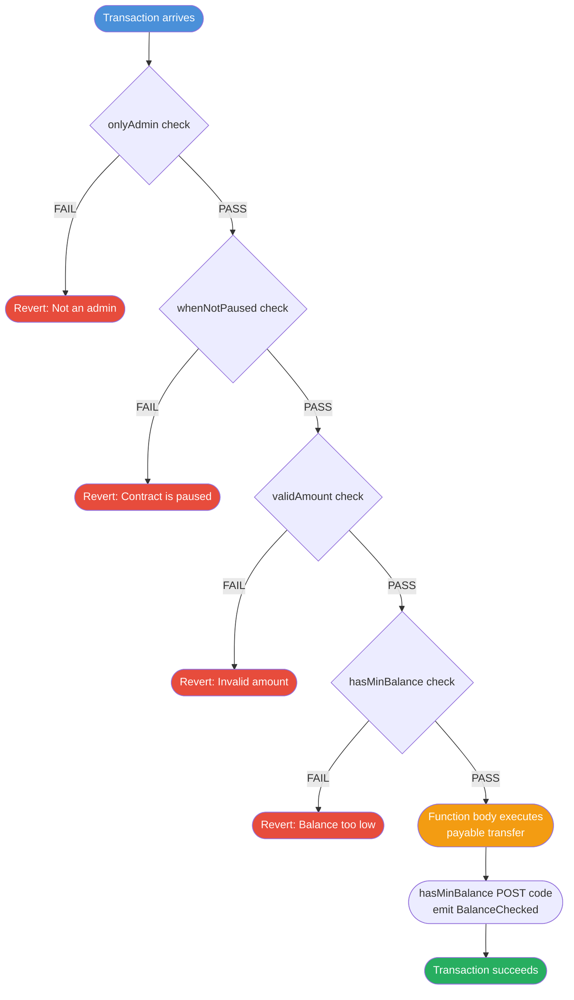

# 🛡️ Modifiers in Solidity

> **Chapter 09 — Solidity for Beginners**
> Prerequisites: Functions, State Variables, `require`, `msg.sender`

---

## 🎯 What You Will Learn

- What a modifier is and why you need one
- How to write and apply modifiers
- The mysterious `_;` underscore placeholder
- Stacking multiple modifiers on one function
- Modifiers that accept parameters
- The six most common patterns every Solidity developer uses
- How OpenZeppelin saves you from writing this yourself
- Why modifier position (`_;` before vs after) changes execution order
- How modifiers differ from regular functions under the hood

---

## 🚪 What Is a Modifier? (The Bouncer Analogy)

Imagine a nightclub. Before you walk in, the bouncer checks three things: Are you on the guest list? Are you sober? Are you wearing shoes? Only if you pass all three checks do you get through the door.

A **modifier** in Solidity is exactly that bouncer. It is a reusable piece of code that runs **before** (or after, or both) a function body. Instead of copy-pasting the same `require` checks into every single function, you write the check once as a modifier and attach it to whichever functions need it.

Without modifiers, your code looks like this:

```solidity
function pause() public {
    require(msg.sender == owner, "Not the owner"); // repeated everywhere
    paused = true;
}

function addAdmin(address admin) public {
    require(msg.sender == owner, "Not the owner"); // repeated again
    admins[admin] = true;
}
```

With modifiers, it becomes:

```solidity
function pause() public onlyOwner {
    paused = true;
}

function addAdmin(address admin) public onlyOwner {
    admins[admin] = true;
}
```

Clean, readable, and the check lives in one place.

---

## ✍️ Modifier Syntax

```solidity
modifier modifierName() {
    // Code that runs BEFORE the function body
    require(someCondition, "Error message");
    _;  // <-- This is where the function body gets inserted
    // Code here runs AFTER the function body
}
```

To apply it, list the modifier name in the function signature:

```solidity
function doSomething() public modifierName {
    // This is the function body
}
```

---

## 🔢 The Underscore `_;` — Placeholder for the Function Body

The `_;` (underscore-semicolon) is the most important — and most confusing — part of a modifier. It is a **placeholder** that tells Solidity: *"Insert the function body here."*

Think of it like a template:

```
[modifier pre-code]
[function body goes here where _; sits]
[modifier post-code]
```

When Solidity compiles your contract, it takes the function body and literally pastes it where `_;` appears. That is why modifiers are said to **inline** code rather than call it (more on this in the last section).

```solidity
modifier greetAndFarewell() {
    emit Greeting("Hello before function");
    _;   // function body runs here
    emit Farewell("Goodbye after function");
}
```

If `_;` is missing, the function body **never executes**. If `_;` appears twice, the function body executes twice — a footgun to avoid.

---

## 🔀 Multiple Modifiers on One Function

You can stack modifiers by listing them in order after `public`/`external`:

```solidity
function withdraw(uint256 amount)
    public
    onlyAdmin
    whenNotPaused
    validAmount(amount)
    hasMinBalance(amount)
{
    payable(msg.sender).transfer(amount);
}
```

**Execution order is left to right, then back out right to left.**

```
onlyAdmin pre-code
  whenNotPaused pre-code
    validAmount pre-code
      hasMinBalance pre-code
        [function body]
      hasMinBalance post-code
    validAmount post-code
  whenNotPaused post-code
onlyAdmin post-code
```

In practice, most modifiers only have pre-code (the `_;` is at the end), so the "back out" phase is empty. But when post-code exists — like logging — execution unwinds through the stack in reverse.

---

## 🎛️ Modifiers with Parameters

Modifiers can accept arguments just like functions:

```solidity
modifier validAmount(uint256 amount) {
    require(amount > 0, "Amount must be > 0");
    require(amount <= 1 ether, "Amount too large");
    _;
}
```

You pass arguments at the call site:

```solidity
function deposit() public payable validAmount(msg.value) {
    // msg.value has already been validated
}

function withdraw(uint256 amount) public validAmount(amount) {
    payable(msg.sender).transfer(amount);
}
```

The parameter name in the modifier (`amount`) is local to the modifier. It does not need to match the function parameter name — but it is good practice to keep them the same for readability.

---

## 🔥 The Full Demo Contract

Here is the complete example that showcases everything covered so far:

```solidity
// SPDX-License-Identifier: MIT
pragma solidity ^0.8.0;

contract ModifiersDemo {
    address public owner;
    bool public paused;
    mapping(address => bool) public admins;

    constructor() {
        owner = msg.sender;
    }

    // ── Modifiers ────────────────────────────────────────────────

    modifier onlyOwner() {
        require(msg.sender == owner, "Not the owner");
        _;
    }

    modifier whenNotPaused() {
        require(!paused, "Contract is paused");
        _;
    }

    modifier onlyAdmin() {
        require(admins[msg.sender] || msg.sender == owner, "Not an admin");
        _;
    }

    modifier validAmount(uint256 amount) {
        require(amount > 0, "Amount must be > 0");
        require(amount <= 1 ether, "Amount too large");
        _;
    }

    modifier hasMinBalance(uint256 minimum) {
        require(address(this).balance >= minimum, "Contract balance too low");
        _;
        // Post-function code: runs AFTER the function body
        emit BalanceChecked(address(this).balance);
    }

    // ── Events ───────────────────────────────────────────────────

    event BalanceChecked(uint256 balance);

    // ── Functions ────────────────────────────────────────────────

    function pause() public onlyOwner {
        paused = true;
    }

    function addAdmin(address admin) public onlyOwner {
        admins[admin] = true;
    }

    function deposit() public payable whenNotPaused validAmount(msg.value) {
        // Deposits are accepted only when not paused and amount is valid
    }

    function withdraw(uint256 amount)
        public
        onlyAdmin
        whenNotPaused
        validAmount(amount)
        hasMinBalance(amount)
    {
        payable(msg.sender).transfer(amount);
    }
}
```

---

## 🗺️ Modifier Execution Flow Diagram



---

## 🏆 Common Patterns Every Solidity Developer Uses

### 1. `onlyOwner` — The Most Common Modifier

```solidity
modifier onlyOwner() {
    require(msg.sender == owner, "Ownable: caller is not the owner");
    _;
}
```

**When to use it:** Any administrative action — changing fees, upgrading addresses, pausing the contract, withdrawing funds.

**The pattern:** Set `owner` in the constructor to `msg.sender`. Optionally provide a `transferOwnership` function (also gated by `onlyOwner`).

---

### 2. `whenNotPaused` — Pausable Contract Pattern

```solidity
modifier whenNotPaused() {
    require(!paused, "Pausable: paused");
    _;
}

modifier whenPaused() {
    require(paused, "Pausable: not paused");
    _;
}
```

**When to use it:** Any contract that needs an emergency stop — DeFi protocols, NFT sales, bridges. When something goes wrong, the owner can halt all user-facing functions instantly without deploying a new contract.

**Pair with:** `pause()` and `unpause()` functions, both guarded by `onlyOwner`.

---

### 3. `nonReentrant` — Reentrancy Guard (Critical Security!)

Reentrancy is one of the most dangerous vulnerabilities in Solidity. It occurs when an external contract calls back into yours before your first execution finishes — famously exploited in the 2016 DAO hack that lost $60 million.

```solidity
uint256 private _status;
uint256 private constant _NOT_ENTERED = 1;
uint256 private constant _ENTERED = 2;

modifier nonReentrant() {
    require(_status != _ENTERED, "ReentrancyGuard: reentrant call");
    _status = _ENTERED;
    _;
    _status = _NOT_ENTERED;  // Reset AFTER function body
}
```

Notice that `_;` is **in the middle** here. The status is set to `_ENTERED` before the function runs, and reset to `_NOT_ENTERED` only after it finishes. If an attacker's contract tries to call back in during execution, the status is still `_ENTERED` and the transaction reverts.

**When to use it:** Any function that sends ETH or calls an external contract. Apply it liberally — it is cheap in gas.

---

### 4. `onlyRole` — Role-Based Access Control

When `onlyOwner` is too blunt (one person controls everything), you want roles:

```solidity
mapping(bytes32 => mapping(address => bool)) private _roles;

modifier onlyRole(bytes32 role) {
    require(_roles[role][msg.sender], "AccessControl: missing role");
    _;
}

// Usage
bytes32 public constant MINTER_ROLE = keccak256("MINTER_ROLE");
bytes32 public constant BURNER_ROLE = keccak256("BURNER_ROLE");

function mint(address to, uint256 amount) public onlyRole(MINTER_ROLE) {
    _mint(to, amount);
}
```

**When to use it:** Multi-stakeholder systems — an exchange may have separate minter, pauser, and upgrader roles controlled by different teams.

---

### 5. `validAddress` — Input Validation

```solidity
modifier validAddress(address addr) {
    require(addr != address(0), "Zero address not allowed");
    _;
}

function setRecipient(address recipient) public validAddress(recipient) {
    feeRecipient = recipient;
}
```

**When to use it:** Anytime you store or transfer to an address provided by the caller. Sending ETH to `address(0)` burns it permanently.

---

## 📦 OpenZeppelin: Don't Reinvent the Wheel

OpenZeppelin is the standard library of the Solidity ecosystem. It ships battle-tested, audited implementations of all the patterns above.

### Ownable

```solidity
import "@openzeppelin/contracts/access/Ownable.sol";

contract MyToken is Ownable {
    constructor() Ownable(msg.sender) {}

    function adminAction() public onlyOwner {
        // onlyOwner is inherited — no need to write it yourself
    }
}
```

`Ownable` gives you `onlyOwner`, `owner()`, `transferOwnership()`, and `renounceOwnership()` for free.

### AccessControl

```solidity
import "@openzeppelin/contracts/access/AccessControl.sol";

contract MyContract is AccessControl {
    bytes32 public constant MINTER_ROLE = keccak256("MINTER_ROLE");

    constructor() {
        _grantRole(DEFAULT_ADMIN_ROLE, msg.sender);
        _grantRole(MINTER_ROLE, msg.sender);
    }

    function mint(address to) public onlyRole(MINTER_ROLE) {
        // Only addresses with MINTER_ROLE can call this
    }
}
```

### ReentrancyGuard

```solidity
import "@openzeppelin/contracts/utils/ReentrancyGuard.sol";

contract MyVault is ReentrancyGuard {
    function withdraw(uint256 amount) public nonReentrant {
        // Safe from reentrancy attacks
    }
}
```

**Rule of thumb:** Always prefer OpenZeppelin's implementations over writing your own security-critical modifiers. Their code is audited by the best security researchers in the space.

---

## ⏱️ Before vs After: `_;` Position Matters

Most modifiers place `_;` at the end, meaning all checks happen before the function body. But `_;` can appear anywhere — and its position defines when the function body runs.

```solidity
// BEFORE only (most common)
modifier checkBefore() {
    require(condition, "Failed");
    _;                            // function body runs here, at the end
}

// AFTER only (unusual but valid)
modifier logAfter() {
    _;                            // function body runs first
    emit ActionLogged(msg.sender); // then this runs
}

// BEFORE and AFTER (sandwich pattern)
modifier timed() {
    uint256 start = block.timestamp;
    _;                            // function body runs in the middle
    emit Duration(block.timestamp - start);
}
```

**The `nonReentrant` modifier uses the sandwich pattern** — it sets a lock before, runs the function, then clears the lock after. This is what makes it secure.

**When would you use post-code?**
- Emitting an event that reflects the state after the function ran
- Recording timestamps of when an action completed
- Cleanup logic (though this is rare — most cleanup goes inside the function)

---

## 🔬 Modifiers Are NOT Functions

This is a subtle but important point for understanding gas and security.

When Solidity compiles a function with modifiers, it does **not** generate a separate function call. Instead, the modifier code is **inlined** — copy-pasted directly into the compiled bytecode of the function. There is no call frame, no CALL opcode, no stack push/pop for the modifier itself.

**What this means in practice:**

| Property | Modifier | Function |
|---|---|---|
| Separate call frame | No | Yes |
| Can return a value | No | Yes |
| Inlined by compiler | Yes | No |
| Gas overhead of call | None | Small overhead |
| Can be inherited | Yes | Yes |
| Can override in child | Yes | Yes |

Because modifiers are inlined, the `_;` placeholder literally means "paste the function body here." This is why you cannot have `_;` in a regular function — it is modifier-only syntax.

**Practical implication:** If you have the same 5-line check in 10 functions via a modifier, the compiler generates 10 copies of those 5 lines in the bytecode. Code size grows, but there is no runtime call overhead. For very large modifiers used in many functions, this can increase deploy cost slightly.

---

## 💡 Key Takeaways

- A **modifier** is a reusable code block that wraps a function — like a bouncer checking conditions before (or after) entry.
- The **`_;`** placeholder is where the function body gets inlined. Its position controls execution order.
- Modifiers execute **left to right** when stacked; post-code unwinds right to left.
- Modifiers can **accept parameters** just like functions.
- The six patterns to know: `onlyOwner`, `whenNotPaused`, `nonReentrant`, `onlyRole`, `validAddress`, and sandwich (before + after).
- **Always use OpenZeppelin** for `Ownable`, `AccessControl`, and `ReentrancyGuard` in production — never roll your own security-critical code.
- Modifiers are **inlined by the compiler**, not called — no separate call frame.
- **`nonReentrant` is not optional** on any function that sends ETH or calls external contracts.

---

## 📝 Quiz

Test yourself before moving on.

**Question 1**

Given this modifier:

```solidity
modifier sandwich() {
    emit Before();
    _;
    emit After();
}
```

And this function:

```solidity
function doWork() public sandwich {
    emit Work();
}
```

In what order are the events emitted when `doWork()` is called?

- A) Work, Before, After
- B) Before, After, Work
- C) Before, Work, After
- D) After, Work, Before

<details>
<summary>Answer</summary>

**C) Before, Work, After**

The modifier runs `emit Before()`, then hits `_;` which inserts the function body (`emit Work()`), then continues to `emit After()`.

</details>

---

**Question 2**

What happens if you remove the `_;` from a modifier entirely?

```solidity
modifier broken() {
    require(msg.sender == owner, "Not owner");
    // No _; here
}

function doSomething() public broken {
    importantState = 42; // Does this execute?
}
```

- A) The function body still executes normally
- B) The function body never executes — `importantState` is never set
- C) Solidity throws a compile error
- D) The modifier is ignored

<details>
<summary>Answer</summary>

**C) Solidity throws a compile error**

Solidity requires that every modifier contains exactly one `_;`. A modifier without `_;` will not compile. This is a safety mechanism — Solidity prevents you from accidentally writing a modifier that silently swallows the function body.

</details>

---

**Question 3**

You are writing a `withdraw` function that sends ETH to the caller. Which modifiers should you apply, and in what order, to make it safe?

```solidity
function withdraw(uint256 amount) public /* ??? */ {
    payable(msg.sender).transfer(amount);
}
```

- A) `onlyOwner nonReentrant validAmount(amount)`
- B) `nonReentrant onlyOwner validAmount(amount)`
- C) `validAmount(amount) onlyOwner`
- D) `onlyOwner` alone is sufficient

<details>
<summary>Answer</summary>

**A or B — both are correct**, though A is the more conventional order.

The critical requirement is that **`nonReentrant` must be present** on any function that sends ETH. Without it, an attacker whose contract implements a `receive()` fallback can recursively drain the contract.

`onlyOwner` restricts who can call it. `validAmount` ensures the request is sane. Order between these two matters for gas (fail early on the cheapest check), but both orderings are secure. What is **never** acceptable is D — `onlyOwner` alone does nothing to prevent a malicious owner from being exploited via reentrancy if the owner's key is compromised or if the owner is itself a contract.

</details>

---

*Next Chapter: Events and Logging — How smart contracts communicate with the outside world.*
