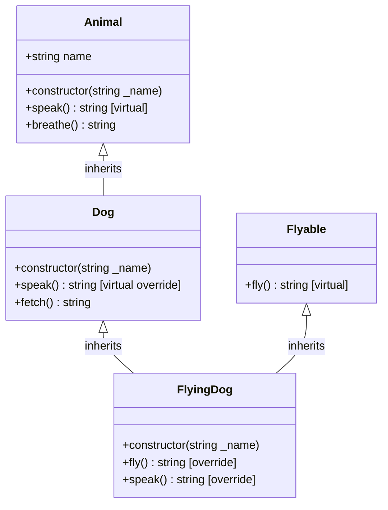
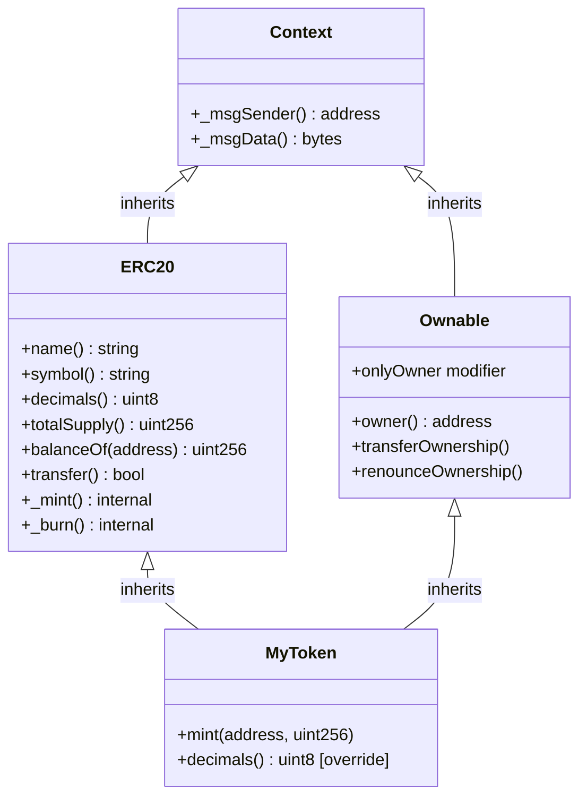

# 🧬 Chapter 10: Inheritance in Solidity

> **Level:** Beginner-to-Intermediate | **Solidity Version:** 0.8+  
> **Prerequisites:** Contracts, Functions, Visibility Modifiers, Constructors

---

## 🧠 What Is Inheritance?

Think of inheritance in real life. A child inherits traits from their parents — eye colour, height tendencies, maybe a love of music. The child doesn't need to "rebuild" those traits from scratch; they already come built-in.

Inheritance in Solidity works the same way. You write a **parent contract** (also called a *base contract*) with functions, state variables, and logic. Then a **child contract** (also called a *derived contract*) can **reuse everything** from that parent without copy-pasting code.

This is a cornerstone of:
- **Code reuse** — write once, use everywhere
- **Modularity** — break complex systems into small focused contracts
- **OpenZeppelin** — the most popular Solidity library uses deep inheritance to give you battle-tested building blocks

```
Parent Contract  →  Child Contract inherits it  →  Grandchild Contract inherits Child
```

---

## 🌱 1. Single Inheritance

The simplest form. One child, one parent.

```solidity
// SPDX-License-Identifier: MIT
pragma solidity ^0.8.0;

// Parent contract
contract Animal {
    string public name;

    constructor(string memory _name) {
        name = _name;
    }

    function breathe() public pure returns (string memory) {
        return "Breathing air";
    }

    function speak() public virtual returns (string memory) {
        return "...";
    }
}

// Child contract — inherits everything from Animal
contract Dog is Animal {
    constructor(string memory _name) Animal(_name) {}

    function speak() public virtual override returns (string memory) {
        return "Woof!";
    }

    function fetch() public pure returns (string memory) {
        return "Fetching ball!";
    }
}
```

The `Dog` contract automatically gets:
- The `name` state variable
- The `breathe()` function
- Its own version of `speak()` (overridden)
- A new function `fetch()` that `Animal` doesn't have

**Key syntax:** `contract Child is Parent { ... }`

---

## 🌳 2. Multiple Inheritance

A child contract can inherit from **more than one parent**. This is useful when you want to combine capabilities.

```solidity
// SPDX-License-Identifier: MIT
pragma solidity ^0.8.0;

contract Flyable {
    function fly() public virtual returns (string memory) {
        return "I cannot fly";
    }
}

contract FlyingDog is Dog, Flyable {
    constructor(string memory _name) Dog(_name) {}

    function fly() public override returns (string memory) {
        return "Super dog flies!";
    }

    function speak() public override(Dog) returns (string memory) {
        return string(abi.encodePacked(super.speak(), " (from the sky)"));
    }
}
```

`FlyingDog` inherits from **both** `Dog` (which itself inherits from `Animal`) and `Flyable`.

**Key syntax:** `contract Child is Parent1, Parent2 { ... }`

> Order matters here — more on that in the Diamond Problem section.

---

## 💎 3. The Diamond Problem & C3 Linearization

### What is the Diamond Problem?

Imagine this situation:

```
       Animal
      /      \
   Dog       Flyable
      \      /
      FlyingDog
```

Both `Dog` and `Flyable` inherit from `Animal`. When `FlyingDog` calls a function defined in `Animal`, which path does it take? `Dog → Animal` or `Flyable → Animal`? This ambiguity is the **Diamond Problem**.

Languages like C++ can produce unpredictable bugs here. Solidity solves it with a deterministic algorithm.

### Solidity's Solution: C3 Linearization (MRO)

Solidity uses **C3 Linearization** (also called Method Resolution Order, MRO) to compute a single, predictable inheritance order. The rule is:

> **List parents from most base to most derived, left to right**

```solidity
// CORRECT: most base contract first
contract FlyingDog is Animal, Dog, Flyable { }
// Solidity will reject orderings that violate the linearization

// If you write:
contract FlyingDog is Dog, Flyable { }
// Solidity resolves: FlyingDog -> Flyable -> Dog -> Animal
// (right-to-left, deepest base first)
```

**Practical rule of thumb:** list parents from the most general (base) to the most specific (derived). Solidity will throw a **compile error** if your ordering is ambiguous or impossible, so you can't accidentally write broken code.

---

## 🔑 4. `virtual` and `override` Keywords

Starting in Solidity **0.8**, these keywords are **required** — not optional.

| Keyword   | Used on          | Meaning                                          |
|-----------|------------------|--------------------------------------------------|
| `virtual` | Parent function  | "I allow child contracts to override me"         |
| `override`| Child function   | "I am overriding my parent's version"            |

```solidity
contract Animal {
    // Must mark as virtual to allow overriding
    function speak() public virtual returns (string memory) {
        return "...";
    }
}

contract Dog is Animal {
    // Must mark as override to signal intent
    function speak() public override returns (string memory) {
        return "Woof!";
    }
}
```

### Overriding Multiple Parents

When your function overrides implementations from **multiple** parents, list all of them:

```solidity
contract C is A, B {
    function greet() public override(A, B) returns (string memory) {
        return "Hello from C!";
    }
}
```

Omitting any parent that defines `greet()` is a **compile error**. Solidity enforces that you acknowledge every parent you are overriding.

---

## ⬆️ 5. The `super` Keyword

`super` calls the **next function in the inheritance chain** as determined by C3 linearization. It doesn't necessarily call the *direct* parent — it calls the next one in line.

```solidity
contract FlyingDog is Dog, Flyable {
    function speak() public override(Dog) returns (string memory) {
        // super.speak() calls Dog.speak() → returns "Woof!"
        return string(abi.encodePacked(super.speak(), " (from the sky)"));
        // Result: "Woof! (from the sky)"
    }
}
```

Think of `super` as saying: "Call the same function, but from my parent's perspective."

You can also call a **specific parent** by name:

```solidity
function speak() public override(Dog) returns (string memory) {
    return Dog.speak(); // calls Dog.speak() directly
}
```

---

## 🏗️ 6. Constructor Inheritance

When a parent contract has a constructor with parameters, the child must pass arguments to it.

### Method 1: Inline in the child's header

```solidity
contract Dog is Animal {
    constructor(string memory _name) Animal(_name) {}
    //                              ^^^^^^^^^^^^^^^
    //                    Passing _name up to Animal's constructor
}
```

### Method 2: Inline in the child's constructor body (for computed values)

```solidity
contract RobotDog is Animal {
    constructor() Animal("RoboDog-9000") {}
    // Hardcoded name passed to parent
}
```

### Multiple Parent Constructors

```solidity
contract FlyingDog is Dog, Flyable {
    // Flyable has no constructor arguments, so only Dog needs feeding
    constructor(string memory _name) Dog(_name) {}
}
```

> Rule: Every parent constructor that requires arguments **must** be supplied, either in the derived contract's header or body.

---

## 👁️ 7. Visibility and Inheritance

Not all members of a parent contract are accessible in child contracts. Visibility determines what gets inherited.

| Visibility  | Accessible Inside Child? | Accessible Outside? | Notes                            |
|-------------|--------------------------|---------------------|----------------------------------|
| `public`    | Yes                      | Yes                 | Fully open                       |
| `internal`  | Yes                      | No                  | Like "protected" in other langs  |
| `external`  | No (directly)            | Yes                 | Only callable from outside       |
| `private`   | **No**                   | No                  | Stays strictly in defining contract |

```solidity
contract Parent {
    uint256 public publicVar = 1;       // child can read and use
    uint256 internal internalVar = 2;   // child can read and use
    uint256 private privateVar = 3;     // child CANNOT access this

    function publicFunc() public virtual returns (uint256) { return publicVar; }
    function internalFunc() internal virtual returns (uint256) { return internalVar; }
    function privateFunc() private returns (uint256) { return privateVar; }
}

contract Child is Parent {
    function readVars() public view returns (uint256, uint256) {
        return (publicVar, internalVar); // both accessible
        // privateVar would cause a compile error
    }

    function callInternal() public returns (uint256) {
        return internalFunc(); // accessible
        // privateFunc() would cause a compile error
    }
}
```

> Key insight: `private` is the **only** visibility level that is NOT inherited. Use `internal` when you want something hidden from the outside world but still accessible to child contracts.

---

## 🧪 8. Calling Parent Functions Explicitly

Beyond `super`, you can call a specific parent's function using its contract name:

```solidity
contract FlyingDog is Dog, Flyable {
    function whichSpeak() public returns (string memory) {
        // Call Animal's speak directly
        return Animal.speak();   // returns "..."

        // Call Dog's speak directly
        // return Dog.speak();   // returns "Woof!"
    }
}
```

This is useful when:
- You need a specific ancestor's implementation (not the next in chain)
- You want to compose outputs from multiple parents explicitly

---

## 🗺️ Inheritance Hierarchy Diagram



---

## 🏦 9. Real-World Example: ERC-20 Token with OpenZeppelin

OpenZeppelin is a library of secure, audited Solidity contracts. Instead of writing token logic from scratch, you inherit from their `ERC20` contract.

```solidity
// SPDX-License-Identifier: MIT
pragma solidity ^0.8.20;

// Import OpenZeppelin's ERC20 implementation
import "@openzeppelin/contracts/token/ERC20/ERC20.sol";
import "@openzeppelin/contracts/access/Ownable.sol";

/**
 * @title MyToken
 * @dev A simple ERC-20 token inheriting OpenZeppelin's ERC20 + Ownable
 *
 * Inheritance chain:
 *   MyToken → ERC20, Ownable → Context
 */
contract MyToken is ERC20, Ownable {

    // Constructor feeds required args to both parent constructors
    constructor(
        string memory tokenName,
        string memory tokenSymbol,
        uint256 initialSupply
    )
        ERC20(tokenName, tokenSymbol)    // feeds ERC20's constructor
        Ownable(msg.sender)              // feeds Ownable's constructor
    {
        // _mint is an internal function from ERC20 — accessible because internal
        _mint(msg.sender, initialSupply * 10 ** decimals());
    }

    /**
     * @dev Only the owner (from Ownable) can mint new tokens
     *      onlyOwner is a modifier inherited from Ownable
     */
    function mint(address to, uint256 amount) public onlyOwner {
        _mint(to, amount);
    }

    /**
     * @dev Override decimals() from ERC20 to set 6 decimal places instead of 18
     */
    function decimals() public pure override returns (uint8) {
        return 6;
    }
}
```

### What `MyToken` gets for free from OpenZeppelin:

| From `ERC20`             | From `Ownable`          |
|--------------------------|-------------------------|
| `transfer()`             | `owner()` view          |
| `approve()`              | `onlyOwner` modifier    |
| `transferFrom()`         | `transferOwnership()`   |
| `balanceOf()`            | `renounceOwnership()`   |
| `totalSupply()`          |                         |
| `allowance()`            |                         |
| `name()`, `symbol()`     |                         |

You wrote ~25 lines of meaningful business logic. OpenZeppelin wrote the other ~400 lines of battle-tested code. Inheritance made this possible.

### OpenZeppelin's Internal Hierarchy



---

## 📋 Full Combined Example (from the Chapter)

```solidity
// SPDX-License-Identifier: MIT
pragma solidity ^0.8.0;

// ── Base contract ───────────────────────────────────────────────────────────
contract Animal {
    string public name;

    constructor(string memory _name) {
        name = _name;
    }

    function speak() public virtual returns (string memory) {
        return "...";
    }

    function breathe() public pure returns (string memory) {
        return "Breathing air";
    }
}

// ── Intermediate contract ────────────────────────────────────────────────────
contract Dog is Animal {
    constructor(string memory _name) Animal(_name) {}

    function speak() public virtual override returns (string memory) {
        return "Woof!";
    }

    function fetch() public pure returns (string memory) {
        return "Fetching ball!";
    }
}

// ── Mixin contract ───────────────────────────────────────────────────────────
contract Flyable {
    function fly() public virtual returns (string memory) {
        return "I cannot fly";
    }
}

// ── Diamond inheritance ──────────────────────────────────────────────────────
contract FlyingDog is Dog, Flyable {
    constructor(string memory _name) Dog(_name) {}

    // Override Flyable.fly()
    function fly() public override returns (string memory) {
        return "Super dog flies!";
    }

    // Override Dog.speak() and uses super to compose behavior
    function speak() public override(Dog) returns (string memory) {
        // super.speak() → Dog.speak() → "Woof!"
        return string(abi.encodePacked(super.speak(), " (from the sky)"));
    }
}
```

Deploying `FlyingDog("Rex")` and calling:
- `speak()` → `"Woof! (from the sky)"`
- `fly()` → `"Super dog flies!"`
- `fetch()` → `"Fetching ball!"` (inherited from Dog)
- `breathe()` → `"Breathing air"` (inherited from Animal via Dog)
- `name()` → `"Rex"` (state variable from Animal)

---

## ✅ Key Takeaways

- **`is` keyword** declares inheritance: `contract Child is Parent`
- **Multiple inheritance** is allowed: `contract Child is A, B`
- **C3 linearization** gives Solidity a deterministic, compile-time-enforced resolution order — no ambiguity at runtime
- **`virtual`** must be added to any function a parent wants to allow overriding
- **`override`** must be added to any function a child is overriding — Solidity enforces this explicitly
- **`super`** calls the next function in the MRO chain; `Parent.func()` calls a specific ancestor
- **Constructor chaining** feeds parent constructors using `ParentName(args)` in the child's constructor header
- **`private`** state variables and functions are NOT inherited — use `internal` for "protected" access
- **OpenZeppelin** is built entirely on inheritance — understanding it unlocks the entire ecosystem

---

## 📝 Quiz

Test your understanding. Answers are below.

**Question 1**

```solidity
contract A {
    function greet() public returns (string memory) {
        return "Hello from A";
    }
}

contract B is A {
    function greet() public returns (string memory) {
        return "Hello from B";
    }
}
```

Will this compile? If not, what is missing?

---

**Question 2**

```solidity
contract Base {
    uint256 private secret = 42;
    uint256 internal hint = 7;
}

contract Derived is Base {
    function getHint() public view returns (uint256) {
        return hint;
    }

    function getSecret() public view returns (uint256) {
        return secret; // line X
    }
}
```

Which line will cause a compile error and why?

---

**Question 3**

Given this inheritance setup:

```solidity
contract X {
    function hello() public virtual returns (string memory) { return "X"; }
}
contract Y is X {
    function hello() public virtual override returns (string memory) { return "Y"; }
}
contract Z is Y {
    function hello() public override returns (string memory) {
        return super.hello();
    }
}
```

What does `Z.hello()` return?

---

### Answers

**Answer 1:** No, it will NOT compile. `A.greet()` is missing the `virtual` keyword. In Solidity 0.8+, any function that a child intends to override must be explicitly marked `virtual` in the parent. Fix: `function greet() public virtual returns (string memory)`.

**Answer 2:** Line `return secret;` in `getSecret()` will cause a compile error. `secret` is marked `private` in `Base`, which means it is **not accessible** in derived contracts. `hint` is `internal`, so `getHint()` compiles fine. Fix: change `private` to `internal` if child access is needed.

**Answer 3:** `Z.hello()` returns `"Y"`. `super.hello()` in `Z` follows the C3 MRO chain, which resolves to `Y` as the next in line. `Y.hello()` returns `"Y"`. If `Z` wanted `"X"`, it would call `X.hello()` directly.

---

*Next Chapter: Abstract Contracts and Interfaces →*
