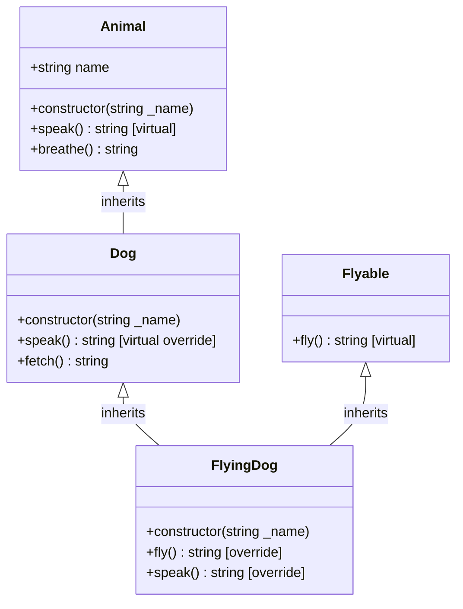
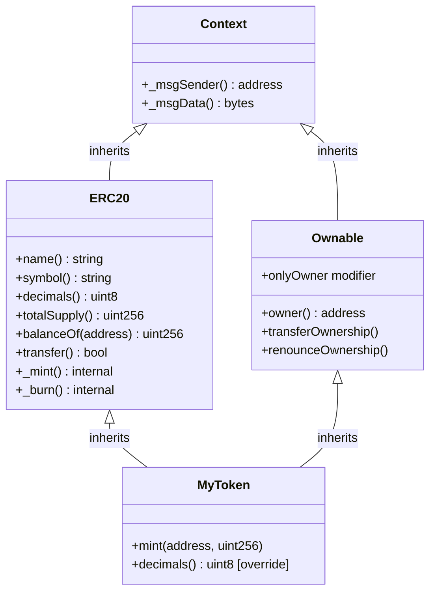

# 🧬 Chapter 10: Inheritance in Solidity

> **Level:** Beginner-to-Intermediate | **Solidity Version:** 0.8+  
> **Prerequisites:** Contracts, Functions, Visibility Modifiers, Constructors

---

## 🧠 Inheritance Hai Kya Cheez?

Zara real life socho. Bacche ko apne parents se traits milte hain — aankhon ka colour, height, shaayad music ka shauk bhi. Bacche ko yeh sab cheezein scratch se banani nahi padtin, woh already built-in aati hain.

Solidity mein inheritance bilkul isi tarah kaam karta hai. Tum ek **parent contract** (jise *base contract* bhi kehte hain) likhte ho jisme functions, state variables, aur logic hota hai. Fir ek **child contract** (jise *derived contract* kehte hain) us parent se **sab kuch reuse** kar sakta hai — bina code copy-paste kiye.

Yeh teen cheezon ka foundation hai:
- **Code reuse** — ek baar likho, sab jagah use karo
- **Modularity** — bade complex systems ko chhote focused contracts mein todna
- **OpenZeppelin** — sabse popular Solidity library deep inheritance use karti hai taaki tumhe battle-tested building blocks mil sakein

```
Parent Contract  →  Child Contract inherits it  →  Grandchild Contract inherits Child
```

---

## 🌱 1. Single Inheritance

Sabse simple form. Ek child, ek parent — bilkul Zomato pe ek restaurant ka ek hi parent chain hone jaisa.

```solidity
// SPDX-License-Identifier: MIT
pragma solidity ^0.8.0;

// Parent contract
contract Animal {
    string public name;

    constructor(string memory _name) {
        name = _name;
    }

    function breathe() public pure returns (string memory) {
        return "Breathing air";
    }

    function speak() public virtual returns (string memory) {
        return "...";
    }
}

// Child contract — inherits everything from Animal
contract Dog is Animal {
    constructor(string memory _name) Animal(_name) {}

    function speak() public virtual override returns (string memory) {
        return "Woof!";
    }

    function fetch() public pure returns (string memory) {
        return "Fetching ball!";
    }
}
```

`Dog` contract ko automatically mil jaata hai:
- `name` state variable
- `breathe()` function
- `speak()` ka apna version (overridden)
- `fetch()` naya function jo `Animal` ke paas nahi hai

**Key syntax:** `contract Child is Parent { ... }`

---

## 🌳 2. Multiple Inheritance

Ek child contract **ek se zyada parents** se bhi inherit kar sakta hai. Yeh tab kaam aata hai jab tumhe multiple capabilities combine karni ho — jaise ek app mein Ola ki ride-booking aur UPI ka payment dono features combine karna.

```solidity
// SPDX-License-Identifier: MIT
pragma solidity ^0.8.0;

contract Flyable {
    function fly() public virtual returns (string memory) {
        return "I cannot fly";
    }
}

contract FlyingDog is Dog, Flyable {
    constructor(string memory _name) Dog(_name) {}

    function fly() public override returns (string memory) {
        return "Super dog flies!";
    }

    function speak() public override(Dog) returns (string memory) {
        return string(abi.encodePacked(super.speak(), " (from the sky)"));
    }
}
```

`FlyingDog` **dono** se inherit karta hai — `Dog` se (jo khud `Animal` se inherit karta hai) aur `Flyable` se.

**Key syntax:** `contract Child is Parent1, Parent2 { ... }`

> Order yahan matter karta hai — Diamond Problem section mein iske baare mein aage baat karenge.

---

## 💎 3. The Diamond Problem & C3 Linearization

### Diamond Problem Hai Kya?

Yeh situation socho:

```
       Animal
      /      \
   Dog       Flyable
      \      /
      FlyingDog
```

`Dog` aur `Flyable` dono `Animal` se inherit karte hain. Jab `FlyingDog`, `Animal` mein defined koi function call karta hai, toh woh kaunsa path follow kare? `Dog → Animal` ya `Flyable → Animal`? Yehi confusion **Diamond Problem** kehlata hai.

C++ jaisi languages mein yeh unpredictable bugs de sakta hai. Solidity isko ek deterministic algorithm se solve karta hai.

### Solidity Ka Solution: C3 Linearization (MRO)

Solidity **C3 Linearization** (jise Method Resolution Order, ya MRO bhi kehte hain) use karta hai taaki ek single, predictable inheritance order compute ho sake. Rule simple hai:

> **Parents ko most base se most derived tak, left se right likho**

```solidity
// CORRECT: most base contract first
contract FlyingDog is Animal, Dog, Flyable { }
// Solidity un orderings ko reject kar dega jo linearization violate karti hain

// Agar tum likho:
contract FlyingDog is Dog, Flyable { }
// Solidity resolve karega: FlyingDog -> Flyable -> Dog -> Animal
// (right-to-left, deepest base pehle)
```

**Practical rule of thumb:** parents ko most general (base) se most specific (derived) tak list karo. Agar ordering ambiguous ya impossible hai, toh Solidity **compile error** de dega — matlab galti se bhi broken code likhne se bach jaate ho.

---

## 🔑 4. `virtual` aur `override` Keywords

Solidity **0.8** se yeh keywords **required** hain — optional nahi.

| Keyword   | Kahan Use Hota Hai | Matlab                                          |
|-----------|------------------|--------------------------------------------------|
| `virtual` | Parent function  | "Main child contracts ko mujhe override karne deta hoon"         |
| `override`| Child function   | "Main apne parent ka version override kar raha hoon"            |

```solidity
contract Animal {
    // Overriding allow karne ke liye virtual mark karna zaruri hai
    function speak() public virtual returns (string memory) {
        return "...";
    }
}

contract Dog is Animal {
    // Intent signal karne ke liye override mark karna zaruri hai
    function speak() public override returns (string memory) {
        return "Woof!";
    }
}
```

### Multiple Parents Ko Override Karna

Jab tumhara function **multiple** parents ke implementations ko override karta hai, toh sabko list karo:

```solidity
contract C is A, B {
    function greet() public override(A, B) returns (string memory) {
        return "Hello from C!";
    }
}
```

Agar `greet()` define karne wale kisi bhi parent ko chhod diya toh **compile error** aayega. Solidity yeh enforce karta hai ki tum jitne parents ko override kar rahe ho, unko explicitly acknowledge karo.

---

## ⬆️ 5. `super` Keyword

`super`, C3 linearization se decide hui **inheritance chain ka agla function** call karta hai. Zaruri nahi ki yeh *direct* parent ko call kare — yeh chain mein jo agla hai, usko call karta hai.

```solidity
contract FlyingDog is Dog, Flyable {
    function speak() public override(Dog) returns (string memory) {
        // super.speak() calls Dog.speak() → returns "Woof!"
        return string(abi.encodePacked(super.speak(), " (from the sky)"));
        // Result: "Woof! (from the sky)"
    }
}
```

`super` ko aise socho jaise tum keh rahe ho: "Same function call karo, lekin mere parent ke perspective se."

Tum kisi **specific parent** ko naam se bhi call kar sakte ho:

```solidity
function speak() public override(Dog) returns (string memory) {
    return Dog.speak(); // Dog.speak() ko directly call karta hai
}
```

---

## 🏗️ 6. Constructor Inheritance

Jab parent contract ke constructor mein parameters hote hain, toh child ko usko arguments pass karne padte hain.

### Method 1: Child ke header mein inline

```solidity
contract Dog is Animal {
    constructor(string memory _name) Animal(_name) {}
    //                              ^^^^^^^^^^^^^^^
    //                    _name ko Animal ke constructor tak pass kar rahe hain
}
```

### Method 2: Child ke constructor body mein inline (computed values ke liye)

```solidity
contract RobotDog is Animal {
    constructor() Animal("RoboDog-9000") {}
    // Hardcoded naam parent ko pass kiya
}
```

### Multiple Parent Constructors

```solidity
contract FlyingDog is Dog, Flyable {
    // Flyable ke paas constructor arguments nahi hain, isliye sirf Dog ko feed karna hai
    constructor(string memory _name) Dog(_name) {}
}
```

> Rule: Har us parent constructor ko arguments **zaruri** milne chahiye jo unko maangta hai, chahe derived contract ke header mein do ya body mein.

---

## 👁️ 7. Visibility Aur Inheritance

Parent contract ke saare members child contracts mein accessible nahi hote. Visibility decide karti hai ki kya inherit hoga.

| Visibility  | Child Ke Andar Accessible? | Bahar Se Accessible? | Notes                            |
|-------------|--------------------------|---------------------|----------------------------------|
| `public`    | Haan                      | Haan                 | Poori tarah open                       |
| `internal`  | Haan                      | Nahi                  | Doosri languages ke "protected" jaisa  |
| `external`  | Nahi (directly)            | Haan                 | Sirf bahar se hi call ho sakta hai       |
| `private`   | **Nahi**                     | Nahi                    | Sirf defining contract mein hi rehta hai |

```solidity
contract Parent {
    uint256 public publicVar = 1;       // child read aur use kar sakta hai
    uint256 internal internalVar = 2;   // child read aur use kar sakta hai
    uint256 private privateVar = 3;     // child isko access NAHI kar sakta

    function publicFunc() public virtual returns (uint256) { return publicVar; }
    function internalFunc() internal virtual returns (uint256) { return internalVar; }
    function privateFunc() private returns (uint256) { return privateVar; }
}

contract Child is Parent {
    function readVars() public view returns (uint256, uint256) {
        return (publicVar, internalVar); // dono accessible hain
        // privateVar use karne se compile error aayega
    }

    function callInternal() public returns (uint256) {
        return internalFunc(); // accessible hai
        // privateFunc() se compile error aayega
    }
}
```

> Key insight: `private` hi ek **aisi** visibility hai jo inherit NAHI hoti. Jab tumhe kuch bahar ki duniya se hide karna ho lekin child contracts ko access dena ho, toh `internal` use karo.

---

## 🧪 8. Parent Functions Ko Explicitly Call Karna

`super` ke alawa, tum kisi specific parent ka function uske contract name se bhi call kar sakte ho:

```solidity
contract FlyingDog is Dog, Flyable {
    function whichSpeak() public returns (string memory) {
        // Animal ka speak directly call karo
        return Animal.speak();   // returns "..."

        // Dog ka speak directly call karo
        // return Dog.speak();   // returns "Woof!"
    }
}
```

Yeh tab useful hai jab:
- Tumhe kisi specific ancestor ka implementation chahiye (chain ka agla wala nahi)
- Tum multiple parents ke outputs ko explicitly compose karna chahte ho

---

## 🗺️ Inheritance Hierarchy Diagram



---

## 🏦 9. Real-World Example: OpenZeppelin Ke Saath ERC-20 Token

OpenZeppelin ek secure, audited Solidity contracts ki library hai. Token logic scratch se likhne ki bajaye, tum unke `ERC20` contract se inherit karte ho — bilkul jaise koi naya fintech app apna khud ka payment gateway na banakar Razorpay ka SDK use kar le.

```solidity
// SPDX-License-Identifier: MIT
pragma solidity ^0.8.20;

// OpenZeppelin ka ERC20 implementation import karo
import "@openzeppelin/contracts/token/ERC20/ERC20.sol";
import "@openzeppelin/contracts/access/Ownable.sol";

/**
 * @title MyToken
 * @dev OpenZeppelin ke ERC20 + Ownable se inherit karta ek simple ERC-20 token
 *
 * Inheritance chain:
 *   MyToken → ERC20, Ownable → Context
 */
contract MyToken is ERC20, Ownable {

    // Constructor dono parent constructors ko required args feed karta hai
    constructor(
        string memory tokenName,
        string memory tokenSymbol,
        uint256 initialSupply
    )
        ERC20(tokenName, tokenSymbol)    // ERC20 ke constructor ko feed karta hai
        Ownable(msg.sender)              // Ownable ke constructor ko feed karta hai
    {
        // _mint ERC20 ka internal function hai — internal hone ki wajah se accessible hai
        _mint(msg.sender, initialSupply * 10 ** decimals());
    }

    /**
     * @dev Sirf owner (Ownable se) naye tokens mint kar sakta hai
     *      onlyOwner modifier Ownable se inherit hua hai
     */
    function mint(address to, uint256 amount) public onlyOwner {
        _mint(to, amount);
    }

    /**
     * @dev ERC20 ke decimals() ko override karke 18 ki jagah 6 decimal places set karo
     */
    function decimals() public pure override returns (uint8) {
        return 6;
    }
}
```

### `MyToken` ko OpenZeppelin se muft mein kya milta hai:

| `ERC20` Se             | `Ownable` Se          |
|--------------------------|-------------------------|
| `transfer()`             | `owner()` view          |
| `approve()`              | `onlyOwner` modifier    |
| `transferFrom()`         | `transferOwnership()`   |
| `balanceOf()`            | `renounceOwnership()`   |
| `totalSupply()`          |                         |
| `allowance()`            |                         |
| `name()`, `symbol()`     |                         |

Tumne sirf ~25 lines ka meaningful business logic likha. OpenZeppelin ne baaki ~400 lines ka battle-tested code likh diya. Yeh sab inheritance ki wajah se mumkin hua.

### OpenZeppelin Ki Internal Hierarchy



---

## 📋 Full Combined Example (Iss Chapter Se)

```solidity
// SPDX-License-Identifier: MIT
pragma solidity ^0.8.0;

// ── Base contract ───────────────────────────────────────────────────────────
contract Animal {
    string public name;

    constructor(string memory _name) {
        name = _name;
    }

    function speak() public virtual returns (string memory) {
        return "...";
    }

    function breathe() public pure returns (string memory) {
        return "Breathing air";
    }
}

// ── Intermediate contract ────────────────────────────────────────────────────
contract Dog is Animal {
    constructor(string memory _name) Animal(_name) {}

    function speak() public virtual override returns (string memory) {
        return "Woof!";
    }

    function fetch() public pure returns (string memory) {
        return "Fetching ball!";
    }
}

// ── Mixin contract ───────────────────────────────────────────────────────────
contract Flyable {
    function fly() public virtual returns (string memory) {
        return "I cannot fly";
    }
}

// ── Diamond inheritance ──────────────────────────────────────────────────────
contract FlyingDog is Dog, Flyable {
    constructor(string memory _name) Dog(_name) {}

    // Flyable.fly() ko override karo
    function fly() public override returns (string memory) {
        return "Super dog flies!";
    }

    // Dog.speak() ko override karo aur super se behavior compose karo
    function speak() public override(Dog) returns (string memory) {
        // super.speak() → Dog.speak() → "Woof!"
        return string(abi.encodePacked(super.speak(), " (from the sky)"));
    }
}
```

`FlyingDog("Rex")` deploy karke yeh call karne par:
- `speak()` → `"Woof! (from the sky)"`
- `fly()` → `"Super dog flies!"`
- `fetch()` → `"Fetching ball!"` (Dog se inherited)
- `breathe()` → `"Breathing air"` (Dog ke through Animal se inherited)
- `name()` → `"Rex"` (Animal ka state variable)

---

## ✅ Key Takeaways

- **`is` keyword** inheritance declare karta hai: `contract Child is Parent`
- **Multiple inheritance** allowed hai: `contract Child is A, B`
- **C3 linearization** Solidity ko ek deterministic, compile-time-enforced resolution order deta hai — runtime pe koi ambiguity nahi
- **`virtual`** har us function pe lagana zaruri hai jise parent override karne dena chahta hai
- **`override`** har us function pe lagana zaruri hai jise child override kar raha hai — Solidity yeh explicitly enforce karta hai
- **`super`** MRO chain ka agla function call karta hai; `Parent.func()` ek specific ancestor ko call karta hai
- **Constructor chaining** child ke constructor header mein `ParentName(args)` use karke parent constructors ko feed karta hai
- **`private`** state variables aur functions inherit NAHI hote — "protected" jaisi access ke liye `internal` use karo
- **OpenZeppelin** poori tarah inheritance pe bana hai — isko samajhna poore ecosystem ko unlock kar deta hai

---

## 📝 Quiz

Apni samajh test karo. Answers neeche diye hain.

**Question 1**

```solidity
contract A {
    function greet() public returns (string memory) {
        return "Hello from A";
    }
}

contract B is A {
    function greet() public returns (string memory) {
        return "Hello from B";
    }
}
```

Kya yeh compile hoga? Agar nahi, toh kya missing hai?

---

**Question 2**

```solidity
contract Base {
    uint256 private secret = 42;
    uint256 internal hint = 7;
}

contract Derived is Base {
    function getHint() public view returns (uint256) {
        return hint;
    }

    function getSecret() public view returns (uint256) {
        return secret; // line X
    }
}
```

Kaunsi line compile error dega aur kyun?

---

**Question 3**

Yeh inheritance setup dekho:

```solidity
contract X {
    function hello() public virtual returns (string memory) { return "X"; }
}
contract Y is X {
    function hello() public virtual override returns (string memory) { return "Y"; }
}
contract Z is Y {
    function hello() public override returns (string memory) {
        return super.hello();
    }
}
```

`Z.hello()` kya return karega?

---

### Answers

**Answer 1:** Nahi, yeh compile NAHI hoga. `A.greet()` mein `virtual` keyword missing hai. Solidity 0.8+ mein, jo bhi function child override karna chahta hai, use parent mein explicitly `virtual` mark karna hoga. Fix: `function greet() public virtual returns (string memory)`.

**Answer 2:** `getSecret()` mein `return secret;` waali line compile error degi. `secret`, `Base` mein `private` mark hai, matlab yeh derived contracts mein **accessible nahi** hai. `hint` `internal` hai, isliye `getHint()` bina kisi problem ke compile ho jaata hai. Fix: agar child access chahiye toh `private` ko `internal` mein badal do.

**Answer 3:** `Z.hello()` `"Y"` return karega. `Z` mein `super.hello()`, C3 MRO chain follow karta hai, jo agla resolve karta hai `Y` pe. `Y.hello()` `"Y"` return karta hai. Agar `Z` ko `"X"` chahiye hota, toh usse `X.hello()` directly call karna padta.

---

*Next Chapter: Abstract Contracts and Interfaces →*
