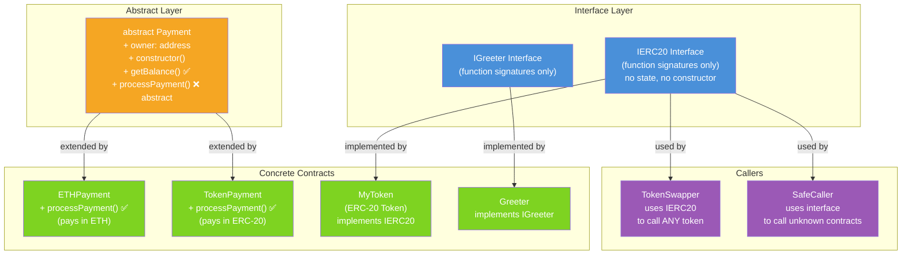

# 🔌 Chapter 11: Interfaces and Abstract Contracts in Solidity

> **Level:** Beginner-Friendly | **Prerequisites:** Chapter 10 (Inheritance)

---

## 📋 Table of Contents

1. [What Is an Interface?](#1-what-is-an-interface)
2. [The TV Remote Analogy](#2-the-tv-remote-analogy)
3. [Rules for Interfaces](#3-rules-for-interfaces)
4. [Implementing an Interface](#4-implementing-an-interface)
5. [Using Interfaces to Talk to Other Contracts](#5-using-interfaces-to-talk-to-other-contracts)
6. [The IERC20 Interface — The Real Deal](#6-the-ierc20-interface--the-real-deal)
7. [Calling External Contracts via Interface (DeFi Power Move)](#7-calling-external-contracts-via-interface-defi-power-move)
8. [Interface Checks: ERC-165 and supportsInterface](#8-interface-checks-erc-165-and-supportsinterface)
9. [Abstract Contracts](#9-abstract-contracts)
10. [Abstract vs Interface — When to Use What](#10-abstract-vs-interface--when-to-use-what)
11. [Architecture Diagram](#11-architecture-diagram)
12. [Key Takeaways](#12-key-takeaways)
13. [Quiz](#13-quiz)

---

## 1. What Is an Interface?

Kya hota hai ek interface? Socho ek second ke liye — Zomato ka app khola, menu dekha. Menu mein likha hai "Butter Chicken - ₹350", "Paneer Tikka - ₹280". Tumhe pata hai kya order kar sakte ho, kya ingredients hain. Lekin kitchen mein actual mein kaise banta hai, kaunsa chef banata hai, kya recipe hai — woh tumhe pata nahi aur na hi tumhe fikar hai.

**Interface** bilkul yehi karta hai Solidity mein — ye ek **blueprint** hai jo batata hai ki contract mein *kaunse* functions hone chahiye, lekin *kaise* kaam karte hain woh kuch nahi batata.

```solidity
// SPDX-License-Identifier: MIT
pragma solidity ^0.8.0;

// This is an interface — pure declarations, zero implementation
interface IGreeter {
    function greet(string calldata name) external pure returns (string memory);
    function setMessage(string calldata message) external;
}
```

Dekho kya missing hai — koi function body nahi, koi curly braces mein logic nahi. Bas clean signatures, jaise menu card mein sirf dish ka naam aur price hota hai.

---

## 2. The TV Remote Analogy

Ek TV remote uthao haath mein. Usme buttons dikhenge — **Power**, **Volume Up**, **Volume Down**, **Channel Up**, **Channel Down**.

Tumhe exactly pata hai har button kya karega. Volume Up dabaoge to volume badhega. Tumhe ye jaanne ki zaroorat nahi ki remote ke andar circuit board kaisa hai, infrared LED ki frequency kya hai, ya TV ka firmware kaisa likha hai. Bas buttons use karo.

Interface bhi exactly aise hi kaam karta hai:

| TV Remote Concept | Solidity Equivalent |
|---|---|
| Remote pe buttons | Interface mein function signatures |
| Button dabane pe kya hota hai (behavior) | Contract mein actual implementation |
| Remote ke andar electronics | Contract ka internal logic (tumse hidden) |
| Tum button press karte ho | Tumhara contract interface ko call karta hai |

Jab tumhare contract ke paas kisi interface ka reference hota hai, woh un functions ko call kar sakta hai **bina ye jaane ki target contract ke andar code kaisa likha hai**. Ye tab kaam aata hai jab tumhe kisi doosri team ke deploy kiye hue contract se baat karni ho — jaise Uniswap, Aave, ya koi bhi ERC-20 token. Bilkul UPI jaisa — tumhe PhonePe ke internal code se matlab nahi, bas UPI protocol follow hota hai to payment ho jaata hai, chahe woh GPay ho ya Paytm.

---

## 3. Rules for Interfaces

Interfaces ke kuch strict rules hote hain Solidity mein. Inme se koi bhi rule tod diya to compiler bol dega "nahi chalega bhai".

### Interface mein ye NAHI ho sakta:
- State variables (`uint256 public count;` jaisa kuch andar nahi likh sakte)
- Constructor (`constructor()` block allowed nahi hai)
- Function implementation (curly-brace mein body allowed nahi)
- `external` ke alawa koi bhi visibility

### Interface mein ye ho sakta hai:
- Function declarations (sirf signatures)
- Events
- Errors (custom errors)
- Enums
- Structs

```solidity
// SPDX-License-Identifier: MIT
pragma solidity ^0.8.0;

interface IVault {
    // Events are allowed
    event Deposited(address indexed user, uint256 amount);
    event Withdrawn(address indexed user, uint256 amount);

    // Custom errors are allowed
    error InsufficientFunds(uint256 requested, uint256 available);

    // All functions must be external
    function deposit(uint256 amount) external;
    function withdraw(uint256 amount) external;
    function balanceOf(address user) external view returns (uint256);

    // NO state variables allowed — this would cause a compile error:
    // uint256 public totalDeposits;  ❌

    // NO constructors allowed — this would cause a compile error:
    // constructor() {}  ❌
}
```

> [!tip]
> Simple trick yaad rakhne ke liye: agar tum kuch is tarah bol sakte ho — "is contract mein X karne ki capability honi chahiye" — to woh interface mein jaayega. Agar tumhe data store karna hai ya logic share karna hai, to tumhe abstract contract ya base contract chahiye.

---

## 4. Implementing an Interface

Interface ko implement karne ke liye contract `is` keyword use karta hai — bilkul wahi syntax jo inheritance mein use hota hai, kyunki interface implement karna bhi ek tarah ki inheritance hi hai.

```solidity
// SPDX-License-Identifier: MIT
pragma solidity ^0.8.0;

interface IAnimal {
    function speak() external pure returns (string memory);
    function move() external pure returns (string memory);
}

// Dog MUST implement ALL functions declared in IAnimal
contract Dog is IAnimal {
    function speak() external pure override returns (string memory) {
        return "Woof!";
    }

    function move() external pure override returns (string memory) {
        return "I run on four legs.";
    }
}

contract Bird is IAnimal {
    function speak() external pure override returns (string memory) {
        return "Tweet!";
    }

    function move() external pure override returns (string memory) {
        return "I fly with wings.";
    }
}
```

Agar `Dog` `speak()` implement karna bhool jaata, to compiler seedha error de deta:

```
TypeError: Contract "Dog" should be marked as abstract.
```

Ye compile-time safety net interfaces ka sabse bada fayda hai — TypeScript wale `implements` keyword se jo safety milti hai, wahi feeling.

---

## 5. Using Interfaces to Talk to Other Contracts

Ab asli maza yahan hai. Tumhara contract **kisi bhi deployed contract** se baat kar sakta hai jo interface se match karta ho — chahe woh contract tumne likha hi na ho, chahe saalon pehle kisi unknown developer ne deploy kiya ho.

```solidity
// SPDX-License-Identifier: MIT
pragma solidity ^0.8.0;

// Define what we expect the external contract to look like
interface ICounter {
    function increment() external;
    function getCount() external view returns (uint256);
}

contract CounterCaller {
    // Call ANY contract at a given address, as long as it matches ICounter
    function callIncrement(address counterAddress) external {
        ICounter counter = ICounter(counterAddress);
        counter.increment();
    }

    function readCount(address counterAddress) external view returns (uint256) {
        return ICounter(counterAddress).getCount();
    }
}
```

**Ye kaam kaise karta hai andar se?**

Jab tum `ICounter(counterAddress)` likhte ho, to Solidity ko keh rahe ho: "`counterAddress` ko `ICounter` type mein cast kar do." Solidity actual mein verify nahi karta ki uss address pe deploy hua contract sach mein `ICounter` implement karta hai ya nahi. Woh bas ABI (Application Binary Interface) ke hisaab se function call encode karta hai aur bhej deta hai. Agar target contract mein matching function nahi mila, to call revert ho jaayega.

Isiliye interfaces ko kabhi-kabhi **"ABI shortcuts"** bola jaata hai — inse tum sahi function call encoding generate kar sakte ho bina target contract ka poora source code haath mein liye.

---

## 6. The IERC20 Interface — The Real Deal

ERC-20 woh token standard hai jo Ethereum ecosystem ke almost har fungible token ko chalata hai — USDC, DAI, LINK, UNI, aur hazaron aur tokens. **IERC20 interface** define karta hai ki har ERC-20 token mein exactly kaunse functions aur events hone chahiye.

Ye raha official IERC20 interface, poora ka poora:

```solidity
// SPDX-License-Identifier: MIT
pragma solidity ^0.8.0;

/**
 * @dev Interface of the ERC-20 standard as defined in the EIP.
 * https://eips.ethereum.org/EIPS/eip-20
 */
interface IERC20 {
    /**
     * @dev Returns the total token supply in existence.
     * Example: USDC has ~40 billion tokens in circulation.
     */
    function totalSupply() external view returns (uint256);

    /**
     * @dev Returns the token balance of a specific account.
     * Example: How many USDC does address 0xABC... hold?
     */
    function balanceOf(address account) external view returns (uint256);

    /**
     * @dev Transfers `amount` tokens from the caller to `to`.
     * Returns true on success.
     */
    function transfer(address to, uint256 amount) external returns (bool);

    /**
     * @dev Returns how many tokens `spender` is allowed to spend
     * on behalf of `owner`.
     * Example: You approved Uniswap to spend 1000 USDC for you.
     */
    function allowance(address owner, address spender) external view returns (uint256);

    /**
     * @dev Allows `spender` to spend up to `amount` of your tokens.
     * This is how DeFi protocols get permission to move your tokens.
     */
    function approve(address spender, uint256 amount) external returns (bool);

    /**
     * @dev Moves tokens FROM `from` TO `to`, using the allowance mechanism.
     * The caller must have been approved by `from` first.
     */
    function transferFrom(
        address from,
        address to,
        uint256 amount
    ) external returns (bool);

    // --- Events ---

    /**
     * @dev Emitted whenever tokens move between addresses.
     */
    event Transfer(address indexed from, address indexed to, uint256 value);

    /**
     * @dev Emitted when an approval is set or changed.
     */
    event Approval(address indexed owner, address indexed spender, uint256 value);
}
```

Har ek ERC-20 token — chahe kisi ne bhi banaya ho — ye exact 6 functions aur 2 events expose karta hai. Iska matlab hai tumhara contract **kisi bhi ERC-20 token** ke saath interact kar sakta hai sirf isi interface ka use karke. Bilkul waise jaise har UPI app QR code scan kar sakta hai — chahe woh QR PhonePe ka generate kiya ho ya Paytm ka, standard same hai to sab kaam karta hai.

---

## 7. Calling External Contracts via Interface (DeFi Power Move)

Kyun zaruri hai ye pattern? Kyunki yehi cheez DeFi ko composable banati hai. Uniswap, Aave, Compound jaise protocols kisi bhi arbitrary ERC-20 token ke saath interact karte hain bina specific token addresses hardcode kiye. Woh bas IERC20 interface use karte hain.

Ye raha ek practical example — ek token swapper jo KISI BHI ERC-20 pair ke saath kaam karta hai:

```solidity
// SPDX-License-Identifier: MIT
pragma solidity ^0.8.0;

// Import the IERC20 interface (in practice, you'd import from OpenZeppelin)
interface IERC20 {
    function totalSupply() external view returns (uint256);
    function balanceOf(address account) external view returns (uint256);
    function transfer(address to, uint256 amount) external returns (bool);
    function allowance(address owner, address spender) external view returns (uint256);
    function approve(address spender, uint256 amount) external returns (bool);
    function transferFrom(address from, address to, uint256 amount) external returns (bool);

    event Transfer(address indexed from, address indexed to, uint256 value);
    event Approval(address indexed owner, address indexed spender, uint256 value);
}

/**
 * @title TokenSwapper
 * @dev A contract that can interact with ANY ERC-20 token using IERC20.
 *      In real DeFi, swap logic would call a DEX like Uniswap.
 */
contract TokenSwapper {
    address public owner;
    
    event SwapInitiated(address indexed tokenA, address indexed tokenB, uint256 amount);

    constructor() {
        owner = msg.sender;
    }

    /**
     * @dev Step 1: User must call tokenA.approve(address(this), amount) FIRST.
     *      Step 2: Then call this function to pull tokens into this contract.
     */
    function swapTokens(
        address tokenA,
        address tokenB,
        uint256 amount
    ) external {
        // Wrap tokenA's address in the IERC20 interface
        IERC20 tokenContractA = IERC20(tokenA);
        IERC20 tokenContractB = IERC20(tokenB);

        // Check the caller actually has enough of tokenA
        require(
            tokenContractA.balanceOf(msg.sender) >= amount,
            "Insufficient tokenA balance"
        );

        // Check the caller approved this contract to move their tokens
        require(
            tokenContractA.allowance(msg.sender, address(this)) >= amount,
            "Insufficient allowance — call approve() first"
        );

        // Pull tokenA FROM the caller INTO this contract
        bool success = tokenContractA.transferFrom(msg.sender, address(this), amount);
        require(success, "transferFrom failed");

        // In a real DEX, swap logic happens here.
        // For demo purposes, we just emit an event.
        emit SwapInitiated(tokenA, tokenB, amount);

        // ... (real swap logic: price calculation, liquidity pool interaction, etc.)
    }

    /**
     * @dev Check this contract's balance of any ERC-20 token.
     */
    function checkBalance(address token) external view returns (uint256) {
        return IERC20(token).balanceOf(address(this));
    }
}
```

**Approve-then-transferFrom pattern** DeFi ka backbone hai — samjho isse Swiggy ke wallet jaisa:

1. User `token.approve(dexAddress, 1000)` call karta hai — DEX ko permission deta hai ki woh 1000 tokens spend kar sake, bilkul jaise tum Swiggy Money wallet ko auto-debit ke liye pehle se ek limit set karte ho
2. User `dex.swapTokens(...)` call karta hai — DEX andar hi andar `token.transferFrom(user, dex, 1000)` call kar leta hai

Tumhara contract kabhi bhi user ki private keys apne paas nahi rakhta. Woh sirf utna hi kar sakta hai jitna user ne approve kiya. Yehi hai ERC-20 ka trust model — bilkul UPI mandate jaisa, jitni limit set ki utna hi auto-debit hoga.

---

## 8. Interface Checks: ERC-165 and supportsInterface

Ek contract ko kaise pata chale ki doosra contract sach mein ek specific interface implement karta hai ya nahi? Iska jawab hai **ERC-165**, jo introspection ka standard hai.

ERC-165 ek single function define karta hai:

```solidity
interface IERC165 {
    /**
     * @dev Returns true if this contract implements the interface
     *      defined by `interfaceId`.
     *
     * interfaceId is the XOR of all function selectors in the interface.
     * Example: IERC721's interfaceId is 0x80ac58cd
     */
    function supportsInterface(bytes4 interfaceId) external view returns (bool);
}
```

Jo contract ERC-165 support karta hai, usse `supportsInterface` implement karna hi padega aur apni khud ki interface IDs ke liye `true` return karna hoga.

```solidity
// SPDX-License-Identifier: MIT
pragma solidity ^0.8.0;

interface IERC165 {
    function supportsInterface(bytes4 interfaceId) external view returns (bool);
}

interface IMyFeature {
    function doSomething() external;
}

contract MyContract is IERC165, IMyFeature {
    // The interface ID is the XOR of all function selectors
    // bytes4(keccak256("doSomething()")) == 0x...
    bytes4 private constant MY_FEATURE_INTERFACE_ID = type(IMyFeature).interfaceId;
    bytes4 private constant ERC165_INTERFACE_ID = type(IERC165).interfaceId;

    function supportsInterface(bytes4 interfaceId) external pure override returns (bool) {
        return
            interfaceId == MY_FEATURE_INTERFACE_ID ||
            interfaceId == ERC165_INTERFACE_ID;
    }

    function doSomething() external override {
        // implementation
    }
}

// A caller can CHECK before calling
contract SafeCaller {
    function safeCall(address target) external {
        bool hasFeature = IERC165(target).supportsInterface(
            type(IMyFeature).interfaceId
        );
        require(hasFeature, "Target does not support IMyFeature");
        IMyFeature(target).doSomething();
    }
}
```

ERC-165 ka use bahut zyada hota hai **NFT standards** (ERC-721, ERC-1155) mein, taaki marketplaces aur wallets ye check kar sakein ki kis type ka token hai — interact karne se pehle. Jaise Flipkart pe order karne se pehle check karte ho ki seller COD accept karta hai ya nahi.

---

## 9. Abstract Contracts

**Abstract contract** kya hota hai? Ye ek full interface aur ek fully deployed contract ke beech mein baithta hai. Isme ye sab ho sakta hai:

- State variables
- Constructor
- Fully implemented functions
- Unimplemented (abstract) functions jo subclasses ko implement karne hi padenge

`abstract` keyword signal karta hai ki ye contract **directly deploy karne ke liye nahi hai** — ye ek base hai jispe doosre contracts build karte hain. Bilkul OYO ka base template jaisa — sabhi hotels ke liye common cheezein (booking flow, check-in logic) fixed hain, lekin har hotel apna khud ka room-type detail bhar sakta hai.

```solidity
// SPDX-License-Identifier: MIT
pragma solidity ^0.8.0;

/**
 * @title Payment
 * @dev An abstract base contract for payment systems.
 *      Handles common setup but leaves payment logic to subclasses.
 */
abstract contract Payment {
    // State variables ARE allowed in abstract contracts
    address public owner;
    uint256 public totalProcessed;

    // Constructors ARE allowed
    constructor() {
        owner = msg.sender;
    }

    // Unimplemented function — subclasses MUST override this
    // The `virtual` keyword marks it as overridable
    function processPayment(address to, uint256 amount) public virtual;

    // Fully implemented function — shared by all subclasses
    function getBalance() public view returns (uint256) {
        return address(this).balance;
    }

    // Another implemented function
    modifier onlyOwner() {
        require(msg.sender == owner, "Only owner can call this");
        _;
    }
}

/**
 * @title ETHPayment
 * @dev Concrete implementation that pays in native ETH.
 */
contract ETHPayment is Payment {
    // Must implement the abstract function
    function processPayment(address to, uint256 amount) public override onlyOwner {
        require(address(this).balance >= amount, "Insufficient contract balance");
        totalProcessed += amount;
        payable(to).transfer(amount);
    }

    // Allow the contract to receive ETH
    receive() external payable {}
}

/**
 * @title TokenPayment
 * @dev Concrete implementation that pays in an ERC-20 token.
 */
interface IERC20Simple {
    function transfer(address to, uint256 amount) external returns (bool);
}

contract TokenPayment is Payment {
    IERC20Simple public token;

    constructor(address tokenAddress) {
        token = IERC20Simple(tokenAddress);
    }

    function processPayment(address to, uint256 amount) public override onlyOwner {
        totalProcessed += amount;
        bool success = token.transfer(to, amount);
        require(success, "Token transfer failed");
    }
}
```

Dekho kaise `ETHPayment` aur `TokenPayment` dono same `owner` state, same `onlyOwner` modifier, aur same `getBalance()` function share kar rahe hain — sab kuch ek hi jagah, abstract base mein define hua hai. Farak sirf itna hai ki payment *kaise* process hota hai.

---

## 10. Abstract vs Interface — When to Use What

Ye confusion beginners ke liye bahut common hai. Chalo clear kar dete hain:

| Feature | Interface | Abstract Contract |
|---|---|---|
| State variables | Nahi | Haan |
| Constructor | Nahi | Haan |
| Implemented functions | Nahi | Haan |
| Unimplemented functions | Haan (sab) | Haan (kam se kam ek) |
| Multiple inheritance | Haan (easy) | Haan (conflicts se dhyan rakho) |
| Deployment | Deploy nahi kar sakte | Deploy nahi kar sakte |
| Primary use case | Ek standard API define karna | Common logic share karna + overrides enforce karna |

**Interface tab use karo jab:**
- Tumhe ek aisa standard define karna ho jo bahut saare unrelated contracts implement karenge (ERC-20, ERC-721)
- Tumhe kisi external contract ko call karna ho bina uska source code liye
- Tumhe lightweight type-checking chahiye minimal coupling ke saath
- Multiple unrelated contracts ko ek certain behavior "promise" karna ho

**Abstract contract tab use karo jab:**
- Tumhe actual logic share karna ho (state variables, helper functions, modifiers) related contracts ke beech
- Tumhare paas contracts ka ek family ho jo same cheez ke variations hain (ETHPayment, TokenPayment)
- Tumhe shared initialization logic ke saath ek constructor chahiye
- Socho isse ek template ki tarah jisme kuch blanks fill karne baaki hain

**Real-world rule of thumb:**
- `interface` = standard/protocol (contracts kya kar sakte hain)
- `abstract` = base class/template (related contracts kaise code share karte hain)

---

## 11. Architecture Diagram



**Legend:**
- Blue = Interfaces (koi implementation nahi)
- Orange = Abstract contracts (partial implementation)
- Green = Concrete contracts (fully deployable)
- Purple = Caller contracts (interfaces ke consumers)

---

## 12. Key Takeaways

- **Interfaces "what" define karte hain** — functions ki ek list jo contract ko expose karni hi hongi, bina implementation details ke. Inhe ek promise samjho jo contract bahar ki duniya se karta hai.

- **Abstract contracts "what + kuch how" define karte hain** — inme state variables, constructors, aur shared logic ho sakta hai, lekin kam se kam ek function subclasses ke liye implement karne ke liye chhod dete hain.

- **Interfaces interoperability enable karte hain** — kyunki same interface implement karne wala koi bhi contract interchangeably use ho sakta hai, tum aisa code likh sakte ho jo kisi ke bhi deploy kiye tokens, NFTs, ya protocols ke saath kaam kare.

- **ERC-20 standard khud ek interface hi hai** — IERC20 hi hai jo ek DEX ko hazaron alag-alag tokens trade karne deta hai identical code use karke.

- **Approve + transferFrom pattern** hi wo canonical tareeka hai jisse ERC-20 contracts third-party contracts ko user ke behalf pe tokens move karne dete hain, bina custody liye.

- **ERC-165 ka supportsInterface** contracts ko apni capabilities advertise karne ka tareeka deta hai, jisse safe runtime checks possible hote hain calls karne se pehle.

- **Tum interface ya abstract contract deploy nahi kar sakte** — ye building blocks hain, standalone products nahi.

- **Interface ke sabhi functions `external` hone chahiye** — ye contract ka public-facing API represent karte hain, koi internal helper nahi.

---

## 13. Quiz

Aage badhne se pehle apni understanding test kar lo.

---

**Question 1**

Tumhe ek contract likhna hai jo Ethereum pe deploy hua kisi bhi ERC-20 token ke saath interact kar sake — tokens jo tumne likhe nahi aur jinka source code tumhare paas nahi hai. Solidity ki kaunsi feature ye possible banati hai, aur target contract ke baare mein tumhe kya jaanna zaruri hai use karne ke liye?

<details>
<summary>Answer</summary>

Tum ek **interface** (`IERC20`) use karoge. Tumhe sirf un functions ke signatures (naam, parameter types, return types) jaanne hain jo call karne hain — contract ka source code ya koi internal logic jaanne ki zaroorat nahi. Tum token ke deployed address ko `IERC20` interface type mein cast karte ho aur uspe functions call karte ho. Agar contract un functions ko implement nahi karta, to call runtime pe revert ho jaayegi, lekin compile-time pe error nahi milega.

</details>

---

**Question 2**

Abstract contract aur interface mein sabse bada farak kya hai? Ek example do jahan tum interface ke bajaye abstract contract prefer karoge.

<details>
<summary>Answer</summary>

**Interface** mein koi state variables nahi hote, koi constructor nahi hota, aur koi implemented function nahi hota — sirf function signatures. **Abstract contract** mein ye sab ho sakta hai; bas kam se kam ek unimplemented (`virtual`) function hona chahiye.

Tum abstract contract tab prefer karoge jab multiple related contracts ko state aur logic share karna ho. Jaise agar tumhare paas `ETHPayment` aur `TokenPayment` hain jinhe dono ko `owner` variable aur `onlyOwner` modifier chahiye, to tum unhe ek abstract `Payment` contract mein daal doge. Interface ke saath, tumhe har subclass mein woh code duplicate karna padta.

</details>

---

**Question 3**

Ek user tumhare DeFi contract se apne USDC tokens swap karna chahta hai. Woh tumhara `swapTokens` function call karta hai lekin ye "Insufficient allowance — call approve() first" bolke revert ho jaata hai. User ko tumhara contract call karne se pehle kya karna chahiye, aur ye two-step process kyun exist karta hai?

<details>
<summary>Answer</summary>

User ko pehle USDC token contract pe `USDC.approve(yourContractAddress, amount)` call karna hoga. Isse USDC contract ko pata chalta hai ki tumhara contract user ke behalf pe `amount` tak ke tokens move kar sakta hai.

Ye two-step process ERC-20 ke design ki wajah se exist karta hai: token contracts sirf tabhi tokens move karte hain jab token owner khud instruct kare (`transfer` ke through) ya koi approved spender instruct kare (`transferFrom` ke through). Tumhare swap contract ko user se tokens pull karne ke liye `transferFrom` use karna padta hai, lekin token contract us call ko reject kar dega jab tak user ne explicitly tumhare contract ko approve nahi kiya. Isse ye ensure hota hai ki koi bhi contract user ki prior explicit permission ke bina uske tokens drain nahi kar sakta — ye ERC-20 standard ka ek fundamental security boundary hai.

</details>

---

> **Up Next:** Chapter 12 — Libraries and Code Reuse in Solidity
