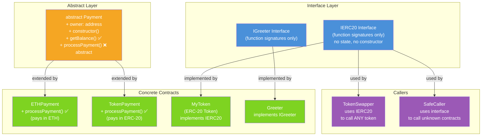

# 🔌 Chapter 11: Interfaces and Abstract Contracts in Solidity

> **Level:** Beginner-Friendly | **Prerequisites:** Chapter 10 (Inheritance)

---

## 📋 Table of Contents

1. [What Is an Interface?](#1-what-is-an-interface)
2. [The TV Remote Analogy](#2-the-tv-remote-analogy)
3. [Rules for Interfaces](#3-rules-for-interfaces)
4. [Implementing an Interface](#4-implementing-an-interface)
5. [Using Interfaces to Talk to Other Contracts](#5-using-interfaces-to-talk-to-other-contracts)
6. [The IERC20 Interface — The Real Deal](#6-the-ierc20-interface--the-real-deal)
7. [Calling External Contracts via Interface (DeFi Power Move)](#7-calling-external-contracts-via-interface-defi-power-move)
8. [Interface Checks: ERC-165 and supportsInterface](#8-interface-checks-erc-165-and-supportsinterface)
9. [Abstract Contracts](#9-abstract-contracts)
10. [Abstract vs Interface — When to Use What](#10-abstract-vs-interface--when-to-use-what)
11. [Architecture Diagram](#11-architecture-diagram)
12. [Key Takeaways](#12-key-takeaways)
13. [Quiz](#13-quiz)

---

## 1. What Is an Interface?

An **interface** in Solidity is like a **contract blueprint** — it tells you *what* functions a contract must have, but says nothing about *how* those functions work internally.

Think of an interface as a **menu at a restaurant**. The menu lists what dishes are available and what ingredients they contain. You know what you can order. But you have no idea what happens in the kitchen — that is not your concern.

```solidity
// SPDX-License-Identifier: MIT
pragma solidity ^0.8.0;

// This is an interface — pure declarations, zero implementation
interface IGreeter {
    function greet(string calldata name) external pure returns (string memory);
    function setMessage(string calldata message) external;
}
```

Notice what is missing: no function bodies, no curly braces with logic inside. Just clean signatures.

---

## 2. The TV Remote Analogy

Imagine you pick up a TV remote. You see buttons: **Power**, **Volume Up**, **Volume Down**, **Channel Up**, **Channel Down**.

You know exactly what each button does. You press **Volume Up** and the volume increases. You do not need to know anything about the circuit board inside the remote, the infrared LED frequencies, or the TV's firmware. You just use the buttons.

An interface works the same way:

| TV Remote Concept | Solidity Equivalent |
|---|---|
| The buttons on the remote | Function signatures in the interface |
| What each button does (behavior) | Function implementations in the contract |
| The electronics inside the remote | Internal contract logic (hidden from you) |
| You pressing buttons | Your contract calling the interface |

When your contract holds an interface reference, it can call those functions **without knowing anything about the code inside the target contract**. This is incredibly powerful when you want to interact with contracts deployed by other teams — like Uniswap, Aave, or any ERC-20 token.

---

## 3. Rules for Interfaces

Interfaces have strict rules in Solidity. Break any of them and the compiler will reject your code.

### What interfaces CANNOT have:
- State variables (no `uint256 public count;` inside an interface)
- Constructors (no `constructor()` block)
- Function implementations (no curly-brace bodies)
- Any function visibility other than `external`

### What interfaces CAN have:
- Function declarations (signatures only)
- Events
- Errors (custom errors)
- Enums
- Structs

```solidity
// SPDX-License-Identifier: MIT
pragma solidity ^0.8.0;

interface IVault {
    // Events are allowed
    event Deposited(address indexed user, uint256 amount);
    event Withdrawn(address indexed user, uint256 amount);

    // Custom errors are allowed
    error InsufficientFunds(uint256 requested, uint256 available);

    // All functions must be external
    function deposit(uint256 amount) external;
    function withdraw(uint256 amount) external;
    function balanceOf(address user) external view returns (uint256);

    // NO state variables allowed — this would cause a compile error:
    // uint256 public totalDeposits;  ❌

    // NO constructors allowed — this would cause a compile error:
    // constructor() {}  ❌
}
```

> **Quick Rule of Thumb:** If you can describe it as "this contract must be able to do X", that belongs in an interface. If you need to store data or share logic, you need an abstract contract or a base contract.

---

## 4. Implementing an Interface

To implement an interface, a contract uses the `is` keyword — the same syntax as inheritance, because implementing an interface is a form of inheritance.

```solidity
// SPDX-License-Identifier: MIT
pragma solidity ^0.8.0;

interface IAnimal {
    function speak() external pure returns (string memory);
    function move() external pure returns (string memory);
}

// Dog MUST implement ALL functions declared in IAnimal
contract Dog is IAnimal {
    function speak() external pure override returns (string memory) {
        return "Woof!";
    }

    function move() external pure override returns (string memory) {
        return "I run on four legs.";
    }
}

contract Bird is IAnimal {
    function speak() external pure override returns (string memory) {
        return "Tweet!";
    }

    function move() external pure override returns (string memory) {
        return "I fly with wings.";
    }
}
```

If `Dog` forgot to implement `speak()`, the compiler would throw an error:

```
TypeError: Contract "Dog" should be marked as abstract.
```

This compile-time safety net is one of the biggest advantages of using interfaces.

---

## 5. Using Interfaces to Talk to Other Contracts

This is where interfaces become truly powerful. Your contract can interact with **any deployed contract** that matches the interface — even contracts you did not write, even contracts deployed years ago by unknown developers.

```solidity
// SPDX-License-Identifier: MIT
pragma solidity ^0.8.0;

// Define what we expect the external contract to look like
interface ICounter {
    function increment() external;
    function getCount() external view returns (uint256);
}

contract CounterCaller {
    // Call ANY contract at a given address, as long as it matches ICounter
    function callIncrement(address counterAddress) external {
        ICounter counter = ICounter(counterAddress);
        counter.increment();
    }

    function readCount(address counterAddress) external view returns (uint256) {
        return ICounter(counterAddress).getCount();
    }
}
```

**How does this work under the hood?**

When you write `ICounter(counterAddress)`, you are telling Solidity: "Cast the address `counterAddress` into the `ICounter` type." Solidity does not actually verify that the contract at that address implements `ICounter`. It simply encodes the function call according to the ABI (Application Binary Interface) and sends it. If the target contract has no matching function, the call will revert.

This is why interfaces are sometimes called **"ABI shortcuts"** — they let you generate correct function call encodings without having the full contract source code.

---

## 6. The IERC20 Interface — The Real Deal

ERC-20 is the token standard that powers almost every fungible token in the Ethereum ecosystem — USDC, DAI, LINK, UNI, and thousands more. The **IERC20 interface** defines the exact functions and events every ERC-20 token must implement.

Here is the full, official IERC20 interface:

```solidity
// SPDX-License-Identifier: MIT
pragma solidity ^0.8.0;

/**
 * @dev Interface of the ERC-20 standard as defined in the EIP.
 * https://eips.ethereum.org/EIPS/eip-20
 */
interface IERC20 {
    /**
     * @dev Returns the total token supply in existence.
     * Example: USDC has ~40 billion tokens in circulation.
     */
    function totalSupply() external view returns (uint256);

    /**
     * @dev Returns the token balance of a specific account.
     * Example: How many USDC does address 0xABC... hold?
     */
    function balanceOf(address account) external view returns (uint256);

    /**
     * @dev Transfers `amount` tokens from the caller to `to`.
     * Returns true on success.
     */
    function transfer(address to, uint256 amount) external returns (bool);

    /**
     * @dev Returns how many tokens `spender` is allowed to spend
     * on behalf of `owner`.
     * Example: You approved Uniswap to spend 1000 USDC for you.
     */
    function allowance(address owner, address spender) external view returns (uint256);

    /**
     * @dev Allows `spender` to spend up to `amount` of your tokens.
     * This is how DeFi protocols get permission to move your tokens.
     */
    function approve(address spender, uint256 amount) external returns (bool);

    /**
     * @dev Moves tokens FROM `from` TO `to`, using the allowance mechanism.
     * The caller must have been approved by `from` first.
     */
    function transferFrom(
        address from,
        address to,
        uint256 amount
    ) external returns (bool);

    // --- Events ---

    /**
     * @dev Emitted whenever tokens move between addresses.
     */
    event Transfer(address indexed from, address indexed to, uint256 value);

    /**
     * @dev Emitted when an approval is set or changed.
     */
    event Approval(address indexed owner, address indexed spender, uint256 value);
}
```

Every single ERC-20 token — regardless of who built it — exposes these exact 6 functions and 2 events. This means your contract can interact with **any ERC-20 token** using just this interface.

---

## 7. Calling External Contracts via Interface (DeFi Power Move)

This is the pattern that makes DeFi composable. Protocols like Uniswap, Aave, and Compound interact with arbitrary ERC-20 tokens without hardcoding specific token addresses. They just use the IERC20 interface.

Here is a practical example — a token swapper that works with ANY ERC-20 pair:

```solidity
// SPDX-License-Identifier: MIT
pragma solidity ^0.8.0;

// Import the IERC20 interface (in practice, you'd import from OpenZeppelin)
interface IERC20 {
    function totalSupply() external view returns (uint256);
    function balanceOf(address account) external view returns (uint256);
    function transfer(address to, uint256 amount) external returns (bool);
    function allowance(address owner, address spender) external view returns (uint256);
    function approve(address spender, uint256 amount) external returns (bool);
    function transferFrom(address from, address to, uint256 amount) external returns (bool);

    event Transfer(address indexed from, address indexed to, uint256 value);
    event Approval(address indexed owner, address indexed spender, uint256 value);
}

/**
 * @title TokenSwapper
 * @dev A contract that can interact with ANY ERC-20 token using IERC20.
 *      In real DeFi, swap logic would call a DEX like Uniswap.
 */
contract TokenSwapper {
    address public owner;
    
    event SwapInitiated(address indexed tokenA, address indexed tokenB, uint256 amount);

    constructor() {
        owner = msg.sender;
    }

    /**
     * @dev Step 1: User must call tokenA.approve(address(this), amount) FIRST.
     *      Step 2: Then call this function to pull tokens into this contract.
     */
    function swapTokens(
        address tokenA,
        address tokenB,
        uint256 amount
    ) external {
        // Wrap tokenA's address in the IERC20 interface
        IERC20 tokenContractA = IERC20(tokenA);
        IERC20 tokenContractB = IERC20(tokenB);

        // Check the caller actually has enough of tokenA
        require(
            tokenContractA.balanceOf(msg.sender) >= amount,
            "Insufficient tokenA balance"
        );

        // Check the caller approved this contract to move their tokens
        require(
            tokenContractA.allowance(msg.sender, address(this)) >= amount,
            "Insufficient allowance — call approve() first"
        );

        // Pull tokenA FROM the caller INTO this contract
        bool success = tokenContractA.transferFrom(msg.sender, address(this), amount);
        require(success, "transferFrom failed");

        // In a real DEX, swap logic happens here.
        // For demo purposes, we just emit an event.
        emit SwapInitiated(tokenA, tokenB, amount);

        // ... (real swap logic: price calculation, liquidity pool interaction, etc.)
    }

    /**
     * @dev Check this contract's balance of any ERC-20 token.
     */
    function checkBalance(address token) external view returns (uint256) {
        return IERC20(token).balanceOf(address(this));
    }
}
```

**The approve-then-transferFrom pattern** is fundamental in DeFi:

1. User calls `token.approve(dexAddress, 1000)` — gives the DEX permission to spend 1000 tokens
2. User calls `dex.swapTokens(...)` — the DEX internally calls `token.transferFrom(user, dex, 1000)`

Your contract never holds the user's private keys. It only acts within the limits of what the user approved. This is the ERC-20 trust model.

---

## 8. Interface Checks: ERC-165 and supportsInterface

How does a contract know whether another contract actually implements a specific interface? The answer is **ERC-165**, a standard for introspection.

ERC-165 defines a single function:

```solidity
interface IERC165 {
    /**
     * @dev Returns true if this contract implements the interface
     *      defined by `interfaceId`.
     *
     * interfaceId is the XOR of all function selectors in the interface.
     * Example: IERC721's interfaceId is 0x80ac58cd
     */
    function supportsInterface(bytes4 interfaceId) external view returns (bool);
}
```

A contract that supports ERC-165 must implement `supportsInterface` and return `true` for its own interface IDs.

```solidity
// SPDX-License-Identifier: MIT
pragma solidity ^0.8.0;

interface IERC165 {
    function supportsInterface(bytes4 interfaceId) external view returns (bool);
}

interface IMyFeature {
    function doSomething() external;
}

contract MyContract is IERC165, IMyFeature {
    // The interface ID is the XOR of all function selectors
    // bytes4(keccak256("doSomething()")) == 0x...
    bytes4 private constant MY_FEATURE_INTERFACE_ID = type(IMyFeature).interfaceId;
    bytes4 private constant ERC165_INTERFACE_ID = type(IERC165).interfaceId;

    function supportsInterface(bytes4 interfaceId) external pure override returns (bool) {
        return
            interfaceId == MY_FEATURE_INTERFACE_ID ||
            interfaceId == ERC165_INTERFACE_ID;
    }

    function doSomething() external override {
        // implementation
    }
}

// A caller can CHECK before calling
contract SafeCaller {
    function safeCall(address target) external {
        bool hasFeature = IERC165(target).supportsInterface(
            type(IMyFeature).interfaceId
        );
        require(hasFeature, "Target does not support IMyFeature");
        IMyFeature(target).doSomething();
    }
}
```

ERC-165 is widely used in **NFT standards** (ERC-721, ERC-1155) so that marketplaces and wallets can detect what type of token they are dealing with before interacting.

---

## 9. Abstract Contracts

An **abstract contract** sits between a full interface and a fully deployed contract. It can have:

- State variables
- A constructor
- Fully implemented functions
- Unimplemented (abstract) functions that subclasses must implement

The `abstract` keyword signals that this contract is **not meant to be deployed directly** — it is a base that others build upon.

```solidity
// SPDX-License-Identifier: MIT
pragma solidity ^0.8.0;

/**
 * @title Payment
 * @dev An abstract base contract for payment systems.
 *      Handles common setup but leaves payment logic to subclasses.
 */
abstract contract Payment {
    // State variables ARE allowed in abstract contracts
    address public owner;
    uint256 public totalProcessed;

    // Constructors ARE allowed
    constructor() {
        owner = msg.sender;
    }

    // Unimplemented function — subclasses MUST override this
    // The `virtual` keyword marks it as overridable
    function processPayment(address to, uint256 amount) public virtual;

    // Fully implemented function — shared by all subclasses
    function getBalance() public view returns (uint256) {
        return address(this).balance;
    }

    // Another implemented function
    modifier onlyOwner() {
        require(msg.sender == owner, "Only owner can call this");
        _;
    }
}

/**
 * @title ETHPayment
 * @dev Concrete implementation that pays in native ETH.
 */
contract ETHPayment is Payment {
    // Must implement the abstract function
    function processPayment(address to, uint256 amount) public override onlyOwner {
        require(address(this).balance >= amount, "Insufficient contract balance");
        totalProcessed += amount;
        payable(to).transfer(amount);
    }

    // Allow the contract to receive ETH
    receive() external payable {}
}

/**
 * @title TokenPayment
 * @dev Concrete implementation that pays in an ERC-20 token.
 */
interface IERC20Simple {
    function transfer(address to, uint256 amount) external returns (bool);
}

contract TokenPayment is Payment {
    IERC20Simple public token;

    constructor(address tokenAddress) {
        token = IERC20Simple(tokenAddress);
    }

    function processPayment(address to, uint256 amount) public override onlyOwner {
        totalProcessed += amount;
        bool success = token.transfer(to, amount);
        require(success, "Token transfer failed");
    }
}
```

Notice how `ETHPayment` and `TokenPayment` share the same `owner` state, the same `onlyOwner` modifier, and the same `getBalance()` function — all defined once in the abstract base. The only difference is *how* payment is processed.

---

## 10. Abstract vs Interface — When to Use What

This decision is a common source of confusion for beginners. Here is a clear breakdown:

| Feature | Interface | Abstract Contract |
|---|---|---|
| State variables | No | Yes |
| Constructor | No | Yes |
| Implemented functions | No | Yes |
| Unimplemented functions | Yes (all) | Yes (at least one) |
| Multiple inheritance | Yes (easy) | Yes (careful with conflicts) |
| Deployment | Cannot be deployed | Cannot be deployed |
| Primary use case | Define a standard API | Share common logic + enforce overrides |

**Use an interface when:**
- You want to define a standard that many unrelated contracts will implement (ERC-20, ERC-721)
- You want to call an external contract without needing its source code
- You need lightweight type-checking with minimal coupling
- Multiple unrelated contracts need to "promise" certain behavior

**Use an abstract contract when:**
- You want to share actual logic (state variables, helper functions, modifiers) between related contracts
- You have a family of contracts that are variations of the same thing (ETHPayment, TokenPayment)
- You need a constructor with shared initialization logic
- Think of it as a template with some blanks to fill in

**Real-world rule of thumb:**
- `interface` = standard/protocol (what contracts can do)
- `abstract` = base class/template (how related contracts share code)

---

## 11. Architecture Diagram



**Legend:**
- Blue = Interfaces (no implementation)
- Orange = Abstract contracts (partial implementation)
- Green = Concrete contracts (fully deployable)
- Purple = Caller contracts (consumers of interfaces)

---

## 12. Key Takeaways

- **Interfaces define "what"** — a list of functions a contract must expose, with no implementation details. Think of them as a promise a contract makes to the outside world.

- **Abstract contracts define "what + some how"** — they can include state variables, constructors, and shared logic, but leave at least one function for subclasses to implement.

- **Interfaces enable interoperability** — because any contract implementing the same interface can be used interchangeably, you can write code that works with tokens, NFTs, or protocols deployed by anyone.

- **The ERC-20 standard is just an interface** — IERC20 is what makes it possible for one DEX to trade thousands of different tokens using identical code.

- **The approve + transferFrom pattern** is the canonical way ERC-20 contracts allow third-party contracts to move tokens on a user's behalf, without custody.

- **ERC-165's supportsInterface** gives contracts a way to advertise their capabilities, enabling safe runtime checks before making calls.

- **You cannot deploy an interface or abstract contract** — they are building blocks, not standalone products.

- **All interface functions must be `external`** — they represent the public-facing API of a contract, not internal helpers.

---

## 13. Quiz

Test your understanding before moving on.

---

**Question 1**

You want to write a contract that can interact with any ERC-20 token deployed on Ethereum — tokens you did not write and whose source code you do not have. What Solidity feature makes this possible, and what do you need to know about the target contract to use it?

<details>
<summary>Answer</summary>

You use an **interface** (`IERC20`). You only need to know the function signatures (names, parameter types, return types) of the functions you want to call — you do not need the contract's source code or any internal logic. You cast the token's deployed address to the `IERC20` interface type and call functions on it. If the contract does not implement those functions, the call will revert at runtime, but you will not get a compile-time error.

</details>

---

**Question 2**

What is the key difference between an abstract contract and an interface? Give one example where you would prefer an abstract contract over an interface.

<details>
<summary>Answer</summary>

An **interface** has no state variables, no constructor, and no implemented functions — only function signatures. An **abstract contract** can have all of those; it just must have at least one unimplemented (`virtual`) function.

You would prefer an abstract contract when multiple related contracts need to share state and logic. For example, if you have `ETHPayment` and `TokenPayment` that both need an `owner` variable and an `onlyOwner` modifier, you put those in an abstract `Payment` contract. With an interface, you would have to duplicate that code in every subclass.

</details>

---

**Question 3**

A user wants to use your DeFi contract to swap their USDC tokens. They call your `swapTokens` function but it reverts with "Insufficient allowance — call approve() first". What must the user do before calling your contract, and why does this two-step process exist?

<details>
<summary>Answer</summary>

The user must call `USDC.approve(yourContractAddress, amount)` on the USDC token contract first. This tells the USDC contract to record that your contract is allowed to move up to `amount` tokens on the user's behalf.

The two-step process exists because of the ERC-20 design: token contracts only move tokens when instructed by the token owner (via `transfer`) or by an approved spender (via `transferFrom`). Your swap contract needs to use `transferFrom` to pull tokens from the user, but the token contract will reject that call unless the user has explicitly approved your contract. This ensures no contract can drain a user's tokens without their prior explicit permission — it is a fundamental security boundary in the ERC-20 standard.

</details>

---

> **Up Next:** Chapter 12 — Libraries and Code Reuse in Solidity
