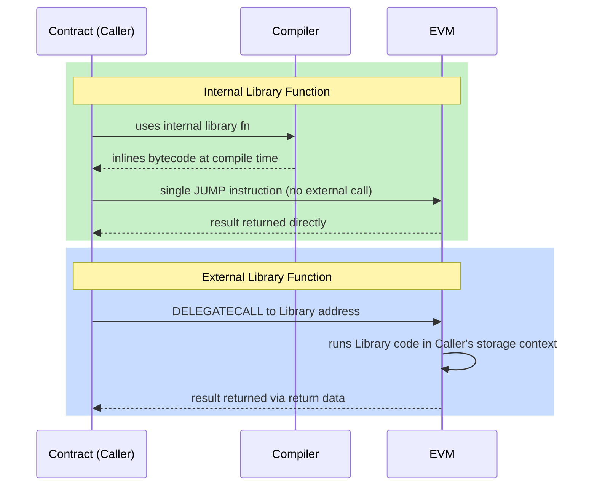

# 📚 Chapter 12: Libraries in Solidity

> **Level:** Beginner → Intermediate
> **Prerequisites:** Functions, Structs, Inheritance (Chapters 4, 7, 10)

---

## 🧰 Library Kya Hoti Hai?

Socho tum ek ghar bana rahe ho. Ab har baar site pe naya hammer, naya tape measure banane baithoge kya? Nahi na — tum apne saath ek **tool belt** carry karte ho jisme pehle se ready tools hote hain. Solidity ki **library** bilkul yehi tool belt hai tumhare smart contracts ke liye.

Library ek special type ka Solidity contract hota hai jisme **reusable logic** hota hai — pure calculations, data manipulation, validation helpers — jise koi bhi contract call kar sakta hai. Code ek baar likho, aur jis bhi contract ko zaroorat ho woh bas usse borrow kar le, alag-alag files mein wahi logic baar-baar copy-paste karne ki zaroorat nahi.

```solidity
// SPDX-License-Identifier: MIT
pragma solidity ^0.8.0;

library MathHelper {
    function average(uint256 a, uint256 b) internal pure returns (uint256) {
        // Avoids overflow by dividing before adding
        return (a / 2) + (b / 2) + ((a % 2 + b % 2) / 2);
    }
}
```

Libraries **DRY principle** (Don't Repeat Yourself) ko follow karwati hain, bugs kam karti hain, aur safe, maintainable smart contract development ki foundation hain.

---

## 🆚 Library vs Contract: Farak Kya Hai?

Pehli nazar mein library ek contract jaisi hi dikhti hai, lekin iske kuch strict rules hote hain jo isse lighter aur safer banate hain.

| Feature | Contract | Library |
|---|---|---|
| State variables | Haan | Nahi |
| ETH receive kar sakta hai | Haan (agar `payable`) | Nahi |
| Inheritance | Haan | Nahi |
| `payable` functions | Haan | Nahi |
| `selfdestruct` | Haan | Nahi |
| Balance hold kar sakta hai | Haan | Nahi |
| Deployment | Hamesha | Sirf tab jab `external` functions ho |

Yaad rakhne wali cheez: **library ke paas na state hoti hai, na ETH**. Yeh sirf stateless utility functions ka collection hai. Isi restriction ki wajah se Solidity compiler library code ko safely tumhare contract mein directly inline kar sakta hai (`internal` functions ke liye), ya `DELEGATECALL` ke through call kar sakta hai (`external` functions ke liye) — bina is risk ke ki library kisi storage ke saath chhed-chhaad kar de jispe uska haq nahi.

---

## ⚙️ Library Types: Internal vs External

Libraries do deployment flavours mein aati hain, depending on unke functions ki visibility.

### Internal Library Functions

Jab library ke saare functions `internal` marked hote hain, compiler us library ka code directly har us contract mein **inline** kar deta hai jo use use karta hai. Koi alag library contract deploy nahi hota — bytecode seedha caller ke andar copy ho jaata hai.

Socho jaise tum apni khud ki recipe kisi doosre ke cookbook se copy karke apni khud ki cookbook mein likh lo — koi extra kitab kharidne ki zaroorat nahi.

**Fayde:**
- Extra deployment transaction ya address ki zaroorat nahi
- Runtime call overhead nahi — thoda cheaper gas per call
- Koi linking step nahi chahiye

**Nuksaan:**
- Jo bhi contract library use karta hai, uske paas bytecode ki apni copy hoti hai (contract size badh jaata hai)

```solidity
library SafeDiv {
    function divide(uint256 a, uint256 b) internal pure returns (uint256) {
        require(b > 0, "Cannot divide by zero");
        return a / b;
    }
}
```

### External Library Functions

Jab library mein `external` (ya `public`) functions hote hain, use apne khud ke address pe **deploy** karna padta hai blockchain pe. Jo contracts isse use karte hain, woh **`DELEGATECALL`** ke through call karte hain — ek low-level EVM opcode jo library ka code run karta hai lekin *caller* ke storage context ke andar.

Yeh bilkul Ola/Uber jaisa hai — driver (library) apni khud ki gaadi (code) leke aata hai, lekin trip tumhare account (storage) pe hi record hoti hai.

**Fayde:**
- Library bytecode on-chain sirf ek baar exist karta hai; bahut saare contracts same address ko point kar sakte hain
- Har consuming contract ka size chhota rehta hai

**Nuksaan:**
- Pehle deploy karna padta hai (uska address pata hona chahiye)
- Compilation/deployment ke waqt ek **linking** step chahiye
- `DELEGATECALL` ki wajah se per-call thoda zyada gas overhead

```solidity
library BigArrayOps {
    // external — will be deployed separately
    function sum(uint256[] memory arr) external pure returns (uint256 total) {
        for (uint256 i = 0; i < arr.length; i++) {
            total += arr[i];
        }
    }
}
```

### Diagram: Internal vs External Library Calls



---

## 🔗 `using X for Y` Syntax

Solidity ek powerful shorthand deta hai jisse tum **library functions ko kisi specific type ke saath attach** kar sakte ho, taaki woh us type ke native methods jaise dikhein.

```solidity
using ArrayUtils for uint256[];
```

Yeh declaration likhne ke baad, contract ke andar koi bhi `uint256[]` variable `ArrayUtils` ke functions ko apne khud ke methods ki tarah call kar sakta hai. Array automatically first argument ki tarah pass ho jaata hai.

```solidity
// "using" ke bina
bool found = ArrayUtils.contains(myArray, 42);

// "using ArrayUtils for uint256[]" ke saath
bool found = myArray.contains(42);   // kitna clean hai!
```

Tum primitive types pe bhi attach kar sakte ho:

```solidity
using StringUtils for string;

string memory greeting = "hello";
string memory upper = greeting.toUpperCase(); // "HELLO"
```

Yeh pattern code ko kaafi zyada readable bana deta hai — Solidity libraries ke sabse pasandida features mein se ek hai yeh.

---

## 🛡️ SafeMath: Kyun Zaruri Thi, Aur Ab Kyun Gayi

Solidity 0.8.0 se pehle, integer arithmetic **overflow aur underflow pe silently wrap** ho jaati thi. Matlab, koi error nahi, seedha galat answer mil jaata tha. Example dekho:

```solidity
// Solidity < 0.8.0 — DANGEROUS
uint8 x = 255;
x = x + 1; // wraps to 0 — attacker isko exploit kar sakta tha!
```

OpenZeppelin ki **SafeMath** library community ka jawaab thi. Yeh har arithmetic operation ko ek check mein wrap kar deti thi jo overflow hone pe `revert` kar de, jisse BEC token overflow attack jaise mashhoor exploits rukte the.

```solidity
// SafeMath usage (pre-0.8)
using SafeMath for uint256;

uint256 total = a.add(b);   // overflow pe revert
uint256 diff  = a.sub(b);   // agar b > a ho to revert
uint256 prod  = a.mul(b);   // overflow pe revert
```

**Solidity 0.8.0 se**, compiler khud hi saari arithmetic pe overflow/underflow checks by default karta hai aur automatically revert kar deta hai — isliye SafeMath **ab zaruri nahi hai**. Gas-sensitive code ke liye `unchecked { }` blocks abhi bhi use kar sakte ho, jab tumhe pakka pata ho ki overflow nahi hoga.

```solidity
// Solidity ^0.8.0 — by default safe
uint256 x = type(uint256).max;
x = x + 1; // automatically revert — SafeMath ki zaroorat nahi!

// gas savings ke liye unchecked, jab pata ho ki safe hai
unchecked {
    for (uint256 i = 0; i < arr.length; i++) { /* ... */ }
}
```

> [!tip]
> Agar tum naye Solidity (0.8+) mein code likh rahe ho, to SafeMath ko import karna ek red flag hai — compiler khud yeh kaam kar deta hai. Sirf legacy code padhte waqt yeh samajhna zaruri hai.

---

## 🔨 Apni Khud ki Library Banao

Chalo ek practical library from scratch banate hain. Neeche wala example ek reusable `ArrayUtils` library aur ek `StringUtils` library banata hai, aur unhe ek `Registry` contract mein use karta hai.

```solidity
// SPDX-License-Identifier: MIT
pragma solidity ^0.8.0;

// ─── Custom Library: ArrayUtils ─────────────────────────────────────────────
library ArrayUtils {
    /// @notice Returns the index of `value` in `arr`, or -1 if not found.
    function indexOf(uint256[] storage arr, uint256 value)
        internal
        view
        returns (int256)
    {
        for (uint256 i = 0; i < arr.length; i++) {
            if (arr[i] == value) {
                return int256(i);
            }
        }
        return -1;
    }

    /// @notice Removes the element at `index` using swap-and-pop (O(1), unordered).
    function removeAt(uint256[] storage arr, uint256 index) internal {
        require(index < arr.length, "Index out of bounds");
        arr[index] = arr[arr.length - 1];
        arr.pop();
    }

    /// @notice Returns true if `value` exists in `arr`.
    function contains(uint256[] storage arr, uint256 value)
        internal
        view
        returns (bool)
    {
        return indexOf(arr, value) >= 0;
    }
}

// ─── Custom Library: StringUtils ────────────────────────────────────────────
library StringUtils {
    /// @notice Converts a lowercase ASCII string to uppercase.
    function toUpperCase(string memory str)
        internal
        pure
        returns (string memory)
    {
        bytes memory strBytes = bytes(str);
        for (uint256 i = 0; i < strBytes.length; i++) {
            // ASCII 'a'=0x61, 'z'=0x7A; uppercase offset = 32
            if (strBytes[i] >= 0x61 && strBytes[i] <= 0x7A) {
                strBytes[i] = bytes1(uint8(strBytes[i]) - 32);
            }
        }
        return string(strBytes);
    }
}

// ─── Contract: Registry ─────────────────────────────────────────────────────
contract Registry {
    using ArrayUtils  for uint256[];   // attach to uint256 arrays
    using StringUtils for string;      // attach to string type

    uint256[] public registeredIds;

    event Registered(uint256 indexed id);
    event Unregistered(uint256 indexed id);

    function register(uint256 id) public {
        require(!registeredIds.contains(id), "Already registered");
        registeredIds.push(id);
        emit Registered(id);
    }

    function unregister(uint256 id) public {
        int256 index = registeredIds.indexOf(id);
        require(index >= 0, "Not registered");
        registeredIds.removeAt(uint256(index));
        emit Unregistered(id);
    }

    function greet(string memory name) public pure returns (string memory) {
        // StringUtils.toUpperCase is called as a method on `name`
        return name.toUpperCase();
    }
}
```

**Achhi library banane ke liye kya zaruri hai?**

- Functions jahan tak ho sake `pure` ya `view` rakho — koi side effects nahi
- Helper logic ke liye `internal` use karo taaki compiler use inline kar sake
- Koi events emit mat karo (events sirf contracts ke domain mein aate hain)
- Arrays ya mappings pe kaam karte waqt `storage` references accept karo, taaki expensive copies na banein

---

## 🌐 Popular OpenZeppelin Libraries

[OpenZeppelin Contracts](https://github.com/OpenZeppelin/openzeppelin-contracts) Solidity ke liye gold standard library suite hai. Har serious project inme se kam se kam kuch to zaroor use karta hai. Isse tum Zomato/Swiggy jaisa soch sakte ho — jaise woh apna khud ka payment gateway banane ke bajaye Razorpay/PhonePe use karte hain, waise hi tumhe apna khud ka arithmetic ya string logic banane ke bajaye OpenZeppelin use karna chahiye.

### SafeERC20

ERC-20 ke `transfer` aur `transferFrom` functions poorly specified the — kuch tokens failure pe revert karne ke bajaye `false` return kar dete the. **SafeERC20** har ERC-20 call ko wrap karta hai aur failure pe hamesha revert karta hai, jisse tumhara contract un tokens se safe rehta hai jo expected interface follow nahi karte.

```solidity
import "@openzeppelin/contracts/token/ERC20/utils/SafeERC20.sol";

using SafeERC20 for IERC20;

IERC20 token = IERC20(tokenAddress);
token.safeTransfer(recipient, amount);         // kabhi silently fail nahi hota
token.safeTransferFrom(sender, recipient, amt);
```

### Strings

Numbers aur addresses ko unke string representation mein convert karne ke liye utility functions — token URIs aur on-chain metadata banane ke liye kaam ke.

```solidity
import "@openzeppelin/contracts/utils/Strings.sol";

using Strings for uint256;
using Strings for address;

string memory uri = string.concat("https://api.example.com/", tokenId.toString());
// e.g. "https://api.example.com/42"
```

### Address

`address` types ke saath kaam karne ke liye helpers: check karna ki address contract hai ya nahi, proper revert propagation ke saath low-level calls karna, aur ETH safely bhejna.

```solidity
import "@openzeppelin/contracts/utils/Address.sol";

using Address for address;
using Address for address payable;

bool isContract = target.isContract();
target.sendValue(1 ether);             // failure pe revert, `.transfer()` ke ulat
```

### Math

Safe arithmetic utilities aur convenience functions — `min`, `max`, `average`, `ceilDiv`, aur bhi bahut kuch. Overflow protection 0.8 se built-in hone ke bawajood, `Math` kuch helpful combinators deta hai jo manual implementations mein hone wale subtle bugs se bachate hain.

```solidity
import "@openzeppelin/contracts/utils/math/Math.sol";

uint256 smaller = Math.min(a, b);
uint256 larger  = Math.max(a, b);
uint256 avg     = Math.average(a, b);    // overflow nahi, (a+b)/2 ke ulat
uint256 ceil    = Math.ceilDiv(10, 3);   // 4
```

### EnumerableSet

Ek normal Solidity `mapping` iterable nahi hoti — tum uski keys pe loop nahi chala sakte. **EnumerableSet** tumhe ek `Set` data structure deta hai jo membership checks ke liye O(1) bhi hai aur fully iterable bhi.

```solidity
import "@openzeppelin/contracts/utils/structs/EnumerableSet.sol";

using EnumerableSet for EnumerableSet.AddressSet;

EnumerableSet.AddressSet private _admins;

function addAdmin(address account) public {
    _admins.add(account);
}

function listAdmins() public view returns (address[] memory) {
    return _admins.values();   // pura set array ki tarah return karta hai
}
```

Variants: `AddressSet`, `UintSet`, `Bytes32Set`.

### EnumerableMap

`EnumerableSet` jaisa hi, lekin **key-value pairs** ke liye — ek map jise tum iterate kar sakte ho. Under the hood yeh ek mapping ko keys ke enumerable set ke saath combine karta hai.

```solidity
import "@openzeppelin/contracts/utils/structs/EnumerableMap.sol";

using EnumerableMap for EnumerableMap.UintToAddressMap;

EnumerableMap.UintToAddressMap private _tokenOwners;

function mint(uint256 tokenId, address owner) internal {
    _tokenOwners.set(tokenId, owner);
}

function ownerAt(uint256 index) public view returns (uint256 id, address owner) {
    return _tokenOwners.at(index);   // position ke hisaab se iterate
}
```

Variants: `UintToAddressMap`, `AddressToUintMap`, `Bytes32ToBytes32Map`.

> [!warning]
> Apni khud ki SafeMath, Strings, ya EnumerableSet type ki library kabhi ghar pe mat banao jab tak koi bahut special reason na ho. OpenZeppelin ki libraries thousands of hours ki auditing aur real-world battle-testing se guzri hain — reinventing the wheel karne mein bugs ka risk hi zyada hai.

---

## 🗝️ Key Takeaways

- **Library** ek reusable, stateless utility functions ka collection hai — koi state variables nahi, koi ETH nahi, koi inheritance nahi.
- **Internal** library functions compile time pe inline ho jaate hain — zero deployment overhead, thoda bada contract bytecode.
- **External** library functions alag se deploy hote hain aur `DELEGATECALL` ke through call hote hain — ek deployment, bahut saare consumers.
- **`using X for Y`** directive library methods ko ek type ke saath attach karta hai, jisse call sites cleaner aur zyada readable ban jaate hain.
- **SafeMath** Solidity 0.8 se pehle zaruri thi, ab obsolete hai — compiler overflow automatically handle karta hai.
- **OpenZeppelin** battle-tested libraries deta hai (SafeERC20, Strings, Address, Math, EnumerableSet, EnumerableMap) jo custom logic likhne se pehle tumhara first stop hona chahiye.
- Golden rule: **kabhi bhi audited library available ho, to hand-rolled code se better usi ko prefer karo**.

---

## 🧪 Quiz

Apni samajh test karo:

**1. Internal library function ko sabse best kaunsa statement describe karta hai?**

- A) Yeh alag address pe deploy hota hai aur `DELEGATECALL` se call hota hai
- B) Iska bytecode compile time pe har us contract mein directly copy ho jaata hai jo isse use karta hai
- C) Yeh ETH hold kar sakta hai aur normal contract ki tarah events emit kar sakta hai
- D) Deployment se pehle isko linking step chahiye

> **Answer: B.** Internal library functions compiler dwara consuming contract ke bytecode mein inline kar diye jaate hain. Koi alag deployment ya linking nahi chahiye.

---

**2. Tum ek Solidity 0.8.x contract likh rahe ho aur ek colleague suggest karta hai ki saari addition ko SafeMath ke `.add()` mein wrap karo. Unhe kya batana chahiye?**

- A) Woh sahi hain — SafeMath 0.8 mein bhi zaruri hai
- B) SafeMath sirf subtraction ke liye zaruri hai, addition ke liye nahi
- C) Solidity 0.8+ khud overflow check karta hai, isliye SafeMath redundant hai; plain `+` overflow pe revert kar dega
- D) SafeMath sirf `uint8` aur `uint16` ke liye use karo, `uint256` ke liye nahi

> **Answer: C.** Solidity 0.8.0 se, arithmetic overflow aur underflow automatically revert kar dete hain. SafeMath ki protection ab language mein hi built-in hai.

---

**3. `using EnumerableSet for EnumerableSet.AddressSet` declaration ke saath, tum aisa kya kar sakte ho jo ek plain `mapping(address => bool)` nahi kar sakta?**

- A) O(1) time mein membership check karna
- B) Duplicate entries rokna
- C) Set ke saare addresses pe iterate karna
- D) Addresses ko off-chain store karna

> **Answer: C.** Ek plain mapping iterable nahi hoti — tum uski keys enumerate nahi kar sakte. `EnumerableSet` ek internal array add karta hai jo iteration possible banata hai, saath hi O(1) membership checks bhi maintain rakhta hai.

---

*Next chapter: Interfaces and Abstract Contracts →*
