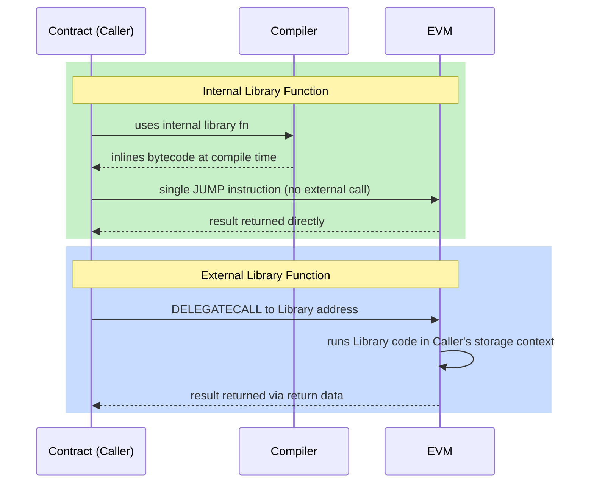

# 📚 Chapter 12: Libraries in Solidity

> **Level:** Beginner → Intermediate
> **Prerequisites:** Functions, Structs, Inheritance (Chapters 4, 7, 10)

---

## 🧰 What Is a Library?

Imagine you are building a house. Instead of crafting every tool from scratch on the job site, you carry a **utility belt** packed with pre-built, reusable tools — a hammer, a level, a tape measure. A Solidity **library** is exactly that utility belt for your smart contracts.

A library is a special kind of Solidity contract that contains **reusable logic** — pure calculations, data manipulation, validation helpers — that any contract can call. You write the code once, and every contract that needs it simply borrows it, rather than duplicating the same logic across dozens of files.

```solidity
// SPDX-License-Identifier: MIT
pragma solidity ^0.8.0;

library MathHelper {
    function average(uint256 a, uint256 b) internal pure returns (uint256) {
        // Avoids overflow by dividing before adding
        return (a / 2) + (b / 2) + ((a % 2 + b % 2) / 2);
    }
}
```

Libraries promote the **DRY principle** (Don't Repeat Yourself), reduce bugs, and are a cornerstone of safe, maintainable smart contract development.

---

## 🆚 Library vs Contract: Key Differences

At first glance a library looks like a contract, but it operates under strict rules that make it lighter and safer.

| Feature | Contract | Library |
|---|---|---|
| State variables | Yes | No |
| Can receive ETH | Yes (if `payable`) | No |
| Inheritance | Yes | No |
| `payable` functions | Yes | No |
| `selfdestruct` | Yes | No |
| Can hold a balance | Yes | No |
| Deployment | Always | Only if it has `external` functions |

The key insight: **a library has no state and no ETH**. It is a collection of stateless utility functions. This constraint is what allows the Solidity compiler to safely inline library code directly into your contract (for `internal` functions), or call it via `DELEGATECALL` (for `external` functions) without risk of the library misbehaving with storage it should not touch.

---

## ⚙️ Library Types: Internal vs External

Libraries come in two deployment flavours depending on the visibility of their functions.

### Internal Library Functions

When all functions in a library are marked `internal`, the compiler **inlines** the library code directly into every contract that uses it. There is no separate deployed library contract — the bytecode is copied into the caller.

**Pros:**
- No extra deployment transaction or address needed
- No runtime call overhead — slightly cheaper gas per call
- No linking step required

**Cons:**
- Every contract that uses the library carries a copy of the bytecode (increases contract size)

```solidity
library SafeDiv {
    function divide(uint256 a, uint256 b) internal pure returns (uint256) {
        require(b > 0, "Cannot divide by zero");
        return a / b;
    }
}
```

### External Library Functions

When a library contains `external` (or `public`) functions, it must be **deployed to its own address** on the blockchain. Contracts that use it call those functions via **`DELEGATECALL`** — a low-level EVM opcode that runs the library's code but inside the *caller's* storage context.

**Pros:**
- The library bytecode exists once on-chain; many contracts can point to the same address
- Reduces the size of each consuming contract

**Cons:**
- Must be deployed first (its address must be known)
- Requires a **linking** step during compilation/deployment
- Slightly more gas overhead per call due to the `DELEGATECALL`

```solidity
library BigArrayOps {
    // external — will be deployed separately
    function sum(uint256[] memory arr) external pure returns (uint256 total) {
        for (uint256 i = 0; i < arr.length; i++) {
            total += arr[i];
        }
    }
}
```

### Diagram: Internal vs External Library Calls



---

## 🔗 The `using X for Y` Syntax

Solidity provides a powerful shorthand that lets you **attach library functions to a specific type** so they read like native methods on that type.

```solidity
using ArrayUtils for uint256[];
```

After this declaration, any `uint256[]` variable inside the contract can call `ArrayUtils` functions as if they were its own methods. The array is automatically passed as the first argument.

```solidity
// Without "using"
bool found = ArrayUtils.contains(myArray, 42);

// With "using ArrayUtils for uint256[]"
bool found = myArray.contains(42);   // much cleaner!
```

You can also attach to primitive types:

```solidity
using StringUtils for string;

string memory greeting = "hello";
string memory upper = greeting.toUpperCase(); // "HELLO"
```

This pattern makes code dramatically more readable — it is one of the most beloved features of Solidity libraries.

---

## 🛡️ SafeMath: Why It Existed and Why It's Gone

Before Solidity 0.8.0, integer arithmetic **silently wrapped on overflow and underflow**. For example:

```solidity
// Solidity < 0.8.0 — DANGEROUS
uint8 x = 255;
x = x + 1; // wraps to 0 — attacker could exploit this!
```

OpenZeppelin's **SafeMath** library was the community's answer. It wrapped every arithmetic operation in a check that would `revert` on overflow, preventing entire classes of exploits like the infamous BEC token overflow attack.

```solidity
// SafeMath usage (pre-0.8)
using SafeMath for uint256;

uint256 total = a.add(b);   // reverts on overflow
uint256 diff  = a.sub(b);   // reverts if b > a
uint256 prod  = a.mul(b);   // reverts on overflow
```

**Since Solidity 0.8.0**, the compiler itself performs overflow/underflow checks on all arithmetic by default and automatically reverts — so SafeMath is **no longer needed**. You can still use `unchecked { }` blocks for gas-sensitive code where you are certain no overflow can occur.

```solidity
// Solidity ^0.8.0 — safe by default
uint256 x = type(uint256).max;
x = x + 1; // automatically reverts — no SafeMath needed!

// unchecked for gas savings when you know it's safe
unchecked {
    for (uint256 i = 0; i < arr.length; i++) { /* ... */ }
}
```

---

## 🔨 Writing Your Own Library

Let's build a practical library from scratch. The example below creates a reusable `ArrayUtils` library plus a `StringUtils` library, and consumes them in a `Registry` contract.

```solidity
// SPDX-License-Identifier: MIT
pragma solidity ^0.8.0;

// ─── Custom Library: ArrayUtils ─────────────────────────────────────────────
library ArrayUtils {
    /// @notice Returns the index of `value` in `arr`, or -1 if not found.
    function indexOf(uint256[] storage arr, uint256 value)
        internal
        view
        returns (int256)
    {
        for (uint256 i = 0; i < arr.length; i++) {
            if (arr[i] == value) {
                return int256(i);
            }
        }
        return -1;
    }

    /// @notice Removes the element at `index` using swap-and-pop (O(1), unordered).
    function removeAt(uint256[] storage arr, uint256 index) internal {
        require(index < arr.length, "Index out of bounds");
        arr[index] = arr[arr.length - 1];
        arr.pop();
    }

    /// @notice Returns true if `value` exists in `arr`.
    function contains(uint256[] storage arr, uint256 value)
        internal
        view
        returns (bool)
    {
        return indexOf(arr, value) >= 0;
    }
}

// ─── Custom Library: StringUtils ────────────────────────────────────────────
library StringUtils {
    /// @notice Converts a lowercase ASCII string to uppercase.
    function toUpperCase(string memory str)
        internal
        pure
        returns (string memory)
    {
        bytes memory strBytes = bytes(str);
        for (uint256 i = 0; i < strBytes.length; i++) {
            // ASCII 'a'=0x61, 'z'=0x7A; uppercase offset = 32
            if (strBytes[i] >= 0x61 && strBytes[i] <= 0x7A) {
                strBytes[i] = bytes1(uint8(strBytes[i]) - 32);
            }
        }
        return string(strBytes);
    }
}

// ─── Contract: Registry ─────────────────────────────────────────────────────
contract Registry {
    using ArrayUtils  for uint256[];   // attach to uint256 arrays
    using StringUtils for string;      // attach to string type

    uint256[] public registeredIds;

    event Registered(uint256 indexed id);
    event Unregistered(uint256 indexed id);

    function register(uint256 id) public {
        require(!registeredIds.contains(id), "Already registered");
        registeredIds.push(id);
        emit Registered(id);
    }

    function unregister(uint256 id) public {
        int256 index = registeredIds.indexOf(id);
        require(index >= 0, "Not registered");
        registeredIds.removeAt(uint256(index));
        emit Unregistered(id);
    }

    function greet(string memory name) public pure returns (string memory) {
        // StringUtils.toUpperCase is called as a method on `name`
        return name.toUpperCase();
    }
}
```

**What makes a good library?**

- Functions are `pure` or `view` whenever possible — no side effects
- Use `internal` for helper logic so the compiler can inline it
- Emit no events (events belong to contracts)
- Accept `storage` references when operating on arrays or mappings to avoid expensive copies

---

## 🌐 Popular OpenZeppelin Libraries

[OpenZeppelin Contracts](https://github.com/OpenZeppelin/openzeppelin-contracts) is the gold standard library suite for Solidity. Every serious project uses at least some of these.

### SafeERC20

ERC-20's `transfer` and `transferFrom` functions were poorly specified — some tokens return `false` on failure instead of reverting. **SafeERC20** wraps every ERC-20 call and always reverts on failure, protecting your contract from tokens that do not meet the expected interface.

```solidity
import "@openzeppelin/contracts/token/ERC20/utils/SafeERC20.sol";

using SafeERC20 for IERC20;

IERC20 token = IERC20(tokenAddress);
token.safeTransfer(recipient, amount);         // never silently fails
token.safeTransferFrom(sender, recipient, amt);
```

### Strings

Utility functions for converting numbers and addresses to their string representations — invaluable for building token URIs and on-chain metadata.

```solidity
import "@openzeppelin/contracts/utils/Strings.sol";

using Strings for uint256;
using Strings for address;

string memory uri = string.concat("https://api.example.com/", tokenId.toString());
// e.g. "https://api.example.com/42"
```

### Address

Helpers for working with `address` types: checking if an address is a contract, making low-level calls with proper revert propagation, and sending ETH safely.

```solidity
import "@openzeppelin/contracts/utils/Address.sol";

using Address for address;
using Address for address payable;

bool isContract = target.isContract();
target.sendValue(1 ether);             // reverts on failure, unlike .transfer()
```

### Math

Safe arithmetic utilities and convenience functions — `min`, `max`, `average`, `ceilDiv`, and more. Even though overflow protection is built-in since 0.8, `Math` offers helpful combinators that avoid the subtle bugs common in manual implementations.

```solidity
import "@openzeppelin/contracts/utils/math/Math.sol";

uint256 smaller = Math.min(a, b);
uint256 larger  = Math.max(a, b);
uint256 avg     = Math.average(a, b);    // no overflow, unlike (a+b)/2
uint256 ceil    = Math.ceilDiv(10, 3);   // 4
```

### EnumerableSet

A standard Solidity `mapping` is not iterable — you cannot loop over its keys. **EnumerableSet** gives you a `Set` data structure that is both O(1) for membership checks and fully iterable.

```solidity
import "@openzeppelin/contracts/utils/structs/EnumerableSet.sol";

using EnumerableSet for EnumerableSet.AddressSet;

EnumerableSet.AddressSet private _admins;

function addAdmin(address account) public {
    _admins.add(account);
}

function listAdmins() public view returns (address[] memory) {
    return _admins.values();   // returns the full set as an array
}
```

Variants: `AddressSet`, `UintSet`, `Bytes32Set`.

### EnumerableMap

Like `EnumerableSet`, but for **key-value pairs** — a map you can iterate. Under the hood it combines a mapping with an enumerable set of keys.

```solidity
import "@openzeppelin/contracts/utils/structs/EnumerableMap.sol";

using EnumerableMap for EnumerableMap.UintToAddressMap;

EnumerableMap.UintToAddressMap private _tokenOwners;

function mint(uint256 tokenId, address owner) internal {
    _tokenOwners.set(tokenId, owner);
}

function ownerAt(uint256 index) public view returns (uint256 id, address owner) {
    return _tokenOwners.at(index);   // iterate by position
}
```

Variants: `UintToAddressMap`, `AddressToUintMap`, `Bytes32ToBytes32Map`.

---

## 🗝️ Key Takeaways

- A **library** is a collection of reusable, stateless utility functions — no state variables, no ETH, no inheritance.
- **Internal** library functions are inlined at compile time — zero deployment overhead, slightly larger contract bytecode.
- **External** library functions are deployed separately and called via `DELEGATECALL` — one deployment, many consumers.
- The **`using X for Y`** directive attaches library methods to a type, making call sites cleaner and more readable.
- **SafeMath** was essential before Solidity 0.8 but is now obsolete — the compiler handles overflow automatically.
- **OpenZeppelin** provides battle-tested libraries (SafeERC20, Strings, Address, Math, EnumerableSet, EnumerableMap) that should be your first stop before writing custom logic.
- The golden rule: **prefer a well-audited library over hand-rolled code** whenever one exists for your use case.

---

## 🧪 Quiz

Test your understanding:

**1. Which statement best describes an internal library function?**

- A) It is deployed to a separate address and called with `DELEGATECALL`
- B) Its bytecode is copied directly into each contract that uses it at compile time
- C) It can hold ETH and emit events like a regular contract
- D) It requires a linking step before deployment

> **Answer: B.** Internal library functions are inlined by the compiler into the consuming contract's bytecode. No separate deployment or linking is needed.

---

**2. You are writing a Solidity 0.8.x contract and a colleague suggests wrapping all addition with SafeMath's `.add()`. What should you tell them?**

- A) They are right — SafeMath is still required in 0.8
- B) SafeMath is only needed for subtraction, not addition
- C) Solidity 0.8+ checks overflow automatically, so SafeMath is redundant; plain `+` will revert on overflow
- D) Use SafeMath only for `uint8` and `uint16`, not `uint256`

> **Answer: C.** Since Solidity 0.8.0, arithmetic overflow and underflow cause an automatic revert. SafeMath's protection is built into the language itself.

---

**3. Given the declaration `using EnumerableSet for EnumerableSet.AddressSet`, which of the following can you do that a plain `mapping(address => bool)` cannot?**

- A) Check membership in O(1) time
- B) Prevent duplicate entries
- C) Iterate over all addresses in the set
- D) Store the addresses off-chain

> **Answer: C.** A plain mapping is not iterable — you cannot enumerate its keys. `EnumerableSet` adds an internal array that makes iteration possible while keeping O(1) membership checks.

---

*Next chapter: Interfaces and Abstract Contracts →*
