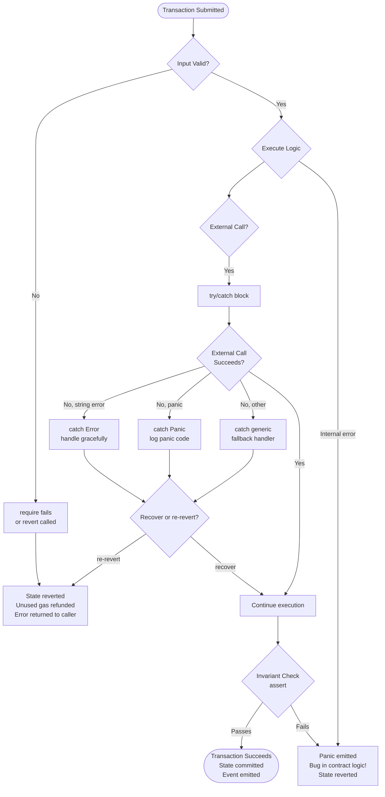

# 13 - Error Handling in Solidity

> "In traditional software, bugs are embarrassing. In smart contracts, bugs can be catastrophic — and permanent."

---

## Why Error Handling Matters (More Than You Think) ⚠️

When you write a web app and something goes wrong, you log it, show an error page, roll back the database, and move on. The damage is usually fixable.

Smart contracts do not work that way.

Once a transaction is mined on the Ethereum blockchain, it is **permanent**. There is no undo button. There is no customer support line. There is no rollback from a backup. If your contract sends 10 ETH to the wrong address because of a missing validation check, that ETH is gone — unless the recipient voluntarily sends it back.

This makes error handling in Solidity one of the most critical skills you need to develop early. Proper error handling in smart contracts serves three essential purposes:

1. **Prevents invalid state transitions** — stops your contract from entering a broken or exploitable state.
2. **Refunds unused gas** — when a transaction reverts, the caller gets back the gas they did not spend, reducing punishment for invalid inputs.
3. **Communicates intent clearly** — descriptive error messages make your contract easier to debug, audit, and use correctly.

Let's explore the tools Solidity gives you to handle errors properly.

---

## The Three Core Error Mechanisms 🔧

### a) `require` — Validate Inputs and Conditions

`require` is the most commonly used error-handling tool. You use it to **validate conditions that depend on external inputs or runtime state**. If the condition is false, execution stops immediately, all state changes are reverted, and the provided error message is returned to the caller. Unused gas is refunded.

**Syntax:**
```solidity
require(condition, "Human-readable error message");
```

**When to use it:**
- Validating function arguments (e.g., amount > 0)
- Checking caller permissions (e.g., msg.sender == owner)
- Verifying external state (e.g., balance is sufficient)
- Ensuring contract preconditions before executing logic

**Example:**
```solidity
function deposit() public payable {
    require(msg.value > 0, "Must send ETH");
    // Only reaches here if msg.value > 0
    balances[msg.sender] += msg.value;
}
```

If someone calls `deposit()` without sending ETH, the transaction reverts with the message `"Must send ETH"` and they receive back the gas they did not use.

**Key rule:** `require` is for things that *could legitimately fail* based on user input or current state. It is a gate, not an internal sanity check.

---

### b) `revert` — Explicitly Abort Execution

`revert` gives you more control over when and how you abort. You can use it with a string message (similar to `require`), or with a **custom error** (covered in the next section). Like `require`, it reverts all state changes and refunds unused gas.

**Syntax:**
```solidity
revert("Error message");           // string-based (less gas efficient)
revert CustomError(arg1, arg2);    // custom error (recommended)
```

**When to use it:**
- Inside complex `if/else` branches where `require` would read awkwardly
- When you want to use custom errors (which are more gas efficient)
- When the revert condition is not a simple boolean check

**Example:**
```solidity
function withdraw(uint256 amount) public {
    uint256 userBalance = balances[msg.sender];

    if (amount == 0) revert InvalidInput("Amount cannot be zero");
    if (userBalance < amount) revert InsufficientBalance(msg.sender, amount, userBalance);

    balances[msg.sender] -= amount;
    // ... send ETH
}
```

This pattern — `if (condition) revert CustomError(...)` — is the modern, idiomatic way to write Solidity error handling.

---

### c) `assert` — Check Invariants (Internal Sanity)

`assert` is fundamentally different from `require` and `revert`. It is **not** for validating user input. It is for checking **invariants** — conditions that should *always* be true if your code is written correctly.

If an `assert` fails, something has gone deeply wrong with your contract logic itself. It signals a bug, not a bad user input.

**Syntax:**
```solidity
assert(condition);
```

**Key differences from `require`:**
- Does **not** accept an error message (it produces a `Panic` error with a code)
- Historically consumed all remaining gas (pre-0.8.0), now also refunds gas
- Should **never** be false in correctly written code

**When to use it:**
- After arithmetic operations to verify the result is sane
- To verify internal accounting adds up (e.g., sum of balances equals total supply)
- After state transitions that should be deterministically correct

**Example:**
```solidity
function invariantCheck(uint256 a, uint256 b) public pure returns (uint256) {
    uint256 result = a + b;
    assert(result >= a); // In Solidity 0.8+, overflow reverts anyway, but this expresses intent
    return result;
}
```

**Think of it this way:** If `require` failing means "the user did something wrong", `assert` failing means "the developer did something wrong."

---

## Custom Errors — Gas Efficient and Informative 💡

Introduced in **Solidity 0.8.4**, custom errors are the modern, recommended way to handle errors. They are more gas efficient than string messages because string data is expensive to store and return on-chain.

**Why custom errors save gas:**
- A string error message is ABI-encoded as a full UTF-8 byte array in the transaction revert data.
- A custom error is identified by a 4-byte selector (a keccak256 hash of the error signature), just like a function call.
- Less data = lower gas cost.

### Defining Custom Errors

Custom errors are defined at the file or contract level with the `error` keyword:

```solidity
// Defined at file level (accessible across contracts)
error InsufficientBalance(address user, uint256 required, uint256 available);
error TransferFailed(address from, address to, uint256 amount);
error Unauthorized(address caller, address required);
error InvalidInput(string reason);
```

Custom errors can carry **typed parameters**, which makes them both cheaper and more informative than string messages. When a tool or dApp catches the revert, it can decode the parameters and present meaningful context to the user.

### Using Custom Errors

```solidity
function withdraw(uint256 amount) public {
    uint256 userBalance = balances[msg.sender];

    if (amount == 0) {
        revert InvalidInput("Amount cannot be zero");
    }

    if (userBalance < amount) {
        revert InsufficientBalance(msg.sender, amount, userBalance);
    }

    balances[msg.sender] -= amount;

    (bool success, ) = payable(msg.sender).call{value: amount}("");
    if (!success) {
        revert TransferFailed(address(this), msg.sender, amount);
    }
}
```

When `InsufficientBalance` is thrown, the caller's tool can decode `user`, `required`, and `available` — giving precise diagnostic information. Compare this to `revert("Insufficient balance")` which tells you nothing about the actual values involved.

**Custom errors are the best practice in modern Solidity. Prefer them over string messages in `require` and `revert`.**

---

## try/catch — Calling External Contracts Safely 🛡️

One of the most dangerous patterns in smart contract development is calling an **external contract** without handling the possibility of failure. If an external call fails and you do not catch it, your entire transaction reverts — even if you had already completed other important work.

Solidity provides `try/catch` for calling external contract functions and constructor calls.

### Basic try/catch Structure

```solidity
try someContract.someFunction(args) returns (ReturnType value) {
    // Success path: use value
} catch Error(string memory reason) {
    // Caught a revert with a string message (from require or revert("..."))
} catch Panic(uint256 code) {
    // Caught a Panic (from assert, overflow, etc.)
} catch (bytes memory lowLevelData) {
    // Caught any other error (custom errors, low-level failures)
}
```

### try/catch with Token Transfers

```solidity
function safeTransferToken(address token, address to, uint256 amount) public {
    try IERC20(token).transfer(to, amount) returns (bool success) {
        require(success, "Transfer returned false");
        // All good — token was transferred
    } catch Error(string memory reason) {
        // The ERC20 contract reverted with a string message
        revert(string(abi.encodePacked("Token transfer failed: ", reason)));
    } catch {
        // Catch-all: handles custom errors, panics, and low-level failures
        revert("Token transfer failed: unknown reason");
    }
}
```

### The Four catch Clauses Explained

| Clause | What It Catches |
|--------|----------------|
| `catch Error(string memory reason)` | `revert("message")` or `require(false, "message")` |
| `catch Panic(uint256 code)` | `assert` failures, arithmetic overflow, array out-of-bounds |
| `catch (bytes memory lowLevelData)` | Custom errors, any other ABI-encoded revert data |
| `catch { }` (no parameters) | Anything — a generic fallback that catches all errors |

**Important rules for try/catch:**
- It only works on **external** function calls and contract creation (`new`).
- It does **not** work on internal function calls.
- Even inside `try`, if your own code inside the success block reverts, the entire transaction reverts (try/catch does not wrap your own code).
- If the external call succeeds but returns unexpected data, try/catch may still fail to decode.

### try/catch with Constructor Calls

```solidity
function deployChild(uint256 initialValue) public {
    try new ChildContract(initialValue) returns (ChildContract child) {
        // Deployment succeeded
        childAddress = address(child);
    } catch {
        revert("Child deployment failed");
    }
}
```

---

## Panic Codes — What Assert Tells You 🔢

When an `assert` fails (or certain other critical internal errors occur), Solidity emits a `Panic(uint256)` error with a numeric code. Knowing these codes helps you diagnose what went wrong.

| Panic Code | Hex | Cause |
|------------|-----|-------|
| 0 | `0x00` | Generic / compiler-inserted panic (should not occur in production) |
| 1 | `0x01` | `assert(false)` — assertion failed |
| 17 | `0x11` | Arithmetic overflow or underflow (in unchecked blocks, Solidity 0.8+) |
| 18 | `0x12` | Division or modulo by zero |
| 33 | `0x21` | Conversion to invalid enum value |
| 49 | `0x31` | `.pop()` on an empty array |
| 50 | `0x32` | Array index out of bounds |
| 65 | `0x41` | Too much memory allocated (memory allocation failed) |
| 81 | `0x51` | Call to a zero-initialized function variable (calling `address(0)`) |

**Tip:** In Solidity 0.8.0 and later, arithmetic overflow and underflow automatically revert with `Panic(0x11)` — you no longer need to use SafeMath for basic arithmetic. The `assert` statement today is primarily for documenting invariants rather than catching overflow.

---

## Gas Refunds on Revert ⛽

One of the most misunderstood aspects of error handling is what happens to gas when a transaction reverts.

**What gets refunded:**
- All **unused** gas is returned to the caller.
- If you had 100,000 gas, used 30,000 before the revert, you get ~70,000 back.

**What does NOT get refunded:**
- Gas already consumed executing code up to the revert point.
- The base transaction fee (21,000 gas minimum).

This is why validating inputs **early** (at the top of a function) is good practice — if the input is invalid, you want to fail fast before spending gas on expensive computation or storage operations.

```solidity
function processLargeOperation(uint256 amount) public {
    // Validate FIRST — cheap check before expensive work
    require(amount > 0, "Amount must be positive");
    require(balances[msg.sender] >= amount, "Insufficient balance");

    // Only run expensive logic if validation passes
    _runExpensiveComputation(amount);
    _updateMultipleStorageSlots(amount);
}
```

Compare `require` vs `assert` gas behavior:
- `require(false, "msg")` — reverts and refunds remaining gas.
- `assert(false)` — in Solidity 0.8+, also reverts and refunds remaining gas (in older versions, it consumed all gas — another reason to use `require` for user-facing checks).

---

## The Full Example 📄

```solidity
// SPDX-License-Identifier: MIT
pragma solidity ^0.8.0;

// Custom errors (gas efficient)
error InsufficientBalance(address user, uint256 required, uint256 available);
error TransferFailed(address from, address to, uint256 amount);
error Unauthorized(address caller, address required);
error InvalidInput(string reason);

contract ErrorHandling {
    mapping(address => uint256) public balances;
    address public owner;

    constructor() {
        owner = msg.sender;
    }

    function deposit() public payable {
        require(msg.value > 0, "Must send ETH");
        balances[msg.sender] += msg.value;
    }

    function withdraw(uint256 amount) public {
        uint256 userBalance = balances[msg.sender];

        if (amount == 0) revert InvalidInput("Amount cannot be zero");
        if (userBalance < amount) revert InsufficientBalance(msg.sender, amount, userBalance);

        balances[msg.sender] -= amount;

        (bool success, ) = payable(msg.sender).call{value: amount}("");
        if (!success) revert TransferFailed(address(this), msg.sender, amount);
    }

    // try/catch example
    function safeTransferToken(address token, address to, uint256 amount) public {
        try IERC20(token).transfer(to, amount) returns (bool success) {
            require(success, "Transfer returned false");
        } catch Error(string memory reason) {
            revert(string(abi.encodePacked("Token transfer failed: ", reason)));
        } catch {
            revert("Token transfer failed: unknown reason");
        }
    }

    function invariantCheck(uint256 a, uint256 b) public pure returns (uint256) {
        uint256 result = a + b;
        assert(result >= a); // This should ALWAYS be true (overflow is checked in 0.8+)
        return result;
    }
}

interface IERC20 {
    function transfer(address to, uint256 amount) external returns (bool);
}
```

---

## require vs revert vs assert — Quick Comparison 📊

| Feature | `require` | `revert` | `assert` |
|---------|-----------|----------|----------|
| **Primary use** | Validate inputs and preconditions | Explicitly abort with control | Check internal invariants |
| **Error type** | `Error(string)` | `Error(string)` or custom error | `Panic(uint256)` |
| **Accepts message** | Yes (string) | Yes (string or custom error) | No |
| **Refunds unused gas** | Yes | Yes | Yes (since 0.8.0) |
| **Should caller ever trigger it?** | Yes — bad input | Yes — invalid state | No — indicates a bug |
| **Idiomatic modern usage** | Simple boolean gates | Complex branches with custom errors | Invariant documentation |
| **Gas efficiency** | Moderate (with string) | Best (with custom errors) | Low (Panic, no message) |

---

## Error Flow Diagram 🗺️



---

## Key Takeaways ✅

- **Blockchain transactions are irreversible.** Error handling is not optional — it is the foundation of safe smart contract development.
- **Use `require` for input validation** at the top of functions. Fail fast, refund gas early.
- **Use `revert` with custom errors** for complex branching logic. Custom errors are more gas efficient and carry typed data.
- **Use `assert` sparingly** — only to express invariants that *must always hold*. An `assert` failure means your contract has a bug, not that a user did something wrong.
- **Wrap external calls in `try/catch`** to prevent a failing external contract from silently killing your entire transaction.
- **Know your Panic codes** — `0x01` means assert failed, `0x11` means overflow, `0x32` means array out-of-bounds.
- **Custom errors (Solidity 0.8.4+) are the modern best practice.** Prefer them over string messages in all new code.
- **Gas is partially refunded on revert** — the unused portion comes back to the caller. More validation up front means more potential gas savings when inputs are invalid.

---

## Quiz — Test Your Understanding 🧠

**Question 1:**

You are writing a function that allows users to purchase an NFT. The function should check that the user sent exactly the right amount of ETH. Which statement is most appropriate?

```solidity
// Option A
require(msg.value == price, "Wrong ETH amount");

// Option B
assert(msg.value == price);

// Option C
if (msg.value != price) revert();
```

**A)** Option A — `require` is correct for validating a user-provided value (msg.value) against an expected price. `assert` should never be used for user inputs. Option C works but gives no error information.

---

**Question 2:**

A custom error is defined as:
```solidity
error InsufficientBalance(address user, uint256 required, uint256 available);
```

Why is this more gas efficient than:
```solidity
require(balance >= amount, "Insufficient balance: user does not have enough funds");
```

**A)** The custom error is identified by a 4-byte selector (keccak256 hash of the signature). The string message is stored as raw UTF-8 bytes in the revert data. Less revert data = lower gas cost for the caller and for the transaction overall. Additionally, the custom error encodes typed parameters compactly using ABI encoding.

---

**Question 3:**

Examine this code:
```solidity
function riskyCall(address token, address to, uint256 amount) public {
    IERC20(token).transfer(to, amount);
    emit TransferCompleted(to, amount);
}
```

What is the problem, and how would you fix it?

**A)** The external call `IERC20(token).transfer(to, amount)` is not wrapped in a `try/catch`. If the token contract reverts for any reason (bad token, insufficient allowance, paused contract, reentrancy guard, etc.), the entire `riskyCall` transaction reverts with no diagnostic information and no opportunity to handle the failure gracefully. The fix is to wrap the call:

```solidity
function riskyCall(address token, address to, uint256 amount) public {
    try IERC20(token).transfer(to, amount) returns (bool success) {
        require(success, "Transfer returned false");
        emit TransferCompleted(to, amount);
    } catch Error(string memory reason) {
        revert(string(abi.encodePacked("Transfer failed: ", reason)));
    } catch {
        revert("Transfer failed: unknown error");
    }
}
```

---

*Next chapter: Reentrancy Attacks and the Checks-Effects-Interactions Pattern — the most important security pattern in Solidity.*
