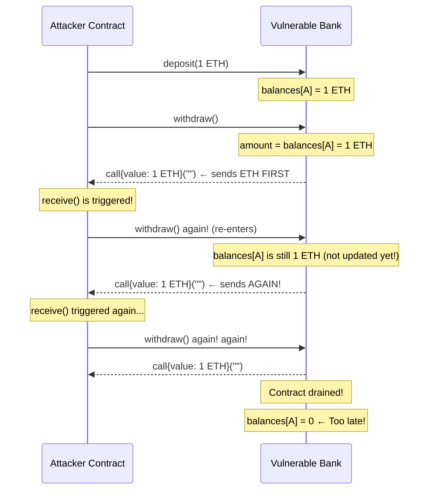

# 🔐 Chapter 15: Security in Solidity

> "Smart contracts are immutable. Once deployed, bugs become permanent money drains."

Solidity mein security koi "optional feature" nahi hai — yeh poori building ki foundation hai. Socho Node.js/Express wale world mein tumse ek bug ho gaya, toh kya karte ho? `git revert`, server restart, deploy — 5 minute ka kaam. Lekin blockchain pe aisa kuch nahi hota. Ek baar contract deploy ho gaya, toh woh **hamesha ke liye** wahi rahega. Koi rollback button nahi, koi hotfix nahi. Agar usme koi loophole hai, toh attackers use dhoondh lenge — guaranteed.

Is chapter mein hum Solidity ke sabse dangerous vulnerabilities dekhenge — woh kaise kaam karte hain, aur unse bachne ka tarika kya hai.

---

## Security Itni Important Kyun Hai?

| Hack | Year | Amount Lost |
|---|---|---|
| The DAO | 2016 | $60 million |
| Poly Network | 2021 | $611 million |
| Ronin Bridge | 2022 | $625 million |
| Wormhole | 2022 | $320 million |

Yeh koi rocket-science-level fancy attacks nahi the. Zyadatar simple, common patterns exploit hue the — jo har developer ko pata hone chahiye.

---

## 1. 🔄 Reentrancy Attack

### The DAO Hack ($60M in 2016)

The DAO (Decentralized Autonomous Organization) apne time ka sabse bada crowdfunding event tha — $150 million worth ka ETH raise hua tha. June 2016 mein ek attacker ne reentrancy vulnerability exploit karke $60 million nikaal liye, aur koi rok nahi paaya. Yeh event itna bada tha ki Ethereum ko hard fork karna pada — wahi se Ethereum (ETH) aur Ethereum Classic (ETC) alag hue.

### Reentrancy Kaam Kaise Karta Hai — Step by Step

Socho ek bank teller hai jo pehle tumhara balance check karta hai, phir tumhe cash deta hai, aur *uske baad* tumhara account update karke likhta hai "withdrawn". Ab agar tum teller ka haath pakad ke usse baar-baar pooch lo cash update hone se pehle hi — toh kya hoga?

Yehi hai reentrancy.

Step by step dekho kaise chalta hai:

1. Attacker ek vulnerable contract mein thoda sa ETH deposit karta hai.
2. Attacker `withdraw()` call karta hai.
3. Vulnerable contract attacker ke contract address pe ETH bhej deta hai.
4. Attacker ke contract mein ek `receive()` ya `fallback()` function hota hai jo turant `withdraw()` ko phir se call kar deta hai.
5. Kyunki victim contract ne abhi tak attacker ka balance update nahi kiya, usse abhi bhi lagta hai attacker ke paas funds hain.
6. Victim phir se ETH bhej deta hai. Steps 4-6 tab tak repeat hote hain jab tak contract khaali nahi ho jaata.
7. Saare recursive calls khatam hone ke baad hi victim contract balance update karne ki koshish karta hai — lekin tab tak bahut der ho chuki hoti hai.

Bilkul Zomato ke wallet system jaisa socho — agar refund process mein pehle paisa wallet mein credit ho jaye, aur "refund complete" flag baad mein set ho, toh tum wahi refund request 10 baar bhej ke 10x paisa le sakte ho, jab tak flag set na ho.

### Mermaid Sequence Diagram



### Vulnerable Code

```solidity
// VULNERABLE: Classic Reentrancy
contract VulnerableBank {
    mapping(address => uint256) public balances;

    function deposit() public payable {
        balances[msg.sender] += msg.value;
    }

    function withdraw() public {
        uint256 amount = balances[msg.sender];
        require(amount > 0, "Nothing to withdraw");

        // DANGER: Sends ETH BEFORE updating balance!
        // The attacker's receive() function fires here and calls withdraw() again.
        (bool success,) = msg.sender.call{value: amount}("");
        require(success, "Transfer failed");

        // This line only runs AFTER all re-entrant calls finish.
        balances[msg.sender] = 0; // Too late!
    }
}

// The attacker's weapon
contract Attacker {
    VulnerableBank public target;

    constructor(address _target) {
        target = VulnerableBank(_target);
    }

    function attack() public payable {
        target.deposit{value: msg.value}();
        target.withdraw();
    }

    // This is called every time the bank sends ETH to this contract
    receive() external payable {
        if (address(target).balance >= msg.value) {
            target.withdraw(); // Re-enter before balance is updated!
        }
    }
}
```

### Fix 1: Checks-Effects-Interactions (CEI) Pattern

Sabse fundamental fix: hamesha state pehle update karo, external call baad mein.

```solidity
// SECURE: Checks-Effects-Interactions Pattern
contract SecureBankCEI {
    mapping(address => uint256) public balances;

    function deposit() public payable {
        balances[msg.sender] += msg.value;
    }

    function withdraw() public {
        // 1. CHECK: Verify conditions
        uint256 amount = balances[msg.sender];
        require(amount > 0, "Nothing to withdraw");

        // 2. EFFECT: Update state BEFORE any external call
        balances[msg.sender] = 0; // Balance zeroed FIRST

        // 3. INTERACTION: Now it is safe to make the external call
        (bool success,) = payable(msg.sender).call{value: amount}("");
        require(success, "Transfer failed");
        // Even if attacker re-enters, balances[msg.sender] is already 0
    }
}
```

### Fix 2: ReentrancyGuard (Mutex Lock)

Ek mutex (mutual exclusion) lock function ko dobara enter hone se rok deta hai jab tak woh pehle se chal raha ho. Iska ek battle-tested version OpenZeppelin deta hai — use hi use karo, khud reinvent mat karo.

```solidity
// SECURE: Manual ReentrancyGuard
contract SecureBank {
    mapping(address => uint256) public balances;
    bool private locked; // The mutex

    modifier nonReentrant() {
        require(!locked, "Reentrant call detected");
        locked = true;  // Lock the door
        _;              // Execute the function body
        locked = false; // Unlock after done
    }

    function deposit() public payable {
        balances[msg.sender] += msg.value;
    }

    function withdraw() public nonReentrant {
        uint256 amount = balances[msg.sender];
        require(amount > 0, "Nothing to withdraw");

        // 1. EFFECT: update state first
        balances[msg.sender] = 0;

        // 2. INTERACTION: safe external call
        (bool success,) = payable(msg.sender).call{value: amount}("");
        require(success, "Transfer failed");
    }
}

// BEST PRACTICE: Use OpenZeppelin's ReentrancyGuard
import "@openzeppelin/contracts/security/ReentrancyGuard.sol";

contract BestPracticeBank is ReentrancyGuard {
    mapping(address => uint256) public balances;

    function deposit() public payable {
        balances[msg.sender] += msg.value;
    }

    function withdraw() public nonReentrant { // From OpenZeppelin
        uint256 amount = balances[msg.sender];
        require(amount > 0, "Nothing to withdraw");
        balances[msg.sender] = 0;
        (bool success,) = payable(msg.sender).call{value: amount}("");
        require(success, "Transfer failed");
    }
}
```

> [!tip]
> **Rule:** Jo bhi function ETH bhejta hai ya external contract ko call karta hai, usme CEI pattern AUR ReentrancyGuard dono use karo — dono ka combo hi asli safety hai.

---

## 2. ➕ Integer Overflow and Underflow

### Kya Hota Hai Pre-0.8 Vulnerability?

Solidity 0.8.0 se pehle, arithmetic mein overflow ya underflow ka koi check nahi hota tha. Numbers bas "wrap around" ho jaate the — bilkul purane car odometer jaisa jo 999999 ke baad wapas 000000 pe aa jaata hai.

```solidity
// VULNERABLE: Solidity < 0.8.0
pragma solidity ^0.7.0;

contract VulnerableToken {
    mapping(address => uint256) public balances;

    function transfer(address to, uint256 amount) public {
        // If balances[msg.sender] = 0 and amount = 1:
        // 0 - 1 = 2^256 - 1 (an astronomically huge number!)
        balances[msg.sender] -= amount; // UNDERFLOW: no check!
        balances[to] += amount;
    }
}
```

Socho tumhare Paytm wallet mein ₹0 balance hai aur tum ₹1 minus karne ki koshish karo — agar system underflow check na kare, toh ₹0 - ₹1 seedha ₹99,999,999... ban jaaye! Bilkul yehi hua tha 2018 mein BEC token hack mein — overflow exploit karke arabon tokens hawa se bana liye gaye the.

### Fix 1: SafeMath (Pre-0.8)

```solidity
// SECURE: Using SafeMath for Solidity < 0.8
pragma solidity ^0.7.0;

import "@openzeppelin/contracts/math/SafeMath.sol";

contract SafeToken {
    using SafeMath for uint256; // Attach SafeMath to uint256
    mapping(address => uint256) public balances;

    function transfer(address to, uint256 amount) public {
        // SafeMath reverts on overflow/underflow automatically
        balances[msg.sender] = balances[msg.sender].sub(amount);
        balances[to] = balances[to].add(amount);
    }
}
```

### Fix 2: Solidity 0.8+ Built-in Checks

```solidity
// SECURE: Solidity 0.8+ has overflow/underflow protection built in
pragma solidity ^0.8.0;

contract ModernToken {
    mapping(address => uint256) public balances;

    function transfer(address to, uint256 amount) public {
        // This automatically reverts if underflow occurs
        balances[msg.sender] -= amount;
        balances[to] += amount;
    }
}
```

### `unchecked` Block — Zara Sambhal Ke Use Karo

Kabhi-kabhi tumhe pata hota hai ki overflow ho hi nahi sakta, aur tum gas bachana chahte ho check skip karke:

```solidity
pragma solidity ^0.8.0;

contract GasOptimized {
    function sumArray(uint256[] memory arr) public pure returns (uint256 total) {
        for (uint256 i = 0; i < arr.length; ) {
            total += arr[i];
            unchecked {
                // Safe because i can never exceed arr.length
                // which is bounded by array size limits
                i++;
            }
        }
    }
}
```

> [!warning]
> **Rule:** `unchecked{}` sirf tab use karo jab tumne mathematically proof kar liya ho ki overflow/underflow impossible hai. User-supplied values pe kabhi mat use karo.

---

## 3. 🔑 Access Control Vulnerabilities

### Missing Access Control

```solidity
// VULNERABLE: Anyone can call selfdestruct!
contract VulnerableVault {
    address public owner;

    constructor() {
        owner = msg.sender;
    }

    // No access control! Any address can destroy this contract
    function destroy() public {
        selfdestruct(payable(msg.sender)); // Sends all ETH to caller!
    }

    // No access control! Anyone can drain funds
    function withdrawAll(address payable recipient) public {
        recipient.transfer(address(this).balance);
    }
}
```

Yeh bilkul waisa hai jaise tumhara ATM card ho aur PIN check hi na ho — koi bhi jaake paisa nikaal le. Har sensitive function ke aage guard lagana zaruri hai.

### tx.origin vs msg.sender — Auth Ke Liye Kabhi tx.origin Use Mat Karo

Yeh ek critical difference hai:

- `msg.sender` — jisne abhi-abhi tumhe call kiya (koi contract ho sakta hai ya user)
- `tx.origin` — asli human jisne poori transaction chain shuru ki (hamesha ek EOA — wallet address)

Isko aise socho: Swiggy pe tumne order kiya, order ne restaurant ko call kiya, restaurant ne delivery partner ko call kiya. `msg.sender` = jisne tumhe immediately call kiya (restaurant→delivery ke case mein restaurant). `tx.origin` = tum, jisne sabse pehle order daala. Agar koi beech mein fake restaurant tumhe trick karke apna link click karwa de, toh `tx.origin` phir bhi tumhi rahoge — chahe fraud beech mein ho raha ho.

```solidity
// VULNERABLE: tx.origin authentication
contract VulnerableWallet {
    address public owner;

    constructor() {
        owner = msg.sender;
    }

    function transfer(address payable dest, uint256 amount) public {
        // tx.origin is the human who started the chain of calls
        // An attacker contract can trick the owner into calling it,
        // and tx.origin will still be the owner!
        require(tx.origin == owner, "Not owner"); // WRONG!
        dest.transfer(amount);
    }
}

// The phishing attack
contract PhishingAttacker {
    VulnerableWallet public target;
    address payable public attacker;

    constructor(address _target) {
        target = VulnerableWallet(_target);
        attacker = payable(msg.sender);
    }

    // Owner is tricked into calling this (e.g., via a fake NFT claim)
    receive() external payable {
        // tx.origin is still the owner here!
        target.transfer(attacker, address(target).balance);
    }
}
```

```solidity
// SECURE: Always use msg.sender for authentication
contract SecureWallet {
    address public owner;

    constructor() {
        owner = msg.sender;
    }

    modifier onlyOwner() {
        require(msg.sender == owner, "Not owner");
        _;
    }

    function transfer(address payable dest, uint256 amount) public onlyOwner {
        dest.transfer(amount); // msg.sender must be owner
    }
}
```

### OpenZeppelin Ke Saath Proper Access Control

```solidity
import "@openzeppelin/contracts/access/Ownable.sol";
import "@openzeppelin/contracts/access/AccessControl.sol";

// Simple ownership
contract MyToken is Ownable {
    function mint(address to, uint256 amount) public onlyOwner {
        // Only the owner can mint
    }
}

// Role-based access (recommended for complex systems)
contract AdvancedProtocol is AccessControl {
    bytes32 public constant MINTER_ROLE = keccak256("MINTER_ROLE");
    bytes32 public constant PAUSER_ROLE = keccak256("PAUSER_ROLE");

    constructor() {
        _grantRole(DEFAULT_ADMIN_ROLE, msg.sender);
        _grantRole(MINTER_ROLE, msg.sender);
    }

    function mint(address to, uint256 amount) public onlyRole(MINTER_ROLE) {
        // Only MINTER_ROLE can call this
    }

    function pause() public onlyRole(PAUSER_ROLE) {
        // Only PAUSER_ROLE can call this
    }
}
```

Yeh bilkul CRED app jaisa hai — har role ka apna access level hota hai. Ek "admin" sab kuch kar sakta hai, ek "support agent" sirf refund process kar sakta hai, transaction delete nahi. `AccessControl` isi tarah ka role-based system deta hai.

---

## 4. 🏃 Front-Running (MEV)

### Front-Running Hai Kya?

Ethereum pe jo bhi transaction tum submit karte ho, woh block mein include hone se pehle ek public **mempool** mein jaake baithta hai. Bots (aur miners) is mempool ko dekhte rehte hain, aur woh:

1. Tumhara transaction dekh lete hain (jaise tum ek particular price pe token khareed rahe ho).
2. Usi jaisa transaction submit kar dete hain, lekin zyada gas fee ke saath.
3. Miners bot ka transaction pehle include karte hain kyunki woh zyada paisa de raha hai.
4. Tumhara transaction baad mein execute hota hai, worse price pe.

Isse kehte hain **MEV (Maximal Extractable Value)**.

Bilkul IRCTC Tatkal booking jaisa socho — tum form bhar rahe ho, aur koi bot tumhare click se pehle hi seat book kar leta hai kyunki uska server response zyada fast hai. Yahan bhi wahi race hai, bas paisa gas fee ke roop mein hai.

```
Mempool (public waiting room):
  Your tx:  buy TOKEN at price X (gas: 10 gwei)
  Bot sees your tx → submits: buy TOKEN at price X (gas: 50 gwei)
  
Block is mined:
  1. Bot's tx executes first  → token price rises
  2. Your tx executes after   → you pay MORE than expected
```

### Commit-Reveal Scheme

Sensitive operations ke liye (jaise lottery ya auction), ek do-step process use karo.

```solidity
// SECURE: Commit-Reveal Pattern for Blind Auction
contract BlindAuction {
    struct Bid {
        bytes32 commitment; // Hash of the real bid
        bool revealed;
    }

    mapping(address => Bid) public bids;
    uint256 public revealDeadline;
    uint256 public commitDeadline;
    address public highestBidder;
    uint256 public highestBid;

    // PHASE 1: Submit a commitment (a hash, not the real amount)
    function commit(bytes32 _commitment) public {
        require(block.timestamp < commitDeadline, "Commit phase over");
        // Hash is: keccak256(abi.encodePacked(bidAmount, secretSalt))
        // Bots cannot know the real bid from the hash!
        bids[msg.sender] = Bid(_commitment, false);
    }

    // PHASE 2: Reveal the real bid after commit phase ends
    function reveal(uint256 _bidAmount, bytes32 _salt) public payable {
        require(block.timestamp > commitDeadline, "Commit phase not over");
        require(block.timestamp < revealDeadline, "Reveal phase over");

        Bid storage bid = bids[msg.sender];
        require(!bid.revealed, "Already revealed");

        // Verify the reveal matches the commitment
        bytes32 commitment = keccak256(abi.encodePacked(_bidAmount, _salt));
        require(commitment == bid.commitment, "Invalid reveal");

        bid.revealed = true;
        if (_bidAmount > highestBid) {
            highestBid = _bidAmount;
            highestBidder = msg.sender;
        }
    }
}
```

Idea simple hai — pehle tum apna asli bid ek hash ke roop mein "seal" kar dete ho (commit), kisi ko pata nahi chalta amount kya hai. Baad mein, jab commit phase khatam ho jaaye, tum asli amount reveal karte ho. Bots ko manipulate karne ka koi chance nahi milta kyunki unhe pata hi nahi asli number kya tha.

---

## 5. ⏱️ Timestamp Manipulation

### Problem Kya Hai?

`block.timestamp` woh miner set karta hai jo block mine kar raha hai. Miners ise thode seconds (Ethereum pe generally ~15 seconds tak) adjust kar sakte hain. Isliye precise timing ya randomness ke liye yeh unreliable hai.

```solidity
// VULNERABLE: Timestamp used for critical logic
contract BadLottery {
    function isWinner() public view returns (bool) {
        // A miner could choose to include this transaction when
        // block.timestamp % 7 == 0, winning on demand!
        return block.timestamp % 7 == 0;
    }

    // ALSO BAD: Using timestamp for short time windows
    function timeLockedAction() public {
        // A miner can manipulate by a few seconds to bypass or trigger this
        require(block.timestamp == targetTime, "Not the right time");
    }
}
```

### Timestamps Ka Safe Use

```solidity
// ACCEPTABLE: Timestamps for long durations (hours, days)
contract TimeLock {
    uint256 public constant LOCK_PERIOD = 7 days; // 7 days is fine
    uint256 public lockEnd;

    constructor() {
        lockEnd = block.timestamp + LOCK_PERIOD;
    }

    function unlock() public {
        // A few seconds of drift does not matter over 7 days
        require(block.timestamp >= lockEnd, "Still locked");
        // ...
    }
}
```

> [!info]
> **Rule:** `block.timestamp` ka use ghanton ya dinon wali durations ke liye karo. Second-level precision ya randomness ke liye kabhi bharosa mat karo.

---

## 6. 🎲 Weak Randomness

### On-Chain Randomness Itni Mushkil Kyun Hai?

Blockchain pe sab kuch deterministic aur public hota hai. Asli randomness jaisi cheez hoti hi nahi.

```solidity
// VULNERABLE: Fake randomness (all of these are predictable or manipulable)
contract BadRNG {
    function roll() public view returns (uint256) {
        // Miners control block.difficulty and block.timestamp
        // block.blockhash is public
        // All of these are known before the transaction executes!
        return uint256(
            keccak256(abi.encodePacked(
                block.timestamp,
                block.difficulty,
                block.number,
                msg.sender
            ))
        ) % 6;
    }
}
```

Ek miner pehle se dekh sakta hai result kya aayega, aur apni marzi se block include ya discard kar sakta hai apne favour mein outcome laane ke liye. Yeh bilkul waisa hai jaise koi Ludo game mein dice pehle se dekh ke roll kare.

### Fix: Chainlink VRF (Verifiable Random Function)

```solidity
// SECURE: Using Chainlink VRF for provably fair randomness
import "@chainlink/contracts/src/v0.8/VRFConsumerBase.sol";

contract FairLottery is VRFConsumerBase {
    bytes32 internal keyHash;
    uint256 internal fee;
    uint256 public randomResult;

    constructor()
        VRFConsumerBase(
            0x514910771AF9Ca656af840dff83E8264EcF986CA, // VRF Coordinator
            0x514910771AF9Ca656af840dff83E8264EcF986CA  // LINK token
        )
    {
        keyHash = 0x6c3699283bda56ad74f6b855546325b68d482e983852a7a82979cc4807b641f4;
        fee = 0.1 * 10 ** 18; // 0.1 LINK
    }

    function rollDice() public returns (bytes32 requestId) {
        // Requests randomness from Chainlink oracle
        // The result cannot be predicted or manipulated
        return requestRandomness(keyHash, fee);
    }

    // Chainlink calls this function with the provably random number
    function fulfillRandomness(bytes32 requestId, uint256 randomness) internal override {
        randomResult = (randomness % 6) + 1; // 1-6 dice roll
    }
}
```

---

## 7. 🚫 Denial of Service (DoS)

### Loop DoS — Unbounded Loops

Agar attacker tumhare array ko infinitely bada kar sakta hai, toh us array pe loop chalane wale functions eventually block gas limit se zyada gas maang lenge, aur permanently break ho jaayenge.

```solidity
// VULNERABLE: Loop over a user-controlled array
contract VulnerableAirdrop {
    address[] public recipients;

    function addRecipient(address addr) public {
        recipients.push(addr); // Anyone can add to this array!
    }

    function distributeAirdrop() public {
        // If recipients has 10,000 entries, this runs out of gas!
        for (uint256 i = 0; i < recipients.length; i++) {
            payable(recipients[i]).transfer(1 ether);
        }
    }
}
```

### Fix: Pull Over Push Pattern

Contract khud sabko funds "push" karne ki jagah, har user apna paisa khud "pull" kare — yeh better approach hai.

```solidity
// SECURE: Pull-over-push pattern
contract SecureAirdrop {
    mapping(address => uint256) public pendingWithdrawals;

    // Owner loads the airdrop amounts (off-chain computed)
    function loadAirdrop(address[] calldata users, uint256[] calldata amounts) public {
        require(users.length == amounts.length, "Length mismatch");
        for (uint256 i = 0; i < users.length; i++) {
            pendingWithdrawals[users[i]] += amounts[i];
        }
    }

    // Each user pulls their own funds — no more loop DoS!
    function claimAirdrop() public {
        uint256 amount = pendingWithdrawals[msg.sender];
        require(amount > 0, "Nothing to claim");
        pendingWithdrawals[msg.sender] = 0; // CEI pattern
        payable(msg.sender).transfer(amount);
    }
}
```

Bilkul Flipkart ke "cashback wallet" jaisa socho — Flipkart tumhe seedha bank account mein cashback push nahi karta, balki wallet mein credit kar deta hai aur tum jab chaho withdraw karo. Isse Flipkart ko ek saath lakhon logon ko transfer karne ka load nahi uthana padta.

### ETH Transfer DoS — Blocking Receive

Jis contract mein `receive()` ya `fallback()` function nahi hai, woh ETH bheje jaane pe revert ho jaayega. Agar tumhara logic kisi successful `transfer` pe depend karta hai, toh ek hi bura recipient sab kuch break kar sakta hai.

```solidity
// VULNERABLE: Transfer to winner can fail if winner is a contract
contract VulnerableAuction {
    address public highestBidder;
    uint256 public highestBid;

    function bid() public payable {
        require(msg.value > highestBid, "Bid too low");
        // If highestBidder is a contract that rejects ETH,
        // this transfer reverts, and nobody can ever outbid!
        payable(highestBidder).transfer(highestBid); // DANGER
        highestBidder = msg.sender;
        highestBid = msg.value;
    }
}
```

```solidity
// SECURE: Pull pattern for auctions
contract SecureAuction {
    address public highestBidder;
    uint256 public highestBid;
    mapping(address => uint256) public refunds;

    function bid() public payable {
        require(msg.value > highestBid, "Bid too low");
        // Store the old highest bid for the previous bidder to claim
        refunds[highestBidder] += highestBid;
        highestBidder = msg.sender;
        highestBid = msg.value;
    }

    // Previous bidders pull their refunds themselves
    function withdrawRefund() public {
        uint256 amount = refunds[msg.sender];
        require(amount > 0, "No refund");
        refunds[msg.sender] = 0; // CEI pattern
        payable(msg.sender).transfer(amount);
    }
}
```

---

## 8. 📞 Unchecked External Calls

### Ignore Ki Gayi Return Value

Low-level `.call()` failure pe khud revert nahi karta — yeh `(bool success, bytes memory data)` return karta hai. Agar tum `success` ko ignore karte ho, toh tumhara contract failed transfer ke baad bhi chupchap aage badh jaata hai.

```solidity
// VULNERABLE: Return value ignored
contract UncheckedCall {
    function sendReward(address payable winner, uint256 amount) public {
        // call() returns false on failure but never reverts by itself!
        winner.call{value: amount}(""); // Return value IGNORED!
        // Execution continues even if the transfer failed
    }
}

// Also vulnerable: send() and transfer() have their own issues
contract OldStyle {
    function sendBad(address payable to, uint256 amount) public {
        to.send(amount); // Returns bool, but nobody checks it here!
    }
}
```

Yeh bilkul waisa hai jaise UPI payment fail ho jaaye lekin app ko pata hi na chale, aur woh "order confirmed" dikha de. Return value check karna mandatory hai.

```solidity
// SECURE: Always check return values
contract CheckedCall {
    function sendReward(address payable winner, uint256 amount) public {
        (bool success, ) = winner.call{value: amount}("");
        require(success, "ETH transfer failed"); // Always check!
    }

    // Even better: use a custom error for gas efficiency
    error TransferFailed(address recipient, uint256 amount);

    function sendRewardGasOptimized(address payable winner, uint256 amount) public {
        (bool success, ) = winner.call{value: amount}("");
        if (!success) revert TransferFailed(winner, amount);
    }
}
```

> [!warning]
> **Rule:** `.send()` kabhi mat use karo (yeh chupchap fail ho jaata hai). Hamesha `.call{value: ...}("")` use karo AUR return value check karo.

---

## 9. ⚡ Flash Loan Attacks (Conceptual)

Flash loans se koi bhi amount ka ETH ya token ek hi transaction ke andar borrow kiya ja sakta hai, bas condition itni hai ki transaction khatam hone se pehle poora amount wapas karna hoga. Iske liye zero collateral chahiye.

**Attackers inhe weaponize kaise karte hain:**

```
1. Borrow $100M in a single transaction (no collateral needed)
2. Use the $100M to manipulate a price oracle (e.g., inflate a token's price)
3. Use the inflated price to borrow against it, draining a protocol
4. Repay the $100M loan
5. Keep the profit
```

Socho koi tumhe ek din ke liye ₹100 crore udhaar de de, condition sirf itni ki shaam tak wapas kar do. Us ₹100 crore se tum market mein ek chhote token ka price artificially bahut upar chadha do, phir usi inflated price ke against loan lekar asli protocol se paisa nikaal lo, apna udhaar wapas kar do — aur profit jeb mein. Yeh sab ek hi transaction mein hota hai, isliye koi beech mein rok nahi sakta.

### Defense Strategies

- **Time-weighted average price (TWAP) oracles use karo** — jaise Uniswap V3 TWAP, spot price ki jagah. Yeh time ke saath average price lete hain, jisse manipulation bahut mehenga ho jaata hai.
- **Chainlink price feeds use karo** — off-chain data multiple nodes se aata hai, jisse on-chain trades manipulate nahi kar sakte.
- **Sanity checks add karo** — agar price ek hi block mein X% se zyada move ho jaaye, toh kuch gadbad hai.

```solidity
// BETTER: Use Chainlink for price data instead of DEX spot price
import "@chainlink/contracts/src/v0.8/interfaces/AggregatorV3Interface.sol";

contract SafeLendingProtocol {
    AggregatorV3Interface internal priceFeed;

    constructor(address _priceFeed) {
        priceFeed = AggregatorV3Interface(_priceFeed);
    }

    function getPrice() public view returns (int256) {
        (, int256 price,,,) = priceFeed.latestRoundData();
        return price; // From Chainlink: cannot be flash-loan manipulated
    }
}
```

---

## 10. ✅ The Checks-Effects-Interactions (CEI) Pattern

Yeh Solidity security ka sabse important pattern hai. Ise yaad kar lo aur har jagah apply karo.

```
CHECK  → Verify all conditions (require, revert)
EFFECT → Update your contract's state
INTERACT → Call external contracts or send ETH
```

```solidity
// TEMPLATE: Every state-changing function should follow this order

contract CEITemplate {
    mapping(address => uint256) public balances;
    bool private locked;

    modifier nonReentrant() {
        require(!locked, "No reentrant calls");
        locked = true;
        _;
        locked = false;
    }

    function exampleWithdraw(uint256 amount) external nonReentrant {
        // ==================== CHECK ====================
        // Validate all preconditions FIRST
        require(amount > 0, "Amount must be positive");
        require(balances[msg.sender] >= amount, "Insufficient balance");
        require(address(this).balance >= amount, "Contract has no funds");

        // ==================== EFFECT ====================
        // Update ALL state variables BEFORE any external calls
        balances[msg.sender] -= amount;
        // (Update any other state here too)

        // ==================== INTERACTION ====================
        // Make external calls LAST
        (bool success,) = payable(msg.sender).call{value: amount}("");
        require(success, "Transfer failed");
    }
}
```

---

## 🛡️ Security Checklist

Koi bhi contract deploy karne se pehle yeh checklist use karo:

### Reentrancy
- [ ] ETH bhejne wale saare functions CEI pattern follow karte hain
- [ ] External contracts call karne wale functions mein `nonReentrant` modifier hai
- [ ] OpenZeppelin ka `ReentrancyGuard` import aur inherit kiya gaya hai

### Arithmetic
- [ ] Solidity 0.8+ use ho raha hai (built-in overflow protection)
- [ ] Har `unchecked{}` block mein clear comment hai ki woh safe kyun hai
- [ ] User-supplied values pe `unchecked{}` nahi hai

### Access Control
- [ ] Har sensitive function ke paas access modifier hai (`onlyOwner`, `onlyRole`)
- [ ] `tx.origin` authentication ke liye kahin bhi use NAHI hua
- [ ] Constructor correctly initial ownership set karta hai
- [ ] Ownership transfer ek two-step process hai (propose + accept)

### External Calls
- [ ] Saare `.call()` return values `require(success, ...)` se check hote hain
- [ ] `.send()` kahin bhi use nahi hua
- [ ] External contract calls sabse LAST mein hote hain (CEI pattern)

### DoS Protection
- [ ] User-controlled arrays pe koi unbounded loop nahi hai
- [ ] ETH distribution pull-over-push pattern use karta hai
- [ ] Koi critical logic external call ke success pe depend nahi karta

### Randomness and Oracles
- [ ] `block.timestamp` ya `block.difficulty` se koi randomness derive nahi hoti
- [ ] Kisi bhi lottery/game randomness ke liye Chainlink VRF use hua hai
- [ ] DEX spot price ki jagah Chainlink price feeds use hue hain
- [ ] Koi flash-loan manipulable price source nahi hai

### Front-Running
- [ ] Sensitive operations mein zaroorat pe commit-reveal scheme use hui hai
- [ ] Order-sensitive transactions mein slippage protection hai

### General
- [ ] Mainnet deploy karne se pehle contract ka professional firm se audit hua hai
- [ ] Testnet pe adversarial conditions mein test kiya gaya hai
- [ ] Emergency pause mechanism hai (OpenZeppelin `Pausable`)
- [ ] Agar koi upgrade mechanism hai, toh woh access-controlled hai

---

## 💡 Key Takeaways

1. **Reentrancy hi #1 killer hai.** Hamesha CEI pattern + ReentrancyGuard use karo. External call se pehle state update karo.

2. **Solidity 0.8+ use karo.** Overflow/underflow protection tumhe free mein milta hai. `unchecked{}` tab tak avoid karo jab tak pakka pata na ho ki safe hai.

3. **Authentication ke liye tx.origin kabhi mat use karo.** Yeh phishing contracts ke through spoof ho sakta hai. Hamesha `msg.sender` use karo.

4. **Block values random nahi hote.** Miners `block.timestamp` aur `block.difficulty` control karte hain. Chainlink VRF use karo.

5. **Payments ke liye push nahi, pull use karo.** ETH bhejne ke liye arrays pe loop kabhi mat chalao. Users ko apna paisa khud withdraw karne do.

6. **Return values hamesha check karo.** `.call()` failure pe chupchap false return karta hai. `require(success)` optional nahi hai.

7. **Flash loans har vulnerability ko amplify karte hain.** Manipulation-resistant price oracles (Chainlink, TWAP) use karo.

8. **CEI pattern har jagah apply hota hai.** Check → Effect → Interact. Isi order mein. Har baar.

9. **Audited libraries use karo.** OpenZeppelin hazaaron projects mein battle-tested hai. Security primitives khud reinvent mat karo.

10. **Professional audit karwao.** Expert teams bhi vulnerabilities miss kar dete hain. Significant value deploy karne se pehle auditors hire karo.

---

## 📝 Quiz

**Question 1**

Is code mein kya galat hai?

```solidity
function withdraw() public {
    uint256 amount = balances[msg.sender];
    (bool ok,) = msg.sender.call{value: amount}("");
    require(ok);
    balances[msg.sender] = 0;
}
```

A) `require` call se pehle aana chahiye  
B) Balance ETH bhejne ke baad zero hota hai, isse reentrancy vulnerability ban jaati hai  
C) `msg.sender.call` ki jagah `msg.sender.transfer` hona chahiye  
D) Kuch bhi galat nahi hai

<details>
<summary>Answer</summary>
**B** — Balance update ETH transfer ke BAAD hota hai. Attacker ka `receive()` function balance zero hone se pehle hi `withdraw()` ko dobara call kar sakta hai, aur contract drain ho jaata hai. Fix: call se pehle balance zero karo.
</details>

---

**Question 2**

In mein se kaunsa Solidity contract mein secure randomness ka valid source hai?

A) `block.timestamp % 100`  
B) `keccak256(abi.encodePacked(block.number, msg.sender))`  
C) Chainlink VRF  
D) `block.difficulty`

<details>
<summary>Answer</summary>
**C** — Chainlink VRF off-chain sources se verifiable, tamper-proof randomness deta hai. Options A, B, aur D — teeno miners ke liye predictable hain ya koi bhi pehle se compute kar sakta hai.
</details>

---

**Question 3**

Owner check karne ke liye `tx.origin` kabhi kyun use nahi karna chahiye?

A) Yeh Solidity 0.8 mein deprecated ho gaya hai  
B) Ek malicious contract owner ko trick karke usse call karwa sakta hai, aur `tx.origin` phir bhi owner ka address rahega  
C) Contract-to-contract calls ke liye `tx.origin` hamesha `address(0)` hota hai  
D) Yeh `msg.sender` se zyada gas leta hai

<details>
<summary>Answer</summary>
**B** — `tx.origin` hamesha wahi asli EOA (human wallet) hota hai jisne poori transaction chain shuru ki thi. Ek attacker phishing contract deploy karke owner ko trick karke usse call karwa sakta hai, aur andar se tumhare contract ko call kar sakta hai — `tx.origin` check pass ho jaayega owner ke naam se, jabki `msg.sender` sahi tarike se attacker ke contract address ko dikhata. Hamesha `msg.sender` use karo.
</details>

---

*Next chapter: Gas Optimization — Efficient Solidity likhna jo tumhare users ke wallets ko na jalaye.*
