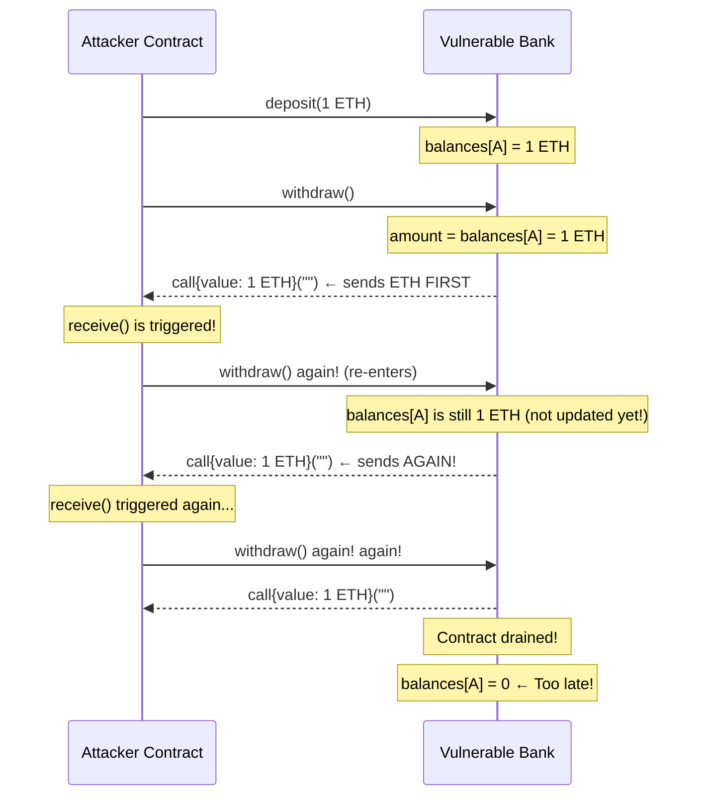

# 🔐 Chapter 15: Security in Solidity

> "Smart contracts are immutable. Once deployed, bugs become permanent money drains."

Smart contract security is not optional — it is the foundation of everything you build on-chain. Unlike traditional software where a bug fix is a server patch away, a deployed Solidity contract lives forever on the blockchain. If it has a vulnerability, attackers will find it, and there is no "rollback" button.

This chapter walks through the most critical vulnerabilities in Solidity, how they work, and how to defend against them.

---

## Why Security Matters So Much

| Hack | Year | Amount Lost |
|---|---|---|
| The DAO | 2016 | $60 million |
| Poly Network | 2021 | $611 million |
| Ronin Bridge | 2022 | $625 million |
| Wormhole | 2022 | $320 million |

These were not exotic, theoretical attacks. Most exploited simple patterns that every developer must understand.

---

## 1. 🔄 Reentrancy Attack

### The DAO Hack ($60M in 2016)

The DAO (Decentralized Autonomous Organization) was one of the largest crowdfunding events in history, raising $150 million worth of ETH. In June 2016, an attacker exploited a reentrancy vulnerability and drained $60 million before anyone could stop it. This single event was so devastating it caused Ethereum to hard fork into Ethereum (ETH) and Ethereum Classic (ETC).

### How Reentrancy Works — Step by Step

Imagine a bank teller who checks your balance, hands you the cash, and *then* marks your account as withdrawn. What if you could grab the teller's hand and ask again before they make the mark?

That is reentrancy.

Here is how it plays out:

1. Attacker deposits a small amount of ETH into a vulnerable contract.
2. Attacker calls `withdraw()`.
3. The vulnerable contract sends ETH to the attacker's contract address.
4. The attacker's contract has a `receive()` or `fallback()` function that immediately calls `withdraw()` again.
5. Because the victim contract has NOT updated the attacker's balance yet, it still thinks the attacker has funds.
6. The victim sends ETH again. Steps 4–6 repeat until the contract is empty.
7. Only after the recursive calls finish does the victim contract try to update the balance — but it is too late.

### Mermaid Sequence Diagram



### Vulnerable Code

```solidity
// VULNERABLE: Classic Reentrancy
contract VulnerableBank {
    mapping(address => uint256) public balances;

    function deposit() public payable {
        balances[msg.sender] += msg.value;
    }

    function withdraw() public {
        uint256 amount = balances[msg.sender];
        require(amount > 0, "Nothing to withdraw");

        // DANGER: Sends ETH BEFORE updating balance!
        // The attacker's receive() function fires here and calls withdraw() again.
        (bool success,) = msg.sender.call{value: amount}("");
        require(success, "Transfer failed");

        // This line only runs AFTER all re-entrant calls finish.
        balances[msg.sender] = 0; // Too late!
    }
}

// The attacker's weapon
contract Attacker {
    VulnerableBank public target;

    constructor(address _target) {
        target = VulnerableBank(_target);
    }

    function attack() public payable {
        target.deposit{value: msg.value}();
        target.withdraw();
    }

    // This is called every time the bank sends ETH to this contract
    receive() external payable {
        if (address(target).balance >= msg.value) {
            target.withdraw(); // Re-enter before balance is updated!
        }
    }
}
```

### Fix 1: Checks-Effects-Interactions (CEI) Pattern

The most fundamental fix: always update state BEFORE making external calls.

```solidity
// SECURE: Checks-Effects-Interactions Pattern
contract SecureBankCEI {
    mapping(address => uint256) public balances;

    function deposit() public payable {
        balances[msg.sender] += msg.value;
    }

    function withdraw() public {
        // 1. CHECK: Verify conditions
        uint256 amount = balances[msg.sender];
        require(amount > 0, "Nothing to withdraw");

        // 2. EFFECT: Update state BEFORE any external call
        balances[msg.sender] = 0; // Balance zeroed FIRST

        // 3. INTERACTION: Now it is safe to make the external call
        (bool success,) = payable(msg.sender).call{value: amount}("");
        require(success, "Transfer failed");
        // Even if attacker re-enters, balances[msg.sender] is already 0
    }
}
```

### Fix 2: ReentrancyGuard (Mutex Lock)

A mutex (mutual exclusion) lock prevents a function from being entered while it is already executing. OpenZeppelin provides a battle-tested version.

```solidity
// SECURE: Manual ReentrancyGuard
contract SecureBank {
    mapping(address => uint256) public balances;
    bool private locked; // The mutex

    modifier nonReentrant() {
        require(!locked, "Reentrant call detected");
        locked = true;  // Lock the door
        _;              // Execute the function body
        locked = false; // Unlock after done
    }

    function deposit() public payable {
        balances[msg.sender] += msg.value;
    }

    function withdraw() public nonReentrant {
        uint256 amount = balances[msg.sender];
        require(amount > 0, "Nothing to withdraw");

        // 1. EFFECT: update state first
        balances[msg.sender] = 0;

        // 2. INTERACTION: safe external call
        (bool success,) = payable(msg.sender).call{value: amount}("");
        require(success, "Transfer failed");
    }
}

// BEST PRACTICE: Use OpenZeppelin's ReentrancyGuard
import "@openzeppelin/contracts/security/ReentrancyGuard.sol";

contract BestPracticeBank is ReentrancyGuard {
    mapping(address => uint256) public balances;

    function deposit() public payable {
        balances[msg.sender] += msg.value;
    }

    function withdraw() public nonReentrant { // From OpenZeppelin
        uint256 amount = balances[msg.sender];
        require(amount > 0, "Nothing to withdraw");
        balances[msg.sender] = 0;
        (bool success,) = payable(msg.sender).call{value: amount}("");
        require(success, "Transfer failed");
    }
}
```

> **Rule:** Always use CEI pattern AND ReentrancyGuard for functions that send ETH or call external contracts.

---

## 2. ➕ Integer Overflow and Underflow

### The Pre-0.8 Vulnerability

Before Solidity 0.8.0, arithmetic did not check for overflow or underflow. Numbers just "wrapped around" like an odometer.

```solidity
// VULNERABLE: Solidity < 0.8.0
pragma solidity ^0.7.0;

contract VulnerableToken {
    mapping(address => uint256) public balances;

    function transfer(address to, uint256 amount) public {
        // If balances[msg.sender] = 0 and amount = 1:
        // 0 - 1 = 2^256 - 1 (an astronomically huge number!)
        balances[msg.sender] -= amount; // UNDERFLOW: no check!
        balances[to] += amount;
    }
}
```

The BEC token hack in 2018 exploited overflow to generate billions of tokens from nothing.

### Fix 1: SafeMath (Pre-0.8)

```solidity
// SECURE: Using SafeMath for Solidity < 0.8
pragma solidity ^0.7.0;

import "@openzeppelin/contracts/math/SafeMath.sol";

contract SafeToken {
    using SafeMath for uint256; // Attach SafeMath to uint256
    mapping(address => uint256) public balances;

    function transfer(address to, uint256 amount) public {
        // SafeMath reverts on overflow/underflow automatically
        balances[msg.sender] = balances[msg.sender].sub(amount);
        balances[to] = balances[to].add(amount);
    }
}
```

### Fix 2: Solidity 0.8+ Built-in Checks

```solidity
// SECURE: Solidity 0.8+ has overflow/underflow protection built in
pragma solidity ^0.8.0;

contract ModernToken {
    mapping(address => uint256) public balances;

    function transfer(address to, uint256 amount) public {
        // This automatically reverts if underflow occurs
        balances[msg.sender] -= amount;
        balances[to] += amount;
    }
}
```

### The `unchecked` Block — Use With Caution

Sometimes you know overflow cannot happen, and you want to save gas by skipping the checks:

```solidity
pragma solidity ^0.8.0;

contract GasOptimized {
    function sumArray(uint256[] memory arr) public pure returns (uint256 total) {
        for (uint256 i = 0; i < arr.length; ) {
            total += arr[i];
            unchecked {
                // Safe because i can never exceed arr.length
                // which is bounded by array size limits
                i++;
            }
        }
    }
}
```

> **Rule:** Only use `unchecked{}` when you have mathematically proven that overflow/underflow is impossible. Never use it on user-supplied values.

---

## 3. 🔑 Access Control Vulnerabilities

### Missing Access Control

```solidity
// VULNERABLE: Anyone can call selfdestruct!
contract VulnerableVault {
    address public owner;

    constructor() {
        owner = msg.sender;
    }

    // No access control! Any address can destroy this contract
    function destroy() public {
        selfdestruct(payable(msg.sender)); // Sends all ETH to caller!
    }

    // No access control! Anyone can drain funds
    function withdrawAll(address payable recipient) public {
        recipient.transfer(address(this).balance);
    }
}
```

### tx.origin vs msg.sender — NEVER Use tx.origin for Auth

This is a critical distinction:

- `msg.sender` — the immediate caller (could be a contract or a user)
- `tx.origin` — the original human who started the transaction (always an EOA)

```solidity
// VULNERABLE: tx.origin authentication
contract VulnerableWallet {
    address public owner;

    constructor() {
        owner = msg.sender;
    }

    function transfer(address payable dest, uint256 amount) public {
        // tx.origin is the human who started the chain of calls
        // An attacker contract can trick the owner into calling it,
        // and tx.origin will still be the owner!
        require(tx.origin == owner, "Not owner"); // WRONG!
        dest.transfer(amount);
    }
}

// The phishing attack
contract PhishingAttacker {
    VulnerableWallet public target;
    address payable public attacker;

    constructor(address _target) {
        target = VulnerableWallet(_target);
        attacker = payable(msg.sender);
    }

    // Owner is tricked into calling this (e.g., via a fake NFT claim)
    receive() external payable {
        // tx.origin is still the owner here!
        target.transfer(attacker, address(target).balance);
    }
}
```

```solidity
// SECURE: Always use msg.sender for authentication
contract SecureWallet {
    address public owner;

    constructor() {
        owner = msg.sender;
    }

    modifier onlyOwner() {
        require(msg.sender == owner, "Not owner");
        _;
    }

    function transfer(address payable dest, uint256 amount) public onlyOwner {
        dest.transfer(amount); // msg.sender must be owner
    }
}
```

### Proper Access Control with OpenZeppelin

```solidity
import "@openzeppelin/contracts/access/Ownable.sol";
import "@openzeppelin/contracts/access/AccessControl.sol";

// Simple ownership
contract MyToken is Ownable {
    function mint(address to, uint256 amount) public onlyOwner {
        // Only the owner can mint
    }
}

// Role-based access (recommended for complex systems)
contract AdvancedProtocol is AccessControl {
    bytes32 public constant MINTER_ROLE = keccak256("MINTER_ROLE");
    bytes32 public constant PAUSER_ROLE = keccak256("PAUSER_ROLE");

    constructor() {
        _grantRole(DEFAULT_ADMIN_ROLE, msg.sender);
        _grantRole(MINTER_ROLE, msg.sender);
    }

    function mint(address to, uint256 amount) public onlyRole(MINTER_ROLE) {
        // Only MINTER_ROLE can call this
    }

    function pause() public onlyRole(PAUSER_ROLE) {
        // Only PAUSER_ROLE can call this
    }
}
```

---

## 4. 🏃 Front-Running (MEV)

### What Is Front-Running?

Every transaction you submit to Ethereum goes into the public **mempool** before it is included in a block. Bots (and miners) monitor this mempool and can:

1. See your transaction (e.g., you are buying a token at a certain price).
2. Submit a similar transaction with a higher gas fee.
3. Miners include the bot's transaction first because it pays more.
4. Your transaction executes at a worse price.

This is called **MEV (Maximal Extractable Value)**.

```
Mempool (public waiting room):
  Your tx:  buy TOKEN at price X (gas: 10 gwei)
  Bot sees your tx → submits: buy TOKEN at price X (gas: 50 gwei)
  
Block is mined:
  1. Bot's tx executes first  → token price rises
  2. Your tx executes after   → you pay MORE than expected
```

### Commit-Reveal Scheme

For sensitive operations (like a lottery or auction), use a two-step process:

```solidity
// SECURE: Commit-Reveal Pattern for Blind Auction
contract BlindAuction {
    struct Bid {
        bytes32 commitment; // Hash of the real bid
        bool revealed;
    }

    mapping(address => Bid) public bids;
    uint256 public revealDeadline;
    uint256 public commitDeadline;
    address public highestBidder;
    uint256 public highestBid;

    // PHASE 1: Submit a commitment (a hash, not the real amount)
    function commit(bytes32 _commitment) public {
        require(block.timestamp < commitDeadline, "Commit phase over");
        // Hash is: keccak256(abi.encodePacked(bidAmount, secretSalt))
        // Bots cannot know the real bid from the hash!
        bids[msg.sender] = Bid(_commitment, false);
    }

    // PHASE 2: Reveal the real bid after commit phase ends
    function reveal(uint256 _bidAmount, bytes32 _salt) public payable {
        require(block.timestamp > commitDeadline, "Commit phase not over");
        require(block.timestamp < revealDeadline, "Reveal phase over");

        Bid storage bid = bids[msg.sender];
        require(!bid.revealed, "Already revealed");

        // Verify the reveal matches the commitment
        bytes32 commitment = keccak256(abi.encodePacked(_bidAmount, _salt));
        require(commitment == bid.commitment, "Invalid reveal");

        bid.revealed = true;
        if (_bidAmount > highestBid) {
            highestBid = _bidAmount;
            highestBidder = msg.sender;
        }
    }
}
```

---

## 5. ⏱️ Timestamp Manipulation

### The Problem

`block.timestamp` is set by the miner who mines the block. Miners can adjust it by a few seconds (typically up to ~15 seconds on Ethereum). This makes it unreliable for anything requiring precise timing or randomness.

```solidity
// VULNERABLE: Timestamp used for critical logic
contract BadLottery {
    function isWinner() public view returns (bool) {
        // A miner could choose to include this transaction when
        // block.timestamp % 7 == 0, winning on demand!
        return block.timestamp % 7 == 0;
    }

    // ALSO BAD: Using timestamp for short time windows
    function timeLockedAction() public {
        // A miner can manipulate by a few seconds to bypass or trigger this
        require(block.timestamp == targetTime, "Not the right time");
    }
}
```

### Safe Usage of Timestamps

```solidity
// ACCEPTABLE: Timestamps for long durations (hours, days)
contract TimeLock {
    uint256 public constant LOCK_PERIOD = 7 days; // 7 days is fine
    uint256 public lockEnd;

    constructor() {
        lockEnd = block.timestamp + LOCK_PERIOD;
    }

    function unlock() public {
        // A few seconds of drift does not matter over 7 days
        require(block.timestamp >= lockEnd, "Still locked");
        // ...
    }
}
```

> **Rule:** Use `block.timestamp` for durations of hours or longer. Never rely on it for second-level precision or randomness.

---

## 6. 🎲 Weak Randomness

### Why On-Chain Randomness Is Hard

Everything on a blockchain is deterministic and public. There is no true randomness.

```solidity
// VULNERABLE: Fake randomness (all of these are predictable or manipulable)
contract BadRNG {
    function roll() public view returns (uint256) {
        // Miners control block.difficulty and block.timestamp
        // block.blockhash is public
        // All of these are known before the transaction executes!
        return uint256(
            keccak256(abi.encodePacked(
                block.timestamp,
                block.difficulty,
                block.number,
                msg.sender
            ))
        ) % 6;
    }
}
```

A miner can see what the result would be and choose to include or discard the block to get the outcome they want.

### Fix: Chainlink VRF (Verifiable Random Function)

```solidity
// SECURE: Using Chainlink VRF for provably fair randomness
import "@chainlink/contracts/src/v0.8/VRFConsumerBase.sol";

contract FairLottery is VRFConsumerBase {
    bytes32 internal keyHash;
    uint256 internal fee;
    uint256 public randomResult;

    constructor()
        VRFConsumerBase(
            0x514910771AF9Ca656af840dff83E8264EcF986CA, // VRF Coordinator
            0x514910771AF9Ca656af840dff83E8264EcF986CA  // LINK token
        )
    {
        keyHash = 0x6c3699283bda56ad74f6b855546325b68d482e983852a7a82979cc4807b641f4;
        fee = 0.1 * 10 ** 18; // 0.1 LINK
    }

    function rollDice() public returns (bytes32 requestId) {
        // Requests randomness from Chainlink oracle
        // The result cannot be predicted or manipulated
        return requestRandomness(keyHash, fee);
    }

    // Chainlink calls this function with the provably random number
    function fulfillRandomness(bytes32 requestId, uint256 randomness) internal override {
        randomResult = (randomness % 6) + 1; // 1-6 dice roll
    }
}
```

---

## 7. 🚫 Denial of Service (DoS)

### Loop DoS — Unbounded Loops

If an attacker can make your array grow indefinitely, functions that loop over it will eventually cost more gas than the block limit allows, permanently breaking them.

```solidity
// VULNERABLE: Loop over a user-controlled array
contract VulnerableAirdrop {
    address[] public recipients;

    function addRecipient(address addr) public {
        recipients.push(addr); // Anyone can add to this array!
    }

    function distributeAirdrop() public {
        // If recipients has 10,000 entries, this runs out of gas!
        for (uint256 i = 0; i < recipients.length; i++) {
            payable(recipients[i]).transfer(1 ether);
        }
    }
}
```

### Fix: Pull Over Push Pattern

Instead of the contract pushing funds to everyone, let each user pull their own funds.

```solidity
// SECURE: Pull-over-push pattern
contract SecureAirdrop {
    mapping(address => uint256) public pendingWithdrawals;

    // Owner loads the airdrop amounts (off-chain computed)
    function loadAirdrop(address[] calldata users, uint256[] calldata amounts) public {
        require(users.length == amounts.length, "Length mismatch");
        for (uint256 i = 0; i < users.length; i++) {
            pendingWithdrawals[users[i]] += amounts[i];
        }
    }

    // Each user pulls their own funds — no more loop DoS!
    function claimAirdrop() public {
        uint256 amount = pendingWithdrawals[msg.sender];
        require(amount > 0, "Nothing to claim");
        pendingWithdrawals[msg.sender] = 0; // CEI pattern
        payable(msg.sender).transfer(amount);
    }
}
```

### ETH Transfer DoS — Blocking Receive

A contract with no `receive()` or `fallback()` function will revert when sent ETH. If your logic depends on a successful `transfer`, one bad recipient breaks everything.

```solidity
// VULNERABLE: Transfer to winner can fail if winner is a contract
contract VulnerableAuction {
    address public highestBidder;
    uint256 public highestBid;

    function bid() public payable {
        require(msg.value > highestBid, "Bid too low");
        // If highestBidder is a contract that rejects ETH,
        // this transfer reverts, and nobody can ever outbid!
        payable(highestBidder).transfer(highestBid); // DANGER
        highestBidder = msg.sender;
        highestBid = msg.value;
    }
}
```

```solidity
// SECURE: Pull pattern for auctions
contract SecureAuction {
    address public highestBidder;
    uint256 public highestBid;
    mapping(address => uint256) public refunds;

    function bid() public payable {
        require(msg.value > highestBid, "Bid too low");
        // Store the old highest bid for the previous bidder to claim
        refunds[highestBidder] += highestBid;
        highestBidder = msg.sender;
        highestBid = msg.value;
    }

    // Previous bidders pull their refunds themselves
    function withdrawRefund() public {
        uint256 amount = refunds[msg.sender];
        require(amount > 0, "No refund");
        refunds[msg.sender] = 0; // CEI pattern
        payable(msg.sender).transfer(amount);
    }
}
```

---

## 8. 📞 Unchecked External Calls

### The Ignored Return Value

Low-level `.call()` does not revert on failure — it returns `(bool success, bytes memory data)`. If you ignore `success`, your contract silently continues after a failed transfer.

```solidity
// VULNERABLE: Return value ignored
contract UncheckedCall {
    function sendReward(address payable winner, uint256 amount) public {
        // call() returns false on failure but never reverts by itself!
        winner.call{value: amount}(""); // Return value IGNORED!
        // Execution continues even if the transfer failed
    }
}

// Also vulnerable: send() and transfer() have their own issues
contract OldStyle {
    function sendBad(address payable to, uint256 amount) public {
        to.send(amount); // Returns bool, but nobody checks it here!
    }
}
```

```solidity
// SECURE: Always check return values
contract CheckedCall {
    function sendReward(address payable winner, uint256 amount) public {
        (bool success, ) = winner.call{value: amount}("");
        require(success, "ETH transfer failed"); // Always check!
    }

    // Even better: use a custom error for gas efficiency
    error TransferFailed(address recipient, uint256 amount);

    function sendRewardGasOptimized(address payable winner, uint256 amount) public {
        (bool success, ) = winner.call{value: amount}("");
        if (!success) revert TransferFailed(winner, amount);
    }
}
```

> **Rule:** Never use `.send()` (it silently fails). Always use `.call{value: ...}("")` AND check the return value.

---

## 9. ⚡ Flash Loan Attacks (Conceptual)

Flash loans allow borrowing any amount of ETH or tokens within a single transaction, as long as the full amount is repaid before the transaction ends. They have zero collateral requirement.

**How attackers weaponize them:**

```
1. Borrow $100M in a single transaction (no collateral needed)
2. Use the $100M to manipulate a price oracle (e.g., inflate a token's price)
3. Use the inflated price to borrow against it, draining a protocol
4. Repay the $100M loan
5. Keep the profit
```

### Defense Strategies

- **Use time-weighted average price (TWAP) oracles** like Uniswap V3 TWAP instead of spot prices. These take the average price over time, making manipulation extremely expensive.
- **Use Chainlink price feeds** — off-chain data from multiple nodes that cannot be manipulated by on-chain trades.
- **Add sanity checks** — if a price moves by more than X% in one block, something is wrong.

```solidity
// BETTER: Use Chainlink for price data instead of DEX spot price
import "@chainlink/contracts/src/v0.8/interfaces/AggregatorV3Interface.sol";

contract SafeLendingProtocol {
    AggregatorV3Interface internal priceFeed;

    constructor(address _priceFeed) {
        priceFeed = AggregatorV3Interface(_priceFeed);
    }

    function getPrice() public view returns (int256) {
        (, int256 price,,,) = priceFeed.latestRoundData();
        return price; // From Chainlink: cannot be flash-loan manipulated
    }
}
```

---

## 10. ✅ The Checks-Effects-Interactions (CEI) Pattern

This is the single most important pattern in Solidity security. Memorize it and apply it everywhere.

```
CHECK  → Verify all conditions (require, revert)
EFFECT → Update your contract's state
INTERACT → Call external contracts or send ETH
```

```solidity
// TEMPLATE: Every state-changing function should follow this order

contract CEITemplate {
    mapping(address => uint256) public balances;
    bool private locked;

    modifier nonReentrant() {
        require(!locked, "No reentrant calls");
        locked = true;
        _;
        locked = false;
    }

    function exampleWithdraw(uint256 amount) external nonReentrant {
        // ==================== CHECK ====================
        // Validate all preconditions FIRST
        require(amount > 0, "Amount must be positive");
        require(balances[msg.sender] >= amount, "Insufficient balance");
        require(address(this).balance >= amount, "Contract has no funds");

        // ==================== EFFECT ====================
        // Update ALL state variables BEFORE any external calls
        balances[msg.sender] -= amount;
        // (Update any other state here too)

        // ==================== INTERACTION ====================
        // Make external calls LAST
        (bool success,) = payable(msg.sender).call{value: amount}("");
        require(success, "Transfer failed");
    }
}
```

---

## 🛡️ Security Checklist

Use this before deploying any contract:

### Reentrancy
- [ ] All functions that send ETH follow the CEI pattern
- [ ] Functions that call external contracts use `nonReentrant` modifier
- [ ] OpenZeppelin's `ReentrancyGuard` is imported and inherited

### Arithmetic
- [ ] Using Solidity 0.8+ (built-in overflow protection)
- [ ] Any `unchecked{}` block has a clear comment explaining why it is safe
- [ ] No `unchecked{}` on user-supplied values

### Access Control
- [ ] Every sensitive function has an access modifier (`onlyOwner`, `onlyRole`)
- [ ] `tx.origin` is NOT used for authentication anywhere
- [ ] Constructor correctly sets initial ownership
- [ ] Ownership transfer is a two-step process (propose + accept)

### External Calls
- [ ] All `.call()` return values are checked with `require(success, ...)`
- [ ] `.send()` is not used anywhere
- [ ] External contract calls are made LAST (CEI pattern)

### DoS Protection
- [ ] No unbounded loops over user-controlled arrays
- [ ] ETH distribution uses pull-over-push pattern
- [ ] No critical logic depends on external call success

### Randomness and Oracles
- [ ] No randomness derived from `block.timestamp` or `block.difficulty`
- [ ] Chainlink VRF used for any lottery/game randomness
- [ ] Chainlink price feeds used instead of DEX spot prices
- [ ] No flash-loan manipulable price sources

### Front-Running
- [ ] Sensitive operations use commit-reveal scheme where needed
- [ ] Order-sensitive transactions have slippage protection

### General
- [ ] Contract audited by a professional firm before mainnet
- [ ] Tested on testnet under adversarial conditions
- [ ] Emergency pause mechanism in place (OpenZeppelin `Pausable`)
- [ ] Upgrade mechanism (if any) is access-controlled

---

## 💡 Key Takeaways

1. **Reentrancy is the #1 killer.** Always use CEI pattern + ReentrancyGuard. Update state before making external calls.

2. **Use Solidity 0.8+.** You get overflow/underflow protection for free. Avoid `unchecked{}` unless you are certain it is safe.

3. **Never use tx.origin for authentication.** It can be spoofed through phishing contracts. Always use `msg.sender`.

4. **Block values are not random.** Miners control `block.timestamp` and `block.difficulty`. Use Chainlink VRF.

5. **Use pull over push for payments.** Never loop over arrays to send ETH. Let users withdraw their own funds.

6. **Always check return values.** `.call()` silently returns false on failure. `require(success)` is not optional.

7. **Flash loans amplify every vulnerability.** Use manipulation-resistant price oracles (Chainlink, TWAP).

8. **The CEI pattern applies everywhere.** Check → Effect → Interact. In that order. Every time.

9. **Use audited libraries.** OpenZeppelin is battle-tested by thousands of projects. Do not reinvent security primitives.

10. **Get a professional audit.** Even expert teams miss vulnerabilities. Before deploying significant value, hire auditors.

---

## 📝 Quiz

**Question 1**

What is wrong with this code?

```solidity
function withdraw() public {
    uint256 amount = balances[msg.sender];
    (bool ok,) = msg.sender.call{value: amount}("");
    require(ok);
    balances[msg.sender] = 0;
}
```

A) The `require` should come before the call  
B) The balance is zeroed after the ETH is sent, creating a reentrancy vulnerability  
C) `msg.sender.call` should be `msg.sender.transfer`  
D) Nothing is wrong

<details>
<summary>Answer</summary>
**B** — The balance update happens AFTER the ETH transfer. An attacker's `receive()` function can call `withdraw()` again before the balance is zeroed, draining the contract. Fix: zero the balance before the call.
</details>

---

**Question 2**

Which of these is a valid source of secure randomness in a Solidity contract?

A) `block.timestamp % 100`  
B) `keccak256(abi.encodePacked(block.number, msg.sender))`  
C) Chainlink VRF  
D) `block.difficulty`

<details>
<summary>Answer</summary>
**C** — Chainlink VRF provides verifiable, tamper-proof randomness from off-chain sources. Options A, B, and D are all predictable by miners or can be computed in advance by anyone.
</details>

---

**Question 3**

Why should you NEVER use `tx.origin` to check if a caller is the owner?

A) It is deprecated in Solidity 0.8  
B) A malicious contract can trick the owner into calling it, and `tx.origin` will still be the owner's address  
C) `tx.origin` is always `address(0)` for contract-to-contract calls  
D) It costs more gas than `msg.sender`

<details>
<summary>Answer</summary>
**B** — `tx.origin` is always the original EOA (human wallet) that started the entire transaction chain. An attacker can deploy a phishing contract, trick the owner into calling it, and then call your contract from within — `tx.origin` will pass the owner check, but `msg.sender` would correctly show the attacker's contract address. Always use `msg.sender`.
</details>

---

*Next chapter: Gas Optimization — Writing efficient Solidity that does not burn your users' wallets.*
