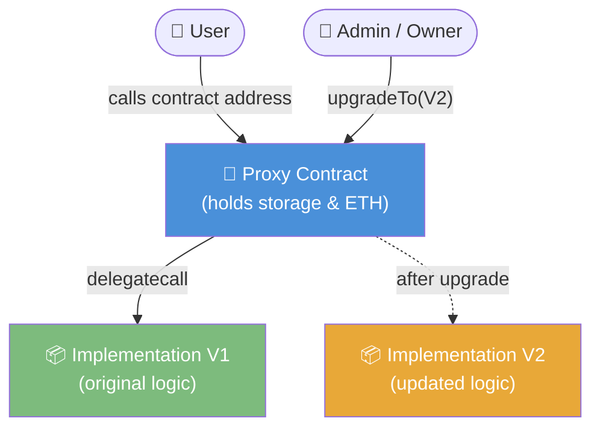

# 🏗️ Chapter 16: Design Patterns in Solidity

> **Who this is for:** Developers who understand Solidity basics and want to write production-ready, secure, and maintainable smart contracts.

Smart contracts are permanent. Once deployed to the blockchain, the code cannot be changed (unless you specifically plan for it). This makes design decisions far more consequential than in traditional web development. The patterns in this chapter are battle-tested solutions that the Solidity community has converged on over years of building and — sometimes painfully — breaking contracts.

---

## 📋 Table of Contents

1. [Ownable Pattern](#ownable-pattern)
2. [Access Control / Role-Based Pattern](#access-control--role-based-pattern)
3. [Pausable Pattern](#pausable-pattern)
4. [Upgradeable Proxy Pattern](#upgradeable-proxy-pattern)
5. [Factory Pattern](#factory-pattern)
6. [Pull Payment Pattern](#pull-payment-pattern)
7. [Commit-Reveal Pattern](#commit-reveal-pattern)
8. [Circuit Breaker / Emergency Stop](#circuit-breaker--emergency-stop)
9. [Oracle Pattern (Chainlink)](#oracle-pattern-chainlink-integration)
10. [Key Takeaways](#key-takeaways)
11. [Quiz](#quiz)

---

## 👑 Ownable Pattern

### The Problem

Most contracts need a privileged account — someone who can configure settings, pause the contract, or withdraw fees. Without a pattern, developers end up copy-pasting `require(msg.sender == owner)` everywhere, which is messy and error-prone.

### The Solution

The **Ownable** pattern centralizes ownership logic into a single, reusable contract. You inherit from it, and immediately gain:

- An `owner` state variable.
- An `onlyOwner` modifier you can attach to any function.
- `transferOwnership` to hand control to another address.
- `renounceOwnership` to permanently lock the contract (nobody owns it).

### Manual Implementation

```solidity
// SPDX-License-Identifier: MIT
pragma solidity ^0.8.0;

contract Ownable {
    address private _owner;

    event OwnershipTransferred(address indexed previousOwner, address indexed newOwner);

    constructor() {
        _owner = msg.sender;
        emit OwnershipTransferred(address(0), msg.sender);
    }

    // Returns the current owner address
    function owner() public view returns (address) {
        return _owner;
    }

    // Reverts if caller is not the owner
    modifier onlyOwner() {
        require(_owner == msg.sender, "Ownable: caller is not the owner");
        _;
    }

    // Transfer ownership to a new account
    function transferOwnership(address newOwner) public onlyOwner {
        require(newOwner != address(0), "Ownable: new owner is the zero address");
        emit OwnershipTransferred(_owner, newOwner);
        _owner = newOwner;
    }

    // Permanently renounce ownership — no one can call onlyOwner functions again
    function renounceOwnership() public onlyOwner {
        emit OwnershipTransferred(_owner, address(0));
        _owner = address(0);
    }
}

// A token contract that uses Ownable
contract SimpleToken is Ownable {
    mapping(address => uint256) public balances;

    // Only the owner can mint new tokens
    function mint(address to, uint256 amount) public onlyOwner {
        balances[to] += amount;
    }
}
```

### Using OpenZeppelin Ownable

In practice, use OpenZeppelin's audited implementation rather than writing your own:

```solidity
// SPDX-License-Identifier: MIT
pragma solidity ^0.8.20;

import "@openzeppelin/contracts/access/Ownable.sol";

contract MyProtocol is Ownable {
    uint256 public fee;

    // Pass initial owner to Ownable constructor (OZ v5+)
    constructor(address initialOwner) Ownable(initialOwner) {
        fee = 100;
    }

    function setFee(uint256 newFee) public onlyOwner {
        fee = newFee;
    }
}
```

> **Warning:** `renounceOwnership()` is irreversible. If you call it, no one can ever call `onlyOwner` functions again. Use with extreme care.

---

## 🔐 Access Control / Role-Based Pattern

### The Problem

A single owner is not granular enough for complex protocols. You may want:
- A **minter** that can create tokens (an automated backend service).
- A **pauser** that can halt the contract (a security team member).
- An **admin** that can grant or revoke the above roles.

### The Solution

OpenZeppelin's `AccessControl` maps role identifiers (`bytes32`) to sets of addresses. Any address can hold multiple roles.

```solidity
// SPDX-License-Identifier: MIT
pragma solidity ^0.8.20;

import "@openzeppelin/contracts/access/AccessControl.sol";
import "@openzeppelin/contracts/token/ERC20/ERC20.sol";

contract RoleBasedToken is ERC20, AccessControl {
    // Role identifiers are keccak256 hashes of role names
    bytes32 public constant ADMIN_ROLE   = keccak256("ADMIN_ROLE");
    bytes32 public constant MINTER_ROLE  = keccak256("MINTER_ROLE");
    bytes32 public constant PAUSER_ROLE  = keccak256("PAUSER_ROLE");

    bool public paused;

    constructor(address admin) ERC20("RoleToken", "RTK") {
        // Grant the deployer the admin role
        _grantRole(ADMIN_ROLE, admin);

        // Admins can manage both minters and pausers
        _setRoleAdmin(MINTER_ROLE, ADMIN_ROLE);
        _setRoleAdmin(PAUSER_ROLE, ADMIN_ROLE);
    }

    // Only minters can create new tokens
    function mint(address to, uint256 amount) public onlyRole(MINTER_ROLE) {
        require(!paused, "Contract is paused");
        _mint(to, amount);
    }

    // Only pausers can halt the contract
    function pause() public onlyRole(PAUSER_ROLE) {
        paused = true;
    }

    function unpause() public onlyRole(PAUSER_ROLE) {
        paused = false;
    }

    // Admins grant roles to new addresses
    function addMinter(address account) public onlyRole(ADMIN_ROLE) {
        grantRole(MINTER_ROLE, account);
    }

    function removeMinter(address account) public onlyRole(ADMIN_ROLE) {
        revokeRole(MINTER_ROLE, account);
    }
}
```

### When to Use Which

| Scenario | Pattern |
|---|---|
| Simple contracts, single owner | `Ownable` |
| Complex protocols, multiple teams | `AccessControl` |
| DAO governance required | `AccessControl` + Governor |

---

## ⏸️ Pausable Pattern

### The Problem

Bugs happen. If your contract handles real funds and a vulnerability is discovered, you need a way to stop all activity immediately while a fix is prepared.

### The Solution

The **Pausable** pattern adds a boolean flag that sensitive functions check before executing. Combined with `AccessControl`, only authorized addresses can trigger the pause.

```solidity
// SPDX-License-Identifier: MIT
pragma solidity ^0.8.20;

import "@openzeppelin/contracts/utils/Pausable.sol";
import "@openzeppelin/contracts/access/Ownable.sol";

contract PausableVault is Ownable, Pausable {
    mapping(address => uint256) public deposits;

    constructor(address initialOwner) Ownable(initialOwner) {}

    // whenNotPaused modifier from OpenZeppelin Pausable
    function deposit() public payable whenNotPaused {
        deposits[msg.sender] += msg.value;
    }

    // Even withdrawals can be paused in an emergency
    function withdraw(uint256 amount) public whenNotPaused {
        require(deposits[msg.sender] >= amount, "Insufficient balance");
        deposits[msg.sender] -= amount;
        payable(msg.sender).transfer(amount);
    }

    // Only owner can flip the pause state
    function pause() public onlyOwner {
        _pause();   // emits Paused(account) event
    }

    function unpause() public onlyOwner {
        _unpause(); // emits Unpaused(account) event
    }
}
```

> **Design note:** Some protocols allow withdrawals even when paused (so users can always get their funds out), but block new deposits. Think carefully about which operations to gate.

---

## 🔄 Upgradeable Proxy Pattern

### Why Contracts Are Immutable By Default

When you deploy a Solidity contract, the bytecode is written to the blockchain permanently. There is no built-in "update" mechanism. This is intentional — immutability is what makes contracts trustworthy. However, real-world projects need bug fixes and new features.

### The Proxy Solution

The proxy pattern splits a contract into two pieces:

- **Proxy contract** — holds the state (storage) and the ETH. Users interact with this address forever.
- **Implementation contract** — holds the logic (bytecode). Can be replaced with a new version.

The proxy uses `delegatecall` to execute the implementation's code but in the proxy's storage context.

```
┌─────────────────────────────────┐
│  User calls proxy address       │
└────────────────┬────────────────┘
                 │ delegatecall
                 ▼
┌─────────────────────────────────┐
│  Implementation Contract        │
│  (logic runs here, but reads/   │
│   writes proxy's storage)       │
└─────────────────────────────────┘
```

### Mermaid Diagram: Proxy Architecture



### Transparent Proxy vs UUPS

| Feature | Transparent Proxy | UUPS |
|---|---|---|
| Upgrade logic location | Proxy contract | Implementation contract |
| Gas cost | Higher (extra admin check each call) | Lower |
| Complexity | Simpler to reason about | More flexible |
| Risk if impl bug | Admin can still upgrade | Upgrade function must survive |

### Storage Slot Collision Risk

This is the most dangerous pitfall of proxies. Both the proxy and implementation share the same storage. If your implementation declares a variable at slot 0, and your proxy also uses slot 0 for the implementation address — they will overwrite each other.

```solidity
// DANGEROUS — storage collision example
contract ProxyBad {
    address public implementation; // slot 0
}

contract ImplementationBad {
    uint256 public value; // ALSO slot 0 — collision!
}
```

OpenZeppelin solves this using **EIP-1967 storage slots** — a random-looking slot derived from a hash, making accidental collision virtually impossible:

```solidity
// EIP-1967 implementation slot
bytes32 constant IMPL_SLOT =
    bytes32(uint256(keccak256("eip1967.proxy.implementation")) - 1);
```

### Minimal UUPS Example

```solidity
// SPDX-License-Identifier: MIT
pragma solidity ^0.8.20;

import "@openzeppelin/contracts-upgradeable/proxy/utils/Initializable.sol";
import "@openzeppelin/contracts-upgradeable/proxy/utils/UUPSUpgradeable.sol";
import "@openzeppelin/contracts-upgradeable/access/OwnableUpgradeable.sol";

// V1 of your logic contract
contract CounterV1 is Initializable, OwnableUpgradeable, UUPSUpgradeable {
    uint256 public count;

    // Use initialize() instead of constructor() for upgradeable contracts
    function initialize(address initialOwner) public initializer {
        __Ownable_init(initialOwner);
        __UUPSUpgradeable_init();
        count = 0;
    }

    function increment() public {
        count += 1;
    }

    // Only owner can authorize upgrades
    function _authorizeUpgrade(address newImplementation)
        internal override onlyOwner {}
}

// V2 adds a new function — storage layout of V1 must be preserved!
contract CounterV2 is CounterV1 {
    // NEW: count by a custom step
    function incrementBy(uint256 step) public {
        count += step;
    }
}
```

### When NOT to Use Upgrades

Upgrades introduce trust assumptions — the upgrade key holder can change contract behavior. Avoid them when:
- You want fully trustless, immutable code (e.g., core DeFi primitives).
- The contract holds user funds without a timelock on upgrades.
- You haven't implemented a multisig or governance process for the upgrade key.

> **Rule of thumb:** If you upgrade, use a timelock (24–48 hours minimum) so users can exit before changes take effect.

---

## 🏭 Factory Pattern

### The Problem

A single contract often needs to spawn many child contracts of the same type — for example, a DEX creating a new liquidity pool per token pair, or an NFT platform creating a new collection per artist.

### The Solution

The **Factory** pattern encapsulates `new ChildContract(...)` inside a parent factory, tracks deployed addresses, and emits events for off-chain indexing.

```solidity
// SPDX-License-Identifier: MIT
pragma solidity ^0.8.0;

// Child contract — one deployed per NFT collection
contract NFTCollection {
    string public name;
    address public owner;
    uint256 public deployedAt;

    constructor(string memory _name, address _owner) {
        name = _name;
        owner = _owner;
        deployedAt = block.timestamp;
    }
}

// Factory — users call this to create their own NFTCollection
contract NFTFactory {
    address[] public deployedCollections;
    mapping(address => address[]) public ownerCollections;

    event CollectionCreated(
        address indexed owner,
        address indexed collection,
        string name
    );

    function createCollection(string memory name) public returns (address) {
        // Deploy a new child contract
        NFTCollection collection = new NFTCollection(name, msg.sender);

        // Track it globally and per owner
        deployedCollections.push(address(collection));
        ownerCollections[msg.sender].push(address(collection));

        emit CollectionCreated(msg.sender, address(collection), name);
        return address(collection);
    }

    function getOwnerCollections(address _owner)
        public view returns (address[] memory)
    {
        return ownerCollections[_owner];
    }

    function totalCollections() public view returns (uint256) {
        return deployedCollections.length;
    }
}
```

### Gas Optimization: Clone Factory (EIP-1167)

Deploying a full contract each time is expensive. For many identical contracts, use **minimal proxies** (clones):

```solidity
import "@openzeppelin/contracts/proxy/Clones.sol";

contract CheapFactory {
    address public implementation;

    constructor(address _impl) {
        implementation = _impl;
    }

    function createClone() external returns (address) {
        // Deploys a tiny 45-byte proxy pointing to implementation
        address clone = Clones.clone(implementation);
        // Initialize the clone (constructor doesn't run)
        NFTCollection(clone).initialize(msg.sender);
        return clone;
    }
}
```

Clones use ~10x less gas than `new Contract()` and are the standard approach for factory contracts at scale.

---

## 💸 Pull Payment Pattern

### The Problem: Push Payments Can Be Weaponized

The naive approach sends ETH directly to recipients in the same transaction:

```solidity
// DANGEROUS — push payment
function refundAll(address[] memory users) public {
    for (uint i = 0; i < users.length; i++) {
        payable(users[i]).transfer(refunds[users[i]]); // can revert!
    }
}
```

If any recipient is a malicious contract that reverts on `receive()`, the entire loop fails — nobody gets refunded. This is a **Denial of Service (DoS)** vulnerability.

### The Solution: Let Users Pull Their Own Funds

Instead of sending ETH outward, record credits and let users withdraw at their own pace:

```solidity
// SPDX-License-Identifier: MIT
pragma solidity ^0.8.0;

contract Auction {
    mapping(address => uint256) public pendingWithdrawals;
    address public highestBidder;
    uint256 public highestBid;
    bool public ended;

    event NewHighestBid(address indexed bidder, uint256 amount);
    event Withdrawn(address indexed user, uint256 amount);

    function bid() public payable {
        require(!ended, "Auction ended");
        require(msg.value > highestBid, "Bid too low");

        // PULL pattern: credit the outgoing highest bidder
        if (highestBidder != address(0)) {
            pendingWithdrawals[highestBidder] += highestBid;
        }

        highestBidder = msg.sender;
        highestBid = msg.value;
        emit NewHighestBid(msg.sender, msg.value);
    }

    function withdraw() public {
        uint256 amount = pendingWithdrawals[msg.sender];
        require(amount > 0, "Nothing to withdraw");

        // Zero out BEFORE transferring to prevent reentrancy
        pendingWithdrawals[msg.sender] = 0;

        (bool success, ) = payable(msg.sender).call{value: amount}("");
        require(success, "Transfer failed");

        emit Withdrawn(msg.sender, amount);
    }

    function endAuction() public {
        ended = true;
    }
}
```

**Why this is safe:**
- Each user's withdrawal is an independent transaction.
- A malicious recipient reverting only affects themselves.
- The check-effects-interactions pattern (zero before transfer) prevents reentrancy.

---

## 🎭 Commit-Reveal Pattern

### The Problem

Blockchain data is public. If players submit choices on-chain (e.g., rock/paper/scissors), everyone can see each other's moves before committing their own. The same problem affects lotteries — miners can front-run or withhold blocks to influence outcomes.

### The Solution: Two-Phase Protocol

1. **Commit phase:** Submit a hash of `(choice + secret_salt)`. Nobody knows your choice, only the hash.
2. **Reveal phase:** Submit the actual choice and salt. The contract verifies `keccak256(choice + salt) == stored_hash`.

```solidity
// SPDX-License-Identifier: MIT
pragma solidity ^0.8.0;

contract CommitRevealGame {
    enum Move { None, Rock, Paper, Scissors }
    enum Phase { Commit, Reveal, Done }

    struct Player {
        bytes32 commitment;   // hash stored during commit phase
        Move    move;         // revealed during reveal phase
        bool    revealed;
    }

    mapping(address => Player) public players;
    address[2] public participants;
    uint8 public commitCount;
    uint8 public revealCount;
    Phase public phase;

    event Committed(address indexed player);
    event Revealed(address indexed player, Move move);
    event Winner(address indexed winner);

    // --- PHASE 1: Commit ---
    // Call with: keccak256(abi.encodePacked(move, salt))
    function commit(bytes32 _commitment) external {
        require(phase == Phase.Commit, "Not in commit phase");
        require(players[msg.sender].commitment == bytes32(0), "Already committed");

        players[msg.sender].commitment = _commitment;
        participants[commitCount] = msg.sender;
        commitCount++;

        if (commitCount == 2) phase = Phase.Reveal;
        emit Committed(msg.sender);
    }

    // --- PHASE 2: Reveal ---
    // Call with actual move (1=Rock,2=Paper,3=Scissors) and your secret salt
    function reveal(Move _move, bytes32 _salt) external {
        require(phase == Phase.Reveal, "Not in reveal phase");
        require(!players[msg.sender].revealed, "Already revealed");
        require(_move != Move.None, "Invalid move");

        // Reconstruct the hash and verify it matches the commitment
        bytes32 expected = keccak256(abi.encodePacked(_move, _salt));
        require(expected == players[msg.sender].commitment, "Commitment mismatch");

        players[msg.sender].move = _move;
        players[msg.sender].revealed = true;
        revealCount++;

        emit Revealed(msg.sender, _move);

        if (revealCount == 2) {
            phase = Phase.Done;
            _determineWinner();
        }
    }

    function _determineWinner() internal {
        Move m0 = players[participants[0]].move;
        Move m1 = players[participants[1]].move;

        if (m0 == m1) {
            emit Winner(address(0)); // draw
        } else if (
            (m0 == Move.Rock     && m1 == Move.Scissors) ||
            (m0 == Move.Paper    && m1 == Move.Rock)     ||
            (m0 == Move.Scissors && m1 == Move.Paper)
        ) {
            emit Winner(participants[0]);
        } else {
            emit Winner(participants[1]);
        }
    }
}
```

**Off-chain commitment generation (JavaScript):**
```javascript
const { ethers } = require("ethers");

const move = 1;  // 1 = Rock
const salt = ethers.randomBytes(32);
const commitment = ethers.keccak256(
  ethers.solidityPacked(["uint8", "bytes32"], [move, salt])
);

console.log("Submit this commitment:", commitment);
console.log("Save your salt:", ethers.hexlify(salt));
```

---

## 🔴 Circuit Breaker / Emergency Stop

The circuit breaker is the operational version of the Pausable pattern — it is paired with monitoring and a clear incident-response process. A well-designed circuit breaker:

- Is triggered by a multisig (not a single EOA) to prevent abuse.
- Has a timelock on re-enabling to allow investigation.
- Emits events that off-chain monitoring can catch.

```solidity
// SPDX-License-Identifier: MIT
pragma solidity ^0.8.0;

contract CircuitBreaker {
    bool public stopped;
    address public admin;
    uint256 public pausedAt;
    uint256 public constant MIN_PAUSE_DURATION = 1 hours;

    event EmergencyStop(address indexed triggeredBy, uint256 timestamp);
    event Resumed(address indexed resumedBy, uint256 timestamp);

    modifier stopInEmergency() {
        require(!stopped, "EMERGENCY: contract is stopped");
        _;
    }

    modifier onlyInEmergency() {
        require(stopped, "Only callable in emergency");
        _;
    }

    modifier onlyAdmin() {
        require(msg.sender == admin, "Not admin");
        _;
    }

    constructor() {
        admin = msg.sender;
    }

    function triggerStop() external onlyAdmin {
        stopped = true;
        pausedAt = block.timestamp;
        emit EmergencyStop(msg.sender, block.timestamp);
    }

    function resume() external onlyAdmin {
        require(
            block.timestamp >= pausedAt + MIN_PAUSE_DURATION,
            "Must wait minimum pause duration"
        );
        stopped = false;
        emit Resumed(msg.sender, block.timestamp);
    }

    // Normal operations are blocked during emergency
    function deposit() external payable stopInEmergency {
        // deposit logic
    }

    // Emergency-only: allow users to retrieve funds
    function emergencyWithdraw() external onlyInEmergency {
        // emergency exit logic
    }
}
```

---

## 🔮 Oracle Pattern (Chainlink Integration)

### The Problem

Smart contracts cannot access data outside the blockchain — no HTTP requests, no API calls. If you need the ETH/USD price, sports scores, or weather data, you need an **oracle**: a trusted off-chain service that writes real-world data on-chain.

### Chainlink Price Feeds

Chainlink is the industry standard. Price feeds are already deployed on every major chain — you just read from them.

```solidity
// SPDX-License-Identifier: MIT
pragma solidity ^0.8.0;

// Chainlink's standard interface for aggregator contracts
interface AggregatorV3Interface {
    function latestRoundData()
        external
        view
        returns (
            uint80 roundId,
            int256 answer,        // price (scaled by decimals)
            uint256 startedAt,
            uint256 updatedAt,
            uint80 answeredInRound
        );

    function decimals() external view returns (uint8);
}

contract PriceConsumer {
    AggregatorV3Interface internal priceFeed;

    // ETH/USD feed on Ethereum mainnet: 0x5f4eC3Df9cbd43714FE2740f5E3616155c5b8419
    // ETH/USD feed on Sepolia testnet: 0x694AA1769357215DE4FAC081bf1f309aDC325306
    constructor(address _priceFeed) {
        priceFeed = AggregatorV3Interface(_priceFeed);
    }

    function getLatestEthPrice() public view returns (int256) {
        (
            uint80 roundId,
            int256 price,
            ,
            uint256 updatedAt,
            uint80 answeredInRound
        ) = priceFeed.latestRoundData();

        // Staleness check: reject data older than 1 hour
        require(block.timestamp - updatedAt < 3600, "Stale price data");

        // Heartbeat check: ensure we have the latest round
        require(answeredInRound >= roundId, "Stale round");

        return price; // 8 decimals: 300000000000 = $3000.00
    }

    // Convert ETH amount to USD (returns USD with 8 decimal places)
    function ethToUsd(uint256 ethAmount) public view returns (uint256) {
        int256 price = getLatestEthPrice();
        require(price > 0, "Invalid price");

        // ethAmount is in wei (18 decimals), price has 8 decimals
        // Result: (wei * price) / 1e18 = USD with 8 decimals
        return (ethAmount * uint256(price)) / 1e18;
    }
}
```

### Chainlink VRF (Verifiable Random Function)

For randomness (lotteries, NFT traits), use Chainlink VRF — it provides provably fair, manipulation-resistant random numbers:

```solidity
// SPDX-License-Identifier: MIT
pragma solidity ^0.8.0;

import "@chainlink/contracts/src/v0.8/vrf/VRFConsumerBaseV2.sol";
import "@chainlink/contracts/src/v0.8/vrf/interfaces/VRFCoordinatorV2Interface.sol";

contract Lottery is VRFConsumerBaseV2 {
    VRFCoordinatorV2Interface coordinator;
    bytes32 keyHash;
    uint64  subscriptionId;

    address[] public players;
    uint256 public lastRandomResult;
    address public lastWinner;

    mapping(uint256 => bool) public pendingRequests;

    event WinnerPicked(address indexed winner, uint256 randomNumber);

    constructor(
        address vrfCoordinator,
        bytes32 _keyHash,
        uint64  _subscriptionId
    ) VRFConsumerBaseV2(vrfCoordinator) {
        coordinator    = VRFCoordinatorV2Interface(vrfCoordinator);
        keyHash        = _keyHash;
        subscriptionId = _subscriptionId;
    }

    function enter() external payable {
        require(msg.value >= 0.01 ether, "Minimum entry fee");
        players.push(msg.sender);
    }

    function pickWinner() external {
        require(players.length >= 2, "Need at least 2 players");
        // Request randomness from Chainlink — async, callback below
        uint256 requestId = coordinator.requestRandomWords(
            keyHash,
            subscriptionId,
            3,   // confirmations
            100000, // callback gas limit
            1    // number of random words
        );
        pendingRequests[requestId] = true;
    }

    // Chainlink calls this with the random result
    function fulfillRandomWords(uint256 requestId, uint256[] memory randomWords)
        internal override
    {
        require(pendingRequests[requestId], "Unknown request");
        delete pendingRequests[requestId];

        uint256 winnerIndex = randomWords[0] % players.length;
        lastWinner = players[winnerIndex];
        lastRandomResult = randomWords[0];

        // Pay the winner
        payable(lastWinner).transfer(address(this).balance);
        delete players;

        emit WinnerPicked(lastWinner, randomWords[0]);
    }
}
```

> **Never use `block.timestamp`, `block.difficulty`, or `blockhash` as randomness sources** — miners/validators can manipulate them. Always use Chainlink VRF for anything of value.

---

## ✅ Key Takeaways

| Pattern | Core Idea | Use When |
|---|---|---|
| **Ownable** | Single privileged owner | Simple admin controls |
| **AccessControl** | Multiple named roles | Complex permission hierarchies |
| **Pausable** | Emergency stop flag | Any contract holding funds |
| **Proxy/Upgradeable** | Separate logic from storage | Long-lived protocols needing iteration |
| **Factory** | Contract spawns contracts | Creating many instances of one type |
| **Pull Payment** | Users withdraw instead of being sent funds | Any ETH distribution to multiple parties |
| **Commit-Reveal** | Hash now, reveal later | Hidden choices, randomness fairness |
| **Circuit Breaker** | Hard stop with recovery process | High-value production contracts |
| **Oracle** | Bring off-chain data on-chain | Prices, randomness, real-world events |

### Golden Rules

1. **Default to immutability.** Only add upgradeability if you have a clear governance process.
2. **Always use Pull over Push** when sending ETH to multiple or unknown addresses.
3. **Never roll your own crypto** for randomness — use Chainlink VRF.
4. **Inherit, don't copy.** OpenZeppelin's implementations are audited and battle-tested.
5. **Emit events for everything** that governance or security monitoring might care about.

---

## 📝 Quiz

Test your understanding before moving on.

**Question 1.**
You are building a DeFi protocol where a security team needs to pause deposits during an exploit, but only a DAO vote can permanently change fee parameters. Which pattern combination is most appropriate?

- A) Ownable for everything
- B) AccessControl with a PAUSER_ROLE for the security team and a separate governance role for fee changes
- C) Pausable without any access control
- D) Factory pattern

<details>
<summary>Answer</summary>

**B.** `AccessControl` lets you assign fine-grained roles. The security team holds `PAUSER_ROLE` (can act instantly), while fee changes go through a governance role tied to a DAO timelock. `Ownable` would give one key too much power; option C has no access restriction.

</details>

---

**Question 2.**
A developer writes an upgradeable proxy where the proxy contract stores the implementation address at storage slot 0, and the implementation contract stores a `uint256 balance` also at slot 0. What happens?

- A) The proxy transparently manages both values without conflict.
- B) The implementation address and `balance` will overwrite each other, corrupting both.
- C) Solidity detects this at compile time and throws an error.
- D) Only the proxy's slot 0 is used; the implementation's slot 0 is ignored.

<details>
<summary>Answer</summary>

**B.** This is a storage collision. Both variables occupy the same physical slot in the proxy's storage. Writing `balance` will corrupt the implementation address and vice versa. This is why EIP-1967 uses a pseudo-random slot far from the collision zone.

</details>

---

**Question 3.**
An auction contract uses the **push payment** pattern, sending ETH back to outbid bidders immediately inside `bid()`. A malicious bidder deploys a contract whose `receive()` function always reverts. What is the impact?

- A) The malicious bidder loses their ETH permanently.
- B) Only the malicious bidder's refund fails; other bidders are unaffected.
- C) Every subsequent call to `bid()` reverts, effectively freezing the auction for all users.
- D) The contract self-destructs.

<details>
<summary>Answer</summary>

**C.** When a new valid bid comes in, the contract tries to refund the malicious bidder (now `highestBidder`). The refund reverts, which reverts the entire `bid()` transaction. No new bids can be accepted — a classic Denial of Service attack. The **Pull Payment** pattern solves this by making each user's withdrawal independent.

</details>

---

*Next Chapter: Security Vulnerabilities and Audit Checklist →*
