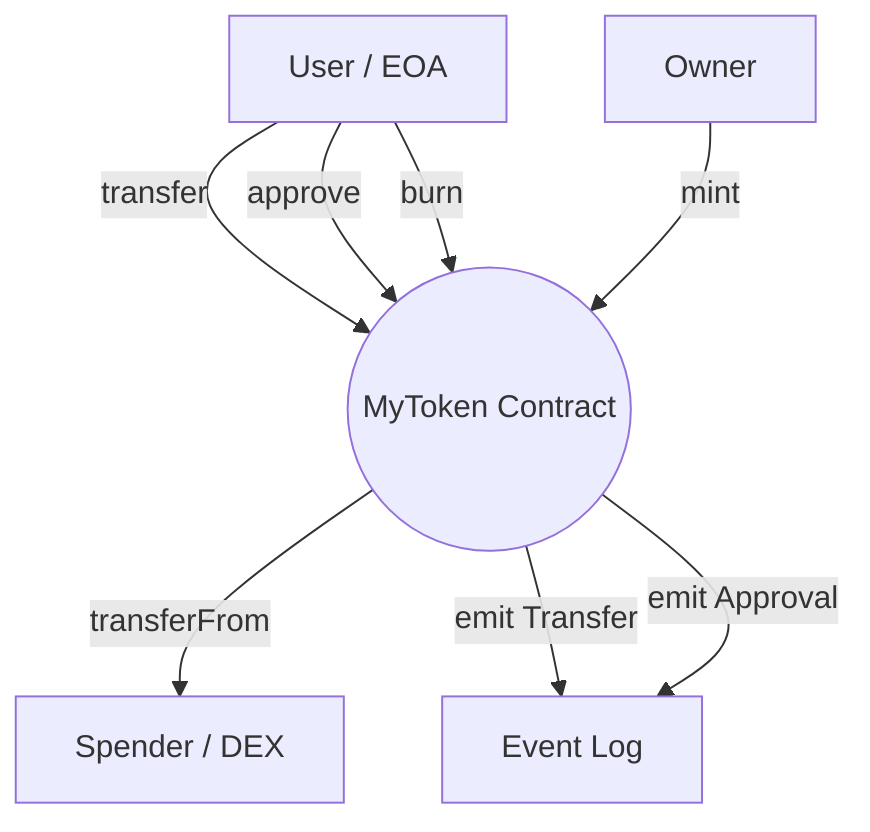
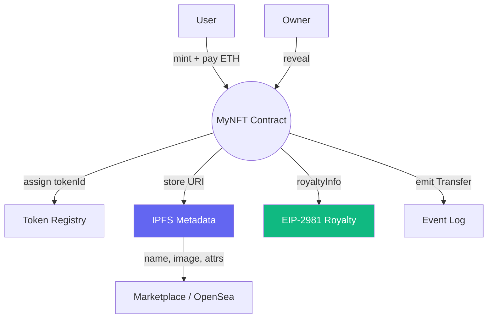
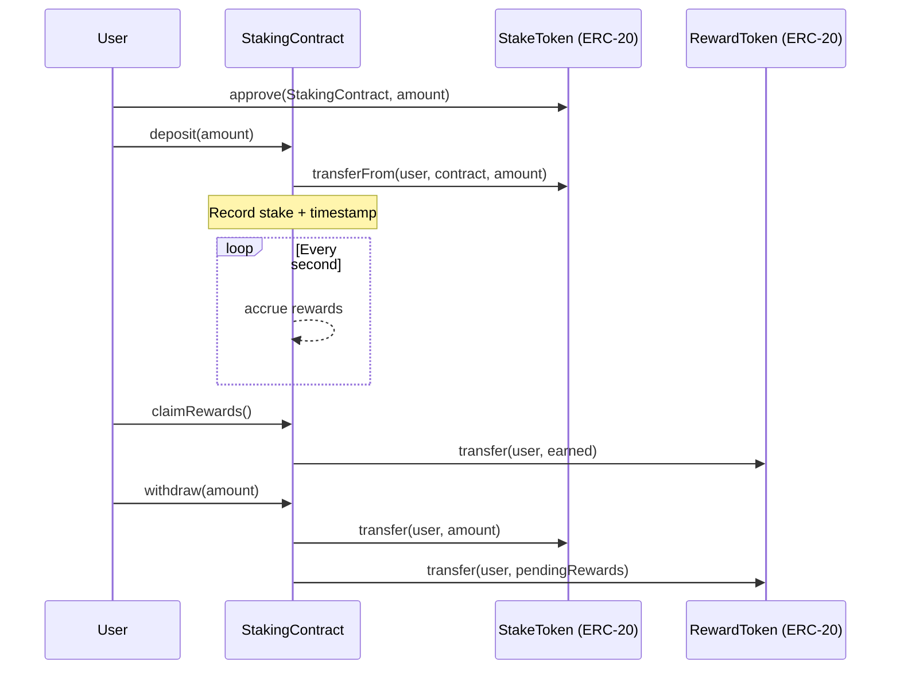
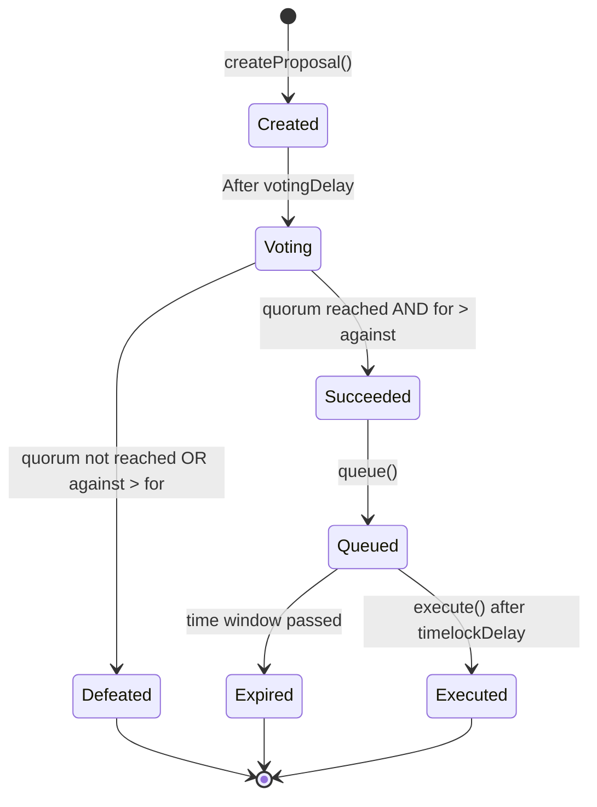

# 🏗️ Chapter 17: Real-World Projects in Solidity

> **Goal:** Ab bas padhna band karo, banana shuru karo. Is chapter mein hum four production-grade smart contracts banayenge — har ek line-by-line samjhaya gaya hai, testnet pe deploy kiya gaya hai, aur real tooling ke saath extend kiya gaya hai.

---

## 📋 Table of Contents

1. [Environment Setup (Hardhat)](#1-environment-setup-hardhat)
2. [Project 1 — ERC-20 Token (MyToken)](#2-project-1--erc-20-token-mytoken)
3. [Project 2 — ERC-721 NFT Contract](#3-project-2--erc-721-nft-contract)
4. [Project 3 — Staking Contract (Simple DeFi)](#4-project-3--staking-contract-simple-defi)
5. [Project 4 — DAO Governance](#5-project-4--dao-governance)
6. [Key Takeaways](#6-key-takeaways)
7. [Next Steps](#7-next-steps)

---

## 1. Environment Setup (Hardhat)

Solidity ki ek bhi line likhne se pehle, apna toolchain ready karlo.

### 1.1 Install Dependencies

```bash
mkdir my-solidity-projects && cd my-solidity-projects
npm init -y
npm install --save-dev hardhat @nomicfoundation/hardhat-toolbox
npm install @openzeppelin/contracts dotenv
npx hardhat init   # choose "Create a JavaScript project"
```

### 1.2 Hardhat Config

```javascript
// hardhat.config.js
require("@nomicfoundation/hardhat-toolbox");
require("dotenv").config();

module.exports = {
  solidity: "0.8.20",
  networks: {
    sepolia: {
      url: process.env.SEPOLIA_RPC_URL,       // Alchemy / Infura endpoint
      accounts: [process.env.PRIVATE_KEY]     // Never commit your real key!
    }
  },
  etherscan: {
    apiKey: process.env.ETHERSCAN_API_KEY     // For contract verification
  }
};
```

### 1.3 `.env` file

```
SEPOLIA_RPC_URL=https://eth-sepolia.g.alchemy.com/v2/YOUR_KEY
PRIVATE_KEY=0xYOUR_PRIVATE_KEY
ETHERSCAN_API_KEY=YOUR_ETHERSCAN_KEY
```

> **Security tip:** `.env` ko turant `.gitignore` mein daal do. Kabhi bhi private key GitHub pe push mat karna — ye bilkul aisa hai jaise apna ATM PIN public repo mein daal dena.

### 1.4 Project Folder Structure

```
my-solidity-projects/
├── contracts/
│   ├── MyToken.sol
│   ├── MyNFT.sol
│   ├── StakingContract.sol
│   └── DAOGovernance.sol
├── scripts/
│   ├── deployToken.js
│   ├── deployNFT.js
│   ├── deployStaking.js
│   └── deployDAO.js
├── test/
│   ├── token.test.js
│   ├── nft.test.js
│   ├── staking.test.js
│   └── dao.test.js
├── hardhat.config.js
└── .env
```

---

## 2. Project 1 — ERC-20 Token (MyToken)

### 2.1 ERC-20 Kya Hota Hai?

ERC-20 Ethereum ka standard interface hai fungible tokens ke liye — matlab jaha har unit identical hoti hai (jaise rupaye ya loyalty points). Zomato ke wallet credits socho: 1 credit = 1 credit, koi farak nahi kaunsa credit hai. Har bada token jo tumne suna hai (USDC, DAI, UNI) isi standard ko follow karta hai.

### 2.2 Architecture Diagram



### 2.3 From Scratch Implementation

Raw implementation samajhne se pata chalta hai ki OpenZeppelin actually kitna kaam chupa deta hai humse.

```solidity
// SPDX-License-Identifier: MIT
pragma solidity ^0.8.20;

/**
 * @title MyToken — ERC-20 from scratch
 * @notice A fully compliant ERC-20 token with mint and burn
 * @dev Implements EIP-20 without any library dependencies
 */
contract MyToken {
    // ─── State Variables ──────────────────────────────────────────────────────

    string public name;          // Token name e.g. "MyToken"
    string public symbol;        // Ticker e.g. "MTK"
    uint8  public decimals;      // Standard is 18 (like ETH)
    uint256 public totalSupply;  // Total tokens in existence

    address public owner;        // Contract deployer — can mint

    // Balances: address → amount
    mapping(address => uint256) private _balances;

    // Allowances: owner → spender → amount
    // Allows owner to let spender spend on their behalf
    mapping(address => mapping(address => uint256)) private _allowances;

    // ─── Events ───────────────────────────────────────────────────────────────

    /// @notice Emitted when tokens move between addresses (including mint/burn)
    event Transfer(address indexed from, address indexed to, uint256 value);

    /// @notice Emitted when an owner approves a spender
    event Approval(address indexed owner, address indexed spender, uint256 value);

    // ─── Modifiers ────────────────────────────────────────────────────────────

    modifier onlyOwner() {
        require(msg.sender == owner, "MyToken: caller is not the owner");
        _;
    }

    // ─── Constructor ──────────────────────────────────────────────────────────

    /**
     * @param _name    Human-readable token name
     * @param _symbol  Short ticker symbol
     * @param _initialSupply  Initial tokens minted to deployer (in whole units)
     */
    constructor(string memory _name, string memory _symbol, uint256 _initialSupply) {
        name     = _name;
        symbol   = _symbol;
        decimals = 18;
        owner    = msg.sender;

        // Mint initial supply to deployer
        // Multiply by 10^18 to account for decimals
        _mint(msg.sender, _initialSupply * 10 ** 18);
    }

    // ─── External / Public Functions ──────────────────────────────────────────

    /**
     * @notice Returns the token balance of `account`
     */
    function balanceOf(address account) public view returns (uint256) {
        return _balances[account];
    }

    /**
     * @notice Returns how much `spender` is allowed to spend on behalf of `owner_`
     */
    function allowance(address owner_, address spender) public view returns (uint256) {
        return _allowances[owner_][spender];
    }

    /**
     * @notice Transfer `amount` tokens from caller to `to`
     * @dev Emits a Transfer event
     */
    function transfer(address to, uint256 amount) public returns (bool) {
        _transfer(msg.sender, to, amount);
        return true;
    }

    /**
     * @notice Approve `spender` to spend `amount` of caller's tokens
     * @dev Emits an Approval event. Overrides any existing allowance.
     */
    function approve(address spender, uint256 amount) public returns (bool) {
        _approve(msg.sender, spender, amount);
        return true;
    }

    /**
     * @notice Transfer `amount` from `from` to `to` using caller's allowance
     * @dev Emits Transfer and decreases allowance
     */
    function transferFrom(address from, address to, uint256 amount) public returns (bool) {
        uint256 currentAllowance = _allowances[from][msg.sender];
        require(currentAllowance >= amount, "MyToken: insufficient allowance");

        // Decrease the allowance
        unchecked {
            _approve(from, msg.sender, currentAllowance - amount);
        }

        _transfer(from, to, amount);
        return true;
    }

    /**
     * @notice Mint `amount` new tokens to `to` — only callable by owner
     * @dev Increases totalSupply
     */
    function mint(address to, uint256 amount) external onlyOwner {
        _mint(to, amount);
    }

    /**
     * @notice Burn `amount` tokens from caller's balance
     * @dev Decreases totalSupply. Tokens are destroyed permanently.
     */
    function burn(uint256 amount) external {
        _burn(msg.sender, amount);
    }

    // ─── Internal Helpers ─────────────────────────────────────────────────────

    function _transfer(address from, address to, uint256 amount) internal {
        require(from != address(0), "MyToken: transfer from zero address");
        require(to   != address(0), "MyToken: transfer to zero address");
        require(_balances[from] >= amount, "MyToken: insufficient balance");

        unchecked {
            _balances[from] -= amount;  // Safe: checked above
        }
        _balances[to] += amount;

        emit Transfer(from, to, amount);
    }

    function _mint(address to, uint256 amount) internal {
        require(to != address(0), "MyToken: mint to zero address");
        totalSupply   += amount;
        _balances[to] += amount;
        emit Transfer(address(0), to, amount);  // Mint = transfer from zero
    }

    function _burn(address from, uint256 amount) internal {
        require(from != address(0), "MyToken: burn from zero address");
        require(_balances[from] >= amount, "MyToken: burn exceeds balance");

        unchecked {
            _balances[from] -= amount;
        }
        totalSupply -= amount;
        emit Transfer(from, address(0), amount);  // Burn = transfer to zero
    }

    function _approve(address owner_, address spender, uint256 amount) internal {
        require(owner_   != address(0), "MyToken: approve from zero address");
        require(spender  != address(0), "MyToken: approve to zero address");
        _allowances[owner_][spender] = amount;
        emit Approval(owner_, spender, amount);
    }
}
```

### 2.4 OpenZeppelin Version (Production Ready)

Real projects mein OpenZeppelin use karo — ye audited hai, battle-tested hai, aur sau-do-sau lines bacha deta hai. Socho khud ka payment gateway banane ke bajaye Razorpay/Stripe use karna — wheel reinvent karne ki zarurat nahi.

```solidity
// SPDX-License-Identifier: MIT
pragma solidity ^0.8.20;

import "@openzeppelin/contracts/token/ERC20/ERC20.sol";
import "@openzeppelin/contracts/token/ERC20/extensions/ERC20Burnable.sol";
import "@openzeppelin/contracts/access/Ownable.sol";

/**
 * @title MyToken — Production ERC-20 using OpenZeppelin
 * @notice Mintable, burnable token with owner-controlled supply
 */
contract MyToken is ERC20, ERC20Burnable, Ownable {
    constructor(
        string memory name,
        string memory symbol,
        uint256 initialSupply,
        address initialOwner
    )
        ERC20(name, symbol)
        Ownable(initialOwner)
    {
        // Mint initial supply to deployer (decimals handled by ERC20 base)
        _mint(initialOwner, initialSupply * 10 ** decimals());
    }

    /// @notice Owner can mint additional tokens at any time
    function mint(address to, uint256 amount) external onlyOwner {
        _mint(to, amount);
    }

    // burn() and burnFrom() come from ERC20Burnable — no code needed!
}
```

### 2.5 Deployment Script

```javascript
// scripts/deployToken.js
const { ethers } = require("hardhat");

async function main() {
  const [deployer] = await ethers.getSigners();
  console.log("Deploying with account:", deployer.address);

  const MyToken = await ethers.getContractFactory("MyToken");
  const token = await MyToken.deploy(
    "MyToken",       // name
    "MTK",           // symbol
    1_000_000,       // initialSupply (1 million tokens)
    deployer.address // initialOwner
  );

  await token.waitForDeployment();
  console.log("MyToken deployed to:", await token.getAddress());
}

main().catch(console.error);
```

```bash
npx hardhat run scripts/deployToken.js --network sepolia
```

### 2.6 Ethers.js Interaction Examples

```javascript
const { ethers } = require("ethers");

// Connect to the deployed contract
const provider = new ethers.JsonRpcProvider(process.env.SEPOLIA_RPC_URL);
const signer   = new ethers.Wallet(process.env.PRIVATE_KEY, provider);

const TOKEN_ADDRESS = "0xYourDeployedTokenAddress";
const ABI = [
  "function balanceOf(address) view returns (uint256)",
  "function transfer(address to, uint256 amount) returns (bool)",
  "function approve(address spender, uint256 amount) returns (bool)",
  "function allowance(address owner, address spender) view returns (uint256)",
  "function mint(address to, uint256 amount)",
  "function burn(uint256 amount)",
  "event Transfer(address indexed from, address indexed to, uint256 value)"
];

const token = new ethers.Contract(TOKEN_ADDRESS, ABI, signer);

// Check balance (returns BigInt)
const balance = await token.balanceOf(signer.address);
console.log("Balance:", ethers.formatUnits(balance, 18), "MTK");

// Transfer 50 tokens
const tx = await token.transfer("0xRecipientAddress", ethers.parseUnits("50", 18));
await tx.wait();
console.log("Transferred! Hash:", tx.hash);

// Approve a spender (e.g. a DEX)
await (await token.approve("0xSpenderAddress", ethers.parseUnits("1000", 18))).wait();

// Listen for Transfer events
token.on("Transfer", (from, to, amount) => {
  console.log(`Transfer: ${from} → ${to} | ${ethers.formatUnits(amount, 18)} MTK`);
});
```

### 2.7 Testing Tips

```javascript
// test/token.test.js
const { expect } = require("chai");
const { ethers }  = require("hardhat");

describe("MyToken", function () {
  let token, owner, alice, bob;

  beforeEach(async () => {
    [owner, alice, bob] = await ethers.getSigners();
    const MyToken = await ethers.getContractFactory("MyToken");
    token = await MyToken.deploy("MyToken", "MTK", 1_000_000, owner.address);
  });

  it("assigns initial supply to owner", async () => {
    const expected = ethers.parseUnits("1000000", 18);
    expect(await token.balanceOf(owner.address)).to.equal(expected);
  });

  it("transfers tokens correctly", async () => {
    await token.transfer(alice.address, ethers.parseUnits("100", 18));
    expect(await token.balanceOf(alice.address)).to.equal(ethers.parseUnits("100", 18));
  });

  it("reverts transfer with insufficient balance", async () => {
    await expect(
      token.connect(alice).transfer(bob.address, 1)
    ).to.be.revertedWith("ERC20: insufficient balance");
  });

  it("allows approved spender to transferFrom", async () => {
    await token.approve(alice.address, ethers.parseUnits("200", 18));
    await token.connect(alice).transferFrom(owner.address, bob.address, ethers.parseUnits("200", 18));
    expect(await token.balanceOf(bob.address)).to.equal(ethers.parseUnits("200", 18));
  });
});
```

### 2.8 Extension Ideas

- **Capped supply** — `ERC20Capped` add karo taaki maximum total supply enforce ho
- **Snapshot** — `ERC20Snapshot`, specific blocks pe DAO voting power ke liye
- **Pausable** — emergency mein transfers freeze karne ke liye
- **Permit (EIP-2612)** — `ERC20Permit` use karke gasless approvals

---

## 3. Project 2 — ERC-721 NFT Contract

### 3.1 ERC-721 Kya Hota Hai?

ERC-721 Non-Fungible Tokens (NFTs) ka standard define karta hai. ERC-20 ke ulat, har token ka apna unique ID hota hai aur usko kisi doosre token se 1:1 exchange nahi kiya ja sakta — ye kisi distinct cheez ke ownership ko represent karta hai: art, zameen, ek gaming character. Socho ye jaise IRCTC ki confirmed train ticket — har ticket unique hai, seat number ke saath, do tickets kabhi identical nahi honge.

### 3.2 Architecture Diagram



### 3.3 Full Implementation

```solidity
// SPDX-License-Identifier: MIT
pragma solidity ^0.8.20;

import "@openzeppelin/contracts/token/ERC721/ERC721.sol";
import "@openzeppelin/contracts/token/ERC721/extensions/ERC721Royalty.sol";
import "@openzeppelin/contracts/access/Ownable.sol";
import "@openzeppelin/contracts/utils/Strings.sol";
import "@openzeppelin/contracts/utils/ReentrancyGuard.sol";

/**
 * @title MyNFT — ERC-721 with IPFS metadata, payment, reveal, and royalties
 * @notice Users pay ETH to mint. Owner can reveal the real metadata later.
 * @dev Implements EIP-2981 for royalty information
 */
contract MyNFT is ERC721, ERC721Royalty, Ownable, ReentrancyGuard {
    using Strings for uint256;

    // ─── Constants ────────────────────────────────────────────────────────────

    uint256 public constant MAX_SUPPLY    = 10_000;   // Hard cap on total NFTs
    uint256 public constant MINT_PRICE    = 0.05 ether; // Price per NFT
    uint256 public constant MAX_PER_WALLET = 5;        // Anti-whale protection

    // ─── State Variables ──────────────────────────────────────────────────────

    uint256 private _nextTokenId;    // Auto-incrementing token counter

    bool public revealed;            // False = show placeholder, True = real art
    string public baseTokenURI;      // IPFS folder URI after reveal
    string public placeholderURI;    // Shown before reveal

    bool public mintingPaused;       // Emergency stop

    // Track how many each wallet has minted
    mapping(address => uint256) public mintCount;

    // ─── Events ───────────────────────────────────────────────────────────────

    event Revealed(string baseURI);
    event Minted(address indexed to, uint256 indexed tokenId);
    event Withdrawn(address indexed to, uint256 amount);

    // ─── Constructor ──────────────────────────────────────────────────────────

    /**
     * @param _placeholder IPFS URI shown before reveal (mystery box image)
     * @param _royaltyReceiver Address that receives royalty payments
     * @param _royaltyFeeNumerator Royalty % * 100 (e.g., 500 = 5%)
     */
    constructor(
        string memory _placeholder,
        address _royaltyReceiver,
        uint96  _royaltyFeeNumerator,
        address initialOwner
    )
        ERC721("MyNFT Collection", "MNFT")
        Ownable(initialOwner)
    {
        placeholderURI = _placeholder;

        // EIP-2981: set default royalty for all tokens
        // 500 out of 10000 = 5%
        _setDefaultRoyalty(_royaltyReceiver, _royaltyFeeNumerator);
    }

    // ─── Minting ──────────────────────────────────────────────────────────────

    /**
     * @notice Mint `quantity` NFTs by paying the required ETH
     * @param quantity Number of NFTs to mint (1 to 5 per transaction)
     */
    function mint(uint256 quantity) external payable nonReentrant {
        require(!mintingPaused,                      "MyNFT: minting is paused");
        require(quantity > 0 && quantity <= 5,        "MyNFT: invalid quantity");
        require(_nextTokenId + quantity <= MAX_SUPPLY,"MyNFT: exceeds max supply");
        require(mintCount[msg.sender] + quantity <= MAX_PER_WALLET, "MyNFT: wallet limit exceeded");
        require(msg.value == MINT_PRICE * quantity,   "MyNFT: incorrect ETH amount");

        mintCount[msg.sender] += quantity;

        for (uint256 i = 0; i < quantity; i++) {
            uint256 tokenId = _nextTokenId++;
            _safeMint(msg.sender, tokenId);  // _safeMint checks for ERC721Receiver
            emit Minted(msg.sender, tokenId);
        }
    }

    // ─── Token URI (Metadata) ─────────────────────────────────────────────────

    /**
     * @notice Returns the metadata URI for a given token
     * @dev Before reveal: returns placeholderURI
     *      After reveal: returns baseTokenURI + tokenId + ".json"
     */
    function tokenURI(uint256 tokenId)
        public
        view
        override
        returns (string memory)
    {
        _requireOwned(tokenId);  // Reverts if token doesn't exist

        if (!revealed) {
            return placeholderURI;
        }

        // Constructs: ipfs://QmHash/1337.json
        return string(abi.encodePacked(baseTokenURI, tokenId.toString(), ".json"));
    }

    // ─── Royalties (EIP-2981) ─────────────────────────────────────────────────

    /**
     * @notice Returns royalty info for a sale. Marketplaces call this.
     * @param tokenId  The NFT being sold (ignored — default royalty applies)
     * @param salePrice  The sale price in ETH/wei
     * @return receiver  Address to pay the royalty
     * @return royaltyAmount  How much to pay (in same currency as salePrice)
     */
    // royaltyInfo() is inherited from ERC721Royalty — nothing to write!

    // ─── Owner Functions ──────────────────────────────────────────────────────

    /**
     * @notice Reveal the real artwork by setting the IPFS base URI
     * @param _baseURI  IPFS folder containing {tokenId}.json metadata files
     */
    function reveal(string memory _baseURI) external onlyOwner {
        require(!revealed, "MyNFT: already revealed");
        baseTokenURI = _baseURI;
        revealed     = true;
        emit Revealed(_baseURI);
    }

    /// @notice Pause or unpause minting (emergency use)
    function setPaused(bool _paused) external onlyOwner {
        mintingPaused = _paused;
    }

    /// @notice Set per-token royalty override for a specific token
    function setTokenRoyalty(
        uint256 tokenId,
        address receiver,
        uint96 feeNumerator
    ) external onlyOwner {
        _setTokenRoyalty(tokenId, receiver, feeNumerator);
    }

    /**
     * @notice Withdraw collected ETH to owner's wallet
     * @dev Uses call{value} instead of transfer to avoid gas limit issues
     */
    function withdraw() external onlyOwner nonReentrant {
        uint256 balance = address(this).balance;
        require(balance > 0, "MyNFT: no funds to withdraw");

        (bool success, ) = payable(owner()).call{value: balance}("");
        require(success, "MyNFT: withdrawal failed");

        emit Withdrawn(owner(), balance);
    }

    // ─── View Helpers ─────────────────────────────────────────────────────────

    /// @notice Returns total number of minted tokens
    function totalSupply() external view returns (uint256) {
        return _nextTokenId;
    }

    // ─── Overrides Required by Solidity ──────────────────────────────────────

    function supportsInterface(bytes4 interfaceId)
        public
        view
        override(ERC721, ERC721Royalty)
        returns (bool)
    {
        return super.supportsInterface(interfaceId);
    }
}
```

### 3.4 IPFS Metadata Format

Har token ko IPFS pe ek JSON file chahiye. `42.json` ka example dekho:

```json
{
  "name": "MyNFT #42",
  "description": "A unique NFT from the MyNFT Collection.",
  "image": "ipfs://QmYourImageHash/42.png",
  "attributes": [
    { "trait_type": "Background", "value": "Ocean Blue" },
    { "trait_type": "Character",  "value": "Wizard" },
    { "trait_type": "Rarity",     "value": "Legendary" }
  ]
}
```

Apni images + JSON folder [Pinata](https://pinata.cloud) ya [NFT.Storage](https://nft.storage) pe upload karo taaki tumhe `ipfs://QmHash/` base URI mil jaye.

### 3.5 Deployment Script

```javascript
// scripts/deployNFT.js
const { ethers } = require("hardhat");

async function main() {
  const [deployer] = await ethers.getSigners();

  const MyNFT = await ethers.getContractFactory("MyNFT");
  const nft = await MyNFT.deploy(
    "ipfs://QmPlaceholderHash/placeholder.json",  // placeholder URI
    deployer.address,                              // royalty receiver
    500,                                           // 5% royalty
    deployer.address                               // initial owner
  );

  await nft.waitForDeployment();
  console.log("MyNFT deployed to:", await nft.getAddress());
}

main().catch(console.error);
```

### 3.6 Ethers.js Interaction

```javascript
const nft = new ethers.Contract(NFT_ADDRESS, ABI, signer);

// Mint 2 NFTs (pay 0.1 ETH)
const tx = await nft.mint(2, { value: ethers.parseEther("0.1") });
await tx.wait();

// Check your token URI
const uri = await nft.tokenURI(0);
console.log("Metadata:", uri);  // placeholder until revealed

// After uploading to IPFS, reveal:
await (await nft.reveal("ipfs://QmRealBaseHash/")).wait();
console.log("NFTs revealed!");

// Check royalties for a 1 ETH sale
const [receiver, amount] = await nft.royaltyInfo(0, ethers.parseEther("1"));
console.log(`Royalty: ${ethers.formatEther(amount)} ETH to ${receiver}`);
```

### 3.7 Extension Ideas

- **Allowlist / Whitelist** — presale ke liye Merkle Tree proofs use karo
- **Dutch Auction** — price time ke saath kam hota jaata hai jab tak sold out na ho jaye
- **Soulbound tokens** — `transferFrom` ko override karke revert karao (non-transferable)
- **Staking NFTs** — NFT ko lock karke ERC-20 rewards kamao (dekho Project 3!)

---

## 4. Project 3 — Staking Contract (Simple DeFi)

### 4.1 Staking Kya Hota Hai?

Staking mein users apne tokens ko ek contract mein lock kar dete hain aur time ke saath rewards kamate hain — bilkul ek fixed deposit (FD) ki tarah jisme interest milta hai. Ye zyada tar DeFi protocols ka foundation hai.

**Real use cases:** Uniswap liquidity mining, Curve gauge rewards, protocol-owned liquidity.

### 4.2 Architecture Diagram



### 4.3 Full Implementation

```solidity
// SPDX-License-Identifier: MIT
pragma solidity ^0.8.20;

import "@openzeppelin/contracts/token/ERC20/IERC20.sol";
import "@openzeppelin/contracts/token/ERC20/utils/SafeERC20.sol";
import "@openzeppelin/contracts/access/Ownable.sol";
import "@openzeppelin/contracts/utils/ReentrancyGuard.sol";

/**
 * @title StakingContract — Single-asset staking with time-based rewards
 * @notice Stake STAKE tokens, earn REWARD tokens at a fixed rate per second
 * @dev Uses SafeERC20 to handle non-standard tokens (no return value, etc.)
 */
contract StakingContract is Ownable, ReentrancyGuard {
    using SafeERC20 for IERC20;

    // ─── Structs ──────────────────────────────────────────────────────────────

    struct StakeInfo {
        uint256 amount;         // How many tokens this user has staked
        uint256 rewardDebt;     // Rewards already accounted for (prevents double-claiming)
        uint256 lastUpdateTime; // Timestamp of last interaction
    }

    // ─── State Variables ──────────────────────────────────────────────────────

    IERC20 public immutable stakeToken;   // Token users deposit
    IERC20 public immutable rewardToken;  // Token users earn

    uint256 public rewardRate;            // Reward tokens emitted per second (for the whole pool)
    uint256 public totalStaked;           // Total tokens currently staked

    // Accumulated reward per staked token (scaled by 1e18 for precision)
    uint256 public accRewardPerShare;
    uint256 public lastRewardTime;        // Last time accRewardPerShare was updated

    mapping(address => StakeInfo) public stakers;

    // ─── Events ───────────────────────────────────────────────────────────────

    event Deposited(address indexed user, uint256 amount);
    event Withdrawn(address indexed user, uint256 amount);
    event RewardClaimed(address indexed user, uint256 reward);
    event RewardRateUpdated(uint256 oldRate, uint256 newRate);

    // ─── Constructor ──────────────────────────────────────────────────────────

    /**
     * @param _stakeToken   ERC-20 token that users stake
     * @param _rewardToken  ERC-20 token given as reward (must be pre-funded)
     * @param _rewardRate   Initial reward emission rate (tokens per second, scaled to 18 decimals)
     */
    constructor(
        address _stakeToken,
        address _rewardToken,
        uint256 _rewardRate,
        address initialOwner
    ) Ownable(initialOwner) {
        stakeToken    = IERC20(_stakeToken);
        rewardToken   = IERC20(_rewardToken);
        rewardRate    = _rewardRate;
        lastRewardTime = block.timestamp;
    }

    // ─── Core Logic ───────────────────────────────────────────────────────────

    /**
     * @notice Deposit `amount` stake tokens to begin earning rewards
     * @dev Must approve this contract first
     */
    function deposit(uint256 amount) external nonReentrant {
        require(amount > 0, "Staking: cannot deposit 0");

        _updatePool();  // Sync reward accumulator first

        StakeInfo storage staker = stakers[msg.sender];

        // If user already has a stake, pay out pending rewards first
        if (staker.amount > 0) {
            uint256 pending = _pendingReward(msg.sender);
            if (pending > 0) {
                rewardToken.safeTransfer(msg.sender, pending);
                emit RewardClaimed(msg.sender, pending);
            }
        }

        // Transfer tokens from user to this contract
        stakeToken.safeTransferFrom(msg.sender, address(this), amount);

        staker.amount         += amount;
        staker.lastUpdateTime  = block.timestamp;
        // Sync rewardDebt so user only earns from this point forward
        staker.rewardDebt      = (staker.amount * accRewardPerShare) / 1e18;

        totalStaked += amount;
        emit Deposited(msg.sender, amount);
    }

    /**
     * @notice Withdraw `amount` staked tokens (auto-claims pending rewards)
     */
    function withdraw(uint256 amount) external nonReentrant {
        StakeInfo storage staker = stakers[msg.sender];
        require(staker.amount >= amount, "Staking: insufficient stake");
        require(amount > 0,              "Staking: cannot withdraw 0");

        _updatePool();

        // Auto-claim rewards on withdrawal
        uint256 pending = _pendingReward(msg.sender);
        if (pending > 0) {
            rewardToken.safeTransfer(msg.sender, pending);
            emit RewardClaimed(msg.sender, pending);
        }

        staker.amount    -= amount;
        staker.rewardDebt = (staker.amount * accRewardPerShare) / 1e18;
        totalStaked      -= amount;

        stakeToken.safeTransfer(msg.sender, amount);
        emit Withdrawn(msg.sender, amount);
    }

    /**
     * @notice Claim all pending rewards without withdrawing stake
     */
    function claimRewards() external nonReentrant {
        _updatePool();

        uint256 pending = _pendingReward(msg.sender);
        require(pending > 0, "Staking: no rewards to claim");

        StakeInfo storage staker = stakers[msg.sender];
        staker.rewardDebt = (staker.amount * accRewardPerShare) / 1e18;

        rewardToken.safeTransfer(msg.sender, pending);
        emit RewardClaimed(msg.sender, pending);
    }

    // ─── View Functions ───────────────────────────────────────────────────────

    /**
     * @notice View how many reward tokens `user` has earned but not yet claimed
     */
    function pendingReward(address user) external view returns (uint256) {
        uint256 _accRewardPerShare = accRewardPerShare;

        // Project accumulator forward to current time (without writing state)
        if (block.timestamp > lastRewardTime && totalStaked > 0) {
            uint256 elapsed   = block.timestamp - lastRewardTime;
            uint256 newReward = elapsed * rewardRate;
            _accRewardPerShare += (newReward * 1e18) / totalStaked;
        }

        StakeInfo memory staker = stakers[user];
        return (staker.amount * _accRewardPerShare) / 1e18 - staker.rewardDebt;
    }

    // ─── Internal Helpers ─────────────────────────────────────────────────────

    /**
     * @dev Update the accumulated reward per share based on elapsed time
     * Called before every state-changing operation
     */
    function _updatePool() internal {
        if (block.timestamp <= lastRewardTime) return;

        if (totalStaked == 0) {
            lastRewardTime = block.timestamp;
            return;
        }

        uint256 elapsed   = block.timestamp - lastRewardTime;
        uint256 newReward = elapsed * rewardRate;

        // Scale by 1e18 to avoid integer division precision loss
        accRewardPerShare += (newReward * 1e18) / totalStaked;
        lastRewardTime     = block.timestamp;
    }

    function _pendingReward(address user) internal view returns (uint256) {
        StakeInfo memory staker = stakers[user];
        return (staker.amount * accRewardPerShare) / 1e18 - staker.rewardDebt;
    }

    // ─── Owner Functions ──────────────────────────────────────────────────────

    /**
     * @notice Fund the contract with reward tokens
     * @dev Owner must approve this contract before calling
     */
    function fundRewards(uint256 amount) external onlyOwner {
        rewardToken.safeTransferFrom(msg.sender, address(this), amount);
    }

    /// @notice Adjust the reward emission rate
    function setRewardRate(uint256 newRate) external onlyOwner {
        _updatePool();  // Settle old rate first
        emit RewardRateUpdated(rewardRate, newRate);
        rewardRate = newRate;
    }
}
```

> [!tip]
> `accRewardPerShare` pattern samajhna thoda tricky lagta hai shuru mein, lekin ye basically ek running total hai — "har ek staked token ne ab tak kitna reward kamaya hai". Jab bhi koi deposit/withdraw karta hai, hum pehle is total ko update karte hain (`_updatePool`), phir user ka `rewardDebt` set karte hain taaki wo dobara wahi purane rewards claim na kar sake. Bilkul waise jaise CRED pe purane transactions dobara reward na de.

### 4.4 Deployment Script

```javascript
// scripts/deployStaking.js
const { ethers } = require("hardhat");

async function main() {
  const [deployer] = await ethers.getSigners();

  // Deploy stake token (or use existing)
  const Token = await ethers.getContractFactory("MyToken");
  const stakeToken  = await Token.deploy("StakeToken",  "STK", 10_000_000, deployer.address);
  const rewardToken = await Token.deploy("RewardToken", "RWD", 10_000_000, deployer.address);

  await stakeToken.waitForDeployment();
  await rewardToken.waitForDeployment();

  // 1 reward token per second (adjust to your tokenomics)
  const rewardRate = ethers.parseUnits("1", 18);

  const Staking = await ethers.getContractFactory("StakingContract");
  const staking = await Staking.deploy(
    await stakeToken.getAddress(),
    await rewardToken.getAddress(),
    rewardRate,
    deployer.address
  );
  await staking.waitForDeployment();

  // Fund the staking contract with reward tokens
  const stakingAddr = await staking.getAddress();
  await rewardToken.approve(stakingAddr, ethers.parseUnits("1000000", 18));
  await staking.fundRewards(ethers.parseUnits("1000000", 18));

  console.log("StakingContract deployed to:", stakingAddr);
}

main().catch(console.error);
```

### 4.5 Ethers.js Interaction

```javascript
// Stake tokens
await stakeToken.approve(STAKING_ADDRESS, ethers.parseUnits("1000", 18));
await staking.deposit(ethers.parseUnits("1000", 18));

// Check pending rewards after some time
const pending = await staking.pendingReward(signer.address);
console.log("Pending:", ethers.formatUnits(pending, 18), "RWD");

// Claim rewards
await staking.claimRewards();

// Withdraw everything
const { amount } = await staking.stakers(signer.address);
await staking.withdraw(amount);
```

### 4.6 Extension Ideas

- **Lock period** — N din tak withdrawal rokna, taaki sell pressure kam ho
- **Multiplier** — lambi lockups pe bonus reward rate
- **Multi-pool** — ek hi contract mein multiple stake/reward token pairs support karna
- **Compound** — rewards ko wapas pool mein auto-stake kar dena

---

## 5. Project 4 — DAO Governance

### 5.1 DAO Kya Hota Hai?

Decentralized Autonomous Organization (DAO) ek aisi community hai jo smart contracts se govern hoti hai. Token holders proposals pe vote karte hain — na koi CEO, na koi board. Examples: Uniswap DAO, Compound, MakerDAO. Socho apne housing society ki general body meeting jaisa — jitne "shares" (tokens) tumhare paas hain, utna vote weight — bas fark itna hai ki yaha meeting on-chain hoti hai aur result automatically execute ho jaata hai.

### 5.2 Architecture Diagram



### 5.3 Full Implementation

```solidity
// SPDX-License-Identifier: MIT
pragma solidity ^0.8.20;

import "@openzeppelin/contracts/token/ERC20/extensions/ERC20Votes.sol";
import "@openzeppelin/contracts/access/Ownable.sol";
import "@openzeppelin/contracts/utils/ReentrancyGuard.sol";

// ─── Governance Token ────────────────────────────────────────────────────────

/**
 * @title GovToken — ERC-20 with vote delegation (ERC20Votes)
 * @notice Holders can delegate voting power to themselves or others
 * @dev ERC20Votes adds checkpointing: vote weight is snapshotted per block
 */
contract GovToken is ERC20Votes, Ownable {
    constructor(address initialOwner)
        ERC20("Governance Token", "GOV")
        EIP712("Governance Token", "1")
        Ownable(initialOwner)
    {
        // Mint 1 million tokens to deployer
        _mint(initialOwner, 1_000_000 * 10 ** 18);
    }

    function mint(address to, uint256 amount) external onlyOwner {
        _mint(to, amount);
    }

    // Required override for ERC20Votes
    function _update(address from, address to, uint256 value)
        internal
        override(ERC20, ERC20Votes)
    {
        super._update(from, to, value);
    }

    function nonces(address owner)
        public
        view
        override(ERC20Permit, Nonces)
        returns (uint256)
    {
        return super.nonces(owner);
    }
}

// ─── DAO Governance Contract ─────────────────────────────────────────────────

/**
 * @title DAOGovernance — Proposal-based voting with on-chain execution
 * @notice Token holders create proposals, vote, and execute passed decisions
 */
contract DAOGovernance is ReentrancyGuard {

    // ─── Types ────────────────────────────────────────────────────────────────

    enum ProposalState {
        Pending,    // Created, voting hasn't started
        Active,     // Voting in progress
        Defeated,   // Failed quorum or lost vote
        Succeeded,  // Passed! Awaiting execution
        Executed,   // Executed on-chain
        Cancelled   // Cancelled by proposer
    }

    enum VoteType {
        Against,  // 0
        For,      // 1
        Abstain   // 2
    }

    struct Proposal {
        uint256 id;
        address proposer;
        string  description;       // Human-readable description
        address target;            // Contract to call on execution
        bytes   callData;          // Encoded function call
        uint256 value;             // ETH to send with execution call
        uint256 votingStart;       // Block timestamp when voting opens
        uint256 votingEnd;         // Block timestamp when voting closes
        uint256 forVotes;          // Total votes in favor
        uint256 againstVotes;      // Total votes against
        uint256 abstainVotes;      // Total abstain votes
        bool    executed;          // Has this been executed?
        bool    cancelled;
    }

    struct Receipt {
        bool     hasVoted;
        VoteType support;
        uint256  votes;   // Weight of vote (token balance at snapshot)
    }

    // ─── State Variables ──────────────────────────────────────────────────────

    GovToken public immutable govToken;

    uint256 public proposalCount;
    uint256 public votingDelay  = 1 days;     // Wait after creation before voting starts
    uint256 public votingPeriod = 7 days;     // How long voting lasts
    uint256 public quorum;                    // Minimum FOR votes needed to pass
    uint256 public proposalThreshold;        // Min tokens to create a proposal

    mapping(uint256 => Proposal)                      public proposals;
    mapping(uint256 => mapping(address => Receipt))   public receipts;

    // ─── Events ───────────────────────────────────────────────────────────────

    event ProposalCreated(
        uint256 indexed proposalId,
        address indexed proposer,
        string  description,
        uint256 votingStart,
        uint256 votingEnd
    );

    event VoteCast(
        address indexed voter,
        uint256 indexed proposalId,
        VoteType        support,
        uint256         votes,
        string          reason
    );

    event ProposalExecuted(uint256 indexed proposalId);
    event ProposalCancelled(uint256 indexed proposalId);

    // ─── Constructor ──────────────────────────────────────────────────────────

    /**
     * @param _govToken          Address of the governance token
     * @param _quorum            Min token weight (e.g. 100_000 * 1e18) for a proposal to pass
     * @param _proposalThreshold Min tokens needed to submit a proposal
     */
    constructor(address _govToken, uint256 _quorum, uint256 _proposalThreshold) {
        govToken           = GovToken(_govToken);
        quorum             = _quorum;
        proposalThreshold  = _proposalThreshold;
    }

    // ─── Proposal Lifecycle ───────────────────────────────────────────────────

    /**
     * @notice Create a new governance proposal
     * @param description  Plain-text explanation of what this proposal does
     * @param target       Contract address to call if proposal passes
     * @param callData     ABI-encoded function call (use abi.encodeWithSignature)
     * @param value        ETH amount to send with the execution call
     * @return proposalId  ID of the newly created proposal
     */
    function createProposal(
        string  memory description,
        address        target,
        bytes   memory callData,
        uint256        value
    ) external returns (uint256 proposalId) {
        require(
            govToken.getVotes(msg.sender) >= proposalThreshold,
            "DAO: insufficient voting power to propose"
        );

        proposalId = ++proposalCount;

        proposals[proposalId] = Proposal({
            id:           proposalId,
            proposer:     msg.sender,
            description:  description,
            target:       target,
            callData:     callData,
            value:        value,
            votingStart:  block.timestamp + votingDelay,
            votingEnd:    block.timestamp + votingDelay + votingPeriod,
            forVotes:     0,
            againstVotes: 0,
            abstainVotes: 0,
            executed:     false,
            cancelled:    false
        });

        emit ProposalCreated(
            proposalId,
            msg.sender,
            description,
            proposals[proposalId].votingStart,
            proposals[proposalId].votingEnd
        );
    }

    /**
     * @notice Cast a vote on a proposal
     * @param proposalId  Which proposal to vote on
     * @param support     0=Against, 1=For, 2=Abstain
     * @param reason      Optional explanation for your vote
     */
    function castVote(
        uint256 proposalId,
        VoteType support,
        string calldata reason
    ) external {
        require(state(proposalId) == ProposalState.Active, "DAO: proposal not active");
        require(!receipts[proposalId][msg.sender].hasVoted,  "DAO: already voted");

        // Use current token balance as vote weight
        // In production, use getPastVotes() with a snapshot block for safety
        uint256 votes = govToken.getVotes(msg.sender);
        require(votes > 0, "DAO: no voting power");

        Proposal storage proposal = proposals[proposalId];
        Receipt   storage receipt  = receipts[proposalId][msg.sender];

        receipt.hasVoted = true;
        receipt.support  = support;
        receipt.votes    = votes;

        if (support == VoteType.For) {
            proposal.forVotes += votes;
        } else if (support == VoteType.Against) {
            proposal.againstVotes += votes;
        } else {
            proposal.abstainVotes += votes;
        }

        emit VoteCast(msg.sender, proposalId, support, votes, reason);
    }

    /**
     * @notice Execute a passed proposal — calls the encoded function on the target
     * @dev Anyone can execute a succeeded proposal
     */
    function execute(uint256 proposalId) external payable nonReentrant {
        require(state(proposalId) == ProposalState.Succeeded, "DAO: proposal not succeeded");

        Proposal storage proposal = proposals[proposalId];
        proposal.executed = true;

        // Low-level call to execute the proposal's encoded action
        (bool success, bytes memory returnData) = proposal.target.call{
            value: proposal.value
        }(proposal.callData);

        require(success, string(abi.encodePacked("DAO: execution failed: ", returnData)));

        emit ProposalExecuted(proposalId);
    }

    /**
     * @notice Proposer can cancel their proposal before execution
     */
    function cancel(uint256 proposalId) external {
        require(proposals[proposalId].proposer == msg.sender, "DAO: not the proposer");
        require(
            state(proposalId) == ProposalState.Pending ||
            state(proposalId) == ProposalState.Active,
            "DAO: cannot cancel at this stage"
        );

        proposals[proposalId].cancelled = true;
        emit ProposalCancelled(proposalId);
    }

    // ─── View Functions ───────────────────────────────────────────────────────

    /**
     * @notice Get current state of a proposal
     */
    function state(uint256 proposalId) public view returns (ProposalState) {
        Proposal storage p = proposals[proposalId];

        if (p.cancelled)                            return ProposalState.Cancelled;
        if (p.executed)                             return ProposalState.Executed;
        if (block.timestamp < p.votingStart)        return ProposalState.Pending;
        if (block.timestamp <= p.votingEnd)         return ProposalState.Active;

        // Voting ended — evaluate result
        bool quorumReached   = p.forVotes >= quorum;
        bool majorityFor     = p.forVotes > p.againstVotes;

        if (quorumReached && majorityFor)           return ProposalState.Succeeded;
        return ProposalState.Defeated;
    }

    /// @notice Get voting receipt for a user on a proposal
    function getReceipt(uint256 proposalId, address voter)
        external view returns (Receipt memory)
    {
        return receipts[proposalId][voter];
    }
}
```

> [!warning]
> `castVote` mein comment dekho — "current token balance as vote weight" use karna production mein risky hai. Koi bhi voting se pehle exchange se tokens borrow karke (flash loan) apna vote weight badha sakta hai, vote daal sakta hai, aur turant tokens wapas kar sakta hai. Isiliye production DAOs (jaise Compound, Uniswap) `getPastVotes()` use karte hain — jo ek fixed past block ka snapshot leta hai, taaki last-minute manipulation na ho sake.

### 5.4 Deployment Script

```javascript
// scripts/deployDAO.js
const { ethers } = require("hardhat");

async function main() {
  const [deployer] = await ethers.getSigners();

  // Deploy governance token
  const GovToken = await ethers.getContractFactory("GovToken");
  const govToken = await GovToken.deploy(deployer.address);
  await govToken.waitForDeployment();
  const govAddr = await govToken.getAddress();

  // Self-delegate so deployer's votes are active
  await govToken.delegate(deployer.address);

  // Quorum: 100,000 tokens (10% of supply)
  const quorum = ethers.parseUnits("100000", 18);
  // Threshold: 1,000 tokens to create a proposal
  const threshold = ethers.parseUnits("1000", 18);

  const DAO = await ethers.getContractFactory("DAOGovernance");
  const dao = await DAO.deploy(govAddr, quorum, threshold);
  await dao.waitForDeployment();

  console.log("GovToken:", govAddr);
  console.log("DAOGovernance:", await dao.getAddress());
}

main().catch(console.error);
```

### 5.5 Ethers.js Interaction

```javascript
// IMPORTANT: Delegate votes to yourself first (ERC20Votes requirement)
await govToken.delegate(signer.address);

// Create a proposal (example: change a parameter on another contract)
const targetContract = new ethers.Contract(TARGET_ADDR, TARGET_ABI, signer);
const callData = targetContract.interface.encodeFunctionData("setFee", [500]); // 5%

const tx = await dao.createProposal(
  "Proposal #1: Set protocol fee to 5%",
  TARGET_ADDR,
  callData,
  0n  // no ETH
);
const receipt = await tx.wait();
const proposalId = 1n; // from event logs

// Wait votingDelay (1 day on mainnet; on localhost you can time-travel)
// In tests: await network.provider.send("evm_increaseTime", [86401]);

// Cast vote: 0=Against, 1=For, 2=Abstain
await dao.castVote(proposalId, 1, "This fee is fair and sustainable.");

// Check state
const state = await dao.state(proposalId);
console.log("State:", ["Pending","Active","Defeated","Succeeded","Executed","Cancelled"][state]);

// After voting period ends and proposal succeeded:
await dao.execute(proposalId);
```

### 5.6 Testing Tips

```javascript
// test/dao.test.js — Key patterns for DAO testing
it("full proposal lifecycle", async function() {
  // 1. Delegate to activate votes
  await govToken.delegate(owner.address);
  await govToken.connect(alice).delegate(alice.address);

  // 2. Transfer tokens so alice has voting power
  await govToken.transfer(alice.address, ethers.parseUnits("200000", 18));

  // 3. Create proposal
  const callData = "0x";  // no-op for this test
  await dao.createProposal("Test proposal", ethers.ZeroAddress, callData, 0);

  // 4. Fast-forward past voting delay
  await network.provider.send("evm_increaseTime", [86401]); // 1 day + 1s
  await network.provider.send("evm_mine");

  // 5. Vote
  await dao.castVote(1, 1, "For!");         // owner votes FOR
  await dao.connect(alice).castVote(1, 1, "Also for!"); // alice votes FOR

  // 6. Fast-forward past voting period
  await network.provider.send("evm_increaseTime", [7 * 86400 + 1]);
  await network.provider.send("evm_mine");

  // 7. Verify state
  expect(await dao.state(1)).to.equal(3); // Succeeded

  // 8. Execute
  await dao.execute(1);
  expect(await dao.state(1)).to.equal(4); // Executed
});
```

### 5.7 Extension Ideas

- **Timelock** — pass hone aur execute hone ke beech ek mandatory delay (security ke liye)
- **Delegation** — token holders apne votes delegate kar sakein bina tokens khoye
- **Quadratic voting** — whale dominance kam karne ke liye (votes = sqrt(tokens))
- **Snapshot.org** — mehenge on-chain execution se pehle off-chain signaling

---

## 6. 🔑 Key Takeaways

| Project | Standard | Key Pattern | Real-World Use |
|---|---|---|---|
| ERC-20 Token | EIP-20 | approve + transferFrom, events | Stablecoins, protocol tokens, utility tokens |
| ERC-721 NFT | EIP-721 + EIP-2981 | tokenURI, royalties, reveal | Art collections, gaming items, real estate |
| Staking | Custom DeFi | accRewardPerShare, rewardDebt | Yield farming, liquidity mining |
| DAO | EIP-20 Votes | proposals, quorum, execution | Protocol governance, community treasuries |

### Sabhi Projects Mein Common Patterns

- **`nonReentrant`** — Jo bhi function ETH ya tokens bhejta hai, usse hamesha protect karo
- **`SafeERC20`** — Unknown/external tokens ke saath interact karte waqt use karo
- **Events** — Har meaningful state change pe event emit karo (UIs inhi pe depend karte hain)
- **`onlyOwner`** — Admin functions ko access control se protect karo
- **`require` early** — Har function ke top mein hi inputs validate karo (fail fast)
- **`immutable`** — Constructor mein set hone wale addresses ke liye use karo (gas bachta hai)

---

## 7. 🚀 Next Steps

### Immediate (Is Hafte)
- [ ] Charon contracts ko Sepolia testnet pe deploy karo
- [ ] Contracts ko Etherscan pe verify karo: `npx hardhat verify --network sepolia CONTRACT_ADDR arg1 arg2`
- [ ] 100% line coverage target karke comprehensive tests likho: `npx hardhat coverage`
- [ ] Etherscan ke "Write Contract" UI se interact karo (frontend ki zaroorat nahi)

### Short-Term (Is Mahine)
- [ ] Next.js + wagmi + viem se ek frontend add karo
- [ ] Apne ERC-721 ko OpenSea testnet se integrate karo
- [ ] ERC-20 token ko apne staking contract se connect karo
- [ ] Real time mein proposal states dikhane wala governance UI banao

### Security Before Mainnet
- [ ] Professional audit karwao (Code4rena, Sherlock, ya ek solo auditor)
- [ ] Slither static analyzer chalao: `pip install slither-analyzer && slither .`
- [ ] Critical math (reward calculation, vote counting) pe Echidna fuzzer chalao
- [ ] OpenZeppelin ka security checklist review karo
- [ ] Bug bounty program add karo (Immunefi)

### Advanced Topics to Explore
- **ERC-4626** — Tokenized vaults (yield strategies)
- **EIP-2535** — Diamond pattern for upgradeable contracts
- **Uniswap V3 hooks** — Custom AMM logic
- **Account Abstraction (ERC-4337)** — Gasless transactions, social recovery wallets
- **Cross-chain messaging** — LayerZero, Chainlink CCIP, Wormhole

---

> **Yaad rakhna:** Jo bhi contract user funds hold karta hai, wo ek target hai. Pehle tests likho, mainnet se pehle audit karwao, aur users ko hamesha bahar nikalne ka raasta do. Best smart contracts simple hote hain, audited hote hain, aur battle-tested hote hain.

---

*Chapter 17 complete. Ab tumhare paas four production-grade contracts hain, ek Hardhat workspace hai, deployment scripts hain, aur interaction patterns hain. Baaki sab iteration hai.*
